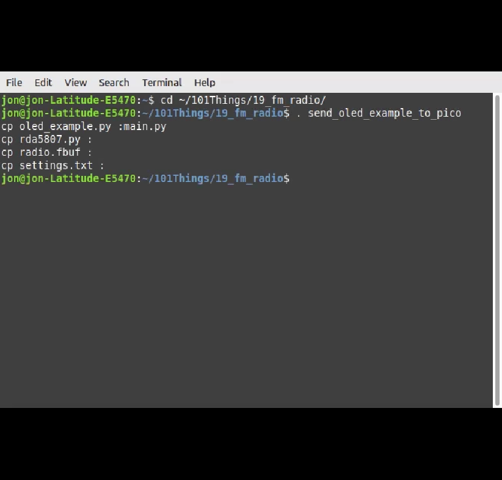

Pi Pico RDA5807 FM Radio
========================

The FM radio project is based around an inexpensive RDA5807 based FM radio
modules. The radio modules have an 8-pin interface, providing:

+ An Antenna Connection 
+ An I2C connection to the host microcontroller 
+ Stereo Audio Output capable of driving 32 ohm headphes directly 
+ Power Supply 2.7v to 3.3v

The example application is written in micropython, a high level,
beginner-friendly programming language. These could easily be customised for
use in other projects and form factors. The RDA5807 only needs 2 spare IO pins
(or you could even use an existing I2C bus) so it should be very easy to add an
FM radio feature to existing projects.

**Note**

*The RDA5807 needs a very clean supply to work properly, I found that it didn't
work at all with the 3.3V output from the pi-pico even after disabling the
power-saving regulator mode to reduce ripple. Powering the module directly from
batteries (which could also supply the pico with suitable filtering) worked well.*

Install Thonny, Micropython and Libraries
=========================================

1. Download and Install the Thonny `application <https://thonny.org/>`_. 
2. Install Micropython on the pi-pico. 

.. image::
  images/install_micropython.png

.. image::
  images/install_micropython2.png

3. Install SSD1306 Library. 

.. image::
  images/install_ssd1306_lib.png

.. image::
  images/install_ssd1306_lib2.png

Install breadboard example
==========================

This is a very minimal example, the radio is controlled using a serial
interface via a PC connection.

OLED 128x64 example
===================

This is a more complete example building a standalone FM radio. The example
uses a ssd1306 128x64 pixel OLED display and 4 push buttons to build a simple
user interface. The module can drive 32 ohm headphones directly, but I have
paired the device with a TPA2012 class-D audio amplifier which is able to drive
a small speaker. The radio is driven using a pair of NiMH AAA batteries.

Install
-------

For easy installation, a script can copy all the project files to the pi-pico
using the pyboard.py utility.

Splash Screen
-------------

The FM radio example displays a radio image on the OLED display for a second
during power up. A simple python script can convert a 128x64 pixel image (e.g.
.png) into a binary file that can be directly loaded from flash into a frameBuf
object allowing it to be displayed on the OLED display. 

.. code:: bash
  $ python image2fbuf.py radio.png radio.fbuf

The radio.fbuf file is then coppied to flash memory on the pi-pico. The default
splash screen could easily be customised by editing the radio.png file,
regenerating the radio.fbuf file and copying to the pi-pico.

