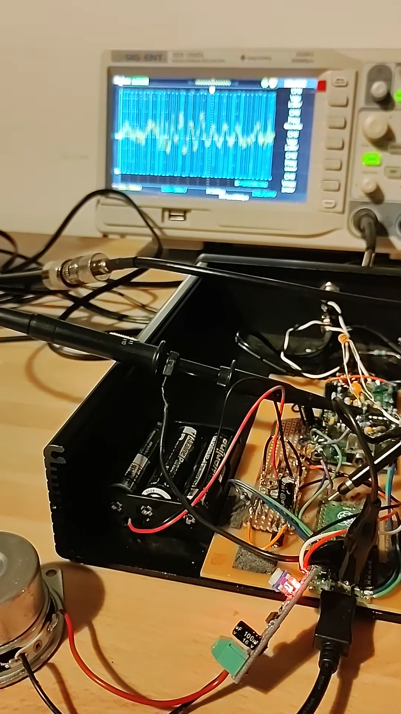
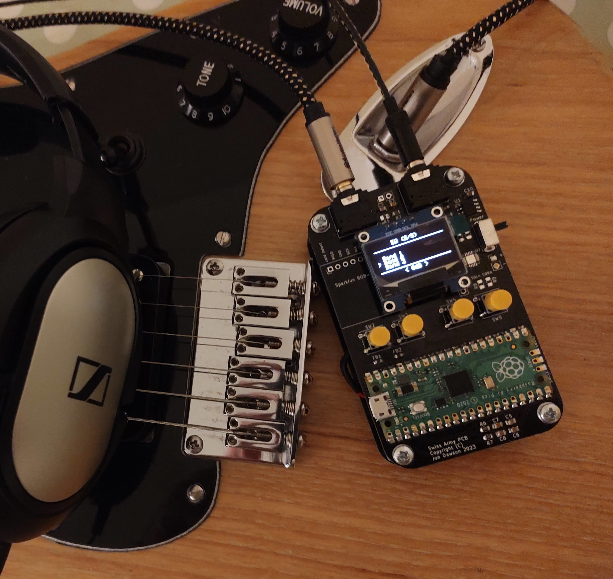
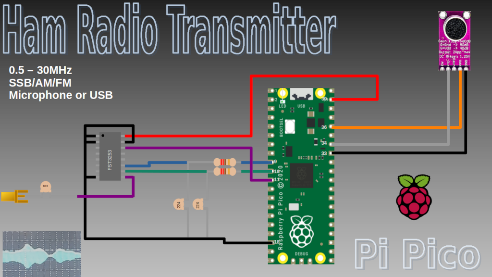
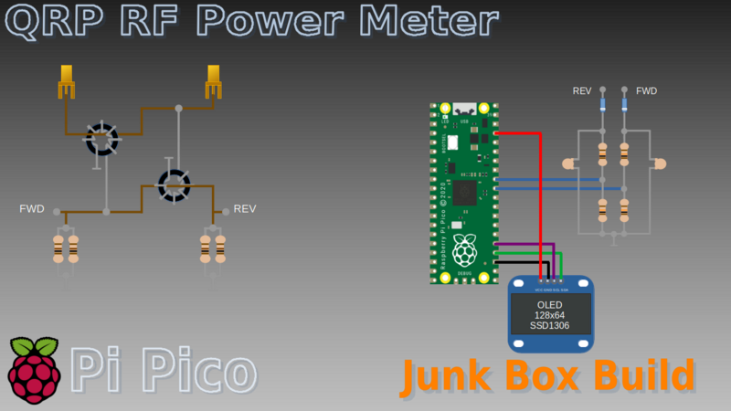
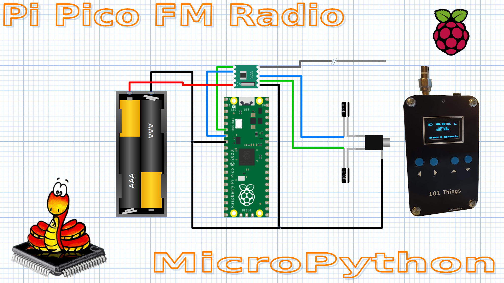
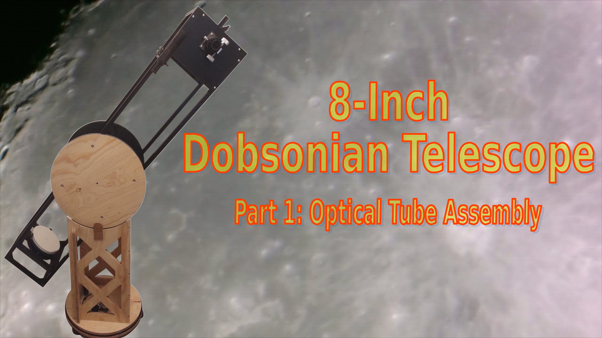
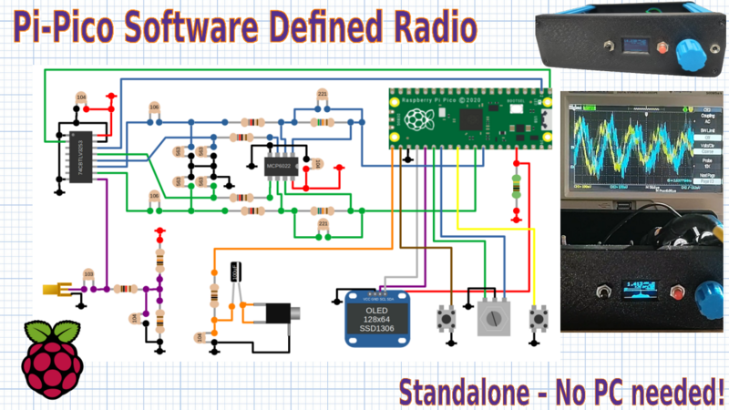

.. image:: https://readthedocs.org/projects/chips-20/badge/?version=latest
    :target: https://readthedocs.org/projects/chips-20/badge/?version=latest

101 Things
==========

Welcome to *101 Things*, a collection of projects that celebrate creativity and
hands-on ingenuity.  If you share a passion for making things, you've come to
the right place. Each project uses simple designs, and basic tools, to push the
creative boundaries of a home tinkerer.  Join me on this exploration of
crafting, coding, and constructing, as we unlock the magic of making, one
project at a time.

Documentation
-------------

`ReadTheDocs <https://101-things.readthedocs.io/en/latest/>`_.

Projects so far
---------------

Pi Pico Rx - A crystal radio for the digital age?
"""""""""""""""""""""""""""""""""""""""""""""""""

DIY Multi-Effect Guitar Unit
""""""""""""""""""""""""""""

Raspberry Pi Pico Ham Radio Transmitter
"""""""""""""""""""""""""""""""""""""""

Raspberry Pi Power and SWR Meter
"""""""""""""""""""""""""""""""""""""""

Raspberry Pi Pico FM Radio
"""""""""""""""""""""""""""

8-inch Dobsonian Telescope
""""""""""""""""""""""""""

Breadboard Software Defined Radio
"""""""""""""""""""""""""""""""""

Getting the Code
----------------

.. code::

  sudo apt install git
  git clone https://github.com/dawsonjon/101Things.git

Install Pi Pico SDK
-------------------

Follow the `Getting started with the Raspberry Pi Pico <https://datasheets.raspberrypi.com/pico/getting-started-with-pico.pdf>`_ quick start guide to install the C/C++ SDK.

.. code::

  sudo apt install wget #if wget not installed
  wget https://raw.githubusercontent.com/raspberrypi/pico-setup/master/pico_setup.sh
  chmod +x pico_setup.sh
  ./pico_setup.sh
  

Build Projects
--------------

Some projects may target either the pico or pico_w variant, although those that use the wireless functionality can only be built on the pi-pico.

To build for pico_w:
""""""""""""""""""""

.. code::

  mkdir build
  cd build
  cmake -DPICO_BOARD=pico_w -DPICO_SDK_PATH=~/pico/pico-sdk ..
  make

To build for pico:
""""""""""""""""""

.. code::

  mkdir build
  cd build
  cmake -DPICO_BOARD=pico -DPICO_SDK_PATH=~/pico/pico-sdk ..
  make
