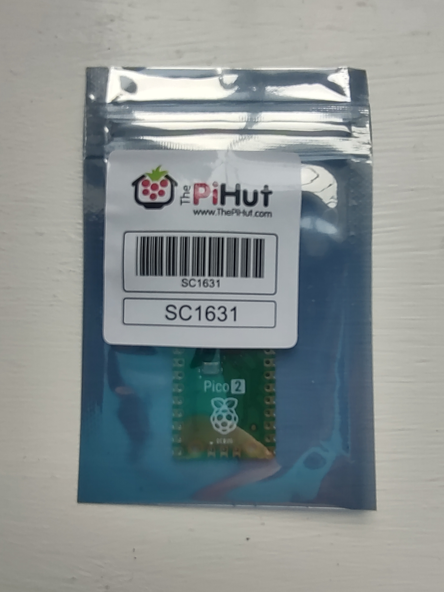
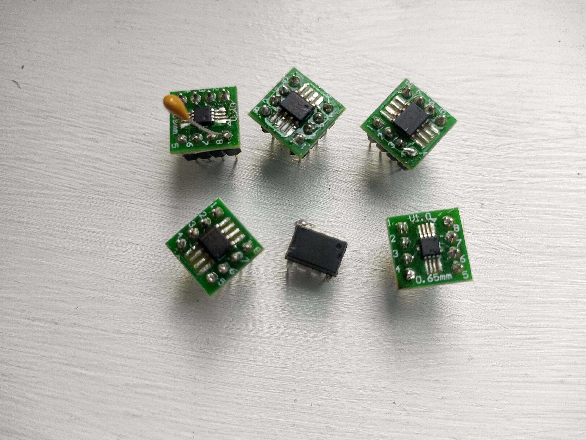
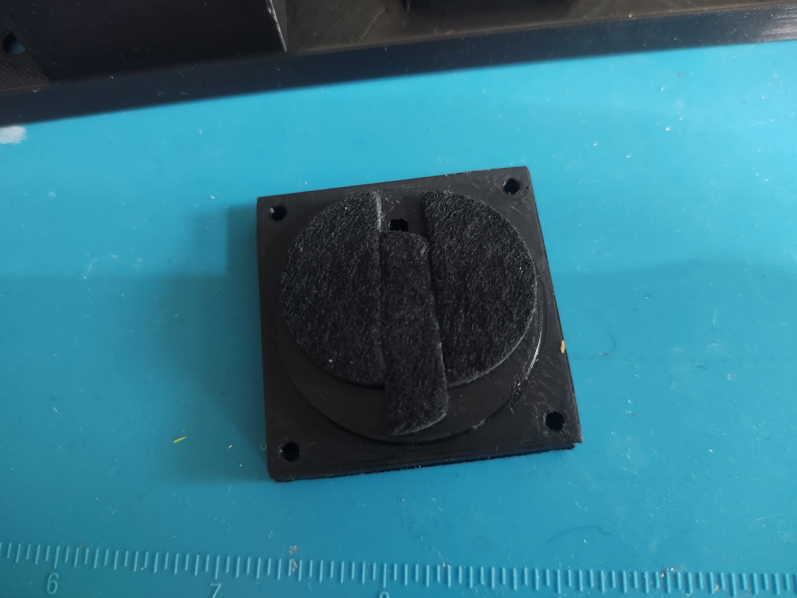

Pi-Pico RX - Breadboard Version
===============================

.. image:: images/breadboard_radio_thumbnail.png
  :target: https://youtu.be/lS1ZRMIYLjA

A couple of years ago, I built a basic yet capable radio receiver using a Pi
Pico, and while I originally designed a custom PCB for it, this time I'm
building an even simpler and cheaper version that can be built on a breadboard
using (mostly) through-hole components. 

I wanted to build a very minimal (but useful) design that I could
use as a platform for experiments, tweaks and upgrades.

If you are interested in the original design or want to find out more about
the technical details you can find all
the info `here <https://101-things.readthedocs.io/en/latest/radio_receiver.html>`_. 
Most of the technical details are the same, so I will focus on the new features and
improvements here.

.. image:: images/breadboard_radio_schematic.svg

Quick Links
"""""""""""

You can find the code on the `GitHub page <https://github.com/dawsonjon/PicoRX>`_ 
including a precompiled `firmware in .uf2 format <https://github.com/dawsonjon/PicoRX/raw/master/build/picorx.uf2>`_.

What Can This Receiver Do?
""""""""""""""""""""""""""

The receiver covers frequencies up to 30MHz, including commercial broadcasts on
Longwave, Medium Wave, Shortwave, and the HF amateur radio bands. What’s great
about this design is that it’s completely standalone—it doesn’t need a PC or
sound card and can run for hours on just three AAA batteries. 

.. image:: images/breadboard_radio_front.png

Here are the specs:

+ 0 - 30MHz coverage
+ CW/SSB/AM/FM reception
+ OLED display
+ simple spectrum scope
+ headphone output
+ 500 general-purpose memories
+ runs on 3 AAA batteries
+ less than 50mA current consumption

Parts List 
""""""""""
+---------------------+------------+-------+--------------------------------------------+------------------------------+
| Item                | Value      | QTY   | Description                                | Example                      |
+=====================+============+=======+============================================+==============================+
| R1, R2              |  10k Ohm   | 2 off | Resistor (Metal Film)                      |                              |
+---------------------+------------+-------+--------------------------------------------+------------------------------+
| R3                  |  1k  Ohm   | 1 off | Resistor (Metal Film)                      |                              |
+---------------------+------------+-------+--------------------------------------------+------------------------------+
| R4                  |  100 Ohm   | 1 off | Resistor (Metal Film)                      |                              |
+---------------------+------------+-------+--------------------------------------------+------------------------------+
| R5, R6, R7, R8      |   82 Ohm   | 4 off | Resistor (Metal Film)                      |                              |
+---------------------+------------+-------+--------------------------------------------+------------------------------+
| R9, R10             |  56k Ohm   | 2 off | Resistor (Metal Film)                      |                              |
+---------------------+------------+-------+--------------------------------------------+------------------------------+
| C1, C3, C5          | 100n Farad | 3 off | Capacitor (Ceramic)                        |                              |
+---------------------+------------+-------+--------------------------------------------+------------------------------+
| C7                  |  10n Farad | 1 off | Capacitor (Ceramic)                        |                              |
+---------------------+------------+-------+--------------------------------------------+------------------------------+
| C9                  | 100u Farad | 1 off | Capacitor (Electrolytic)                   |                              |
+---------------------+------------+-------+--------------------------------------------+------------------------------+
| C10, C11, C12, C13  |  56n Farad | 4 off | Capacitor (Ceramic)                        |                              |
+---------------------+------------+-------+--------------------------------------------+------------------------------+
| C14, C15, C8        |  10u Farad | 3 off | Capacitor (Ceramic)                        |                              |
+---------------------+------------+-------+--------------------------------------------+------------------------------+
| C16                 | 470n Farad | 1 off | Capacitor (Ceramic)                        |                              |
+---------------------+------------+-------+--------------------------------------------+------------------------------+
| C17, C18            | 220p Farad | 1 off | Capacitor (Ceramic)                        |                              |
+---------------------+------------+-------+--------------------------------------------+------------------------------+
| IC1                 |            | 1 off | MCP6022 Dual Operational Amplifier         | https://tinyurl.com/3zb279aa |
+---------------------+------------+-------+--------------------------------------------+------------------------------+
| IC2                 |            | 1 off | Raspberry Pi Pico (or pico 2)              | https://tinyurl.com/mpjc2pzn |
+---------------------+------------+-------+--------------------------------------------+------------------------------+
| IC3                 |            | 1 off | 74CBTLV3253 4:2 Analog Multiplexer         | https://tinyurl.com/kuvmardh |
+---------------------+------------+-------+--------------------------------------------+------------------------------+
| SW1                 |            | 1 off | Rotary Encoder with push switch            | https://tinyurl.com/sepnzwwb |
+---------------------+------------+-------+--------------------------------------------+------------------------------+
| SW2, SW3            |            | 2 off | Push Button Switch (Momentary)             | https://tinyurl.com/d7s957vz |
+---------------------+------------+-------+--------------------------------------------+------------------------------+
| L1/FB1              | 100u Henry | 1 off | Inuductor/Ferrite Bead                     | https://tinyurl.com/y94cnnr6 |
+---------------------+------------+-------+--------------------------------------------+------------------------------+
| Headphone Connector |            | 1 off | 3.5mm Stereo Jack                          | https://tinyurl.com/59cfmcxz |
+---------------------+------------+-------+--------------------------------------------+------------------------------+
| Display             |            | 1 off | 128x64 I2C OLED Display 0.96 inch SSD1306  | https://tinyurl.com/4w7f4p9a |
+---------------------+------------+-------+--------------------------------------------+------------------------------+
| Antenna Connector   |            | 1 off | BNC or SMA female connector                | https://tinyurl.com/yrca5dsk |
+---------------------+------------+-------+--------------------------------------------+------------------------------+

The Design Walkthrough
""""""""""""""""""""""

.. image:: images/breadboard_radio_circuit.png

At the heart of this receiver is a Tayloe detector, which is popular for its
simplicity and performance. The detector converts high-frequency RF signals
into lower-frequency IQ signals that the Pi Pico’s Analog-to-Digital Converter
(ADC) can sample. This design handles frequencies up to 30MHz, although the ADC
has a bandwidth of only 250kHz.

.. image:: images/breadboard_radio_tayloe_diagram.png

The local oscillator, necessary for the detector to function, is generated
directly by the Pi Pico using its PIO feature. This oscillator drives a 4-way
analogue switch, which samples the incoming signal in four different paths, each
covering a quarter of the local oscillator cycle.

.. image:: images/breadboard_radio_tayloe_animation.gif

The I and Q signals generated by the op-amps contain all the information needed
to demodulate the signals. With both I and Q signals, we can determine the
amplitude, phase, and frequency, including whether the signal frequency is
higher or lower than the local oscillator.

The audio interface in this design uses a simple PWM method. Although it's
basic, it performs surprisingly well. The RC low-pass filter removes the PWM
ripple and the output is strong enough to drive headphones directly or even a
small speaker, though an external amplifier is recommended for better
performance.

Improvements and Tweaks
"""""""""""""""""""""""

Since building the original design, I've received a lot of feedback and made
several key improvements to enhance both performance and usability.

1. Capacitors to Prevent Op-Amp Saturation

.. image:: images/breadboard_radio_capacitors.png

One of the issues that has been addressed was the saturation of the op-amps at
higher frequencies. One or both op-amps in the Tayloe detector would
saturate, leading to poor rejection of aliased signals. I quite a few
changes to remedy the solution, but in the end the solution came from the 
`truSDX transceiver <https://dl2man.de/wp-content/uploads/2023/07/truSDX_Main_1_2-1.pdf>`_. 
The addition of these two capacitors solved all the issues of op-amp saturation
on the high bands and I am getting much better performance.

2. Improved Frequency NCO resolution by changing the system clock frequency on the fly.

.. image:: images/breadboard_radio_nco_accuracy.png

Another major improvement involves the frequency accuracy of the Numerically
Controlled Oscillator (NCO). In the original design, I used the fractional
dividers in the Pi Pico’s PIO peripheral to generate a local oscillator
frequency close to the desired frequency. However, this method only allowed me
to get within about 100kHz of the target frequency. While this was sufficient
given the 250kHz bandwidth of the ADC, I was able to get even better resolution
by making small changes to the system clock frequency.

The firmware originally ran at 125MHz, but by tweaking the PLL, the system clock
frequency can be varied between 125MHz and 133MHz. 133MHz is the maximum
frequency without overclocking.  There are 23 possible system clock frequencies
in this range.  Choosing the best combination of system clock and PIO divider
gives a resolution of ~ +/-8kHz of the desired frequency. 

This improvement also allows for a narrower bandwidth of about +/-12kHz, now we
can oversample the I and Q signals by a factor of 10, which greatly improves
the rejection of alias signals which was a weakness in the original design.

**Note: Although the PIO-based local oscillator has a resolution of +/-8kHz
(previously ~+/-60kHz). The receiver achieves an overall frequency resolution
much better than 1Hz. The software implements a second, very-high-resolution,
NCO and mixer in the front end of the receiver to do the fine-tuning.**

3. Switching to a More Affordable Op-Amp

With the improved frequency accuracy and reduced bandwidth, it is now possible
to switch to a more affordable operational amplifier. The LT6231 op-amp, is a 
popular choice in Tayloe detector designs due to its
exceptionally low noise performance. The original design required a
gain-bandwidth product (GBP) of 60MHz, well within the 215MHz limit of the
LT6231. However, the LT6231 is relatively expensive, costing about twice as
much as the Pi Pico.

Thanks to the improvements in frequency accuracy and the ability to oversample,
the new design now requires a GBP of less than 10MHz. This allowed me to switch
to an MCP6022 op-amp, which has a GBP of 10MHz but costs less than half as
much as a Pi Pico. It doesn't have the same low-noise performance as the
LT6231, but it is sill good enough that it doesn’t limit the receiver’s
performance. This change not only reduces the overall cost of the project but
improves the receiver's overall performance.

Antenna and Enclosure
"""""""""""""""""""""

A random wire antenna in a high location preferably outdoors, or in the attic
would be ideal for this type of receiver. If you want an indoor antenna, or something a bit more
portable, I have had pretty good results using a you-loop antenna, it is a clever
design that cancels noise. 

.. image:: images/breadboard_radio_lna.jpg

The only downside is that the output level tends to be
quite low, so you need a sensitive receiver or some kind of pre-amplifier. I'm
just using a cheap wideband LNA I bought online. I have used this setup for all
the experiments in this demo. 

Enclosure
"""""""""

.. image:: images/breadboard_radio_lid_off.png

For the enclosure, I designed a 3D-printed case in FreeCAD. Since this is an
experimental receiver, I will be leaving the lid off!

Testing the Receiver
""""""""""""""""""""
I’ve tested the receiver by tuning into various broadcast stations and
exploring the HAM bands. I also connected it to a PC soundcard to experiment
with digital modes like FT-8. I have been pleased with the results, with successful
signal reception from multiple continents, even using an indoor antenna.

Check out the `video <https://youtu.be/lS1ZRMIYLjA>`_ of the receiver in action.

Conclusion
""""""""""

.. image:: images/breadboard_radio_psk_reporter.png

This SDR receiver would be a great project for anyone getting started in
home-brew radio construction, or perhaps for someone looking for something fun
to build with their pi-pico. While it might not live up to expensive commercial
radios, its low cost and simplicity make it a valuable tool for receiving
signals from around the globe.

Breadboard Radio - Part 2
-------------------------

.. image:: images/breadboard_radio_thumbnail2.png
  :target: https://youtu.be/QfNhv-COuvU

Exploring the Pi Pico 2
"""""""""""""""""""""""

I recently received my Pi Pico 2 and was able to integrate it into the SDR with
minimal code changes. Despite initial expectations of only marginal
improvements, the performance boost was impressive.

The key enhancements in the Pi Pico 2 are the Floating Point Unit (FPU) and the
DSP co-processor. Although the SDR code is written in fixed-point arithmetic,
the faster clock frequency of the Pico 2 provides a significant reduction in
CPU usage—from around 80% on the original Pico to approximately 40% on the Pico
2.

The Pico 2 offers a choice of processors: the ARM Cortex M33 or the RISC-V
Hazard 3. I tested both and found their performance similar in this
fixed-point application. The success of the RISC-V processor suggests that we
may see more of these processors in future projects.

.. image:: images/breadboard_radio_pi_performance.png

One curiosity was whether fixing the well-known ADC bug in the Pico would
affect the SDR's performance. After testing the noise floor across various
bands, I found no measurable or noticeable difference. Given that the SDR
averages hundreds of samples, any occasional bad ADC readings likely get lost
in the noise.

.. image:: images/breadboard_radio_pico_2_nco_resolution.png

The increased clock frequency of the Pi Pico 2 also allows for finer resolution
of the local oscillator, enhancing the SDR’s performance, particularly on
higher frequency bands. While the improvement is modest—just a couple of kHz—it
contributes to a more predictable performance on the high bands.

Receiving Weather FAX
"""""""""""""""""""""

I received a comment asking if the SDR could be used to receive weather FAX.
Although I hadn’t tried this before, I gave it a go using a sound card and
Fldigi on a PC. The setup worked without any issues, successfully downloading
weather maps. This is a really interesting technical solution, it is quite
impressive that a narrow band HF channel can be used to transmit FAX data, but
it is also a testament to the skill of the people who can read and interpret
these maps.

.. image:: images/breadboard_radio_weafax.png

Operational Amplifier Alternatives
""""""""""""""""""""""""""""""""""

Component availability, particularly for op-amps, has been another concern.
Fortunately, the op-amps used in this project are not particularly special, and
suitable substitutes are widely available. Here are the key specifications to
look for in an op-amp for this SDR.

**Operating Voltage** 

The design uses the 3.3V output from the pico to drive the Tayloe detector.
This is mainly so that the voltage stays constant regardless of the battery
level. It also means that we don't have to worry about over-driving the ADC
which only works at up to 3.3V. A starting point is to select a dual output
with a minimum supply voltage of 3V or less.

**Gain-Bandwidth Product:** 

A product of around 10 MHz is sufficient, given the reduced bandwidth of the
detector (12 kHz) and a gain of 600.  

**Noise Performance:** 

Dan Tayloe's `paper <https://www.norcalqrp.org/files/Tayloe_mixer_x3a.pdf>`_
provides some guidance on the noise specification and presents a formula to
calculate the Minimum Detectable Signal based on the op-amp performance.

.. image:: images/breadboard_radio_tayloe_noise.png

At HF frequencies there is a great deal of noise on the bands, `RECOMMENDATION ITU-R P.372-7 <https://www.itu.int/dms_pubrec/itu-r/rec/p/R-REC-P.372-7-200102-S!!PDF-E.pdf>`_
tells us the expected level of man-made noise at different frequencies. 

.. image:: images/breadboard_radio_itu.png

The plot compares the expected receiver performance with the levels of band noise.
We can see that an amplifier with a noise density of 9 nV/√Hz should offer
comparable performance to a typical receiver, and would not limit the
performance of the receiver under most circumstances.

.. image:: images/breadboard_radio_band_noise.png

I selected a few of the cheapest operational amplifiers that meet this
specification and tested them in the receiver.

+---------+---------------+-----------------------------------+------------+-------------+
|         |    GBP (MHz)  | Noise Vol age Density (nV/√Hz)    | Cost (GBP) | DIP package |
+=========+===============+===================================+============+=============+
| MCP6292 |     10        |       8.7                         |   0.82     |  Yes        |
+---------+---------------+-----------------------------------+------------+-------------+
| MCP6022 |     10        |       8.7                         |   1.44     |  Yes        |
+---------+---------------+-----------------------------------+------------+-------------+
| MCP662  |     60        |       6.8                         |   1.25     |  No         |
+---------+---------------+-----------------------------------+------------+-------------+
| OPA2607 |     50        |       3.8                         |   1.26     |  No         |
+---------+---------------+-----------------------------------+------------+-------------+
| OPA1662 |     22        |       3.3                         |   1.44     |  No         |
+---------+---------------+-----------------------------------+------------+-------------+
| LT6231  |     215       |       1.1                         |   6.25     |  No         |
+---------+---------------+-----------------------------------+------------+-------------+
| LTC6227 |     420       |       1                           |   7.53     |  No         |
+---------+---------------+-----------------------------------+------------+-------------+

All of these devices were tested and worked without any issues. There was no
noticeable difference in performance, so it isn't worth using expensive devices
in this design.  If you struggle to find the right op-amp, consider adapting
the design to work with 5V devices, which broadens the range of available
components.

Additional Improvements
"""""""""""""""""""""""

I've also explored adding an external amplifier and speaker to the SDR. While
low-cost PC speakers work well, a built-in speaker could be more convenient,
especially for portable use. There are various low-power amplifier options
available, allowing you to tailor the setup to your specific needs and budget.

.. image:: images/breadboard_radio_speaker.jpg

I have opted to use an inexpensive `PAM8403
<https://www.mouser.com/datasheet/2/115/PAM8403-247318.pdf?srsltid=AfmBOorsKdzvZRRoA1KjdNmuRhPDnJf3MxrqWWowpJ9mUzHqkN2Ck-I3>`_
module. These can be obtained cheaply and can provide up to 3W output
into a 4 ohm load. It uses a class-D design which allows efficiencies of up to
90% which makes it ideal for portable applications. As supplied, the module
uses 10k ohm input resistors, this sets the gain much too high for this
application, so I have replaced these with 100k ohm resistors to give a gain of around 2x.

.. image:: images/breadboard_radio_amplifier.jpg

I have included a simple switch to isolate the amplifier when the speaker is
not required, but this could also be achieved using a switch in the headphone
jack.

There are numerous small speakers to choose from and the quality can be
variable. In any case, a sealed enclosure can improve the quality of the
sound. Speakers in this price range don't come with detailed
specifications, usually just the impedance and power rating, so it isn't
possible to design anything sophisticated. `This page <https://www.digikey.pl/pl/articles/best-practices-for-designing-micro-speaker-enclosures>`_
gives some simple rules of thumb.

I used some self-adhesive felt on the rear of the enclosure to help absorb echoes.

Conclusion
""""""""""

This SDR project continues to evolve, with numerous upgrades and improvements planned for the future.
