Breadboard Radio - Part 2
=========================

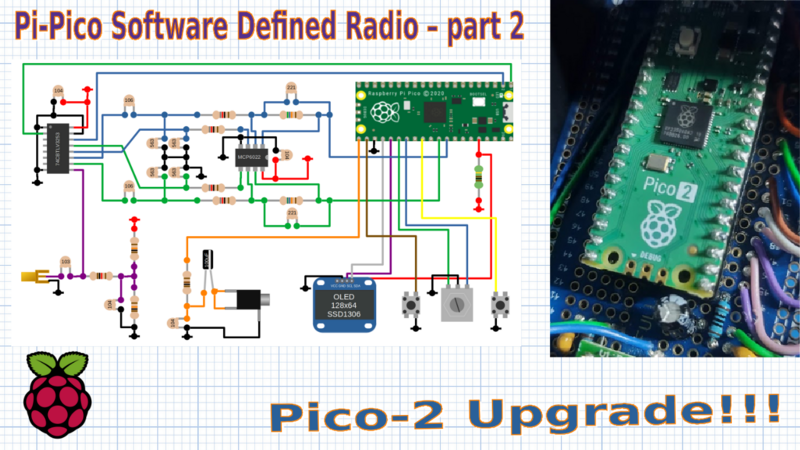

Exploring the Pi Pico 2
-----------------------

I recently received my Pi Pico 2 and was able to integrate it into the SDR with
minimal code changes. Despite initial expectations of only marginal
improvements, the performance boost was impressive.

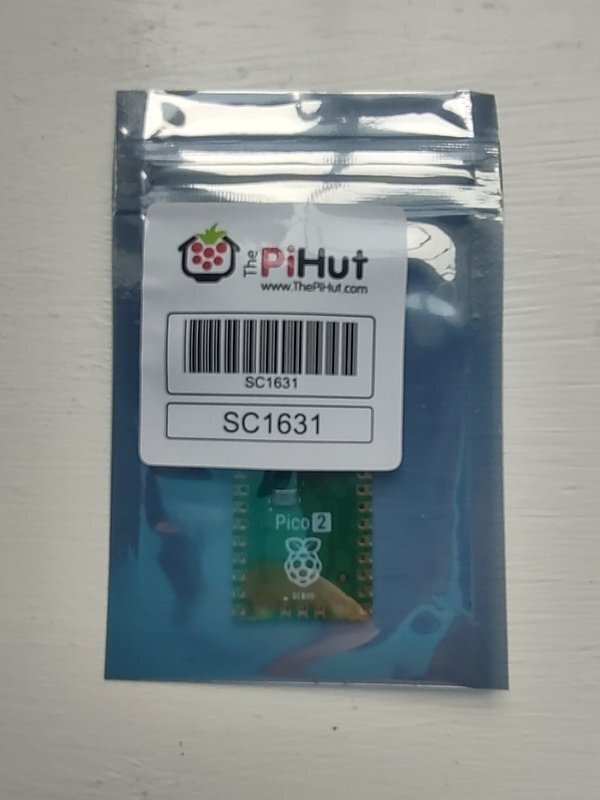

The key enhancements in the Pi Pico 2 are the Floating Point Unit (FPU) and the
DSP co-processor. Although the SDR code is written in fixed-point arithmetic,
the faster clock frequency of the Pico 2 provides a significant reduction in
CPU usage—from around 80% on the original Pico to approximately 40% on the Pico
2.

The Pico 2 offers a choice of processors: the ARM Cortex M33 or the RISC-V
Hazard 3. I tested both and found their performance similar in this
fixed-point application. The success of the RISC-V processor suggests that we
may see more of these processors in future projects.

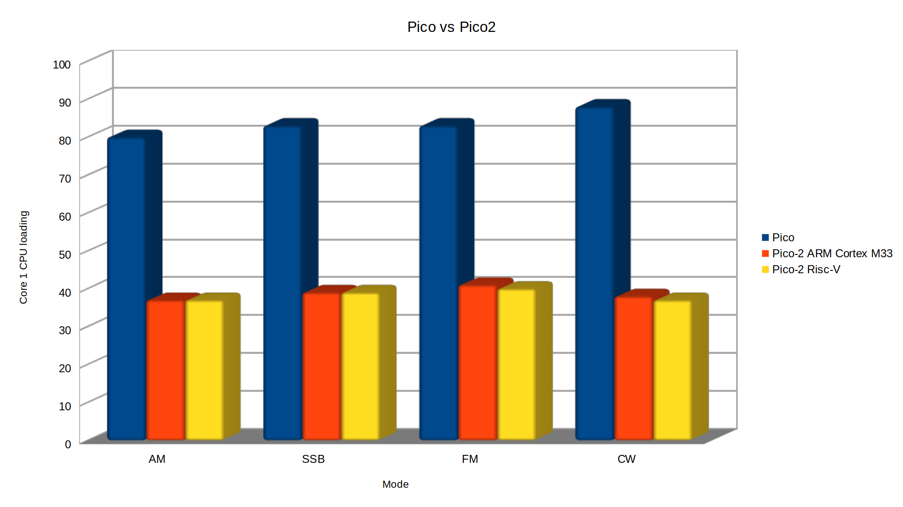

One curiosity was whether fixing the well-known ADC bug in the Pico would
affect the SDR's performance. After testing the noise floor across various
bands, I found no measurable or noticeable difference. Given that the SDR
averages hundreds of samples, any occasional bad ADC readings likely get lost
in the noise.

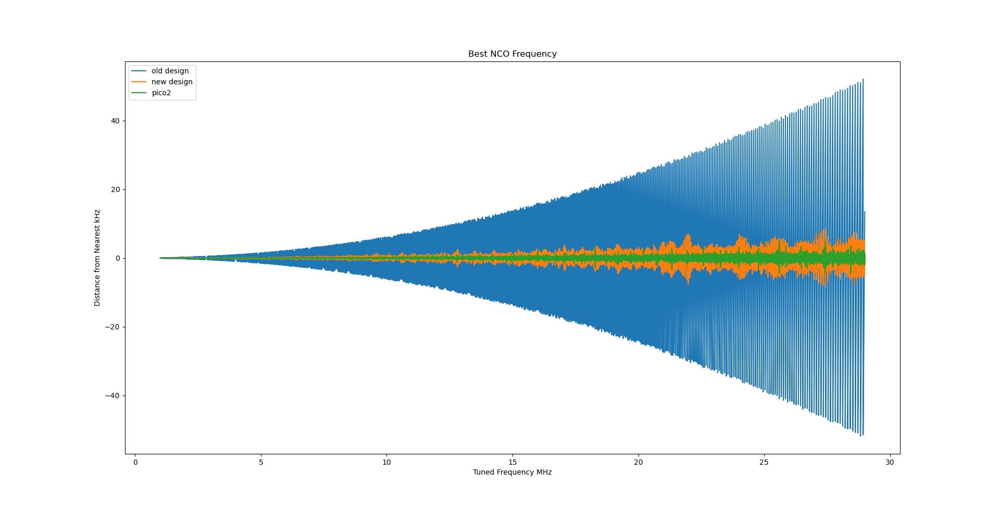

The increased clock frequency of the Pi Pico 2 also allows for finer resolution
of the local oscillator, enhancing the SDR’s performance, particularly on
higher frequency bands. While the improvement is modest—just a couple of kHz—it
contributes to a more predictable performance on the high bands.

Receiving Weather FAX
---------------------

I received a comment asking if the SDR could be used to receive weather FAX.
Although I hadn’t tried this before, I gave it a go using a sound card and
Fldigi on a PC. The setup worked without any issues, successfully downloading
weather maps. This is a really interesting technical solution, it is quite
impressive that a narrow band HF channel can be used to transmit FAX data, but
it is also a testament to the skill of the people who can read and interpret
these maps.

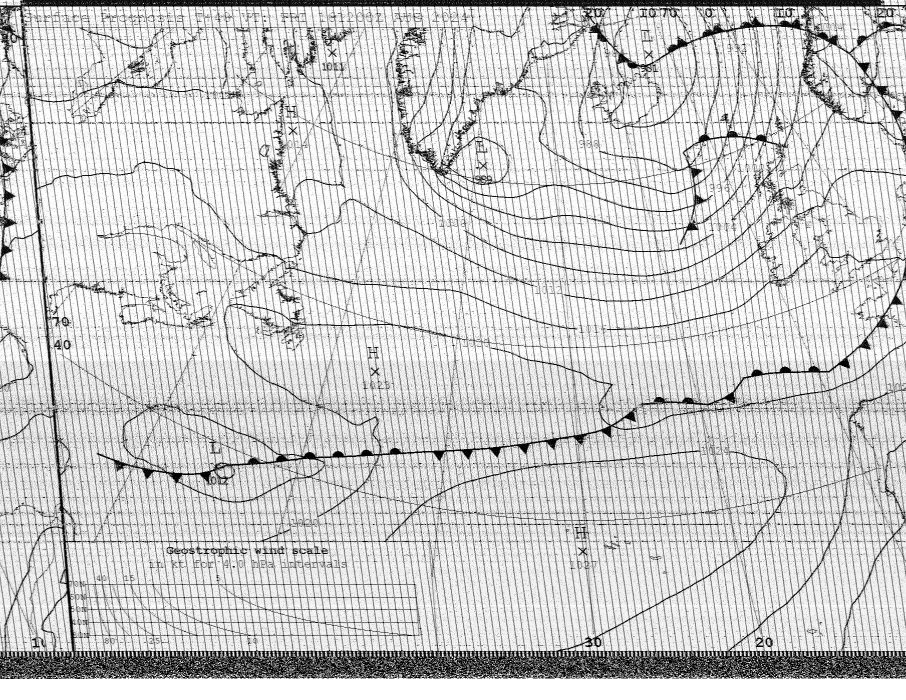

Operational Amplifier Alternatives
----------------------------------

Component availability, particularly for op-amps, has been another concern.
Fortunately, the op-amps used in this project are not particularly special, and
suitable substitutes are widely available. Here are the key specifications to
look for in an op-amp for this SDR.

**Operating Voltage**

The design uses the 3.3V output from the pico to drive the Tayloe detector.
This is mainly so that the voltage stays constant regardless of the battery
level. It also means that we don't have to worry about over-driving the ADC
which only works at up to 3.3V. A starting point is to select a dual output
with a minimum supply voltage of 3V or less.

**Gain-Bandwidth Product:**

A product of around 10 MHz is sufficient, given the reduced bandwidth of the
detector (12 kHz) and a gain of 600.

**Noise Performance:**

Dan Tayloe's `paper <https://www.norcalqrp.org/files/Tayloe_mixer_x3a.pdf>`_
provides some guidance on the noise specification and presents a formula to
calculate the Minimum Detectable Signal based on the op-amp performance.

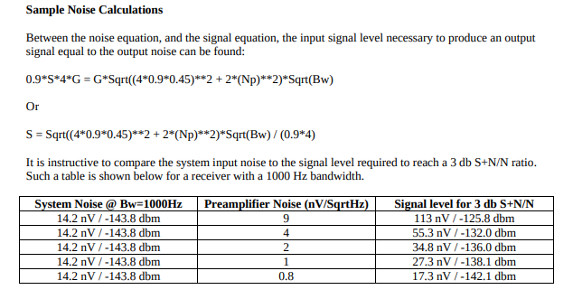

At HF frequencies there is a great deal of noise on the bands, `RECOMMENDATION ITU-R P.372-7 <https://www.itu.int/dms_pubrec/itu-r/rec/p/R-REC-P.372-7-200102-S!!PDF-E.pdf>`_
tells us the expected level of man-made noise at different frequencies.

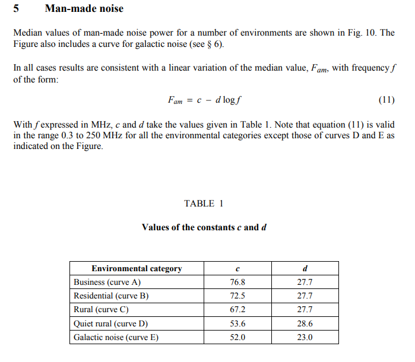

The plot compares the expected receiver performance with the levels of band noise.
We can see that an amplifier with a noise density of 9 nV/√Hz should offer
comparable performance to a typical receiver, and would not limit the
performance of the receiver under most circumstances.

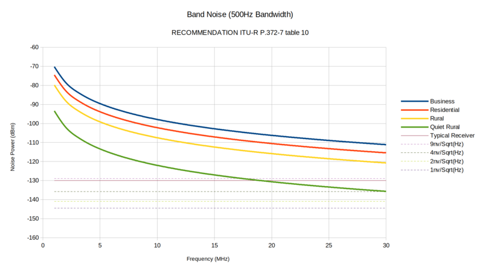

I selected a few of the cheapest operational amplifiers that meet this
specification and tested them in the receiver.

+---------+---------------+-----------------------------------+------------+-------------+
|         |    GBP (MHz)  | Noise Vol age Density (nV/√Hz)    | Cost (GBP) | DIP package |
+=========+===============+===================================+============+=============+
| MCP6292 |     10        |       8.7                         |   0.82     |  Yes        |
+---------+---------------+-----------------------------------+------------+-------------+
| MCP6022 |     10        |       8.7                         |   1.44     |  Yes        |
+---------+---------------+-----------------------------------+------------+-------------+
| MCP662  |     60        |       6.8                         |   1.25     |  No         |
+---------+---------------+-----------------------------------+------------+-------------+
| OPA2607 |     50        |       3.8                         |   1.26     |  No         |
+---------+---------------+-----------------------------------+------------+-------------+
| OPA1662 |     22        |       3.3                         |   1.44     |  No         |
+---------+---------------+-----------------------------------+------------+-------------+
| LT6231  |     215       |       1.1                         |   6.25     |  No         |
+---------+---------------+-----------------------------------+------------+-------------+
| LTC6227 |     420       |       1                           |   7.53     |  No         |
+---------+---------------+-----------------------------------+------------+-------------+

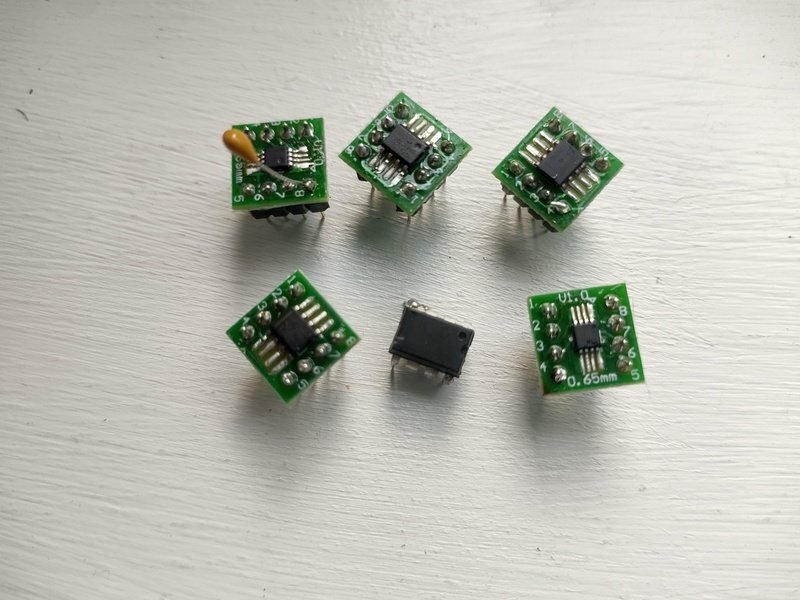

All of these devices were tested and worked without any issues. There was no
noticeable difference in performance, so it isn't worth using expensive devices
in this design.  If you struggle to find the right op-amp, consider adapting
the design to work with 5V devices, which broadens the range of available
components.

Additional Improvements
-----------------------

I've also explored adding an external amplifier and speaker to the SDR. While
low-cost PC speakers work well, a built-in speaker could be more convenient,
especially for portable use. There are various low-power amplifier options
available, allowing you to tailor the setup to your specific needs and budget.

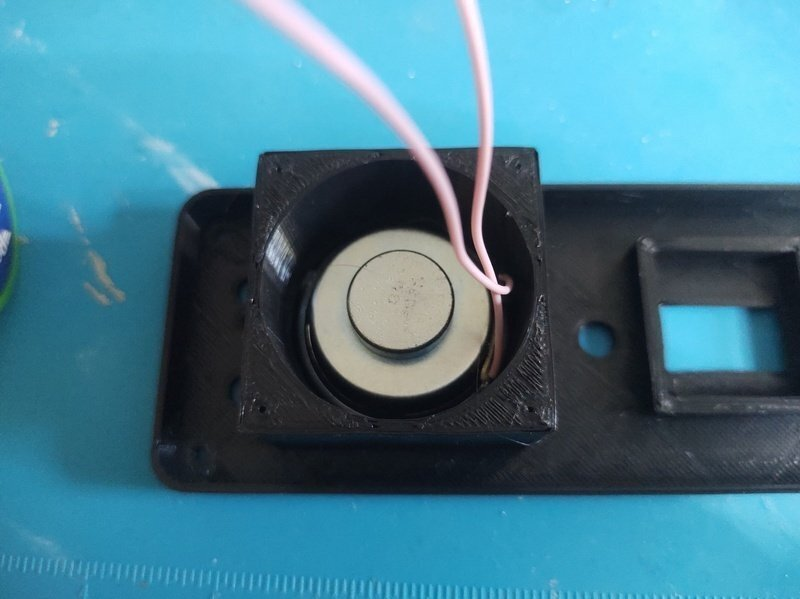

I have opted to use an inexpensive `PAM8403
<https://www.mouser.com/datasheet/2/115/PAM8403-247318.pdf?srsltid=AfmBOorsKdzvZRRoA1KjdNmuRhPDnJf3MxrqWWowpJ9mUzHqkN2Ck-I3>`_
module. These can be obtained cheaply and can provide up to 3W output
into a 4 ohm load. It uses a class-D design which allows efficiencies of up to
90% which makes it ideal for portable applications. As supplied, the module
uses 10k ohm input resistors, this sets the gain much too high for this
application, so I have replaced these with 100k ohm resistors to give a gain of around 2x.

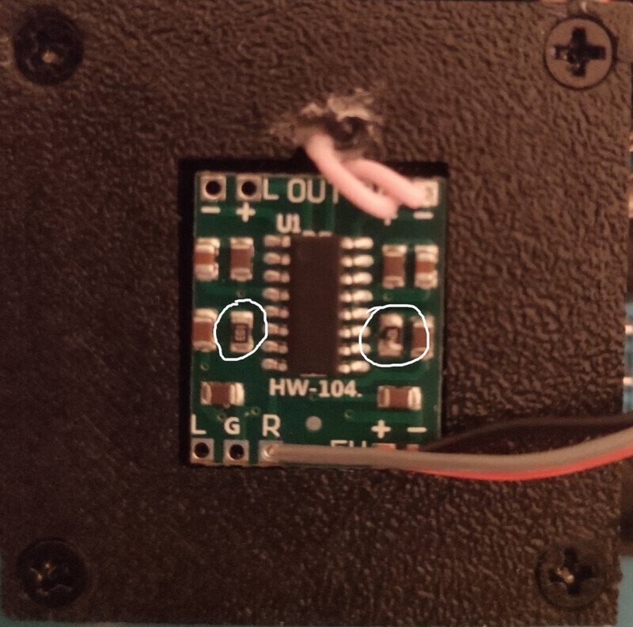

I have included a simple switch to isolate the amplifier when the speaker is
not required, but this could also be achieved using a switch in the headphone
jack.

There are numerous small speakers to choose from and the quality can be
variable. In any case, a sealed enclosure can improve the quality of the
sound. Speakers in this price range don't come with detailed
specifications, usually just the impedance and power rating, so it isn't
possible to design anything sophisticated. `This page <https://www.digikey.pl/pl/articles/best-practices-for-designing-micro-speaker-enclosures>`_
gives some simple rules of thumb.

I used some self-adhesive felt on the rear of the enclosure to help absorb echoes.

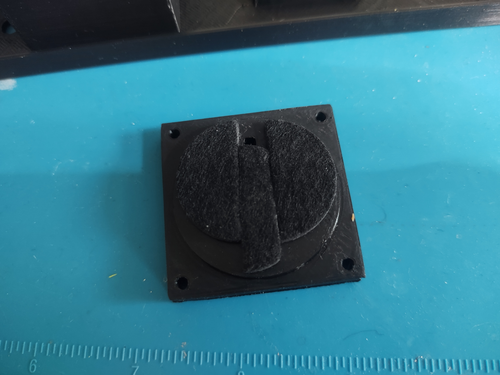

Conclusion
----------

This SDR project continues to evolve, with numerous upgrades and improvements planned for the future.

If you would like to support 101Things, buy me a coffee: https://ko-fi.com/101things
