Breadboard Radio - Part 3
=========================

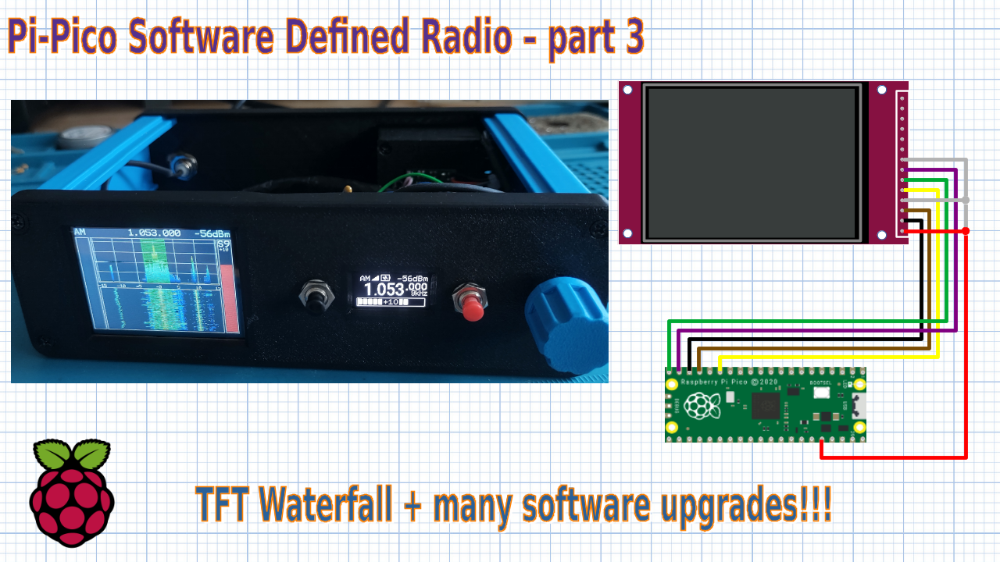

FFT-based filtering
-------------------

One significant change in this release of firmware is the introduction of
frequency-domain filtering using an FFT.

In the time domain, filtering is achieved by convolving a signal with a filter
kernel containing the impulse response of a filter. To build better filters
with narrow pass-bands and sharp transitions, we need to use a longer filter
kernel. Convolution in the time domain is computationally expensive, for each
sample, we need to multiply the previous N samples by a filter
kernel N samples long, thus the number of multiplications required is proportional
to the kernel length.

In the frequency domain, filtering is a much simpler operation that only
requires each frequency sample to be multiplied by a single constant
representing the magnitude of the frequency response. Of course, we first need
to convert the signal from a time domain to a frequency domain and back again.
We use the Fast Fourier Transform (FFT) and its close relation, the Inverse
Fast Fourier Transform (IFFT) to transform between the time and frequency
representations.

The FFT algorithm is so efficient, that even when the additional effort of
transforming to a from the frequency domain is considered, it is still faster
than time domain convolution for large filter kernels.

The *windowed overlap-add method* involves dividing the input signal into
smaller, overlapping segments, applying filtering in the frequency domain to
each segment, and then recombining (adding) these segments to reconstruct the
filtered signal. This approach allows for efficient filtering while avoiding
issues that arise with direct filtering on long signals.

Key Steps Involved
""""""""""""""""""

1. Divide the Signal into Overlapping Segments. The input signal is split
into shorter, overlapping segments using a windowing function.

2. Apply FFT to Each Segment. For each segment, the windowed signal is
transformed into the frequency domain using the Fast Fourier Transform
(FFT). The windowing function minimizes edge effects by smoothly tapering the
signal at the boundaries of each segment. The window shape and overlap are
chosen so that the overlapped signals add to a constant value.

3. Multiply with the Frequency Response of the Filter. In the frequency
domain, each segment is element-wise multiplied by the frequency response
of the desired filter. This multiplication effectively filters the frequency
content of the segment.

4. Inverse FFT (IFFT) to Convert Back to the Time Domain. Each filtered
segment is converted back to the time domain using the Inverse
FFT (IFFT). The result is a filtered version of the segment.

5. Reconstruct the Signal using Overlap-Add. The final step is to overlap
and add the filtered segments to reconstruct the complete output signal. The
overlapping segments are summed together at their overlapping portions. This
ensures a smooth transition between segments without introducing
discontinuities.

.. image:: images/breadboard_radio_fft_animation.gif

In this design, the first decimation stage is still performed using a CIC
filter, since this provides a very efficient means to achieve a high decimation
rate. In this design, a fourth-order CIC filter decimates by a factor of 16
reducing the sampling rate from 480kS/s to 30kS/s.

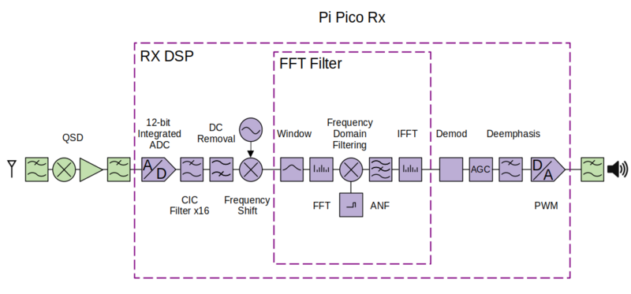

To maximise the performance of the receiver, while minimising the CPU load it
is necessary to consider the bits growth through the FFT. A fixed point
implementation is chosen using a 16-bit signed data word. A 16-bit word size is
efficient because it allows a fixed point multiplication to be performed using
a single 32-bit multiply which the pi-pico can perform in a single clock cycle.

The ADC outputs 12-bit data, but the ADC has an effective number of bits of 9.5
(for an RP2350 which fixes the ADC bug). This means that the lowest 2.5 bits
contain noise rather than useful information. The CIC filter reduces the
bandwidth by a factor of 16, which increases the effective number of bits by 2.

The FFT filter itself also reduces the bandwidth, taking 2.5kHz as a typical
bandwidth for an SSB signal, the bandwidth is reduced by a factor of 3.6 giving
an extra 1.9 useful bits. So, we might have about 13 useful bits once the
filtering has been applied. To make use of the noise reduction during the FFT
filter, the signal is first scaled by a factor of 2 giving 13 rather than 12
bits of data.

During the forward FFT, a growth of 256 can occur. With no scaling at all, a
sin wave with an amplitude of 16 in the time domain would result in a peak with
a magnitude of 4096 in the frequency domain. Various scaling strategies can be
employed in an FFT to allow for this growth.

Scaling by a factor of 2 after each stage is safe and prevents any possibility
of overflow. The downside of this approach is that we truncate the lowest 8
bits of the output data, 4 of these bits contain useful data and 4 contain
noise.

To preserve as many useful bits as possible, a smaller scaling factor is used
in this design. Scaling by a factor of 2 after every *second* stage means that
we truncate by 4 bits overall, losing only the bits that contain noise. This
means that there is a possibility of overflow under worst-case conditions if
the input data exceeds 12 bits.

However, the worst-case growth can only occur for a single tone of large
amplitude, and with our 13-bit input, the conditions needed to cause overflow
are highly unlikely to occur in normal use.

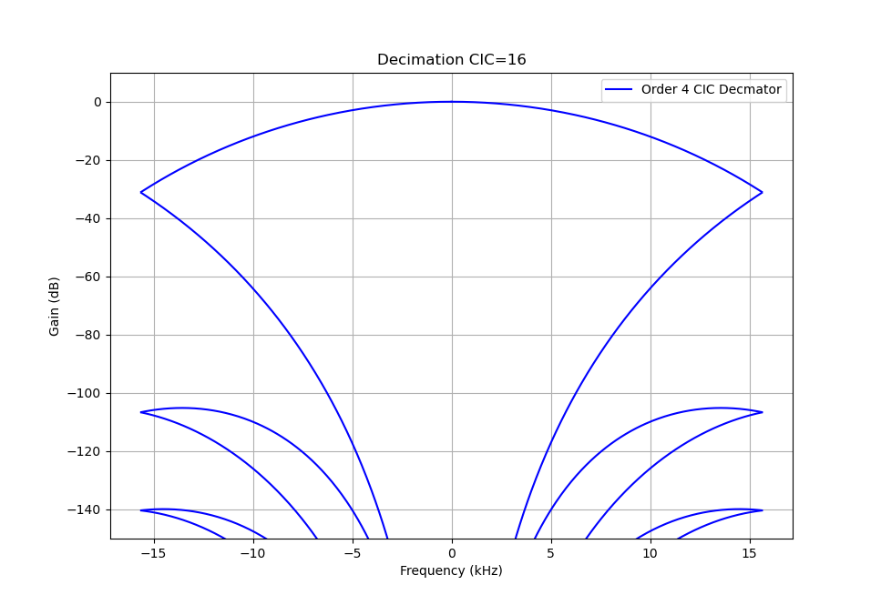

The frequency response of the CIC filter isn't particularly flat in the
passband, fortunately, we can correct this in the FFT filter, by applying a
gain to each bin which is the reciprocal of the CIC filter response.

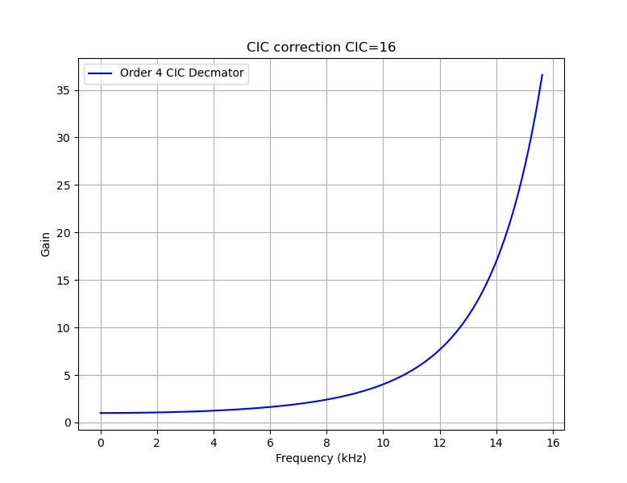

An FFT with a length of 256 points is employed, this allows a sharp frequency
response equivalent to a 256-tap FIR filter, and each frequency bin is 117Hz
wide.  The filter itself is very simple, frequency bins in the pass band are
retained (and adjusted to compensate for the CIC filter), while frequency bins
in the stop band are simply set to zero. It is now very simple to vary the
bandwidth of the filter in real-time, simply by choosing how many bins to
retain.

Another advantage of this approach is that it becomes very easy to implement
asymmetric filters, which makes SSB filters very simple to implement. We simply
remove the negative frequency bins for upper sideband signals and the positive
frequency bins for lower sideband. Since we have efficiently removed the
unwanted sideband there is no need for a separate Hilbert transform,
demodulation of SSB signals then becomes a trivial matter of discarding the
imaginary component of the signal.

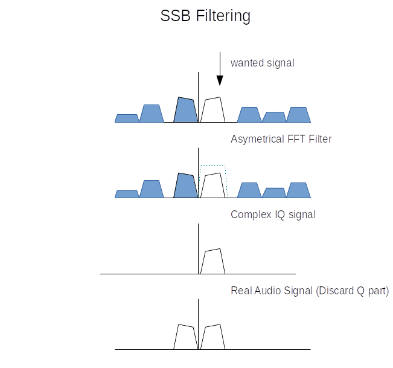

Since we don't need the full 30kHz of bandwidth for the frequency modes we are
working in, we can safely reduce the sample rate by another factor of 2 to
reduce the computational load in the demodulator. This is simply achieved using
a smaller 128-point IFFT returning the central part of the spectrum to the time
domain.

After implementing the frequency domain filtering, the CPU loading hasn't
increased significantly although the performance of the filters has been
significantly improved.

Automatic Notch Filter
----------------------

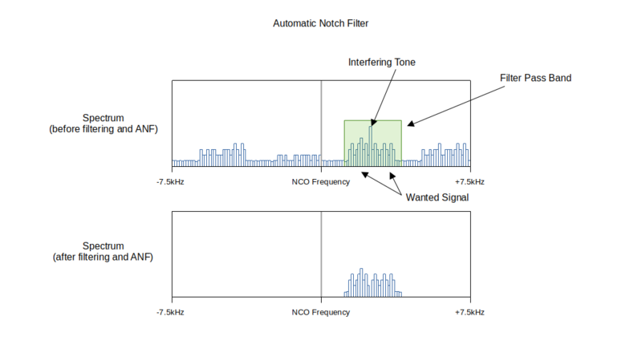

Since we are now filtering in the frequency domain, it is now possible to
implement some more sophisticated DSP processing in the frequency domain
without adding significant load to the CPU. An automatic notch filter can be
used to remove unwanted CW interference.

The algorithm identifies CW interference by searching for the frequency bin
with the highest magnitude. If the same bin is identified consistently over
several frames, the frequency bin is attenuated removing the interfering
signal.

The algorithm is very effective at removing an interfering tone from a speech
signal.

**Interfering tone without ANF**

.. raw:: html

   <audio controls="controls" title="AM Demodulator">
         <source src="_static/ANF_before.wav" type="audio/wav">
         Your browser does not support the <code>audio</code> element.
   </audio>

**Interfering tone with ANF**

.. raw:: html

   <audio controls="controls" title="Synchronous AM Demodulator">
         <source src="_static/ANF_after.wav" type="audio/wav">
         Your browser does not support the <code>audio</code> element.
   </audio>

Synchronous Amplitude Modulation
--------------------------------

Thanks to Mariusz Ryndzionek for contributing the synchronous AM demodulator!

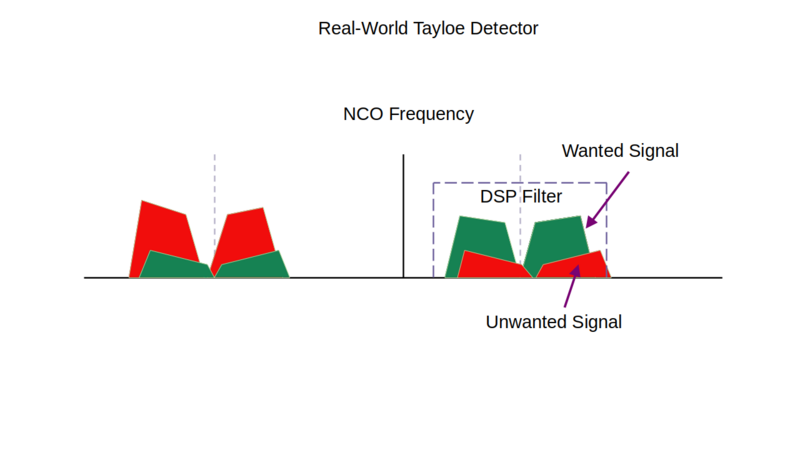

The existing AM demodulation is a very simple implementation that calculates
the magnitude of the IQ baseband signal using a simple magnitude approximation.
A more sophisticated method of AM demodulation is synchronous demodulation.
Synchronous AM demodulation uses a Phase Locked Loop (PLL) to remove any
frequency and phase offset.

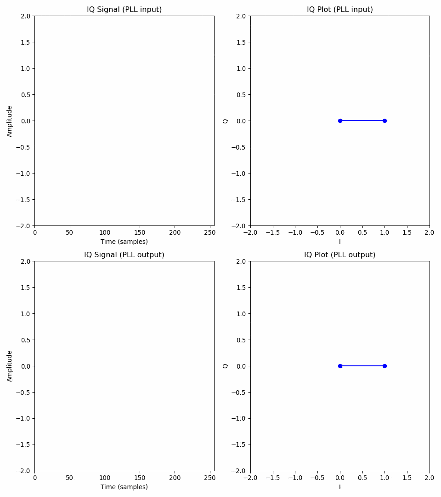

The frequency offset is generally caused by the inevitable small difference
between the receiver's tuned frequency and the signal's carrier. After
demodulation, the baseband signal has a steady zero frequency and phase offset.
Since the phase is zero, the I component now contains all the information, and
the C component is zero. Demodulation then becomes a simple matter of removing
the DC offset in the I component.

.. image:: images/breadboard_radio_PLL.png

The Synchronous AM gives improved reception compared to the original
implementation. I think that is in part because it avoids any distortion
introduced by the magnitude approximation.

**AM Demodulator**

.. raw:: html

   <audio controls="controls" title="AM Demodulator">
         <source src="_static/AMS_before.wav" type="audio/wav">
         Your browser does not support the <code>audio</code> element.
   </audio>

**Synchronous AM Demodulator**

.. raw:: html

   <audio controls="controls" title="Synchronous AM Demodulator">
         <source src="_static/AMS_after.wav" type="audio/wav">
         Your browser does not support the <code>audio</code> element.
   </audio>

IQ Imblance Correction
----------------------

Thanks to Mariusz Ryndzionek for contributing IQ imbalance correction!

One of the nice things about the QSD is that it is a complex mixer with the
capability to reject images, in other words, it can distinguish positive
frequencies (above the NCO) and negative frequencies (below the NCO).

Due to the limits of component tolerances in the real world, the I and Q inputs
from the QSD have a small difference in magnitude and the phase difference
isn't always 90 degrees. This manifests itself in a degradation in the ability
to cancel positive and negative frequencies.

For example, when the wanted station is 6kHz above the QSD frequency, we might
hear a signal 6kHz below the QSD frequency at a reduced level. This interfering
signal is called an "image" or "mirror" signal.

The amount the mirror signal is attenuated is a figure of merit called image
rejection. An easy way to measure the image rejection is to temporarily enable
the "swap IQ" setting. This has the effect of swapping positive and negative
frequencies. When tuning to a strong station, the signal may still be heard at
a reduced level after enabling "swap IQ". The reduction in signal level when
enabling the setting tells us the image rejection. I performed some baseline
measurements of the image rejection in the receiver and the results are quite
good.

+--------------+-------------------+
|   Frequency  |   Image Rejection |
+==============+===================+
|   1.8 MHz    |   42dB            |
+--------------+-------------------+
|   3.5 MHz    |   42dB            |
+--------------+-------------------+
|   7 MHz      |   34dB            |
+--------------+-------------------+
|   14 MHz     |   37dB            |
+--------------+-------------------+
|   28 MHz     |   38dB            |
+--------------+-------------------+

However, it is still possible to hear an image of a very strong signal, the
image rejection can be improved using DSP techniques in software. The technique
used is based on this `paper by Mosley and Slump <https://ris.utwente.nl/ws/portalfiles/portal/5420684/moseley.pdf>`_.

It works quite simply by estimating the difference in phase and magnitude
between I and Q. The quantities theta1, theta2 and theta3 are accumulated over
a block of data. This method of estimation is fast because the theta quantities
are easy to calculate without using any of the trig functions that would
normally be used to calculate the phase and magnitude of a signal.

.. code:: cpp

      theta1 += ((i < 0) ? -q : q);
      theta2 += ((i < 0) ? -i : i);
      theta3 += ((q < 0) ? -q : q);

Theta 1 represents the phase difference, it should give a value of zero when
the I and Q signals are separated in phase by 90 degrees. Greater or smaller
phase differences result in a positive or negative value. Theta 2 and theta 3
effectively rectify the I and Q signals giving a value proportional to their
respective amplitudes. Ideally, we want the magnitudes to be the same. You can
see the effect of phase and amplitude differences in the following animation.

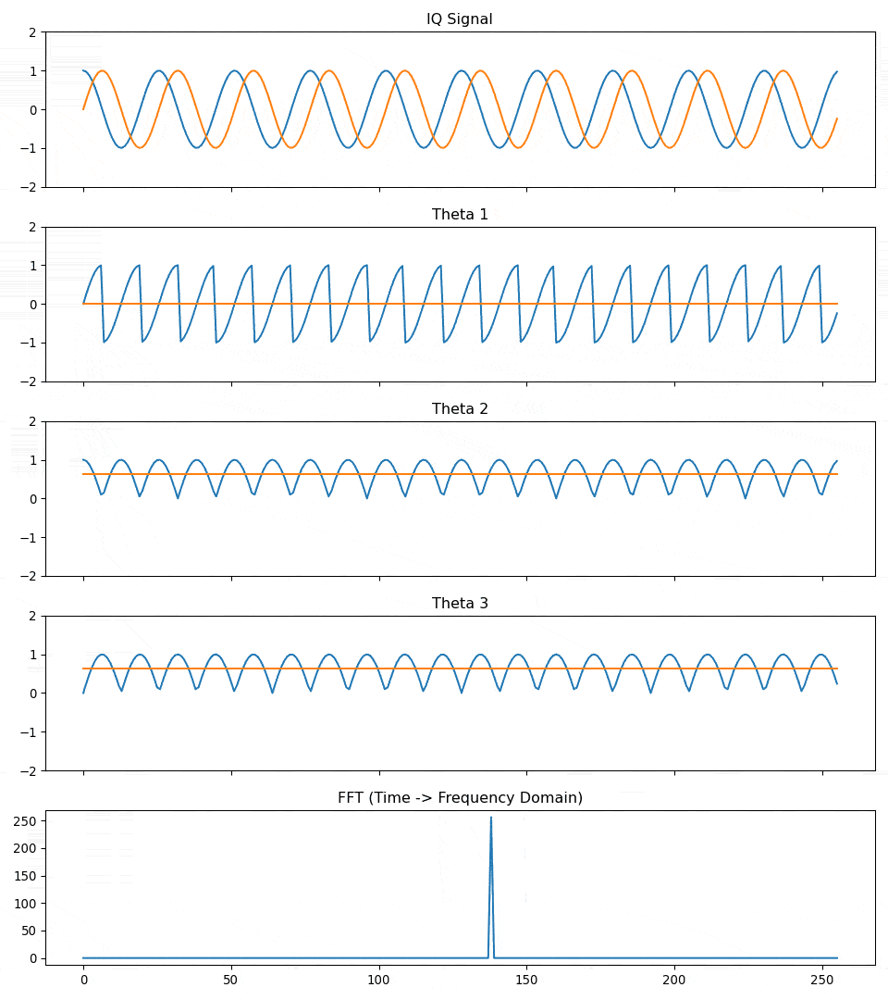

Once these quantities are estimated, we smooth the results using an exponential
smoothing filter. We can calculate how an adjustment to the I and Q channels.
The calculations are a little more complex than the theta values, and we need
to calculate a square root. This isn't too much of an issue because we only
need to calculate the adjustment once for each block of data. The whole process
can be completed in a few lines of C++ code.

.. code:: cpp

    static uint16_t index = 0;
    static int32_t theta1 = 0;
    static int32_t theta2 = 0;
    static int32_t theta3 = 0;

    theta1 += ((i < 0) ? -q : q);
    theta2 += ((i < 0) ? -i : i);
    theta3 += ((q < 0) ? -q : q);

    static int32_t c1 = 0;
    static int32_t c2 = 0;
    if (++index == 512)
    {
      static int64_t theta1_filtered = 0;
      static int64_t theta2_filtered = 0;
      static int64_t theta3_filtered = 0;
      theta1_filtered = theta1_filtered - (theta1_filtered >> 5) + (-theta1 >> 5);
      theta2_filtered = theta2_filtered - (theta2_filtered >> 5) + (theta2 >> 5);
      theta3_filtered = theta3_filtered - (theta3_filtered >> 5) + (theta3 >> 5);

      //try to constrain square to less than 32 bits.
      //Assue that i/q used full int16_t range.
      //Accumulating 512 samples adds 9 bits of growth, so remove 18 after square.
      const int64_t theta1_squared = (theta1_filtered * theta1_filtered) >> 18;
      const int64_t theta2_squared = (theta2_filtered * theta2_filtered) >> 18;
      const int64_t theta3_squared = (theta3_filtered * theta3_filtered) >> 18;

      c1 = (theta1_filtered << 15)/theta2_filtered;
      c2 = intsqrt(((theta3_squared - theta1_squared) << 30)/theta2_squared);

      theta1 = 0;
      theta2 = 0;
      theta3 = 0;
      index = 0;
    }

    q += ((int32_t)i * c1) >> 15;
    i = ((int32_t)i * c2) >> 15;

The solution works quite well, I tried to measure the performance improvements,
but with the IQ correction enabled the signals have either disappeared below the
noise floor, or are too small for the ADC to measure. This is a good result, in
practice we won't be able we won't be able to hear any images with IQ
correction enabled!

#####Insert before and after clip here

UI Enhancements
---------------

Thanks to Mariusz Ryndzionek and Penfold42 for numerous improvements to the UI!

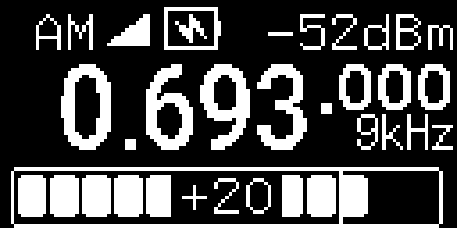

There have been numerous improvements to the user interface including nicer,
easier to read fonts, nicer graphical elements and a cute splash screen!

One of my favourite improvements is the introduction of multiple "views" which
can be accessed by pressing the back button on the home screen. This gives the
option to control and status information in different ways without cluttering
up the home screen. There is even a spectrum-scope with zoom and a dithered
waterfall. I'm amazed at just how much can be achieved using a 128x64 display
with only two colours.

The UI is now using the `u8g2 library <https://github.com/olikraus/u8g2>`_,
which provides a rich set of graphical tools, and loads of fonts. The u8g2 also
supports loads of different display types which should make it easier to adapt
the software to new displays in future.

Scan/Search
-----------

Thanks to Penfold42 for contributing the scanning/search functionality!

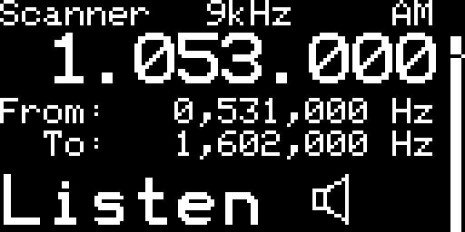

There are 2 scanning modes, frequency scan and memory scan. In frequency scan
mode, the receiver searches for signals in the current band frequency range
(e.g. 20m SSB band). In memory scan mode, the receiver searches memory channels
for active signals.

In both modes, the squelch setting is used to determine the threshold level, if
the signal strength exceeds the squelch threshold, the search is halted.
Searching can be continued by rotating the encoder.

The encoder controls both the direction and speed of the search. The current
signal strength and squelch level are indicated by a vertical bar on the right
hand side.

USB Audio
---------

Thanks to Mariusz Ryndzionek for implementing USB audio!

The addition of USB audio makes it so much easier to make an audio connection
to a host device. No messing around with audio cables, levels and sound cards.
The audio is transferred digitally to the PC with no loss of information in the
process.

The USB audio functionality is implemented using the `tinyUSB library
<https://github.com/hathach/tinyusb>`_, which is a fairly complex library to
use (but worth the effort). Although the library has loads of examples, the
documentation is a bit thin. The USB audio code implements a standard UAC2
audio class, so the pi-pico appears as an audio microphone when connected to
the host.

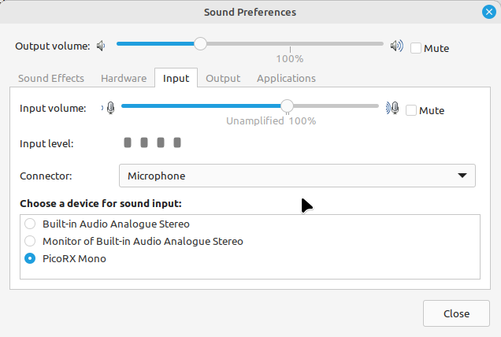

This allows a host device to easily make audio recordings (e.g. using
Audacity), and is compatible with software such as wsjtx, fldigi and QSSTV.
When combined with USB cat control allows a fully functional PC connection
using only a single USB cable. The direct digital audio connection provides
superior audio quality compared to an analogue connection using a sound card.

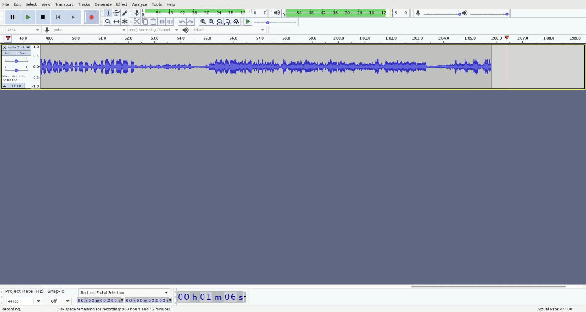

USB CAT Control
---------------

CAT control is provided through a USB serial port interface. The Pi Pico Rx
emulates a subset Kenwood TS-480.

The neat thing about USB is that a device can support multiple endpoints. This
means that with a single USB connection, the receiver can appear as both a USB
microphone and a virtual serial port. This makes it much easier to connect a
radio to a PC or other host device.  The CAT interface allows the receiver to be
controlled via a host device by software such as grig, wsjtx and fldigi.

.. image:: images/breadboard_radio_cat.png

The combination of USB Audio and CAT control opens up a lot of possibilities
for headless devices without a UI. It should be possible to build a simple
adaptor that allows an antenna to be connected to a PC, laptop or smartphone
for easy portable operation with minimal components. A smartphone has a larger
screen and makes it possible to build a much richer user interface than a
standalone device. A smartphone also has a lot more computing power, opening up
many more possibilities for digital modes and internet connectivity.

Calibration
-----------

Thanks to Penfold42 for contributing the signal strength calibration functionality!

The signal strength meter and s-meter have a power scale which makes use of the
theoretical gain of the QSD and op-amp. In the breadboard version, the op-amp
has a gain of 57dB. However, constructors may choose different filters or
preamplifiers, there will always be variations between theoretical gains and
real-world values. It makes sense to have some way to adjust or calibrate the
gain display on the screen. The gain can be calibrated using a signal generator
with a known signal strength. I don't have a calibrated reference, but the
tinySA can be configured to output a signal with a known strength. I found that
the reading on my tinySA was quite close to the value reported on the signal
strength meter, but with a bit of adjustment, the reading was bang on. In theory,
you could use a calibrated instrument to perform the same checks, but the
tinySA gives a good indicative value and it is certainly good enough for most
purposes.

A similar calibration can be performed for the frequency. I have added a menu
item that allows the oscillator error to be specified in parts per million
(PPM). Again, we could perform the calibration using a signal generator with a
known frequency. Another method is to tune in to a radio station with a known
frequency. WSJTX includes a nice frequency calibration feature that we can use
for this purpose. I chose to tune in to BBC Radio 4 on 198kHz, the carrier is
controlled by a rubidium clock. The 500kW transmitter is based at `Droitwich <https://en.wikipedia.org/wiki/Droitwich_Transmitting_Station>`_,
only a few miles away, so I don't have any issues getting a signal. I found
that with my receiver, a setting of 5ppm gave me the best accuracy.  This is
well within the +/-30ppm tolerance of the pi-pico's crystal oscillator. With
calibration, the accuracy of the receiver is within 1ppm.

TFT Waterfall/Spectrum Scope
----------------------------

The small OLED displays are cheap, readily available and very simple to wire
up.  They are pretty efficient and use hardly any power. Ideal for a minimalist
radio like this one! However a waterfall and spectrum scope is a nice addition
to any receiver, and it is tempting to see just how far we can push a simple
design. Don't worry though, the OLED display isn't going anywhere any time
soon. The TFT-based waterfall is just an optional extra that can be added with
just a few extra wires and can be enabled through a menu configuration.

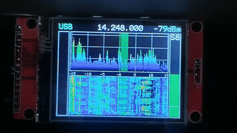

The waterfall uses an ILI9341-based TFT display. There are many such displays
available, and they come in a range of sizes. I used a 2.4-inch display which
seems to be one of the more popular sizes, they are easily available and
inexpensive. The receiver is compatible with 4-wire SPI-type displays.

There are a few spare pins left on the pi-pico, some of which can be configured
to work with the dedicated SPI hardware. It is handy to keep an SPI port spare,
as it allows the pico to connect to other SPI devices too.

Although the display is a write-only device that doesn't need the MISO card, it
makes sense to reserve it for use with other peripherals. The display has a
hardware reset input, but it is fairly common practice to hard wire the reset to
VCC to save the extra IO pin. I use the software reset functionality, and it
seems to be working OK so far.

+--------+------+
| Signal | GPIO |
+========+======+
| MISO   | 12   |
+--------+------+
| CS     | 13   |
+--------+------+
| SCK    | 14   |
+--------+------+
| MOSI   | 15   |
+--------+------+
| DC     | 11   |
+--------+------+

Displays come in different flavours. The ones I have seen may be configured to
work a 5V or 3.3V supply, a no-fit resistor pad can be shorted to bypass an
onboard regulator for 3.3V use. It is quite important to check that the display
you are using is powered by the right voltage. (And also that the pico is
capable of supplying enough current for the display). As far as I know, the
display IO is always 3.3v.

I used this library to `drive the display <https://www.darrenhorrocks.co.uk/native-pico-sdk-ili9341-ili9342-for-raspberry-pi-pico/>`_.
The nice thing about this display is that it is very simple and the code is easy
to understand. It doesn't use any kind of frame buffer which is an advantage
because the pico doesn't have enough spare RAM for this. It does mean that the
SPI has to run at quite a high frequency to achieve a reasonable refresh rate
though. I have modified the driver quite heavily, to make drawing the waterfall
and spectrum scope as efficient as possible. I also changed the text-drawing
functions to allow them to use the same font as the OLED display.

Hardware Configuration Options
------------------------------

Part of the fun of this project is that it isn't a finished product, more like
a starting point for experimenters and constructors to build their own
receiver. It makes sense to make the software as configurable as possible to
support the widest range of receivers. There is now a hardware configuration
that allows you to change many settings. Everything from the OLED display
driver to the encoder direction and resolution. Wire the QSD backwards? - No
problem, just switch I and Q in the hardware configuration menu. You can even
change the frequency ranges of the band filters (if you have them), design a
set of low-pass filters to build a general coverage receiver or add a set of
bandpass filters for your favourite bands.

Project Gallery
---------------

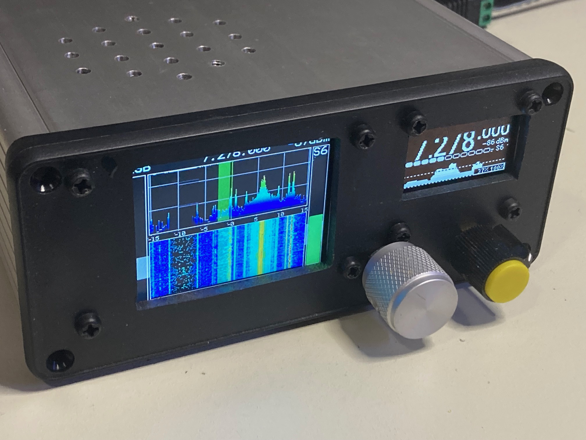

  Pi Pico Rx Build with waterfall (courtesy Jim Reagan W0CHL)

A growing number of people have now completed a build of the breadboard
receiver, and there is now a gallery of receiver builds. If you have built the
pico breadboard receiver, I would love to hear from you! `Gallery
<https://github.com/dawsonjon/PicoRX/issues/99>`_.

If you would like to support 101Things, buy me a coffee: https://ko-fi.com/101things
