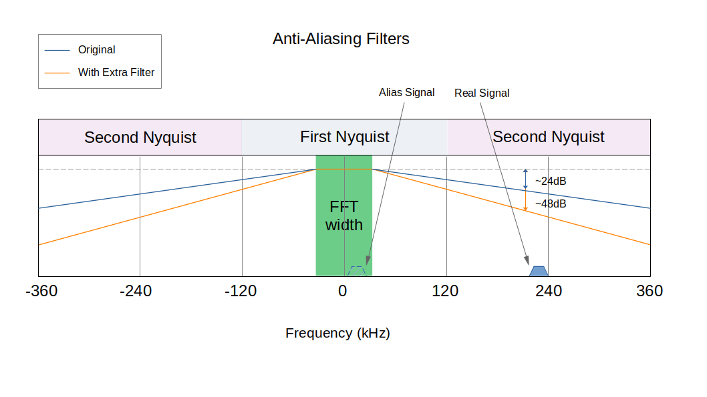

Breadboard Radio - Part 4
=========================

.. raw:: html

  <iframe width="560" height="315" src="https://www.youtube.com/embed/_lKWOAxRme4?si=fEAFpN_dJfoBr1dn" title="YouTube video player" frameborder="0" allow="accelerometer; autoplay; clipboard-write; encrypted-media; gyroscope; picture-in-picture; web-share" referrerpolicy="strict-origin-when-cross-origin" allowfullscreen></iframe>

Improved Anti-Aliasing
----------------------

One weakness of the Pico Rx is its susceptibility to aliases. The ADC in the Pi Pico has a bandwidth of 500kHz, but it doesn't include any anti-aliasing filters. I have done some measurements, and signals of a few MHz can appear as strong alias signals and are hardly attenuated at all. The design relies on the low-pass filter characteristics of the QSD to attenuate signals that fall outside the ADC bandwidth. The QSD already has two first-order low-pass filters, one formed by the source impedance and the sampling capacitors, and the second formed by the feedback resistor and capacitor. In theory, each of these filters contributes 6dB of attenuation per octave. The cutoff frequency of the source's first low-pass filter is dependent on the source impedance. We
don't exactly know what that will be, and it could vary. (We could use a
pre-amplifier or filter to make the source impedance more predictable.) The second filter depends only on the feedback resistor and capacitor and gives a much more predictable cutoff.

The ADC samples at 480kHz, giving a first Nyquist region between -120 and 120kHz. Signals outside this region are "reflected", e.g. a signal at 125kHz looks like a signal of 115kHz, and a signal at 235kHz looks like a signal of 5kHz. The receiver oversamples the signal by a factor of 10, which improves things. The QSD is designed to have a cutoff frequency of 12kHz, so we want the region between -12kHz and 12kHz to be free from reflected alias signals. Anything outside this region gets filtered out. This means that the lowest frequency signal that can be reflected into this region is 228kHz, which is 19 times the cutoff frequency and more than 4 octaves. In theory, each of the two low-pass filters provide 24dB of alias rejection. We do not want to rely on the first, so we ignore its contribution for now, giving between 24 and 48dB of alias rejection in total.

There have, however, been reports of aliasing in practice, with users reporting CW signals being heard in the SSB part of a band (and vice versa). There are some options to improve the alias rejection of the receiver; one option would be to use an external ADC (e.g. a stereo audio ADC). These tend to provide quite good alias rejection out of the box. Another option is to include an anti-aliasing filter. An active filter could be constructed using operational amplifiers, for example.

In a minimalist, low-cost receiver like this one, however, we need something a bit simpler. Connecting a simple RC low-pass filter between the op-amp and the ADC is a cheap and effective option. The filter comprises a 5.6k resistor and a 2.2nF capacitor in each channel. 5.6k is a good compromise, being much larger than the output impedance of the op-amp, but much smaller than the input impedance of the ADC.

The addition of another low-pass filter theoretically reduces aliases by a
further 24dB. In practice, this is enough to push most alias signals below the noise floor. The significant improvement in alias rejection justifies the cost of two resistors and two capacitors!

Frequency Calibration and Tuning Aids
-------------------------------------

The receiver already includes a mechanism to calibrate the frequency to compensate for any inaccuracy of the crystal oscillator on the Pi Pico. The latest software introduces a frequency measurement feature that can make the calibration process easier. The receiver can be calibrated by tuning to an AM station with a known carrier frequency. Most broadcast stations have a very accurate carrier frequency, and some, e.g. Radio 4 Longwave on 198kHz in the UK (there are alternatives in other parts of the world), have been deliberately designed to act as an accurate frequency reference.

The firmware measures the carrier frequency of the received station, with a perfectly accurate crystal; the carrier would have a frequency of zero, but a positive or negative reading of a few Hz indicates an inaccuracy. This frequency measurement is used to provide an indicator in the frequency calibration menu. If a right arrow is displayed, the ppm value should be increased, and a left arrow means that the ppm value should be decreased. When the arrow changes direction, it indicates that we are within 1ppm. The measurement process takes a couple of seconds to complete, so allow some time for the measurements to stabilise each time you adjust. Using this mechanism, calibrating the receiver is a fairly quick and simple process that can achieve good accuracy.

After experimenting with a few receivers, it looks like the frequency accuracy of the crystal oscillator on the Pi Pico is very good. Most seem to lie within +/-4ppm, well within the specified tolerances.

It is also possible to access the frequency measurement from the status screen, which displays the measured carrier frequency in Hz. This can be used as a tuning aid for AM and CW stations.

Noise Reduction
---------------

Thanks to Mariusz Ryndzionek for contributing the noise reduction capability, especially the adaptive threshold function!

The FFT-based filtering introduced in part 3 allowed much sharper,
high-performance filtering to be performed without increasing the CPU load.
Another advantage of FFT-based filtering is that it becomes possible to implement more sophisticated frequency domain processing without adding a significant performance overhead. We are performing the forward and inverse transforms in any case, so the additional processing required to transform the signal into the frequency domain does not add any further overhead. In part 3, we looked at an adaptive notch filter, a powerful technique to mitigate fixed-frequency, constant amplitude interference.

In part 4, we will look at how frequency domain processing can be used to implement a very efficient spectral noise-reduction algorithm. In principle, the noise reduction algorithm works like an automatic squelch control.

A squelch control silences signals that fall below a certain threshold. The squelch threshold is set just higher than the noise floor, so that when signals are present, they pass through unchanged, but when the signals are absent, the hiss of background noise is silenced.

The spectral noise adjustment algorithm works similarly, but it is
applied in the frequency domain. We have already divided the signal into
frequency bins, each containing a small range of frequencies. A threshold,
similar to a squelch control, is applied to each frequency bin. Bins that
contain signals pass through mostly unchanged, while bins that contain mostly noise are silenced. The modified bins are then translated back to the time domain, reconstructing a signal with a reduced background noise level.

While a squelch system uses a "hard" threshold, which turns the signal on or off, the noise reduction algorithm uses a "soft" threshold, which smoothly increases the gain from 0 (for bins containing only noise) to 1 (for bins containing only signal). The "gain function" converts an estimate of the signal-to-noise ratio in each bin into a gain. Changing the shape and steepness (threshold) of the gain function changes how aggressively the algorithm attenuates noisy bins. A soft threshold underestimates the noise level, resulting in less noise being removed. A high threshold value overestimates the noise, removing more noise, but potentially also removing some of the signal and producing "musical" artefacts in the resulting signal. The "adaptive" gain setting provides a compromise setting, equivalent to a high threshold for noisy signals, and a progressively lower threshold for stronger signals.

For the system to work, we first need to generate an estimate of the
signal level and the noise level. The algorithm uses an efficient approach with a low memory/CPU footprint to make these estimates. The signal is estimated using a simple exponential smoothing filter to estimate the average signal level over recent FFT frames. The noise is estimated using a very simple leaky-minimum-hold algorithm to track the lowest historic signal level. The level of "leakage" can be varied, so vary the speed of the estimate. A fast estimate can react more quickly to changes in the background noise level, whereas a slow setting takes much longer to adjust to the background noise level, but is also less sensitive to distortion when the signal is present for long periods.

This video animation shows the system in action using an aggressive
high-threshold setting. The left plot shows the original signal, the
instantaneous signal level and how the signal and noise estimates evolve. The right-hand plot shows the gain applied at each frequency, and the processed signal with attenuated noise.

**Before**

.. raw:: html

  <iframe width="560" height="315" src="https://www.youtube.com/embed/iYxtQ_EGHRU?si=if5wugtd5jYRlsPo" title="YouTube video player" frameborder="0" allow="accelerometer; autoplay; clipboard-write; encrypted-media; gyroscope; picture-in-picture; web-share" referrerpolicy="strict-origin-when-cross-origin" allowfullscreen></iframe>

**After**

.. raw:: html

  <iframe width="560" height="315" src="https://www.youtube.com/embed/f4NLKdcR-LU?si=g6bZ-CSWyF3MEju9" title="YouTube video player" frameborder="0" allow="accelerometer; autoplay; clipboard-write; encrypted-media; gyroscope; picture-in-picture; web-share" referrerpolicy="strict-origin-when-cross-origin" allowfullscreen></iframe>

Overall, the simplified noise reduction algorithm provides a very noticeable reduction in background noise without adding significant CPU or memory overhead.

Adjustable IF
-------------

The receiver uses a low-IF, partly from necessity (the PIO-based oscillator has a fairly low resolution) and partly to avoid noise and interference that occurs close to DC. By default, and IF close to 4.5kHz is used, this was chosen to move the DC noise out of the passband for the widest bandwidth signals. Since the resolution of the NCO is limited, the receiver chooses a frequency setting which is as close as possible to 4.5kHz away from the "dial" frequency; it could be higher or lower than the "dial" frequency, whichever is closest. Another frequency shift is performed in software to allow very precise tuning.

The latest firmware provides the ability to override the default IF setting,
allowing the user to choose their own IF frequency, and an option to change the behaviour so that the NCO is always below or above the dial frequency. This feature was mainly added for test purposes, but it turns out that it provides a quite effective mitigation for many interfering signals. For many types of interference, e.g. birdies, spurs, harmonics, aliases, directly coupled noise and so on, changing the IF frequency setting results in the interference "moving" in the passband while the signal stays in the same place. In many cases, interference can be completely mitigated by moving it out of the passband.

Tone Control
------------

Thanks to Mariusz Ryndzionek for contributing the tone control functions!

The filters use a biquad (second-order IIR filter) to implement bass and treble boost functions. This is a very computationally efficient method of implementing filters, and it is performed in the time domain after the demodulator.

The treble boost uses one of four "high-shelf" filters to boost frequencies
above 1200Hz. There are 5 possible settings implementing a treble boost of 0, 5, 10, 15 or 20dB.

The bass boost uses one of four "low-shelf" filters to boost frequencies
below 1200Hz. There are 5 possible settings implementing a treble boost of 0, 5, 10, 15 or 20dB.

The `Audio EQ Cookbook <https://www.w3.org/TR/audio-eq-cookbook/>`_ shows how the feed-forward and feed-back coefficients of the biquad filter are derived. A `python script <https://github.com/dawsonjon/PicoRX/blob/master/simulations/audio_filters_des.py>`_ calculates the coefficients, generates C code and plots the response of the filters at each of the gain settings.

The simple IIR-based filters generate a very effective tone-control function, and are very efficient in terms of memory and CPU.

TFT Upgrades
------------

The previous software included a secondary TFT display that could be used to display a spectrum scope and waterfall. There have been some visible enhancements to the user interface, including a retro-style tuning dial and signal strength indicator. Behind the scenes, the TFT driver has been extensively reworked to improve the reliability and performance. The drivers now include more settings, including a choice of initialisation routines (drivers) to improve compatibility. The smoothness and refresh rate of the display have been improved through code optimisations and the use of DMA SPI transfers. The DMA transfers allow the next video frame to be computed at the same time the previous frame is transferred.

USB IQ Audio
------------

Thanks to Mariusz Ryndzionek for contributing raw IQ streaming!

In previous versions of the receiver, audio streaming over USB was implemented. This allowed the receiver to act as a USB microphone, allowing for digital recordings of received audio and giving compatibility with PC applications without the need for multiple cables. In this configuration, the receiver is compatible with applications such as fldigi, wsjtx and qsstv. These types of applications expect to receive an audio output from a connected receiver.

The latest software release includes the ability to stream raw IQ data from the receiver to the PC. The data is taken after the FFT filter, but before the demodulator. In this mode, the receiver appears as a stereo audio source with the left channel carrying I samples and the right channel carrying Q samples. The audio hasn't been demodulated, so you can't listen to it directly, but it does allow compatibility with a range of SDR software such as Quisk, GQRX and GNURadio. These applications were designed to work with sound-card-based SDR receivers. This mode allows the receiver to stand in for a sound-card-based SDR receiver and allows for demodulation and further processing to be performed on
a host PC.

Although the raw audio is tapped off before the demodulator, the FFT-based filter is still applied. In this mode, for best results, select AM mode with the widest possible bandwidth. This allows 15kHz of bandwidth to be passed to the PC beased software.

.. raw:: html

  <iframe width="560" height="315" src="https://www.youtube.com/embed/i-kVgdB1nks?si=jfp4WoDLyTiGSoUm" title="YouTube video player" frameborder="0" allow="accelerometer; autoplay; clipboard-write; encrypted-media; gyroscope; picture-in-picture; web-share" referrerpolicy="strict-origin-when-cross-origin" allowfullscreen></iframe>

Integrated SSTV Decoder
-----------------------

One of the other projects I have been working on recently is the `Pi Pico SSTV decoder <https://101-things.readthedocs.io/en/latest/sstv_decoder.html>`_. It is a very minimal SSTV decoder design that has a reasonably small CPU and Memory footprint. The Pico SSTV decoder uses the audio output from a receiver, but I have been curious whether the SSTV decoder and receiver could be integrated into the same device. The receiver already supports an ILI9341 TFT display, which is ideal for displaying SSTV images, so an integrated SSTV receiver can be built using a fairly simple software upgrade.

From the beginning, I had tried to make the SSTV code as flexible as possible, so it was a fairly simple task to adapt the code to accept an I/Q output from the Pico Rx rather than the real-only samples used in the standalone decoder.
This was simply a matter of bypassing the Hilbert transform that converts the real sample to complex samples before passing them to the frequency measurement function. The receiver does most of the real-time signal processing using CPU core 1, while CPU core 0 handles most of the IO tasks.

I opted to implement the SSTV decoder using CPU core 0, which can be displayed on the TFT as an alternative to the waterfall. When the waterfall isn't running, some of the CPU and memory resources are freed to run the SSTV decoder, so the overhead of decoding SSTV images isn't that great.

The IQ samples are taken from the DSP chain after the FFT-based filter, and
before the demodulator. For SSTV decoding, a USB setting with a wide bandwidth
gives the best results. The IQ samples are passed from CPU core 0 to CPU core 1
by means of a queue. Since Core 0 also needs to update the OLED display, the
queue must be of sufficient size to store the IQ samples while the processor is
busy doing other things.

The integrated SSTV decoder is harder to test than the stand-alone version. We
can't play back recorded audio samples as easily; they first need to be
modulated onto a suitable RF signal. For simplicity, I used a Yuesu FT-817 and a
dummy load to generate test SSTV signals.

.. image:: images/breadboard_radio/sstv_off_air.png

*Image courtesy of Robert Nickels W9RAN*

I think there is something very satisfying about the integrated SSTV decoder, and it's fun to leave the receiver running and watch the images coming in. The SSTV decoder also provides an architecture to implement all sorts of post-processing on the IQ data, including digital modes, CW decoders and visualisations. This is an area I would like to develop in future releases.

SI5351 Support
--------------

By default, the receiver uses a PIO-based oscillator to drive the Quadrature Sampling Detector. Probably the most common method for generating a quadrature oscillator is to use an SI5351 clock generator. I have now added support for an external SI5351 oscillator. This is mainly for experimental reasons.

**It is worth noting that the external oscillator is an experimental option,
and not required to build the receiver.  The firmware is fully backwards
compatible, the internal PIO-based oscillator is still the simplest option and recommended for most users.**

Although the SI5351 clock generator and equivalent devices are now widely used in this application, the designers of the chip never had radio applications in mind. The device was originally intended to be statically configured using pre-defined parameters generated using a tool called "ClockBuilder Pro". The manufacturers, Skyworks, later released an `application note <https://www.skyworksinc.com/-/media/Skyworks/SL/documents/public/application-notes/AN619.pdf>`_ describing how the device was structured, and how the configuration parameters could be generated. This allowed the device to be configured on the fly using parameters generated in software.

Early designs used a single clock output from the clock generator at 4 times the NCO frequency and used a flip-flop counter to generate clock outputs separated by 90 degrees.

Hans Summers (from QRP Labs) discovered that it was possible to configure the device to directly generate two clocks separated by 90 degrees. He explains the technique in `this document <https://qrp-labs.com/images/news/dayton2018/fdim2018.pdf>`_

To understand this technique, it is worth looking in a bit more detail at the
structure of the device. The device is driven by a crystal oscillator, typically running at 25MHz. The crystal oscillator drives two independent phase-locked loops, each of which contains an integer/fractional frequency divider in the feedback loop. This has the effect of multiplying the crystal frequency to generate a PLL frequency in the 600MHz to 900MHz range.

The chip provides another integer/fractional frequency divider for each clock divider. This has the effect of dividing the clock down to a smaller frequency; in our case, this could be up to 30MHz. Although this frequency divider can be programmed with fractional values, this introduces jitter; an even integer
gives the best performance. Each of the output frequency dividers can be driven
from either of the two PLLs; thus, it is possible to drive two clock outputs
from the same PLL. The output dividers also provide the ability to add a phase delay to the output, and this is specified in units of
1/4 of the PLL frequency.

To generate two clocks with a 90-degree offset, we first configure the PLL to generate a clock which is an even integer multiple of the output frequency. So to generate a 30MHz clock, we might set the PLL to 600MHz, which is 20 times the output frequency. We can then configure two outputs to be driven from the same 600MHz PLL, and set the divider for both outputs to 20.

And now the clever bit... Since the phase offset is specified in units of 1/4 of a PLL clock cycle, setting the phase offset of one of the outputs to the same value as the divider (in this case, 20) always results in a 90-degree phase offset between the two outputs!

The technique works great, and the only real downside is that it places a
minimum limit on the operating frequency. The device is specified to work with a PLL frequency from 600MHz to 900MHz, and the phase offset has a maximum setting of 127. So, to stay within the device specs, the minimum achievable output frequency using this technique is about 4.7MHz. This is a bit of a shame because we would like to operate on the lower shortwave bands, and preferably mediumwave and longwave too.

Fortunately, another radio enthusiast came up with another very clever technique to generate quadrature signals at much lower frequencies. The technique is documented `here <https://tj-lab.org/2020/08/27/si5351%e5%8d%98%e4%bd%93%e3%81%a73mhz%e4%bb%a5%e4%b8%8b%e3%81%ae%e7%9b%b4%e4%ba%a4%e4%bf%a1%e5%8f%b7%e3%82%92%e5%87%ba%e5%8a%9b%e3%81%99%e3%82%8b/>`_.

With this technique, again, we configure the two outputs to be driven by the same PLL. This time, instead of using the phase offset facility, we configure each clock to use slightly different divider settings. One clock is at the correct frequency, and one is slightly lower. If we set the second clock to say 1Hz (to keep the maths easy, in practice a smaller offset is sufficient), lower than the first, after 0.25 seconds, it would be lagging by exactly 1/4 of a clock cycle. At this point, the divider in the second clock can be reconfigured so that both clocks are using the same divider. From this point forward, the clocks remain 90 degrees out of phase.

Although this sounds a bit tricky, the technique works very well, and if the time delay is relatively long, and our timing is reasonably accurate, we can get a phase shift very close to 90 degrees.

For this receiver, I developed a very simple library that uses both of these
techniques to cover the full range of the receiver from 50kHz to 30MHz. For frequencies above 5MHz, the "Hans Summers" technique is used, and for lower frequencies, the "tj-labs" technique is used.

The external oscillator can be enabled using a menu option. The si5351 shares an I2C bus with the OLED display, and the CLK0 and CLK1 outputs can be connected to the Tayloe detector in place of the PIO outputs (pins 1 and 2 of the Pi Pico). When the external oscillator (si5351) is enabled, the PIO NCO outputs are set into a high impedance state. Conversely, when the external oscillator is disabled, the si5351 outputs are set to a high impedance state.
This means that it is possible to leave both the internal and external
oscillator connected, and to switch between the two options in real time using the menu. If this technique is used, it is worth verifying first that the si5351 is operating correctly to avoid any possible contention.

When I was developing SI5351 support, I did have some issues with the quality of the modules received. The first 3 cheap generic modules I ordered from various sources each had hardware faults. In the end, I opted for a more expensive branded (identical footprint) module, which has been performing well. Your mileage may vary.

From initial testing, the PLL in the SI5351 provides a lower jitter output and fewer spurs. From the very small sample of two branded modules I have received, the frequency accuracy of the SI5351 modules has been variable, with a frequency error in the region of 50ppm, although this can easily be corrected using the frequency calibration facility in the receiver. This is dependent on the quality of the crystal fitted to the module and is likely to depend on the source.

If you would like to support 101Things, buy me a coffee: https://ko-fi.com/101things
