FM Radio using RDA5807M and MicroPython
=======================================

.. image:: images/fm_radio_thumbnail.png
  :target: https://youtu.be/bj8MgL6k2tU

Quick Links
-----------

RDA5807M
--------

The RDA5807M is a highly integrated single-chip FM stereo radio tuner. The chip
can be connected to a microcontroller using the `I2C <https://en.wikipedia.org/wiki/I%C2%B2C>`_ interface to control it. It
includes everything you need to add an FM radio capability to a microcontroller
project with only a couple of extra components. It can even directly drive a 32
ohm load (e.g. headphones) without using an external amplifier. There is a
plentiful supply of very cheap modules based on this chip that make it 
easy to design an FM radio or to add an FM radio to another project.

Apart from the chip itself, they include a crystal oscillator and a couple of
capacitors, but not much else. The modules aren't a standard pitch, ideally,
they would be soldered to a suitable PCB footprint, but with a bit of care, you
can solder small wires to the pads. The pads are quite delicate and can easily
fall off, so it is important to relieve any strain on the wires.

The interface is very simple, it just needs power, an I2C connection, an
antenna input and audio output to be connected.

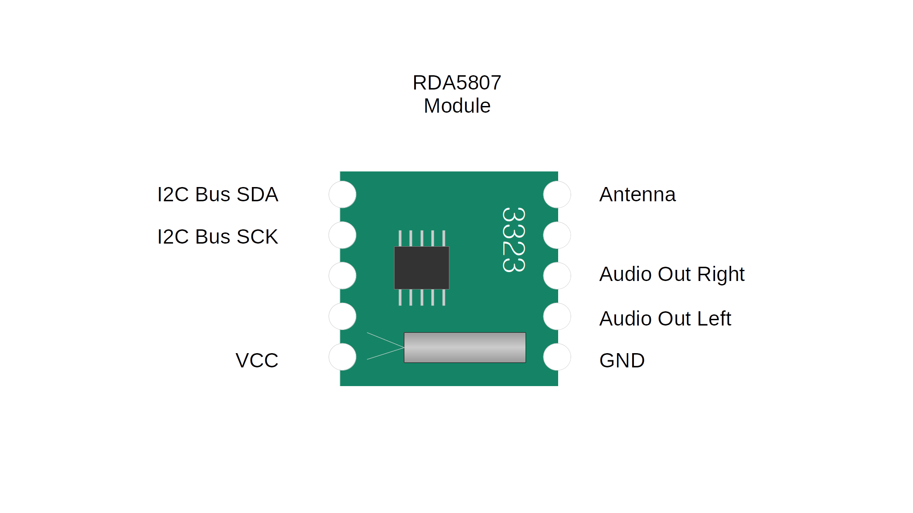

Breadboard Version
------------------

To put the RDA5807M module through its paces I built a simple "breadboard" FM
receiver using a Pi-Pico. It doesn't have a dedicated user interface, I'm using
a USB-serial connection to control the tuning and the volume.

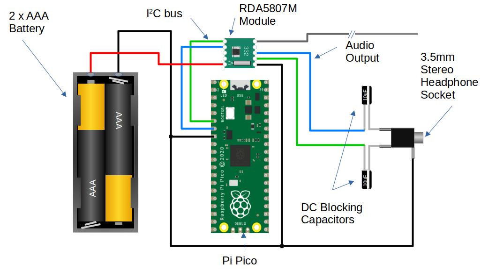

Parts List
~~~~~~~~~~

Most parts are commonly available and could be purchased from multiple sources, but I have included links to some example components.

+ 1x `RDA5807M fm radio module <https://www.amazon.co.uk/Stereo-Radio-RDA5807M-Wireless-Module/dp/B09LVF9288>`_
+ 1x `Raspberry Pi Pico <https://thepihut.com/products/raspberry-pi-pico?variant=41925332533443&currency=GBP&utm_medium=product_sync&utm_source=google&utm_content=sag_organic&utm_campaign=sag_organic&gad_source=1&gclid=CjwKCAjw5ImwBhBtEiwAFHDZxwre5KXVRTWmX5lLn4kBU5xI8hmbzu8zj9dYpZ-y_CjOZlPJE8G5fxoC2_oQAvD_BwE>`_
+ 1x 3.5mm stereo headphone socket
+ 2x 10uF electrolytic capacitor
+ 1x Battery holder 2xAA or 2xAAA

MicroPython Library
~~~~~~~~~~~~~~~~~~~

This time, I thought it would be fun to build the project using MicroPython.
The RDA5807M is doing all the work, so there's no need to squeeze every ounce of
performance out of the device, so why not enjoy the power and simplicity of a Python programming environment?

I wrote a simple Python library to control the RDA5807M using MicroPython's
built-in I2C library.  The Pi-Pico has hardware support for I2C if you use the
dedicated pins. This is the preferred option for I2C control, but it is possible
to use pretty much any pin using the software I2C implementation in MicroPython.
The interface to both hardware and software I2C is the same, so the RDA5807
library works just as well with either.

Antenna
~~~~~~~

For the antenna, I just connected 750 mm of wire to the antenna pin of the
module to form a simple whip.

Headphones
~~~~~~~~~~

The module is capable of directly driving a 32-ohm load, so we can drive a pair
of headphones without any additional amplification. I just added a couple of
10uF DC blocking capacitors and a 3.5mm stereo socket.

PSU Noise
~~~~~~~~~

The RDA5807 does need a low-noise PSU. The Pi-Pico uses a switched-mode
voltage regulator to drive the 3.3v rail. The regulator automatically switches
to a power-saving mode when it is lightly loaded. Unfortunately, the regulator has
a great deal of ripple when operating in this mode. It is possible to override
the power-saving feature of the regulator by setting the GPIO23 output high.
It is worth doing this in any application that might be sensitive to PSU noise.
Unfortunately, even after disabling the power-saving mode the 3.3v output from
the Pi-Pico still had too much noise for the RDA5807M and it wouldn't receive
any stations. For simplicity, I used 2 AA batteries to provide a low-noise
power supply to the module. This worked great and the radio worked well.

USB Serial Example
~~~~~~~~~~~~~~~~~~

I knocked up some simple example code to test out the radio using the USB
serial port to control the device.

.. code:: Python

  import sys
  import time
  import rda5807
  from machine import Pin, I2C

  #disable power save mode to reduce regulator noise
  psu_mode = Pin(23, Pin.OUT)
  psu_mode.value(1)

  # configure radio module
  radio_i2c=I2C(0, sda=Pin(4), scl=Pin(5), freq=400000)
  radio = rda5807.Radio(radio_i2c)
  time.sleep_ms(1000)

  volume = 1
  mute = False
  frequency = 88.0

  radio.set_volume(volume)
  radio.set_frequency_MHz(frequency)
  radio.mute(mute)

  print("Pi Pico RDA5807 FM Radio Example")
  print("press ? for help")
  while(1):
      command = sys.stdin.read(1)
      if command == "?":
          print("Commands")
          print("========")
          print("")
          print("? - help (this message)")
          print(", - seek down")
          print(". - seek up")
          print("- - volume down")
          print("= - volume up")
          print("")
      if command == ".":
          print("seeking...")
          radio.seek_up()
          frequency = radio.get_frequency_MHz()
          print(frequency, "MHz")
      elif command == ",":
          print("seeking...")
          radio.seek_down()
          frequency = radio.get_frequency_MHz()
          print(frequency, "MHz")
      elif command == "=":
          if mute == True:
              mute = False
              radio.mute(mute)
          elif volume < 15:
              volume += 1
              radio.set_volume(volume)
      elif command == "-":
          if volume > 0:
              volume -= 1
              radio.set_volume(volume)
          elif mute == False:
              mute = True
              radio.mute(mute)
      time.sleep_ms(100)

Installing Thonny and Micropython
~~~~~~~~~~~~~~~~~~~~~~~~~~~~~~~~~ 

Thonny is one of the easiest tools to get started with MicroPython development
on the Pi-Pico. Details about how to download and install Thonny can be found
`here <https://thonny.org/>`_.  Once Thonny has been installed, installing
Micropython on the Pi-Pico is a simple operation.

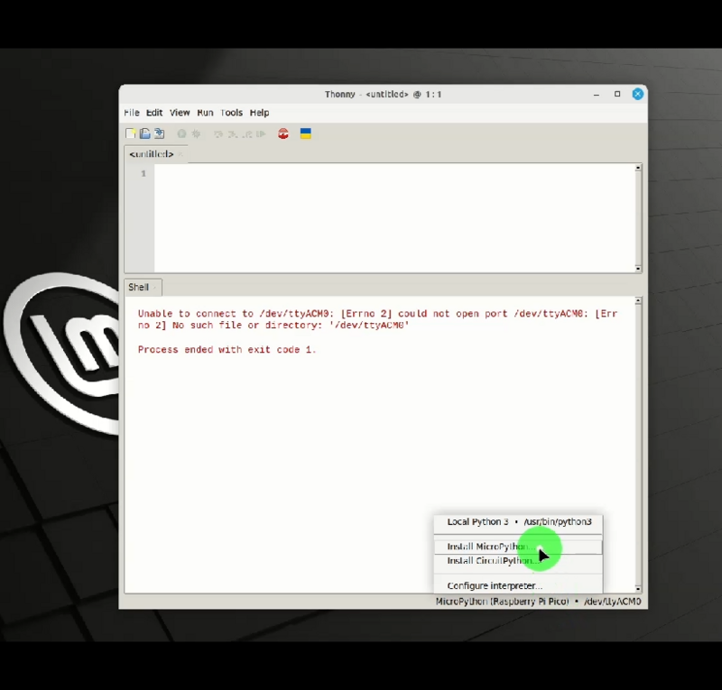
 
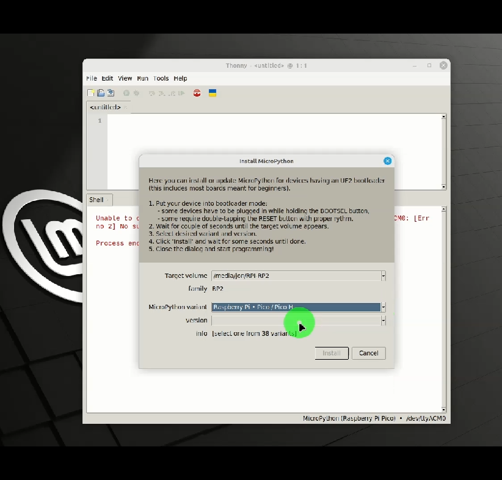

Trying the serial example
~~~~~~~~~~~~~~~~~~~~~~~~~ 

By default, micropython will load and run the module called `main.py` in the
root folder. Loading the example is simply a matter of transferring
`serial_example.py` to the Pi-Pico, renaming it to `main.py`. You also need to
transfer the `rda5807.py`. You can do this using Thonny, which also provides
the ability to edit, run and debug the script or drop into the MicroPython
interpreter.  For convenience, I also added a simple script to transfer the
necessary Python files to the Pi-Pico.  It makes use of the `pyboard.py <https://github.com/micropython/micropython/blob/master/tools/pyboard.py>`_
utility to transfer the files to the Pi-Pico's flash-based file system.  You
may need to edit the serial port settings in the `send_serial_exampl_to_pico`
script to match the serial port names on your system.

.. code:: bash

  $cd 101Things/19_fm_radio/
  $. send_serial_example_to_pico

Once the Python modules are loaded, the example code is automatically loaded
when the Pi-Pico boots. You can connect to the USB serial port using the screen
utility, or another serial terminal application. The serial example uses simple
commands to tune a station or adjust the volume.

.. code:: bash

 $screen /dev/ttyACM0
 Commands
 ========

 ? - help (this message)
 , - seek down
 . - seek up
 - - volume down
 = - volume up
 seeking...
 104.0 MHz
 seeking...
 106.7 MHz
 seeking...
 102.8 MHz

Standalone Version
------------------

Now we have the radio functionality, we can think about building a standalone
radio. There is lots of room for customisation, there is plenty of scope to
experiment with the user interface, to make a portable device or perhaps a
retro-style radio. Perhaps this could be combined into another project, adding
FM radio functionality to an MP3 player, or an internet radio?

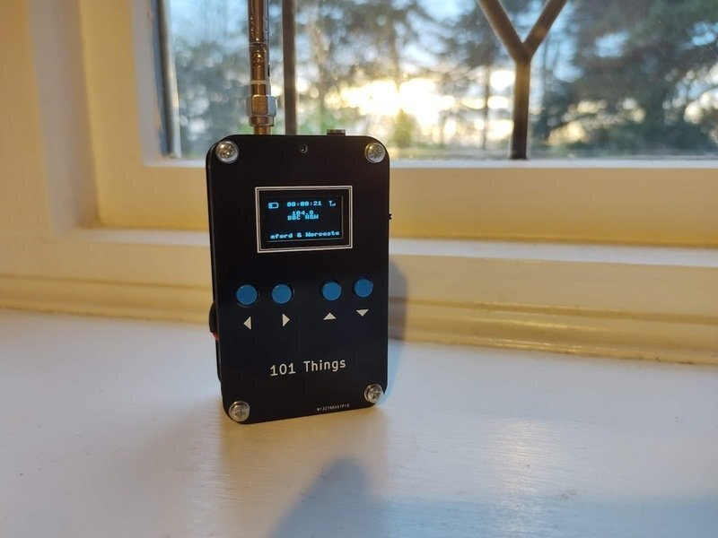

I decided to go for a simple, portable, battery-powered device. I retrofitted
the functionality to my usual Swiss-Army-PCB encloser which I used in the
`guitar multi-effects unit <https://101-things.readthedocs.io/en/latest/guitar_effects.html>`_ and the
`power and SWR meter <https://101-things.readthedocs.io/en/latest/power_swr_meter.html>`_.

I wanted something that could run on batteries, with a small audio amplifier and speaker.

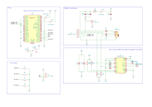

Parts List
~~~~~~~~~~

Most parts are commonly available and could be purchased from multiple sources, but I have included links to some example components.

+ 1x `RDA5807M fm radio module <https://www.amazon.co.uk/Stereo-Radio-RDA5807M-Wireless-Module/dp/B09LVF9288>`_
+ 1x `Raspberry Pi Pico <https://thepihut.com/products/raspberry-pi-pico?variant=41925332533443&currency=GBP&utm_medium=product_sync&utm_source=google&utm_content=sag_organic&utm_campaign=sag_organic&gad_source=1&gclid=CjwKCAjw5ImwBhBtEiwAFHDZxwre5KXVRTWmX5lLn4kBU5xI8hmbzu8zj9dYpZ-y_CjOZlPJE8G5fxoC2_oQAvD_BwE>`_
+ 1x `128x64 OLED Display <https://www.amazon.co.uk/dp/B08ZKW6KM1?ref_=pe_27063361_487360311_302_E_DDE_dt_1&th=1>`_
+ 1x `3.5mm stereo headphone socket <https://uk.farnell.com/cliff-electronic-components/fc68133/stereo-jack-3-5mm-5pos-pcb/dp/2518190>`_
+ 3x `TPA2012D <https://uk.farnell.com/texas-instruments/tpa2012d2rtjtg4/amp-audio-classd-power-smd-qfn20/dp/3116929?st=TPA2012D2RTJTG4>`_
+ 5x 10uF ceramic capacitor X7R 0805 
+ 3x 1uF ceramic capacitor X7R 0805 
+ 1x 100nF ceramic capacitor X7R 0805 
+ 1x `ferrite bead 0805 <https://uk.farnell.com/tdk/mmz2012y102b/ferrite-bead-0-3ohm-500ma-0805/dp/1669727>`_
+ 1x resistor 10R 0805
+ 2x resistor 1K 0805
+ 2x resistor 100K 0805
+ 1x `SPDT slide switch <https://uk.farnell.com/c-k-components/os102011ma1qn1/switch-spdt-0-1a-12v-pcb-r-a/dp/1201431>`_
+ 1x `SMA connector <https://uk.farnell.com/rf-solutions/con-sma-edge-s/sma-female-connector-pcb-edge/dp/3498459>`_
+ 1x battery holder 2xAA or 2xAAA
+ 1x speaker 4-ohm/8-ohm
+ 4x `tactile switch 6mm <https://uk.farnell.com/alcoswitch-te-connectivity/fsm4jh/switch-spno-0-05a/dp/1555982>`_

PSU Noise
~~~~~~~~~

When I first built the radio, I powered both the RDA5807M and the Pi-Pico
directly from 2xAA batteries. This worked quite well, but there were a couple
of downsides to this approach.

The first issue was that noise from the pico reduced the performance of the FM
receiver so that some of the weaker stations could no longer be received. 

The second was that the voltage range of the RDA5807 is quite narrow from 2.7v to
3.3v. 2xNiMH cells should produce 2.4v when charged, reducing to 2.0v when
discharged, in practice the device seemed to work with 2 AA NiMH batteries
until they were almost completely discharged, but it would be nice to have the
flexibility to use 2 or 3 NiMH or alkaline cells. This would need a voltage
range from 2V to 4.5V. Another nice option would be to use a lithium polymer
cell which might output 4.2V when charged and 3.4V when discharged. The Pi-Pico
has a nice built-in switching regulator that can run on 1.8V to 5.5V, and
efficiently produces a 3.3V output. If we could filter the 3.3v supply well
enough to power the RDA5807M, this configuration would allow any of these
battery combinations, while keeping power loss to a minimum.

Some better supply filtering was needed. I tried this circuit using a ferrite,
resistor and capacitors.

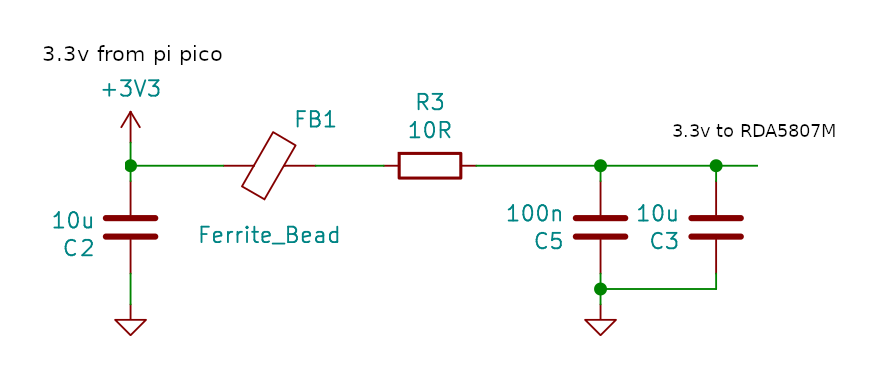

Adding the filter to the 3.3V output from the Pi-Pico did the trick. When the
RDA5807M was able to receive even the weaker stations using the filtered
supply.

User Interface
~~~~~~~~~~~~~~

I was looking for something compact, low-power and inexpensive so I stuck with
the usual SSD1306 OLED display. Fortunately, MicroPython has inbuild support for
this type of display which helps to keep the development simple. I could have
shared the I2C bus between the RDA5807M and the SSD1306, but I'm not doing much
else with the Pi-Pico and I have plenty of spare IO so I used a separate bus.
A few tactile push buttons are all that is needed to control the device. 

MicroPython provides a flash-based file system so it is quite easy to store the
settings by writing them to a file. This is certainly a lot easier than writing
to Flash using the C/C++ SDK.

.. code:: python

  def load_settings():

      """ Load settings from a file in Flash on power-up """

      #default settings if no file present
      settings = {
          "volume" : 0,
          "mute" : False,
          "frequency_MHz" : 88
      }

      try:
          with open("settings.txt") as input_file:
              for line in input_file:
                  key, value = line.split(":")
                  key = key.strip()
                  value = value.strip()
                  settings[key] = value
      except OSError:
          pass
      
      return settings

  def save_settings(settings):

      """ Save settings to a file when a change is made """

      with open("settings.txt", 'w') as output_file:
          for key, value in settings.items():
              line = "%s:%s\n"%(key, value)
              output_file.write(line)

Battery Monitor
~~~~~~~~~~~~~~~

In the Pi-Pico, VSYS (the battery input in our case) is permanently connected
to one of the 5 ADC channels via a potential divider. This makes it very easy
to track the battery voltage. I used a very simple smoothing filter to remove
measurement noise.

.. code:: python

  #The ADC pin needs to be configured at power-up
  adcpin = machine.Pin(29, machine.Pin.IN)

  ...

  #read battery voltage
  analogIn = ADC(3)
  batt_voltage = analogIn.read_u16() * 3.0 * 3.3 / 65536
  average_batt_voltage = (0.6 * average_batt_voltage) + (0.4 * batt_voltage)

Once we know the battery voltage, we can convert this into a battery level that
can be drawn on the display. The battery level scale is from 0 to 10 with zero
representing a flat battery and 10 representing a full one. The voltage of a
full and flat battery depends on the battery chemistry.

.. code:: python

   # Values could be adjusted for different chemistry
   # based on 2 AA cell
   batt_voltage_max = 3.0
   batt_voltage_min = 2.0
    
   # based on 3 AA cell 
   #batt_voltage_max = 4.5
   #batt_voltage_min = 3.0
    
   # based on 1 3.7/4.2v Lithium Polymer cell
   #batt_voltage_max = 4.2
   #batt_voltage_min = 3.4
    
   if average_batt_voltage > batt_voltage_max:
       batt_level = 10
   elif average_batt_voltage < batt_voltage_min:
       batt_level = 0
   else:
       batt_level = (average_batt_voltage - batt_voltage_min) / (batt_voltage_max - batt_voltage_min)
       batt_level = round(batt_level * 10.0)

Signal Strength Indicator
~~~~~~~~~~~~~~~~~~~~~~~~~

The RDA5807M provides an RSSI monitor indicating the signal strength. The
rda7805.get_signal_strength() method returns a signal strength using a
logarithmic scale from 0 to 7. The example code represents this as a signal
strength icon which it draws on the screen.

.. code:: python

    def draw_signal_strength(display, radio):

        """ Draw a signal strength icon on screen. Queries radio's RSSI. """

        x = 110
        y = 0
        display.line(x+2,  y+0, x+2,  y+8, 1)
        display.line(x+0,  y+0, x+2,  y+4, 1)
        display.line(x+4,  y+0, x+2,  y+4, 1)

        level = radio.get_signal_strength()
        for i in range(level):
            display.line(x+4+(2*i),  y+8, x+4+(2*i),  y+8-i, 1)

RDS
~~~

The RDA5807M provides the ability to receive and decode RDS data. The `datasheet <https://cdn-shop.adafruit.com/product-files/5651/5651_tuner84_RDA5807M_datasheet_v1.pdf>`_
for the device does seem to lack detail in this area. The RDS protocol supplies
data in four blocks, the RDA5807M provides each of these blocks in a separate
16 bit registers RDSA/B/C/D. The protocol includes both data and parity bits
which allows for bit errors to be either detected and corrected or just
detected depending on how many bit errors are present. The RDA5807M does the
error correction for us giving us only the data part of each block. The number
of bit errors in blocks A and B can be determined by reading BLERA/B. As far as
I can tell there is no way to tell how many bit errors are present in blocks C
and D, so it doesn't seem to be possible to completely avoid using corrupted data.

Experimentally, it seems that reading from RDSA/B/C/D is an atomic operation.
So long as the registers are read in address order, the blocks always seem to
relate to the same message. Also, it seems like polling the device for new
messages every 10ms is more than sufficient to ensure that we don't miss any of
the received messages.

I included a simple RDS decoder, which only decodes `station name`, `station
text` and `time` messages which are displayed on the screen.

Class-D Amplifier
~~~~~~~~~~~~~~~~~

Although the RDA5807M can drive headphones directly, it is nice to have a bit
more power to drive a speaker. The LM386 might be the traditional choice, but I
opted for the `TPA2012D2 <https://www.ti.com/lit/ds/symlink/tpa2012d2.pdf?ts=1711052806354&ref_url=https%253A%252F%252Fwww.google.com%252F>`_. 
This class-D stereo amplifier is very efficient and
can supply as much as 2.1W per channel into 4-ohm speakers. It is cheap and
requires only a couple of supporting components, so really is ideal for a battery-powered application like this. 

One potential downside of the TPA2012D2 is that the WQFN package isn't
particularly beginner-friendly. Fortunately, several ready-made modules such
as `this one <https://learn.adafruit.com/adafruit-ts2012-2-8w-stereo-audio-amplifier/overview>`_ are available.

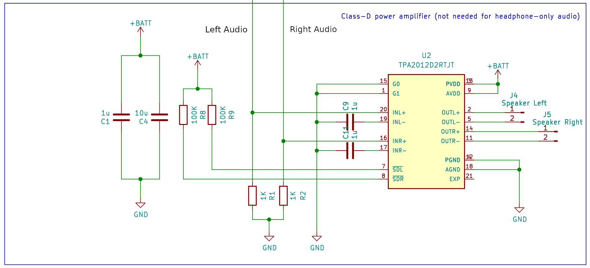

The IC has 2 inputs G0 and G1 that set the gain of the amplifier. In this
application we don't need much gain so I wired both these pins to ground giving
the lowest possible (6dB) gain.

I opted for a tiny 8-ohm speaker, these tiny speakers sound pretty terrible
unless they are sealed in an air-tight enclosure.  Some kind of 3D-printed
surround would have been ideal, but I went for a lower-tech solution and just
used a bottle cap secured with adhesive. Although not Hi-Fi quality, once
sealed in an enclosure I was quite happy with the quality. You can
get miniature speakers that have a built-in enclosure. I would have taken this
route but didn't have the space in the enclosure. 

A larger speaker (in a suitable enclosure) would give even better (and louder)
audio, and would be worth considering if you have the space.

Antenna
~~~~~~~

The FM receiver is quite sensitive, and I found that the wire whip antenna was
able to receive quite a few local stations. In the standalone receiver, I used
an SMA connector for the antenna, this allows a compact telescopic antenna to
be used for portable use while allowing a better external antenna to be used
if necessary. It is possible to use the headphone cable as an antenna if
suitable filtering is used, and the RDA5807 datasheet gives details on how to
achieve this.

Splash Screen
~~~~~~~~~~~~~

For a bit of fun, I thought it might be interesting to play try displaying
images on the OLED display. The MicroPython library for this display is based
on the `FrameBuffer` class which provides drawing primitives but
doesn't have a way of loading an image from a file. The closest thing is the
`blit` method that allows a frame buffer to be drawn on top of another. A
`FrameBuffer` can also be passed a `bytearray` on construction, and it is simple
enough to read this from a file.

.. code:: python

  def draw_image(display, filename):

      """ Load an image from flash into a framebuf object and display on screen """

      width = 128
      height = 64
      with open(filename, "br") as inf:
          data = inf.read(width * height // 8)
      fbuf = framebuf.FrameBuffer(bytearray(data), width, height, framebuf.MONO_HLSB)
      display.blit(fbuf, 0, 0, 0)
      display.show()

To limit the amount of processing that needs to be done in Python, I
pre-process the image into a `bytearray` of the correct format using a Python
script on a PC.

.. code:: python 

  import imageio
  import sys

  input_file = sys.argv[1]
  output_file = sys.argv[2]

  im = imageio.imread(input_file)
  h, w, c = im.shape

  bytevals = []
  for y in range(h):
    for i in range(w//8):
      byteval = 0
      for j in range(8):
        x = (i*8)+j
        byteval <<= 1
        if im[y][x][0] > 0:
          byteval |= 1
      bytevals.append(byteval)

  with open(output_file, "wb") as outf:
    outf.write(bytes(bytevals))

The script uses the `imageio` library so can convert from most common image
types. The image does need to have the correct height (in this case 128 pixels
wide by 64 pixels high). The pixels in the image should be either black or
white.

.. code:: bash

    $ python image2fbuf.py radio.png radio.fbuf

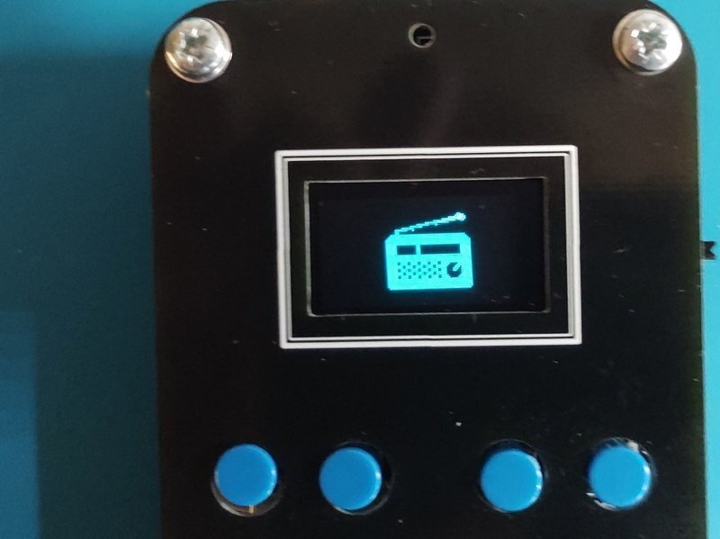

Installing the SSD1306 library
~~~~~~~~~~~~~~~~~~~~~~~~~~~~~~ 

Assuming you have already installed Thonny and MicroPython, it is easy to install the SSD1306 library.

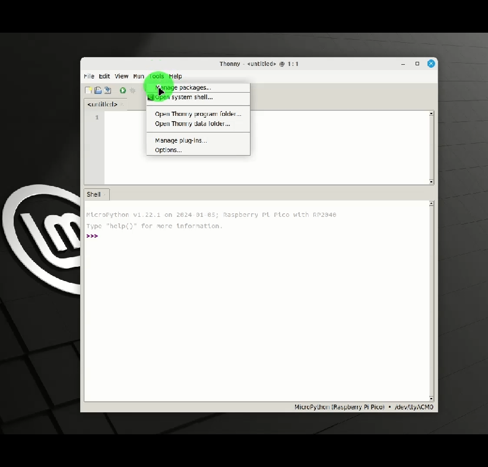

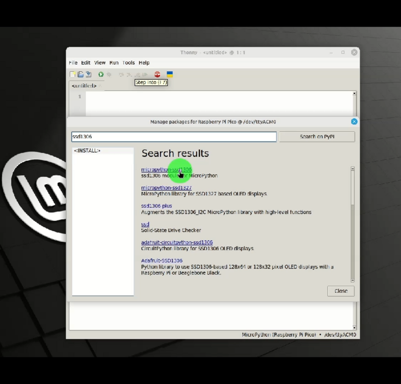

Loading the Python Project
~~~~~~~~~~~~~~~~~~~~~~~~~~

I have written another `pyboard.py <https://github.com/micropython/micropython/blob/master/tools/pyboard.py>`_
based script `send_oled_example_to_pico` to download all the necessary files.
This time the script sends the `FrameBuffer` image file along with the Python
modules.

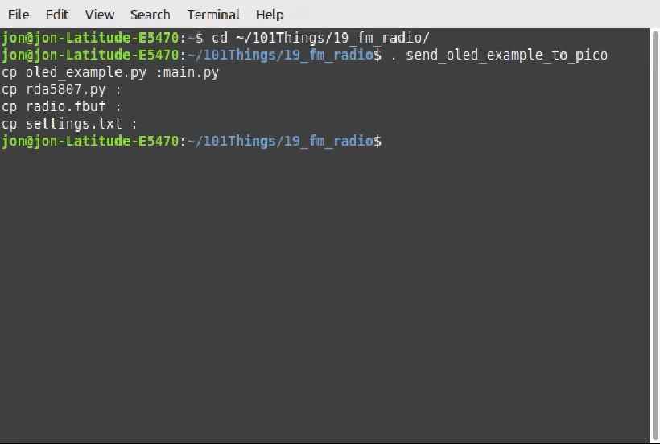

Testing
~~~~~~~

That's it! A working FM radio receiver, using an RD5807M and a Pi-Pico
programmed in MicroPython. The process was fairly simple, supplying the RDA5807
with a clean supply was probably the trickiest part of the project.

If you want to give it a go, you can find the code here:
`FM Radio Code <https://github.com/dawsonjon/101Things/tree/master/19_fm_radio/>`_

Useful Links
------------

`RDA5807M datasheet <https://cdn-shop.adafruit.com/product-files/5651/5651_tuner84_RDA5807M_datasheet_v1.pdf>`_

`C/C++SDK library for RDA5807 <https://github.com/vmilea/pico_rda5807>`_

`TPA2012D2 datasheet <https://www.ti.com/lit/ds/symlink/tpa2012d2.pdf?ts=1711052806354&ref_url=https%253A%252F%252Fwww.google.com%252F>`_. 
