DIY Multi-Effect Guitar Unit: Affordable, Easy, and Versatile
=============================================================

Unlock Your Guitar's Potential on a Budget
------------------------------------------

.. image:: images/headphone_amp.jpg
  :align: center

Are you a guitarist looking to explore a myriad of tones without breaking the
bank? Look no further! Introducing our *DIY Multi-Effect Guitar Unit* — a
cost-effective, straightforward solution for musicians who crave versatility
without complexity.

The DIY Multi-Effect Guitar Unit uses a minimalistic design that harnesses
the power of the Raspberry Pi Pico and just a handful of additional components.
With a total cost that amounts to just a few pounds, this project is not only
budget-friendly but also remarkably simple to build. Regardless of your
technical background, this unit is engineered to be accessible to anyone with
a passion for music and a desire to experiment with their sound.

The secret to its affordability lies in the utilization of the Raspberry Pi
Pico, a versatile microcontroller that serves as the brain of our DIY unit.
Despite its modest cost, the Raspberry Pi Pico provides a robust platform for
implementing a wide array of guitar effects usually found in much more expensive
units.

So, whether you're a seasoned electronics enthusiast or someone just dipping
their toes into the world of DIY projects, the design allows you to create a
feature-rich, multi-effect guitar unit without the headache of a convoluted
assembly process or a hefty price tag.

Effects
-------

The unit includes the most common effects, many of which can be used simultaneously.

+ 5-Band Graphic Equalizer
+ Multiple Distortion Effects
+ Delay
+ Echo
+ Reverb
+ Chorus
+ Flanger
+ Phaser
+ Tremolo
+ Vibrato
+ Multiple Patch Memories

Firmware
--------

In this article, I have gone into quite a bit of detail about how this works,
which may be quite heavy going. Don't let that put you off though, the circuit
is quite simple and there's a pre-built software image too, ready to
download over USB.

+ `C Code for Pi Pico <https://github.com/dawsonjon/101Things/tree/master/13_guitar_effects>`__
+ `Pico Firmware <https://github.com/dawsonjon/101Things/blob/master/build/13_guitar_effects/guitar_effects.uf2>`__

PCB
---

I have put together a general-purpose PCB for audio-based Pi Pico Projects.
This PCB only needs a few modifications to make the guitar effects unit.

+ `Schematic <https://github.com/dawsonjon/101Things/blob/master/PCB/swiss%20army%20pcb/things.pdf>`__
+ `Front Panel PCB <https://github.com/dawsonjon/101Things/blob/master/PCB/front_panel/gerbers/front.zip>`__
+ `Back Panel PCB <https://github.com/dawsonjon/101Things/blob/master/PCB/back_panel/gerbers/back.zip>`__
+ `Swiss Army PCB <https://github.com/dawsonjon/101Things/blob/master/PCB/swiss%20army%20pcb/gerbers/ssa.zip>`__

Hardware Overview
-----------------

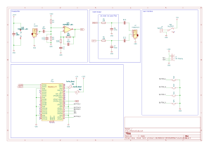

Signal Path Amplification
"""""""""""""""""""""""""

The signal processing in our DIY Multi-Effect Guitar Pedal begins with a
non-inverting amplifier with a high input impedance to avoid interference
with the guitar's natural tone. This amplifier offers 20dB of gain, strengthening
the input signal for subsequent processing.

Analog-to-Digital Conversion (ADC)
""""""""""""""""""""""""""""""""""

After amplification, the signal enters the built-in Analog-to-Digital Converter
(ADC), providing a resolution of 12 bits. Operating at a sampling rate of 320
kHz, the ADC captures the intricacies of the guitar output with precision.

Oversampling for Enhanced Signal Quality
""""""""""""""""""""""""""""""""""""""""

To further enhance signal quality, the design incorporates a 16x oversampling
technique. This technique adds an additional 2 bits to the Signal-to-Noise
Ratio (SNR) and helps minimize aliasing effects. Oversampling at a higher rate
than strictly necessary aids in reducing unwanted artefacts and contributes to
the overall clarity of the processed sound.

PWM Audio
"""""""""

A Pulse Width Modulated (PWM) digital IO pin is used to output the audio. The
PWM is configured to provide a 12-bit audio output. After the
oversampling stage, the signal is directed through a first-order low-pass
filter designed to eliminate any residual switching waveforms. This crucial
filtering step ensures a cleaner output signal, free from unwanted artefacts and interference.

Given the crude nature of the PWM audio output, the quality of the audio is
surprisingly good. The PWM signal is strong enough to drive headphones directly.
The unit could be used as a headphone practice amplifier, or it could be
integrated into an effects pedal, or even into a guitar amplifier.

User Interface
""""""""""""""

There isn't anything particularly unusual about the user interface. A 128x64
OLED display uses an ssd1306-based I2C interface. These are fairly ubiquitous
these days and have replaced the HD44780 as the go-to cheap/simple display. The
The I2C interface certainly helps reduce the pin count. Cost is a key driver, so I
have combined this with a few tactile push buttons to build a menu-driven
interface.

Software Overview
-----------------

One reason why we can achieve such simplicity in hardware is by consolidating all the functionality into the software. The Raspberry Pi Pico boasts a dual-core ARM processor, with each core operating at 120MHz. This speed is quite impressive for a microcontroller in this price range and is more than capable of handling audio processing tasks. However, memory and CPU resources remain relatively limited. As the Pi Pico lacks a Floating Point Unit, the design exclusively employs fixed-point arithmetic in the signal path. This approach provides us with additional headroom and allows for the integration of a greater number of effects.

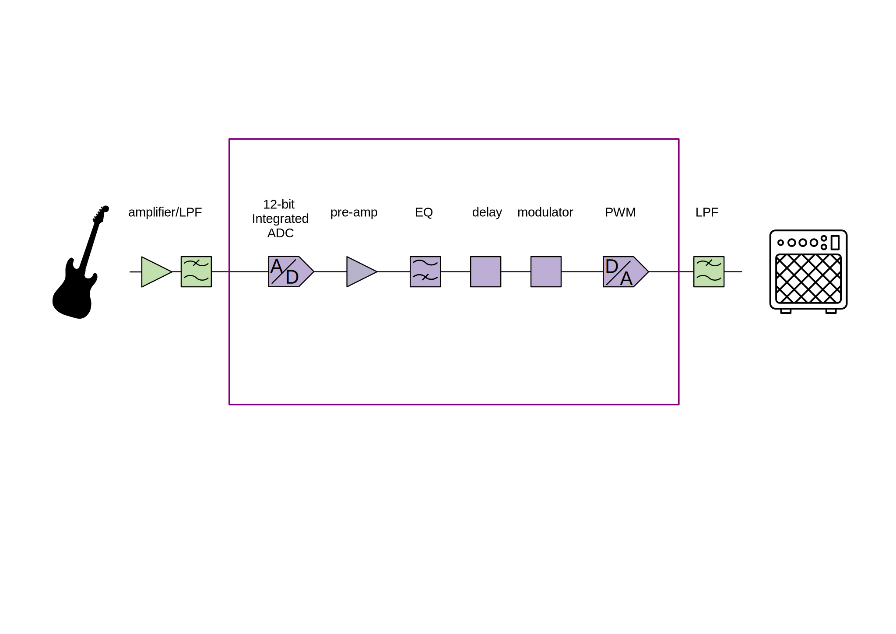

The signal path is divided into 5 main functional blocks:

+ DC removal and preamplifier
+ 5-Band Graphic Equaliser
+ Waveshaping (distortion)
+ Delay (delay, echo, reverb)
+ Modulation (Chorus, Phaser, Flanger, Tremolo, Vibrato)

Graphic Equaliser
-----------------

For my first attempt at a graphic equalizer, I used a bank of 5 filters, each
covering a portion of the spectrum. I opted for IIR filters, known for their
efficiency. The approach worked quite well when processing some test audio on a
laptop, but it couldn't keep up on the Pi Pico. This is probably because I used
a floating-point implementation. I considered converting this to a fixed-point
implementation, but designing stable IIR filters using fixed-point arithmetic
can be fairly tricky.

In the final solution, I used the Fast Fourier Transform (FFT) algorithm to
perform the filtering in the frequency domain. Although the process of
converting from the time domain to the frequency domain and back again is
complex, the filtering operation is much simpler in the frequency domain,
leading to an overall improvement for reasonably large filters.

The data is broken down into overlapping chunks of 64 samples. Each chunk is
windowed using a Hann window to reduce spectral leakage. Subsequently, each
chunk is transformed into the frequency domain using the FFT function,
separating the signal into 32 frequency bins. Each bin can then be scaled
according to a gain value before being transformed back to the time domain
using an inverse FFT.

Graphic equalizer bands are typically sized on a logarithmic scale. The first
band uses a single frequency bin, the second uses 2, and the subsequent bands
use 4, 8, and 18, respectively. This logarithmic scaling ensures that each band
covers the same number of musical tones.

Building Blocks
---------------

Two building blocks are used throughout the software, the Low
Frequency Oscillator (LFO), and the tapped delay line. The implementation of
these basic building blocks is very simple, but they can be combined to produce
a wide variety of effects.

.. code:: cpp

  FixedPoint lfo ::get_sample(uint16_t frequency_steps, FixedPoint amplitude) {
    FixedPoint sample = sin_table[p >> 6] * amplitude; // 10 MSBs (16-10 = 6)
    p += frequency_steps;
    return sample;
  }

The LFO is a very precisely controlled oscillator. The first part is the
phase-accumulator `p`, which is simply a counter. The phase accumulator is
scaled so that the whole range of a 16-bit number represents a full cycle of
the waveform. For each sample, we add a fixed amount `frequency_steps` to the
phase-accumulator. The higher the frequency, the more phase we add, and the
more frequently the phase accumulator overflows. The maximum value of a 16-bit
number is 65535, with a 20kHz sample rate that gives a range of 0-10kHz with a
resolution of 0.3 Hz. We can convert from Hz to frequency steps using this 
function.

.. code:: cpp

  uint16_t frequency_Hz_to_steps(float frequency_Hz) {
    return static_cast<uint32_t>(65536 * frequency_Hz / audio_sample_rate_Hz);
  }

We can convert the phase into a sinusoidal waveform using
a lookup table. The lookup table has 1024 entries, so we only need the 10
highest bits.

The delay line class is implemented using circular buffers. For simplicity, I
have chosen a length which is a power-of-2, this means that I can implement a
circular pointer using only an and operation.

The `input_sample` function adds a new sample to the delay line, and increments
the input pointer effectively moving all the samples one place along the delay
line. The `tap` function extracts a sample from any position along the delay
line.

.. code:: cpp

  void delay_line ::input_sample(FixedPoint sample) {
    buffer[input_pointer] = sample;
    input_pointer = (input_pointer + 1) & 0xfff;
  }

  FixedPoint delay_line ::tap(uint16_t delay) {
    return buffer[(input_pointer - delay + 1) & 0xfff];
  }

Waveshaper
----------

Waveshapers are essential tools for crafting the distinctive distortion effects
heard in electric guitar playing. Typically used in the form of distortion
pedals or software plugins, waveshapers manipulate the guitar's audio waveform
by introducing non-linearities, achieved through techniques like soft clipping.
As the guitar signal passes through, these devices alter the waveform by
compressing or clipping specific parts, resulting in harmonically rich
overtones and a gritty texture. 

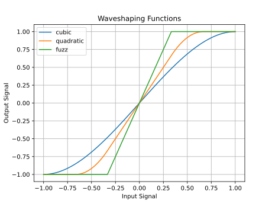

The cubic, quadratic and fuzz waveshapers apply increasingly hard clipping, resulting
in progressively "squarer" waveform containing more harmonics.

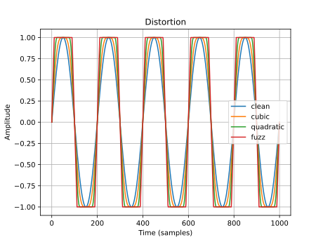

There are a few more experimental waveshapers that create rich even harmonics.
The half-wave and full-wave rectifiers introduce a frequency-doubling effect by
removing or reusing the negative half-wave. The foldback distortion creates
additional harmonics by folding the clipped portion of the signal back on
itself.

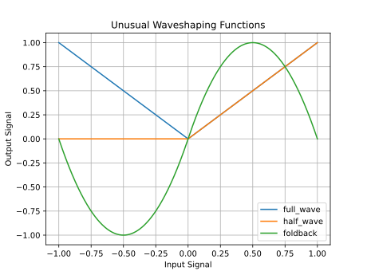

The shaping functions have an interesting effect on the signal.

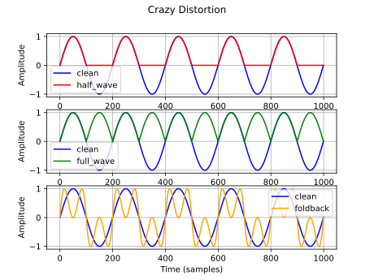

Delay Effects
-------------

The effects unit includes three types of delay-based effects.  Delay is a
guitar effect that repeats the input signal with a time delay, creating a
series of distinct echoes. Echo is similar but often refers specifically to a
more pronounced, distinct repetition of the original sound.  Reverb simulates
the acoustic characteristics of physical spaces, adding a sense of space and
depth to the guitar signal by blending numerous reflections of the sound.

Delay
"""""

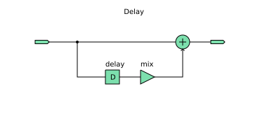

The simplest delay effect adds a single delayed version of the signal to the input.
We can vary the size of the delayed signal relative to the original signal.

.. code:: cpp

    delay_line.input_sample(sample);
    sample = sample + delay_line.tap(delay_ms * samples_per_ms) * delay_mix;

Echo
""""

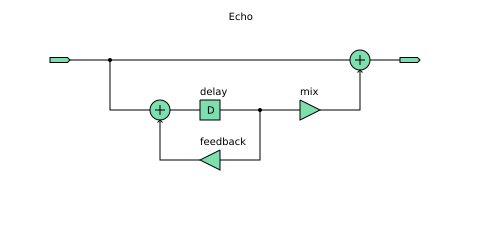

The simple delay produces a single echo. By adding simple feedback we can get
multiple, repeated echos which reduce in amplitude with each repetition.

.. code:: cpp

    delay = delay_line1.tap(delay_ms * samples_per_ms);
    mixed = sample + delay * delay_feedback;
    delay_line.input_sample(mixed);
    sample = sample + (delay * delay_mix);

Reverb
""""""

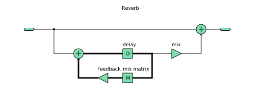

While the echo effect is simple to produce, it doesn't sound like the natural
reverberations that occur in real spaces. It turns out that it is quite hard to
make a natural-sounding reverb.

A natural reverberation has thousands of echoes that follow many complicated
paths from the source. In a natural reverberation, the echos are so dense that
you can't distinguish individual echos.

We could increase the density of the echos by reducing the delay in the echo
effect, but if we do this the constructive and destructive interference causes
the system to behave like a comb filter which with notches at many frequencies
which tends to colour the tone of the signal rather than providing a natural
sounding echo.

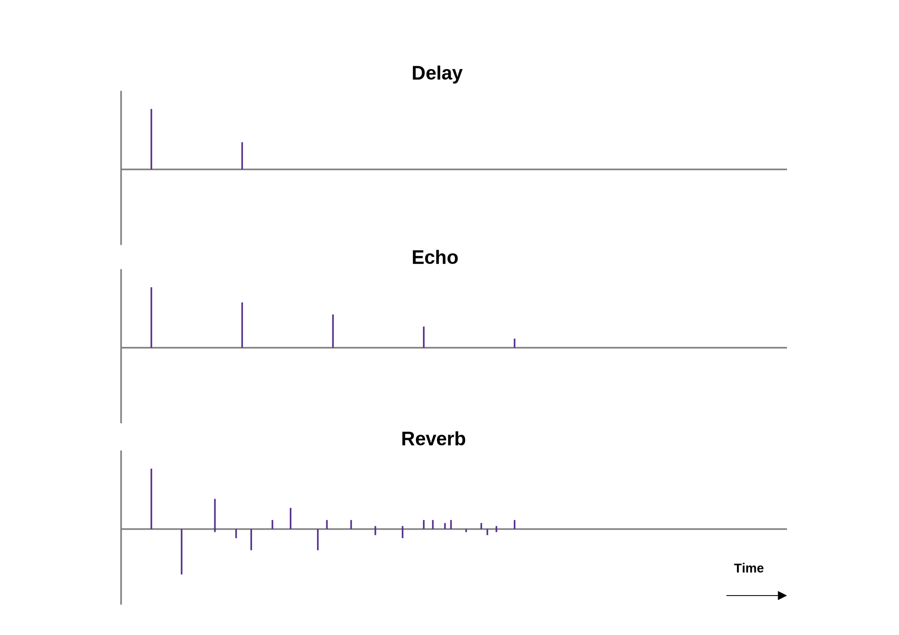

This is one of the best articles I have found on the subject. `Signal Smith
Blog <https://signalsmith-audio.co.uk/writing/>`__ I have tried to use some
of these ideas to build a very minimal version.

This design uses a feedback delay network, the signal passes through several
delay lines of different lengths, the delayed signals are then mixed together
using a matrix resulting in much denser and more random-sounding echos.

.. code:: cpp

    //delay Lines
    delays[0] = delay_line1.tap(150 * samples_per_ms);
    delays[1] = delay_line2.tap(160 * samples_per_ms);
    delays[2] = delay_line3.tap(170 * samples_per_ms);
    delays[3] = delay_line4.tap(180 * samples_per_ms);

    //feedback matrix
    for (int i = 0; i < num_delays; ++i) {
      mixed[i] = delays[i];
      sum = sum + mixed[i];
    }
    sum = sum * FixedPoint::from_float(-0.5);
    for (int i = 0; i < num_delays; ++i) {
      mixed[i] = mixed[i] + sum;
    }

    //feedback gain
    for (int i = 0; i < num_delays; ++i) {
      mixed[i] = sample + mixed[i] * delay_feedback;
    }

    delay_line1.input_sample(mixed[0]);
    delay_line2.input_sample(mixed[1]);
    delay_line3.input_sample(mixed[2]);
    delay_line4.input_sample(mixed[3]);

    sample = sample + (delays[0] * delay_mix);

There is still room for improvement here, we could make a better more
natural-sounding reverb by increasing the number of delay lines. The design
would also benefit from a diffuser stage. 

Modulation Effects
------------------

In the realm of guitar effects, modulation effects play a pivotal role in
shaping the sonic landscape, adding depth, movement, and character to your
playing. These effects manipulate the audio signal in real time, creating
dynamic variations that go beyond the static nature of traditional distortion
or delay effects.

Tremolo
"""""""

Tremolo modulates the volume of the signal at a rhythmic pace, creating a
pulsating effect. It's a classic effect that can range from subtle rhythmic
pulsing to more pronounced amplitude modulation. Tremolo can add a vintage,
surf-rock vibe or a dynamic rhythmic element to your playing.

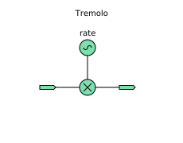

Vibrato
"""""""

Vibrato, often confused with tremolo, modulates the pitch of the signal. It
introduces slight variations in pitch, simulating the natural vibrato produced
by a guitarist's finger movements. Vibrato adds expressiveness and warmth to
sustained notes, making it a popular choice for lead guitar playing.

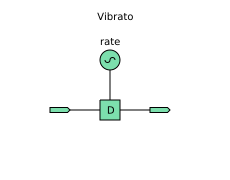

Flanger
"""""""

Similar to a chorus, a flanger duplicates the signal but introduces a short
delay that varies over time. This creates a sweeping, jet-like sound
characterized by a distinctive whooshing effect. Flangers are commonly used to
add a sense of motion and intensity to guitar solos or rhythm parts.

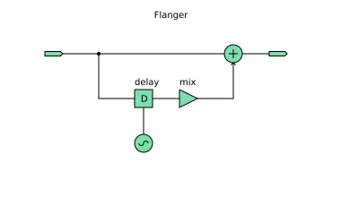

Chorus
""""""

Chorus imparts a lush and shimmering quality to your sound by duplicating the
signal, introducing slight pitch and time variations, and blending it with the
original. The result is akin to a choir of subtly detuned voices, producing a
thicker, more expansive sound that simulates the effect of multiple instruments
playing in unison.

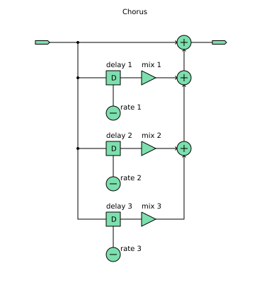

Phaser
""""""

A phaser effect alters the phase of the input signal, creating a distinctive
swirling or sweeping sound. By splitting the signal and modulating the phase
relationship between the two paths, phasers produce a rich, evolving texture
often associated with spacey or psychedelic tones.

Useful Links
------------

+ `DSP Related <https://www.dsprelated.com/freebooks/pasp/>`__
+ `Signal Smith Blog <https://signalsmith-audio.co.uk/writing/>`__
+ `Music DSP <https://www.musicdsp.org/en/latest/Effects/index.html>`__
+ `Curious Motor <https://curiousmotor.com/2020/08/03/curiouspedal-programmable-guitar-fx/>`__
+ `Pedal Shield <https://www.electrosmash.com/pedalshield-mega>`__
+ `Spin Semiconductor <http://www.spinsemi.com/knowledge_base/effects.html>`__

