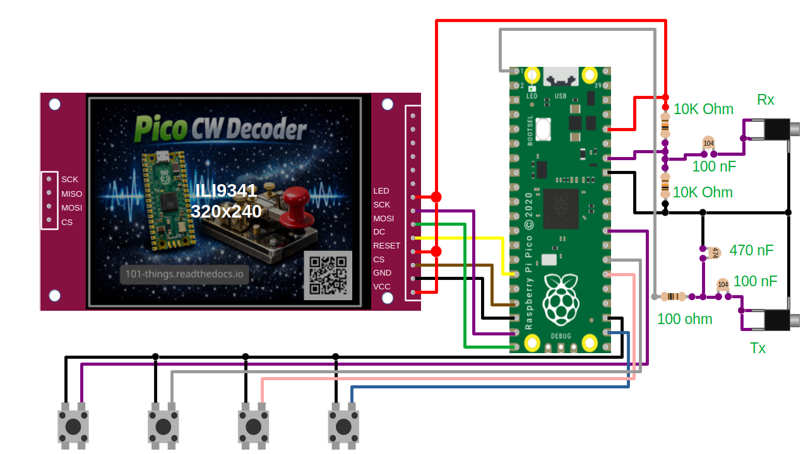
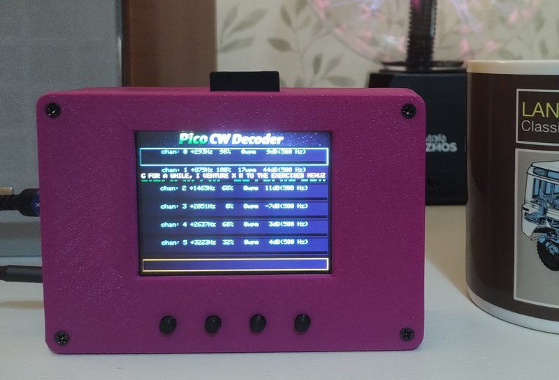
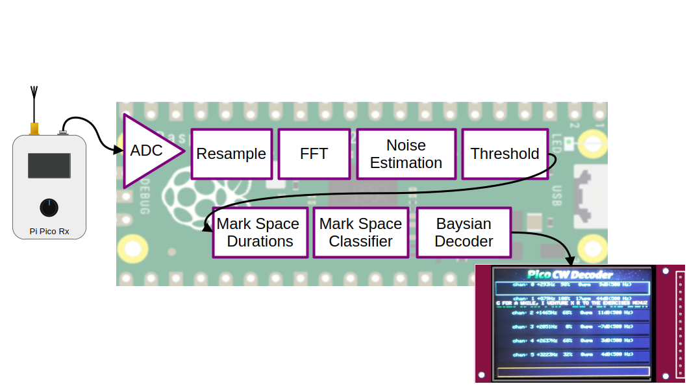
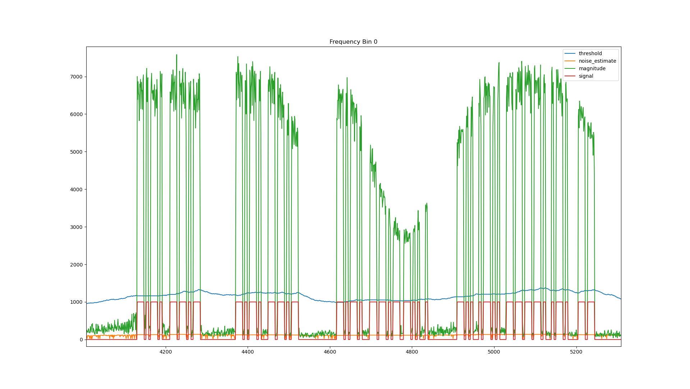

Hamfist – A CW Decoder for Pi Pico
==================================

.. raw:: html

    <iframe width="560" height="315" src="https://www.youtube.com/embed/rBRf3QOt4wc?si=akEd91w6dGNyiKs2" title="YouTube video player" frameborder="0" allow="accelerometer; autoplay; clipboard-write; encrypted-media; gyroscope; picture-in-picture; web-share" referrerpolicy="strict-origin-when-cross-origin" allowfullscreen></iframe>

This project started with a simple question: how much CW decoding can you realistically do on a small microcontroller before you hit the limits? Rather than aiming for the simplest possible decoder, the goal was to build something that is genuinely useful in practice — lightweight enough to embed in a receiver, fast enough to run in real time, and smart enough to cope with real-world Morse code rather than idealised test signals.

The result is Hamfist, a CW decoder (and encoder) designed to run on a Raspberry Pi Pico–class device while borrowing ideas normally found in PC-based decoders. It combines adaptive signal processing, automatic speed estimation, probabilistic decoding, dictionary-based correction, and multi-channel decoding, all while keeping memory and CPU usage firmly under control.

The original wishlist for the project looked like this:

* small memory footprint (small enough to fit into Pico RX–style hardware)
* fast enough to run comfortably on a Pico alongside a UI
* automatic estimation of code speed
* dictionary-based decoding to improve accuracy
* a “CW skimmer” style approach that can decode multiple signals within an SSB bandwidth

In addition to decoding, the project also includes a CW encoder. The intention is for both the encoder and decoder to run on the same hardware, sharing a simple button-driven interface. This makes the platform suitable for both receive and transmitting experiments, portable operation, and further extensions.

Quick Links
-----------

 - `github page <https://github.com/dawsonjon/HamFist>`__
 - `Arduino sketch <https://github.com/dawsonjon/HamFist/tree/main/cw_decoder>`__
 - `3D printed enclosure sketch <https://github.com/dawsonjon/HamFist/tree/main/enclosure>`__

Hardware Description
--------------------

On the hardware side, the project sticks to a familiar and well-tested setup: a Raspberry Pi Pico paired with an inexpensive ILI9341 (or compatible) SPI TFT display. If you’ve followed my other projects, this combination will look very familiar. In fact, the decoder is designed to run on exactly the same hardware as the `full SSTV example <https://101-things.readthedocs.io/en/latest/sstv_decoder_part2.html>`__, which keeps experimentation simple and inexpensive.

The design works equally well on RP2040- and RP2350-based Pico devices. No wireless features are required, but Pico W and Pico 2 W boards work just fine if that’s what you have to hand. For best performance on the RP2040, a clock speed of 125 MHz is recommended. Running at 200 MHz is possible, but tends to reduce maximum SPI speed and actually slows down screen rendering.

Both receive and transmit audio paths are supported using the Pico’s built-in ADC and a PWM-based DAC. A small set of tactile buttons provides a simple menu-driven user interface, allowing the user to switch between receive and transmit modes and adjust decoder settings.

Circuit Wiring
--------------

User settings are stored using the Arduino Pico core’s EEPROM emulation layer, which saves configuration data in onboard flash and restores it automatically after power cycles.

+-----------------------------------------+----------+---------------------------------+
| Part                                    | Quantity | Example URL                     |
+=========================================+==========+=================================+
| 320x240 ILI9341 or ILI9342 SPI Display  | 1        | `<https://shorturl.at/Kwjb0>`__ |
+-----------------------------------------+----------+---------------------------------+
| Raspberry Pi Pico                       | 1        | `<https://shorturl.at/bKibr>`__ |
+-----------------------------------------+----------+---------------------------------+
| Resistor 10k                            | 2        | `<https://shorturl.at/aSetc>`__ |
+-----------------------------------------+----------+---------------------------------+
| Capacitor Ceramic 100n                  | 2        | `<https://shorturl.at/smvFK>`__ |
+-----------------------------------------+----------+---------------------------------+
| Resistor 100 ohm                        | 1        | `<https://shorturl.at/QXFMh>`__ |
+-----------------------------------------+----------+---------------------------------+
| Capacitor Ceramic 470n                  | 1        | `<https://shorturl.at/hRgnC>`__ |
+-----------------------------------------+----------+---------------------------------+
| 3.5mm Stereo Socket                     | 1        | `<https://shorturl.at/KUiZ2>`__ |
+-----------------------------------------+----------+---------------------------------+
| Tactile buttons 6mm                     | 4        | `<https://shorturl.at/IHNVn>`__ |
+-----------------------------------------+----------+---------------------------------+
| SD Card                                 | 1        | `<https://shorturl.at/C5DyY>`__ |
+-----------------------------------------+----------+---------------------------------+
| 3D Printed Enclosure                    | 1        | `<https://shorturl.at/M5z12>`__ |
+-----------------------------------------+----------+---------------------------------+

(Note: Links are for illustrative purposes and not necessarily recommendations.)

The display wiring is shown below:

+-----------+---------------+----------------------+------------------+
| Signal    | Display Pin   | Pico Pin Number      | Pico GPIO Number |
+===========+===============+======================+==================+
| Vcc       | 1             | 36 (3v3 out)         | NA               |
+-----------+---------------+----------------------+------------------+
| Gnd       | 2             | 18 (GND)             | NA               |
+-----------+---------------+----------------------+------------------+
| CS        | 3             | 17                   | 13               |
+-----------+---------------+----------------------+------------------+
| RESET     | 4             | 36 (3v3 out)         | NA               |
+-----------+---------------+----------------------+------------------+
| DC        | 5             | 15                   | 11               |
+-----------+---------------+----------------------+------------------+
| MOSI      | 6             | 20                   | 15               |
+-----------+---------------+----------------------+------------------+
| SCK       | 7             | 19                   | 14               |
+-----------+---------------+----------------------+------------------+
| LED       | 8             | 36 (3v3 out)         | NA               |
+-----------+---------------+----------------------+------------------+

The four buttons used to navigate the menu each connect between GND and a spare GPIO pin:

+-----------+----------------------+------------------+
| Signal    | Pico Pin Number      | Pico GPIO Number |
+===========+======================+==================+
| Gnd       | 23 (GND)             | NA               |
+-----------+----------------------+------------------+
| UP_BTN    | 22                   | 17               |
+-----------+----------------------+------------------+
| DOWN_BTN  | 26                   | 20               |
+-----------+----------------------+------------------+
| RIGHT_BTN | 27                   | 21               |
+-----------+----------------------+------------------+
| LEFT_BTN  | 29                   | 22               |
+-----------+----------------------+------------------+

3D Printed Enclosure
--------------------

The enclosure design is simply a copy of the `SSTV Decoder Enclosure <https://101-things.readthedocs.io/en/latest/sstv_decoder_part2.html>`__ this already includes the functionality required by Hamfist. It provides cut-outs for the TFT display, audio connectors, and four front-panel buttons, while keeping the overall size compact enough for portable use.

The design is deliberately flexible. Multiple front panels are provided to accommodate different TFT sizes (from 2.4″ to 3.2″), and the SD card slot on the display can be accessed through a thin section in the enclosure wall. Additional features, such as holes for power switches or alternative connectors, can easily be added with a drill or craft knife.

A generously sized battery compartment makes the enclosure suitable for portable operation. The Pico’s built-in switching regulator allows it to run from a wide range of supply voltages, including AA/AAA cells or a single lithium-ion battery, as described in the `Pico's datasheet <https://datasheets.raspberrypi.com/pico/pico-datasheet.pdf>`__ .

Decoder Signal Processing Chain
-------------------------------

The signal processing chain begins with audio sampled at 15 kHz, which is then decimated to 7.5 kHz to reduce computational load while preserving the bandwidth of interest for CW signals. The decimated signal is processed in short blocks using a 32-point real FFT, providing a sufficient frequency resolution across the CW passband. For each FFT output bin, the complex magnitude is computed using a fast magnitude approximation, trading a small amount of amplitude accuracy for a significant reduction in processing cost. This produces a per-frame spectral magnitude estimate that forms the basis for subsequent detection.

The spectrum is then divided into six overlapping decoding channels, each formed by grouping five adjacent FFT bins. Within each group, the bin with the highest magnitude is selected as the representative signal level for that channel, and this value is compared against the lowest threshold among the bins in the group. When a signal is detected, hysteresis is applied by temporarily reducing the threshold, helping to stabilise detection across marginal fades and preventing rapid toggling at the noise boundary. The resulting binary signal is converted into a stream of ones and zeros, along with the measured duration of detected and non-detected intervals, yielding time-domain symbol information suitable for Morse decoding.

For each decoding channel, approximately 100 binary samples are accumulated before the decoder is run for the first time. This initial observation period provides enough data to construct a histogram of mark and space lengths, from which initial estimates of dot and dash durations can be derived. Once these timing parameters are established, the decoder can operate more responsively, updating its output every 20 additional samples while continuously refining its internal timing estimates. This staged approach allows the decoder to acquire robust initial synchronisation while still adapting smoothly to changes in sending speed or signal conditions over time.

Noise Estimation and Thresholding
---------------------------------

Accurate noise estimation and thresholding are critical in a CW decoder because the signal of interest often operates very close to the noise floor, especially under weak-signal or crowded-band conditions. A well-behaved noise estimate allows the decoder to distinguish between genuine Morse elements and random noise fluctuations, maintaining sensitivity without excessive false detections. By deriving the detection threshold directly from the estimated noise floor, the decoder automatically adapts to changing band conditions, receiver gain, and interference levels, ensuring consistent performance across a wide range of signal strengths. This adaptive behaviour is essential for reliable symbol timing, element detection, and ultimately correct character decoding in real-world operating environments.

The CW decoder uses a gated, per-bin adaptive noise floor estimator designed to track slow changes in background noise while preventing strong signals from biasing the estimate. On first use, the noise estimate for each FFT bin is initialised directly from the current magnitude, and a per-bin gate counter is cleared. Thereafter, each bin maintains its own noise estimate that is updated continuously based on the observed magnitude.

When the instantaneous magnitude is close to the current noise estimate (less than about twice the estimate, or below a small absolute floor), the algorithm assumes no signal is present and updates the noise estimate using a very slow exponential smoothing filter (99% previous estimate, 1% new magnitude). If the magnitude significantly exceeds the noise estimate, the update is gated off, and a counter is incremented to prevent the signal energy from contaminating the noise floor. However, if this gated condition persists for an extended period, the algorithm assumes the noise floor itself has risen and relaxes the gate, allowing the estimate to adapt more quickly using a faster smoothing constant. The noise estimate is constrained to a minimum value for stability, and a detection threshold is derived as a fixed multiple of the estimated noise level.

.. code:: c++

    static bool initialised = false;
    static uint16_t gate_count[FRAME_SIZE / 2];

    //initialise noise estimates to the current magnitude
    if (!initialised) {
        for (uint16_t idx = 0; idx < FRAME_SIZE / 2; ++idx) {
            noise_estimate[idx] = magnitude[idx];
            gate_count[idx] = 0;
        }
        initialised = true;
    }

    for (uint16_t idx = 0; idx < FRAME_SIZE / 2; ++idx) {

        //When no signal is present, update the noise estimate using a slow smoothing filter.
        if ((magnitude[idx] < 2.0 * noise_estimate[idx]) || magnitude[idx] < 5) {
          noise_estimate[idx] = (0.99 * noise_estimate[idx]) + (0.01 * magnitude[idx]);
          gate_count[idx] = 0;

        //If the gate is closed for too long, it is improbable that a signal is still present.
        //The noise floor has probably risen, allow the noise estimate to adapt to the new noise floor.
        } else if (gate_count[idx] > 50) {
          noise_estimate[idx] = (0.9 * noise_estimate[idx]) + (0.1 * magnitude[idx]);

        //The signal is much larger than the noise estimate. A signal is probably present.
        //Don't update the noise estimate when a signal is present so that the signal doesn't bias the estimate
        } else {
          gate_count[idx]++;
        }
        noise_estimate[idx] = std::max(noise_estimate[idx], 1.0f);
        threshold[idx] = noise_estimate[idx] * 9;

    }

Code Speed Estimation
---------------------

One of the main goals of this decoder is to work with as little manual configuration as possible. In an ideal world, the user shouldn’t need to tell the decoder how fast the sender is keying — the decoder should be able to work that out for itself. Achieving this means turning a stream of raw timing measurements into meaningful Morse elements, which is essentially a classification problem.

At this stage in the signal chain, the decoder has reduced the incoming audio to a sequence of observations. Each observation records whether the signal was present (a mark) or absent (a space), along with how long that state lasted. The challenge is to take these durations and decide what they represent. Marks need to be classified as either dots or dashes, while spaces need to be classified as intra-symbol gaps, inter-letter gaps, or inter-word gaps. Because real Morse code is sent by humans (or imperfect keyers), these durations are never exact — they vary with sending style, speed changes, and noise — so simple fixed thresholds are not sufficient.

This is where the idea of a classifier comes in. Rather than assuming exact timings, the decoder treats dot, dash, and gap lengths as clusters of similar values. By observing enough examples, it can learn what “short” and “long” actually mean for a particular transmission. Once these clusters have been identified, the decoder can estimate the average dot length and infer the overall sending speed, while also measuring how consistent the timing is. These estimates then feed directly into later stages of the decoder, where they are used to assign probabilities to symbols and make informed decoding decisions instead of relying on brittle, hard-coded rules.

K-Means Classifier
------------------

My first attempt at automatically classifying dots, dashes, and gaps used a k-means classifier. K-means is a simple and widely used unsupervised learning algorithm that groups data into a fixed number of clusters based on similarity. In this case, the idea was straightforward: if dot and dash durations naturally form two clusters, then k-means should be able to separate them without any prior knowledge of the sending speed.

The algorithm works iteratively. It starts with an initial guess for the cluster centres, assigns each observed duration to the nearest centre, and then recomputes the centres as the mean of the assigned points. This process is repeated until the centres stop moving significantly. For marks, two clusters are used (dots and dashes), while for gaps, three clusters are used (symbol, letter, and word gaps). Once the clusters have been identified, their means and standard deviations can be calculated and fed directly into the decoding stage.

In practice, k-means worked surprisingly well on clean signals and fairly consistent sending. However, it also exposed some weaknesses that made it less suitable for a small embedded decoder. The algorithm is sensitive to its initial conditions, can be confused by outliers, and assumes that clusters are reasonably compact and well separated. Real-world Morse timing often violates these assumptions, particularly for gaps, where word boundaries are irregular and sparse. On a few difficult signals, the classifier would fail to converge on a sensible solution or converge on a solution that was clearly wrong.

These limitations ultimately led me to look for a simpler and more predictable approach. While k-means was useful as a prototyping tool — especially when modelling ideas quickly in Python — the histogram-based classifier described in the next section proved to be more robust, easier to reason about, and better suited to real-time operation on a microcontroller.

Histogram-Based Classifier
--------------------------

Although the k-means classifier worked well in many situations, it did occasionally fail in ways that were hard to predict. In particular, it could struggle to converge when the timing data was noisy, sparse, or unevenly distributed — all of which are common in real-world CW signals. Since this decoder is intended to run unattended on a microcontroller, robustness and predictability are more important than mathematical elegance.

To address this, I switched to a simpler and more intuitive approach based on histograms and valley detection. The key observation is that dot and dash durations tend to form two overlapping but distinct clusters, each roughly Gaussian in shape. Rather than trying to iteratively fit clusters, the decoder builds a histogram of observed “mark” durations and looks directly for structure in the data.

The process starts by accumulating a histogram of on-times (signal-present durations). This histogram is lightly smoothed to suppress spurious peaks caused by noise or limited sample counts. The decoder then searches for local maxima — bins that are higher than their neighbours — which represent the most likely dot and dash durations. Plateaus are handled explicitly: if several adjacent bins share the same height, the centre of the plateau is treated as the peak. Once the two strongest peaks have been identified, the decoder finds the lowest point in the valley between them. This valley provides a natural threshold that separates dots from dashes.

With the dots and dashes separated, the decoder can estimate the mean and standard deviation of each group directly from the histogram. These statistics describe not only the typical dot and dash lengths but also how consistent the sending is, which becomes valuable later when assigning probabilities to ambiguous symbols. To form an initial estimate, the decoder waits until it has collected around 100 mark durations. Once an initial model has been established, the histogram is updated incrementally in smaller batches of around 20 samples, allowing the estimates to adapt smoothly over time.

After a long period of inactivity — which usually indicates the end of a transmission — the histogram is reset. This allows the decoder to quickly adapt if a new signal appears at a different speed or with different timing characteristics. In practice, this histogram-based approach has proven to be far more robust than k-means, while also being easier to reason about and cheaper to compute — both important properties for an embedded decoder.

.. raw:: html

    <iframe width="560" height="315" src="https://www.youtube.com/embed/qJbEWhgJbAM?si=79hhKmZrEZePhj4u" title="YouTube video player" frameborder="0" allow="accelerometer; autoplay; clipboard-write; encrypted-media; gyroscope; picture-in-picture; web-share" referrerpolicy="strict-origin-when-cross-origin" allowfullscreen></iframe>

This second example uses a more typical noisy signal with a higher noise level
and less consistent timing. The classifier is still able to make a reasonable
estimate of the dot and dash lengths.

.. raw:: html

    <iframe width="560" height="315" src="https://www.youtube.com/embed/ipvZlcF0bD8?si=dLjO6XyFnn33CeTH" title="YouTube video player" frameborder="0" allow="accelerometer; autoplay; clipboard-write; encrypted-media; gyroscope; picture-in-picture; web-share" referrerpolicy="strict-origin-when-cross-origin" allowfullscreen></iframe>

Gap Classification
------------------

Classifying gaps turns out to be slightly more subtle than classifying dots and dashes. While marks naturally fall into two groups (dots and dashes), gaps need to be divided into three categories: intra-symbol gaps, inter-letter gaps, and inter-word gaps. In ideal Morse timing, these have neat 1:3:7 ratios, but in practice, word gaps are both less frequent and far less consistent than shorter gaps.

The decoder starts by building a histogram of off-times (signal-absent durations), using the same basic approach as for marks. Very long gaps are first filtered out, since extended silences — for example, when a transmission pauses — do not represent meaningful Morse structure and would otherwise distort the statistics. With this filtered set of gap durations, the histogram is smoothed and searched for peaks in exactly the same way as before.

The first two peaks typically correspond to intra-symbol and inter-letter gaps and are usually well defined, even in noisy conditions. These gaps are frequent and relatively consistent, so their distributions tend to look reasonably Gaussian. The decoder uses these two peaks to estimate the mean and standard deviation of short and medium gaps, which are then used directly in later probability calculations.

Word gaps are more difficult. They occur less often, vary widely in duration, and rarely form a clean, isolated peak in the histogram. Instead of forcing a statistical model that doesn’t really fit the data, the decoder takes a hybrid approach. Any gap longer than roughly twice the estimated letter gap is treated as a candidate word gap, and the nominal word-gap duration is assumed to be seven times the symbol gap, in line with standard Morse timing.

Rather than modelling word gaps as a Gaussian distribution, the decoder assigns them a fixed high probability once the observed gap exceeds the word-gap mean. This reflects the real-world behaviour more accurately: the longer a silence continues beyond a letter gap, the more likely it is that a word boundary has been reached. This pragmatic approach avoids overfitting sparse data while still allowing the decoder to make reliable word-boundary decisions.

The following animations illustrate how the classifier behaves in practice. The first example shows a clean signal with consistent timing, while the second uses a noisier, real-world signal with more variable gaps. In both cases, the gap classifier is able to form useful estimates and provide stable input to the decoding stage.

.. raw:: html

    <iframe width="560" height="315" src="https://www.youtube.com/embed/XLeFX9tSAdQ?si=QDUf5LToD8tQqNKz" title="YouTube video player" frameborder="0" allow="accelerometer; autoplay; clipboard-write; encrypted-media; gyroscope; picture-in-picture; web-share" referrerpolicy="strict-origin-when-cross-origin" allowfullscreen></iframe>

.. raw:: html

    <iframe width="560" height="315" src="https://www.youtube.com/embed/BI98KvgIwvg?si=bUZ11rUM10EnbKvQ" title="YouTube video player" frameborder="0" allow="accelerometer; autoplay; clipboard-write; encrypted-media; gyroscope; picture-in-picture; web-share" referrerpolicy="strict-origin-when-cross-origin" allowfullscreen></iframe>

Bayesian Beam Search Decoder
----------------------------

At this point in the decoding chain, the problem changes character. We are no longer just deciding whether a particular mark was a dot or a dash, or whether a gap was short or long. Instead, we are trying to decide which sequence of decisions makes the most sense overall. Morse decoding is inherently ambiguous: a slightly long dot might look like a short dash, and an irregular gap might be interpreted in more than one way. If we commit too early to a single interpretation, a small mistake can cascade into a completely incorrect decode.

To address this, the decoder uses a beam search, which is a form of heuristic search commonly used in speech recognition and natural language processing. Rather than committing to a single decode path, the decoder keeps a small set of the most likely interpretations (the “beam”) and updates them as new evidence arrives. Each possible decode carries a score based on Bayesian probabilities derived from the observed symbol durations. At each step, new hypotheses are created, scored, and then aggressively pruned so that only the most promising candidates are retained.

The following diagram illustrates the basic idea. Starting from an initial empty decode, each new observation causes the decoder to branch into multiple possibilities. Low-probability branches are discarded, while the best few survive to the next step.

.. mermaid::

    graph LR
    start -->|dot -31.9| dot0['.' -31.9]
    start -->|dash -0.1| dash0['-' -0.1]
    dot0 -->|symbol gap  -0.0| symbol1['.' -32.0]
    dot0 -->|letter gap -12.2| letter1['E' -44.1]
    dot0 -->|word gap -520.8| word1['E ' -552.7]
    dash0 -->|symbol gap  -0.0| symbol2['-' -0.2]
    dash0 -->|letter gap -12.2| letter2['T' -12.3]
    dash0 -->|word gap -520.8| word2['T ' -520.9]
    letter2 -->|dot -0.1| dot3['T.' -12.4]
    letter2 -->|dash -44.0| dash3['T-' -56.3]
    symbol2 -->|dot -0.1| dot4['.' -0.3]
    symbol2 -->|dash -44.0| dash4['-' -44.2]
    dot3 -->|symbol gap  -0.1| symbol5['T.' -12.6]
    dot3 -->|letter gap -10.2| letter5['TE' -22.6]
    dot3 -->|word gap -494.1| word5['TE ' -506.5]
    dash3 -->|symbol gap  -0.1| symbol6['T-' -56.4]
    dash3 -->|letter gap -10.2| letter6['TT' -66.5]
    dash3 -->|word gap -494.1| word6['TT ' -550.4]
    dot4 -->|symbol gap  -0.1| symbol7['-.' -0.4]
    dot4 -->|letter gap -10.2| letter7['N' -10.5]
    dot4 -->|word gap -494.1| word7['N ' -494.4]
    dash4 -->|symbol gap  -0.1| symbol8['--' -44.3]
    dash4 -->|letter gap -10.2| letter8['M' -54.4]
    dash4 -->|word gap -494.1| word8['M ' -538.2]

In practice, the decoder assigns a log-probability score to each hypothesis. When a dot or dash is received, the score is updated using the Gaussian likelihoods derived from the measured duration. When a gap is received, the decoder considers whether it is more likely to be a symbol gap, a letter gap, or a word gap, and updates the hypothesis accordingly. Because probabilities can become very small very quickly, all calculations are performed in log space; only relative probabilities matter, so this simplified approach is both efficient and numerically stable.

At each step, the number of hypotheses grows rapidly: each mark roughly doubles the number of possibilities, and each gap can triple them. Without pruning, this would quickly become intractable. To keep the computation bounded, the decoder applies a beam width, retaining only the N most likely hypotheses after each update and discarding the rest. This pruning step is critical — it allows the decoder to remain responsive and efficient while still being able to “change its mind” later if new evidence suggests a different interpretation is more likely.

This approach gives the decoder a useful form of short-term memory. A hypothesis that is not currently the most likely can survive for a while if it remains plausible, allowing later observations to confirm or reject it. This is especially valuable when dealing with real-world CW, where timing is imperfect, and noise can temporarily distort individual symbols.

Finally, the beam search framework makes it easy to incorporate prior knowledge. Hypotheses that form valid Morse prefixes are allowed to persist, while impossible symbol sequences are immediately discarded. Likewise, hypotheses that result in dictionary words or common CW abbreviations receive a probability boost. By combining timing statistics with linguistic knowledge, the beam decoder is able to produce results that are far more robust than a simple symbol-by-symbol decision process, while still remaining efficient enough to run comfortably on a microcontroller.

Using Prior Knowledge to Improve Accuracy
-----------------------------------------

Once probabilistic decoding is in place, it becomes possible — and very effective — to incorporate prior knowledge. Morse code is not arbitrary, and neither is the language being transmitted. The decoder uses both of these facts to bias decisions in sensible ways.

At the Morse level, the decoder immediately discards any sequence of dots and dashes that is not a prefix of a valid Morse character. This is a powerful constraint: it prevents impossible symbol sequences from propagating through the beam search and allows valid alternatives to survive longer. Sequences that form valid prefixes are allowed to continue, while sequences that cannot possibly decode to a character are pruned early.

At the language level, the decoder assigns small probability bonuses to candidate decodes that form dictionary words or prefixes of dictionary words. A candidate that ends in a recognised word followed by a space is favoured over one that does not. Likewise, a partial word that matches the prefix of a known word is allowed to persist, rather than being prematurely discarded. This mirrors how humans decode Morse: context matters, and familiar patterns are easier to recognise.

To support this efficiently, the decoder uses ordered word lists and binary search for both exact matches and prefix checks. This keeps lookup costs low even with dictionaries containing thousands of words, making it practical to apply these heuristics in real time on a microcontroller.

Taken together, these techniques allow the decoder to balance raw signal evidence with structural and linguistic knowledge. The result is a system that is cautious when the signal is ambiguous, decisive when evidence is strong, and far more tolerant of real-world imperfections than a purely deterministic decoder.

Morse Symbol Decoding Using a Binary Tree
-----------------------------------------

At the heart of the decoder is the need to translate sequences of dots and dashes into characters, and to do so extremely efficiently. Because the beam search may be tracking many candidate decodes simultaneously, this operation needs to be both fast and predictable. A simple lookup table is not sufficient, because the decoder also needs to know whether a partial sequence is a valid prefix of a Morse character.

To achieve this, the decoder uses a compact binary tree representation of the Morse code alphabet stored in a linear array. Each level of the tree corresponds to one additional dot or dash. Moving left in the tree represents a dot, while moving right represents a dash. By storing this tree in a flat array and using carefully chosen index offsets, the decoder can traverse the tree using only a few integer operations per symbol.

Decoding begins at the root of the tree. For each dot, the index is incremented by one; for each dash, the index is incremented by the current span. The span is halved at each level as the decoder descends the tree. After at most six steps, the decoder reaches a leaf node corresponding to a letter, number, or punctuation symbol. This guarantees a bounded and very small decoding cost.

The following animation demonstrates the process.

.. raw:: html

    <iframe width="560" height="315" src="https://www.youtube.com/embed/6OT8qcdurfo?si=s90UPU9gsfMZ8vXw" title="YouTube video player" frameborder="0" allow="accelerometer; autoplay; clipboard-write; encrypted-media; gyroscope; picture-in-picture; web-share" referrerpolicy="strict-origin-when-cross-origin" allowfullscreen></iframe>

To support prefix checking, the tree includes special markers. Positions that represent valid prefixes of Morse characters are marked distinctly from invalid positions. This allows the decoder to quickly determine whether a partial dot/dash sequence could still form a valid character, or whether it should be discarded immediately. This early pruning is particularly important in the beam search, where eliminating impossible candidates as soon as possible greatly improves both speed and accuracy.

I have used the character ‘~’ to represent all the positions in the tree that are prefixes of Morse characters
and the character ‘#’ to represent all the positions in the tree that are invalid (i.e. not prefixes of valid Morse characters).

.. code:: cpp

  // Is this pattern an exact match to a Morse symbol?
  bool is_code(std::string& pattern)
  {
    int span = 128;
    int morse_index = 0;

    for (int i = 0; i < 7; ++i) {
      span >>= 1;
      assert(i < strlen(pattern.c_str()) + 1);
      if (pattern.c_str()[i] == 0) {
        return MORSE[morse_index] != '#' && MORSE[morse_index] != '~';
      } else if (pattern.c_str()[i] == '.') {
        morse_index++;
      } else if (pattern.c_str()[i] == '-') {
        morse_index += span;
      }
    }
    return false;
  }

Dictionary Word Lookup
----------------------

Higher-level decoding relies heavily on knowing whether a sequence of characters forms a valid word or the prefix of a valid word. Since the decoder uses dictionaries containing thousands of entries, it is essential that word lookup be extremely efficient.

To achieve this, the dictionaries are stored as sorted lists of strings, allowing the use of a binary search. Binary search reduces lookup time from linear to logarithmic, meaning that even a dictionary of 10,000 words can be searched in around 14 comparisons. This makes it practical to perform dictionary checks frequently during decoding without impacting real-time performance.

The following animation illustrates the process using a reduced dictionary of words.

.. raw:: html

    <iframe width="560" height="315" src="https://www.youtube.com/embed/w0WG4H-Jnts?si=S2aRHWUKrg9Dm3UP" title="YouTube video player" frameborder="0" allow="accelerometer; autoplay; clipboard-write; encrypted-media; gyroscope; picture-in-picture; web-share" referrerpolicy="strict-origin-when-cross-origin" allowfullscreen></iframe>

Two types of lookup are required. The first checks whether a decoded word exactly matches an entry in the dictionary. The second checks whether a decoded word is a prefix of any dictionary entry. Prefix checks are particularly important while a word is still being formed, as they allow partially decoded candidates to remain viable if they could plausibly turn into a real word.

.. code:: cpp

  bool binary_search_word(const char* words[], int num_words, const std::string& target)
  {
    int left = 0;
    int right = num_words - 1;

    while (left <= right) {
      int mid = left + (right - left) / 2;
      assert(mid < num_words);
      int cmp = std::strcmp(words[mid], target.c_str());

      if (cmp == 0) {
        return true; // found↲
      } else if (cmp < 0) {
        left = mid + 1; // search right half↲
      } else {
        right = mid - 1; // search left half↲
      }
    }

    return false;
  }

The decoder maintains separate dictionaries for common English words and for CW-specific abbreviations such as “CQ”, “DE”, and “RPT”. This reflects the fact that Morse traffic often contains shorthand and procedural signals that are rare or nonexistent in normal written English. By combining both dictionaries, the decoder gains useful contextual awareness without being overly restrictive.

Auto-correct
------------

As a final refinement step, the decoder applies a conservative autocorrect pass to the decoded text. The goal here is not to aggressively “fix” every unfamiliar word, but to correct obvious single-character errors that are likely the result of marginal timing or noise — and only when doing so is more likely to help than harm.

The autocorrect algorithm is limited to an edit distance of one: a single insertion, deletion, or substitution. This constraint keeps the algorithm well-behaved and reduces the risk of turning a correct but unusual word into an incorrect common one. When a word is not found in the dictionary, the decoder searches for candidate corrections that differ by one edit and selects the most common one if multiple candidates exist.

A naive implementation would compare the target word against every word in the dictionary, which is far too slow for real-time use. Instead, the decoder uses a heuristic approach. It first performs a binary search to find where the misspelled word would appear in the sorted dictionary, then performs a linear scan of a small window around that insertion point. In practice, most viable correction candidates lie close to this.

The following animation illustrates how the algorithms identify candidate corrections.

.. raw:: html

    <iframe width="560" height="315" src="https://www.youtube.com/embed/XItrh-iLLk4?si=tHZpk80lxERSsRHG" title="YouTube video player" frameborder="0" allow="accelerometer; autoplay; clipboard-write; encrypted-media; gyroscope; picture-in-picture; web-share" referrerpolicy="strict-origin-when-cross-origin" allowfullscreen></iframe>

This dramatically reduces the number of edit-distance checks required, providing a speed increase of nearly 100x, while still finding the majority of plausible corrections. To handle errors in the first character — which can move a word far from its expected position — the decoder also performs a limited set of first-letter substitutions. While not perfect, this hybrid strategy is fast, effective, and well-suited to the constraints of a microcontroller.

Encoder
-------

While most of the project focuses on decoding, Hamfist also includes a CW encoder so that both transmit and receive functionality can run on the same hardware. This makes it easier to experiment, test the decoder with known signals, and ultimately build a more complete standalone CW system.

The encoder takes an input text string and converts it into a continuous stream of audio samples representing keyed Morse code. Each character is translated into its dot-and-dash pattern using a lookup table that covers letters, numbers, and common punctuation. Timing is derived from the configured words-per-minute (WPM) setting, with the duration of a single “dit” calculated directly from the output sample rate. Dots are sent as one dit, dashes as three dits, with standard Morse spacing applied between symbols, letters, and words.

Audio generation is performed one sample at a time using a numerically controlled oscillator (NCO) driven by a precomputed sine table. The tone frequency is set independently of the keying speed, allowing the encoder to generate clean CW at any desired pitch. To avoid key clicks and excessive spectral splatter, a smooth amplitude envelope is applied whenever the tone turns on or off. This gentle ramping of the signal produces a clean, well-shaped CW waveform that is pleasant to listen to and easy for the decoder to handle.

Testing
-------

Developing a decoder like this quickly highlights the importance of systematic testing. Small changes to thresholds, smoothing constants, or classification logic can have subtle and sometimes surprising effects. To keep development grounded, I built a large collection of prerecorded audio files and processed them using a dedicated test harness running on a PC.

This approach made testing repeatable and objective. The same audio could be fed through multiple versions of the decoder, making it easy to compare results, spot regressions, and quantify improvements. The test set deliberately included a wide range of conditions: clean signals, weak signals, variable sending speeds, inconsistent timing, and real-world noise and interference.

One of the main lessons from this process was that improvements are often local. It was easy to tweak an algorithm to fix a specific failure case, only to discover that the change degraded performance elsewhere. This led to many deep dives into individual files to understand what was going wrong, but it also reinforced the need to keep the bigger picture in mind. Changes were only accepted if they produced a net improvement across the entire dataset, rather than optimising for isolated examples. This balance between detailed analysis and broad validation was essential in pushing the decoder toward robust, general-purpose performance.

Summary
-------

Hamfist demonstrates that surprisingly sophisticated CW decoding is possible on a small, low-cost microcontroller. By carefully choosing algorithms and focusing on efficiency, the decoder incorporates features that are often reserved for PC-based software: adaptive noise estimation, automatic speed detection, probabilistic decoding, multi-channel “skimmer” operation, dictionary-assisted correction, and even autocorrect — all while using only a small fraction of the available RAM and CPU on a Raspberry Pi Pico.

While the decoder does not yet match the performance of a skilled human operator, it delivers solid and consistent results that compare favourably with many existing decoders, especially given the modest hardware platform. The ticker-tape style waterfall provides an intuitive view of dots and dashes across multiple channels, making it easy to understand what the decoder is seeing and why it is making particular decisions. Overall, Hamfist is both a practical CW tool and a useful exploration of how far modern signal processing and probabilistic techniques can be pushed on resource-constrained embedded hardware.

