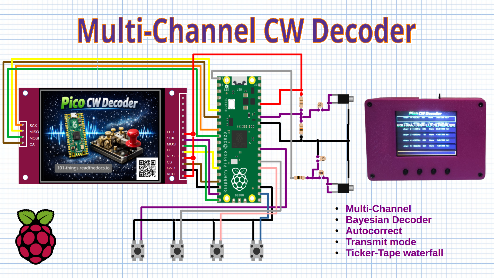

Hamfist A CW Decoder for Microcontroller
========================================

The purpose of this project is to build a CW decoder that is lightweight enough
to run on a microcontroller (possibly embedded into a receiver) while also
having some of the features of more advanced decoders. The wishlist is as follows:

+ low memory footprint (small enough to fit in the pico rx is the aim)
+ fast (fast enough to run in pico rx is the aim)
+ dynamic estimation of code speed
+ use a dictionary lookup to improve decode accuracy (and autocorrect)
+ support a "CW Skimmer" approach that can decode multiple frequencies in a SSB bandwidth

I would also like to include a CW keyer, I would like the CW decoder and
encoder to run on the same hardware as the Pico SSTV project, so I would like
to find an efficient way to enter text using 4 buttons.

Signal Procesing Chain
----------------------

Code Speed Estimation
---------------------

Ideally I would like the decoder to work with a minimum of configuration or
tweaking. To achieve this I need to be able to adapt the decoder to different
code speeds.

The decoder accepts a list of observations as its input. Each observation
contains an indication of whether the signal was present (a dot or a dash) or
absent (a gap) for each observation a duration is provided.

I need to categorise the "signal present" lengths into 2 categories, one for
dots and one for dashes. Likewise I need to categorise the gaps into 3
categories, intra-letter gaps, inter-letter gaps and inter-word gaps.

K-Means Classifier
------------------

In my first attempt to classify dots and dashes I used a k-means classifier.

K-means is an unsupervised learning algorithm used to group data into k
clusters based on similarity. It assumes you know how many clusters (k) you
want ahead of time. The basic idea is to find k “centroids” — representative
points around which data naturally groups — so that each data point belongs to
the cluster with the nearest centroid. The algorithm tries to minimize the
total distance between points and their assigned centroids, effectively finding
compact, well-separated groups in the data.

The algorithm works iteratively:

1. Initialize k centroids (often by picking random data points).

2. Assign step: For each data point, find the nearest centroid and assign the point to that cluster.

3. Update step: For each cluster, recalculate its centroid as the mean (average) of all points assigned to it.

Repeat steps 2–3 until the centroids stop moving significantly or a maximum number of iterations is reached.

The result is a partition of the data into k clusters that locally minimize
within-cluster variance. K-means is simple and fast, but it has limitations: it
assumes roughly spherical clusters of similar size, it’s sensitive to the
initial centroid positions, and it can be misled by outliers or non-convex data
shapes. Despite that, it’s a very common and effective method for tasks like
image compression, document grouping, and exploratory data analysis.

I am using Python to model the algorithms before implementing them in C++. Its
easy to implement the k-means algorithm in Python.

.. code:: python

  def cluster(x, k, iterations):
      clusters = [[] for i in range(k)]
      for item in range(len(x)):
          clusters[item%k].append(x[item])

      for iteration in range(iterations):
          means = [np.mean(cluster) for cluster in clusters]
          clusters = [[] for i in range(k)]
          for item in x:
              distances = [abs(item-mean)*abs(item-mean) for mean in means]
              cluster = np.argmin(distances)
              clusters[cluster].append(item)

      clusters = np.array(clusters)[np.argsort(means)]
      return clusters

The last step is to sort the clusters acording to their mean value. This means
that the shorter cluster (dots) is the first element and the second cluster
contains the dashes. Having categorised the dots and dashes, and the gaps, we
can calculate the mean and the standard deviation of each cluster. The standard
deviation tells us the accuracy (or otherwise) of the dot and dash lengths. We
can use this information to calculate the relative probability that each
recieved symbol is a dot or a dash.

.. code:: python

    #global clustering
    marks = [l for v, l in signal if v]
    dits, dahs = cluster(marks, 2, 5)
    mu = np.mean(dits)
    dah_mu = np.mean(dahs)
    sigma = np.std(dits)
    print("dit mu sigma:", mu, sigma)
    print("dah mu sigma:", dah_mu, sigma)

    spaces = [l for v, l in signal if not v and l < 10*mu]
    short, medium, long = cluster(spaces, 3, 5)
    short_mu = np.mean(short)
    medium_mu = np.mean(medium)
    long_mu = np.mean(long)
    short_sigma = np.std(short)
    medium_sigma = np.std(medium)
    long_sigma = np.std(long)

    print("short mu sigma:", short_mu, short_sigma)
    print("medium mu sigma:", medium_mu, medium_sigma)
    print("long mu sigma:", long_mu, long_sigma)

There is a bit of cheating going on here. There could be some very long gaps
that aren't typical of the usual gaps between words. I don't want the outliers
to unduly influence the outcome, so I filter out any gap longer than ten dot
lengths before I perform clustering on the gaps.

Histogram Based Classifier
--------------------------

Although the k-means algorithm did work well in quite a few situations, I did
occasionaly find that the classifier failed to converge on a correct solution.
I decided that I needed a simpler, more robust solution. I opted for a
histogram based approach using vallley detection. A historgram-based approach
is quite an intuitive algorithm, and it is easy to visualaise how the durations
of dots and dashes approximate a gaussian distribution. The algorithm first
generated a histogram of the "on" times. The histogram is smoothed using a
simple smoothing filter. The first step is to find the two peaks one
representing dots, and the other representing dashes. A peak can be found by
searching for a turning point, that is a bin that is higher than both its
neighbours. It is also possible to find a plateu, where two cenral bins have
equal magnitude. In this case, the centre of the plateu is treated as the peak.
One we have found the highest two peaks, we find a threshold by searching for
the lowest point in the valley between the two peaks. We can then use the
histogram bins corresponding to dots and dashes to estimate the mean and
standard deviation of the dot and dash durations. Initially we need a quite
large sample of dot and dash durations to form our first histogram I wait for
100 dots/dashes before making the first estimate. once we have formed an
initial estimate, we can update the histogram incrementally using batches of
around 20 samples to form improved estimates. After a long period of inactivity
that likely indicates the end of a transmission, the histogram is reset so that
the decoder can adapt, making fresh estimates for any future transmissions.

The following animation demonstrates how the algorithm tracks the durations of
received dots and dashes. This example is using very clean data with a high
signal to noise ratio and consistent timing.

.. raw:: html

   <iframe width="560" height="315" src="https://www.youtube.com/embed/qJbEWhgJbAM?si=79hhKmZrEZePhj4u" title="YouTube video player" frameborder="0" allow="accelerometer; autoplay; clipboard-write; encrypted-media; gyroscope; picture-in-picture; web-share" referrerpolicy="strict-origin-when-cross-origin" allowfullscreen></iframe>

This second example uses a more typical noisy signal with a higher noise level
and less consistent timing. The classifier is still able to make a reasonable
estimate of the dot and dash lengths.

.. raw:: html

    <iframe width="560" height="315" src="https://www.youtube.com/embed/ipvZlcF0bD8?si=dLjO6XyFnn33CeTH" title="YouTube video player" frameborder="0" allow="accelerometer; autoplay; clipboard-write; encrypted-media; gyroscope; picture-in-picture; web-share" referrerpolicy="strict-origin-when-cross-origin" allowfullscreen></iframe>

A similar approach is used to estimate the length of gaps between symbols,
letters and words. This time we need to categorise the off durations into 3
categories. The word length gaps are slightly more difficult to categorise. The
difficulty is that word gaps are less frequent and less consistent. It is
therefore difficult to analyse them statistically, they don't form a nice peak
in the histogram but many small peaks spread out in time. For this reason, a
hybrid approach is used. The first two peaks are used to estimate symbol and
letter gaps. We exclude any bins that are more then twice the duration of a
letter gap when estimating their mean and standard deviations. For word gaps,
we simply assume that a word gap is seven time the length of a symbol gap. This
seems to work quite well in practice, partly because the distribution of word
gaps isn't Gaussian. As the gaps gets increasingly greater than the mean, the
likelihood that a word has ended continues to increase. To get around this I
assign a fixed, high probability of a word gap whenever a gap is longer than
the word-gap mean.

The following animation demonstrates how the algorithm works when classifying
gaps. This first animation uses a clean signal with good timing, while the
second uses a real world signal with more noise and variable timing.

.. raw:: html

    <iframe width="560" height="315" src="https://www.youtube.com/embed/XLeFX9tSAdQ?si=QDUf5LToD8tQqNKz" title="YouTube video player" frameborder="0" allow="accelerometer; autoplay; clipboard-write; encrypted-media; gyroscope; picture-in-picture; web-share" referrerpolicy="strict-origin-when-cross-origin" allowfullscreen></iframe>

.. raw:: html

    <iframe width="560" height="315" src="https://www.youtube.com/embed/BI98KvgIwvg?si=bUZ11rUM10EnbKvQ" title="YouTube video player" frameborder="0" allow="accelerometer; autoplay; clipboard-write; encrypted-media; gyroscope; picture-in-picture; web-share" referrerpolicy="strict-origin-when-cross-origin" allowfullscreen></iframe>

Baysian Probability Based Decoding
----------------------------------

Once we have the means and the standard deviations of the symbols and gaps, we
can work out the relative probability of each recieved symbol being a dot, a
dash, an intra-letter gap, an inter-symbol gap and an inter-word gap.

.. code:: python

  def log_gaussian(x, mu, sigma):

      """return the log likelihood x in a normal distribution mu/sigma"""

      return -0.5 * ((x - mu) / sigma) ** 2

I am using log probabilities in the decoder, this avoids the problem of
probabilites becoming vanishingly small as the decoder progresses which could
quickly get rounded into zeros if we weren't careful. We are also only
interested in realtive probabilies, e.g. is a dot more likely than a dash, so
we can use a simplified version of the maths.

.. code:: python

     logp_dot = log_gaussian(duration, mu, sigma),
     logp_dash = log_gaussian(duration, dah_mu, sigma),
     logp_gap1 = log_gaussian(duration, short_mu, short_sigma),
     logp_gap3 = log_gaussian(duration, medium_mu, medium_sigma),
     logp_gap7 = log_gaussian(duration, long_mu, long_sigma) if x < long_mu else 0

There is another bit of cheating here. The probability of a gap being a word
gap isn't really Gaussian, the longer the gap, the more likely it is that the
last word has finished. To model this, I simply assign a fixed high probability
if a word gap is longer than the mean.

In principal, each time the decoder recieve dot or a dash, we can decide which
it was by comparing logp_dot and logp_dash, and simply chose the larger of the
two. The same process works for gaps, if log_gap2 has the highest probability
we assume that a letter has finished and we decode it. If logp_gap7 is the
longest, it must be the end of a word, we decode the letter and add a space to
the message.

This decoder goes slightly further, it might be that chosing the most likely
outcome at every stage won't give us the right answer. We might get later get
some more evidence later that would have led us to make a different decision.

I have used a beam search in this decoder, at each stage we calculate
probabilities for all possible decodes and add them to a list. The list of
possible decodes quickly expands for each mark we double the number of possible
decodes, and for each space we tripple them. To avoid the explosion in possible
decodes, we prune the list at each stage keeping only the n most-likely
decodes. The number of decodes retained at each stage is known as the beam
width.

Retaining a few of the most probable decodes means that we can change our mind
later if we get new evidence. If we ended up with the sequence .-.- for
example, we can reject the possibility and favour one of the other options,
perhaps A.-, E-.-, or R-, are now the most likely?

Taking this approach also allows us to factor in other evidence, if one of the
possibilities contains a common english word, we can increase the overall
likelihood of that possibility.

This is where having a list of common english words can help. I have included a
list of the 10000 most common english words. A list of 1000 words gives us a
reasonable coverage, on average more than 90% of words used in common spoken
English belong to this list.

However, the messages sent using morse code aren't always typical of more
general english text. For this reason, I have also included a dictionary of
common CW words and abbreviations. This list includes things like "CQ", "DE",
"RPT", "73" and so on.

Using Prior Knowledge to Improve Decoder Accuracy
-------------------------------------------------

We can use our prior knowledge to improve the accuracy of the decoder. For
example, we can favour decode candidates that result in dictionary words over
decodes that are't words. We can also favour candidates that are prefixes of
real words so that we are less likely to discard them.

The decoder assigns a "bonus" probability to:
    + Any candidate decode that ends in a dictionary word, followed by a space.
    + Any candidate decode that is a prefix of a dictionary word followed by a letter gap.

We can also use our prior knowledge of morse code to our advantage. The decoder
immediately discards any sequence of dots and dashes which is not a prefix of a
valid Morse character. This allows alternative decode candidates that contain
letter gaps to persist.

Morse Symbol Decoding Using Binary Tree
---------------------------------------

The Boolean Decoder requires us to rapidly evaluate many potential decode
candidates every time a new symbol is recieved. This means that we need a very
efficient Morse Decoder. I am using the same binary tree method described in
[todo]. This method stores a binary tree in a linear array of characters. We
search the binary tree taking one symbol at a time:

1. Start at index 0, span = 32.
2. If the next symbol is a '.' add 1 to the index.
3. If the next symbol is a '-' add span to the index.
4. If this is the last symbol, return character at index.
5. Otherwise, divide span by 2, repeat from step 2.

This algorithm gives a very efficient search, requiring no more than 6
iterations to search a 64 character tree. The following animation demonstrates
the process.

.. raw:: html

   <iframe width="560" height="315" src="https://www.youtube.com/embed/6OT8qcdurfo?si=s90UPU9gsfMZ8vXw" title="YouTube video player" frameborder="0" allow="accelerometer; autoplay; clipboard-write; encrypted-media; gyroscope; picture-in-picture; web-share" referrerpolicy="strict-origin-when-cross-origin" allowfullscreen></iframe>

I have extended the basic tree to a 128 character array including letters,
numbers and puntuation. The decoding algorithm requires us to also identify
whether a sequence of ones and zeros is a prefix of a valid morse characters,
or whether it is an invalid sequence. I have used the characters '~' to
represent all the potitions in the tree that are prefixes of morse characters
and the character '#' to represent all the positions in the tree that are
invalid (i.e. not prefixes of valid morse characters).

.. code:: cpp

      // Is this pattern an exact match to a morse symbol?↲
      bool is_code(std::string& pattern)
      {
        int span = 128;
        int morse_index = 0;

        for (int i = 0; i < 7; ++i) {
          span >>= 1;
          assert(i < strlen(pattern.c_str()) + 1);
          if (pattern.c_str()[i] == 0) {
            return MORSE[morse_index] != '#' && MORSE[morse_index] != '~';
          } else if (pattern.c_str()[i] == '.') {
            morse_index++;
          } else if (pattern.c_str()[i] == '-') {
            morse_index += span;
          }
        }
        return false;
      }

Dictionary Word Lookup
----------------------

The algorithm also requires us to check wether a decoded word is a dictionary word (including common CW abbreviations). Again we need an efficient method to search through our dictionary of 10000 words. Again the key to efficiency is to use a binary search algorithm. We use an ordered list of words to allow us to search them efficiently. To search for a target word the algorithm procedes as follows.

1. Read the word in the middle of the search range (in the first iteration the search range is the whole list).
2. If the middle word matches our target word, we are done!
3. If the target word is greater than (lexicographically) the middle word, define the new search range to be from immediately after the middle word to the end of the current search range.
4. If the target word is less than the middle word, define the new search range to be from the beginning up to immediately before middle word of the current search range.
5. Repeat from step 1, using the new search range.

The following animations illustrates the process using a reduced dictionary of words.

.. raw:: html

    <iframe width="560" height="315" src="https://www.youtube.com/embed/w0WG4H-Jnts?si=S2aRHWUKrg9Dm3UP" title="YouTube video player" frameborder="0" allow="accelerometer; autoplay; clipboard-write; encrypted-media; gyroscope; picture-in-picture; web-share" referrerpolicy="strict-origin-when-cross-origin" allowfullscreen></iframe>

Again, applying a binary search algorithm greatly improves the speed. Instead of individually checking 10000 words, we can find a word in our dictionary using no more than 14 iterations. In the decoder, we implement two versions of the dictionary lookup, one that searches for an exact match with the target word, and one that checks whether the target word is a prefix of a word in the dictionary.

.. code:: cpp

      bool binary_search_word(const char* words[], int num_words, const std::string& target)
      {
        int left = 0;
        int right = num_words - 1;

        while (left <= right) {
          int mid = left + (right - left) / 2;
          assert(mid < num_words);
          int cmp = std::strcmp(words[mid], target.c_str());

          if (cmp == 0) {
            return true; // found↲
          } else if (cmp < 0) {
            left = mid + 1; // search right half↲
          } else {
            right = mid - 1; // search left half↲
          }
        }

        return false;
      }

Auto-correct
------------

The autocorrect algorithm is performed as a last check after the decode completes, the idea is to find and correct typographical errors. We would like an algorithm that works autonomously - it wouldn't be practical to present the user with a list of alternatives for every word we receive. We also want an autocorrect algorithm that does more good than harm, it should get a correction right more times than it replaces a correct word that it doesn't recognise. I have tried to make the algorithm quite conservative, and it only makes corrections with an edit distance of 1. (A correct distance of one means one inserted, one deleted or one substituted character).

In my first attempt at an autocorrect algorithm, I checked each misspelled word against every word in the dictionary, looking for a replacement with an edit distance of 1. Where multiple candidates were found, I return the most common word. (I also store a list of rankings for each word in the dictionary). While this algorithm worked quite well and resulted in an overall improvement in decode accuracy, it was very inefficient - not fast enough to decode in real time.

A binary search can't be employed directly, so I chose to use a heuristic algorithm. The approach is as follows:

1. Perform a binary search to find the insertion point in the list, i.e. the point in the list where the misspelled word would have appeared.
2. Perform a linear scan of a small window 50 words before and after the insertion point.
3. Return any word within an edit distance of 1 compared to the target.
4. If more than one candidate is found, return the highest ranking word.

This algorithm is much faster, requiring 14 string comparisons for the binary search and 100 edit distance checks. This gives a 100x speed improvement compared to the nieve linear algorithm. The algorithm works because the vast majority of candidates fall within a short distance of the insertion point. A simple Python simulation showed that this algorithm found 60-70% of the possible corrections. The weak point of the algorithm are single arrors that occur at the beginning of the word. An error at the beginning of the word can result in the mispelled word being in a very different part of the dictionary. In order to fill this gap, I added an extra step at the end of the algorithm to search for first letter substitutions. We can check all the possible first letter substitutions using only an additional 25 checks. While not perfect, the algorithm is lightning fast and find the vast majority of correction candidates. It would be possible to close the gap entirely by checking for second letter errors (and possibly third depending on the size of the dictionary), but at the point we only achieve very small returns for the additional processing.

.. raw:: html

    <iframe width="560" height="315" src="https://www.youtube.com/embed/XItrh-iLLk4?si=tHZpk80lxERSsRHG" title="YouTube video player" frameborder="0" allow="accelerometer; autoplay; clipboard-write; encrypted-media; gyroscope; picture-in-picture; web-share" referrerpolicy="strict-origin-when-cross-origin" allowfullscreen></iframe>

