Raspberry Pi Pico Ham Radio Transmitter
=======================================

.. image::  images/HamTransmitterThumbnail.png
  :target: https://youtu.be/PbhmQfPkNL0

Discover the world of amateur radio with the Raspberry Pi Pico-based Ham Radio
Transmitter project, which opens up a spectrum of possibilities for radio
enthusiasts. Capable of outputting SSB, AM, and FM signals, this versatile
transmitter allows you to cover frequencies from 0.5 to 30MHz, including the
Ham bands from 160m to 10m. The transmitter is based on a Raspberry Pi Pico,
which uses a powerful PIO feature to output an RF oscillator with precisely
controlled phase and frequency, reducing the part count and keeping the cost
down. The transmitter also employs a PWM output to generate an RF envelope for
amplitude modulation. Whether you're new to the world of Ham Radio or just
looking for a fun project for your Pi Pico, this transmitter is the perfect way
to get on the air with equipment you built yourself.

`C++ Code for Pi Pico <https://github.com/dawsonjon/101Things/tree/master/18_transmitter>`_

Prototype Design

----------------

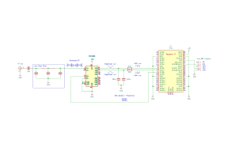

At the moment this is a proof of concept rather than a finished product. I
don't have an amplifier or any filtering yet so it can't be used on the air.  I
built a simple prototype on a piece of copper-clad PCB, to test the concept and
assess the quality of the output.

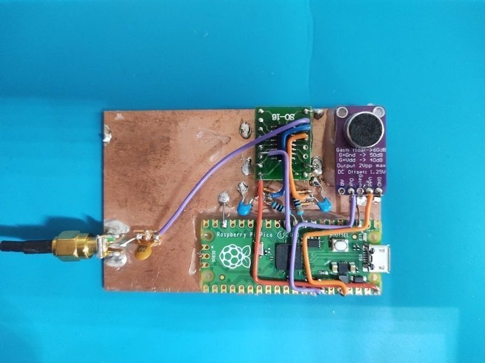

The hardware is pretty simple, the Pi Pico has 3 outputs. The RF oscillator is
output on an IO pin, the phase and the frequency are precisely controlled by
software. 

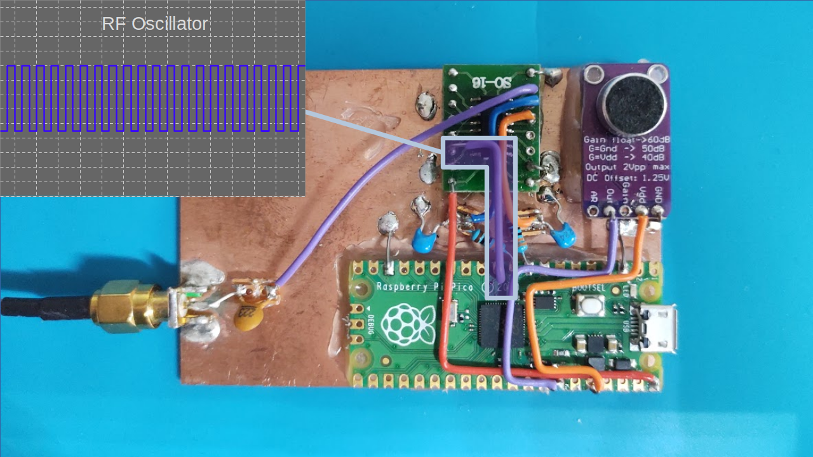

For constant amplitude modes like CW and FM, this is all we need, but for modes
that modulate the amplitude like AM and SSB, we use a complimentary pair of PWM
outputs to generate an RF envelope. The PWM outputs are passed through a simple
RC low-pass filter with a cut-off frequency of around 3kHz. I run the PWM as
fast as I can, to reduce ripple, we can get 8-bits of resolution at around
500kHz, at this frequency the filter attenuation is very strong.

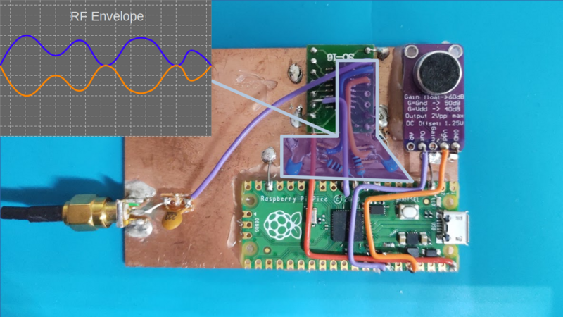

For now, I'm using an FST3253 analogue switch to mix the RF Oscillator and the RF
envelope.

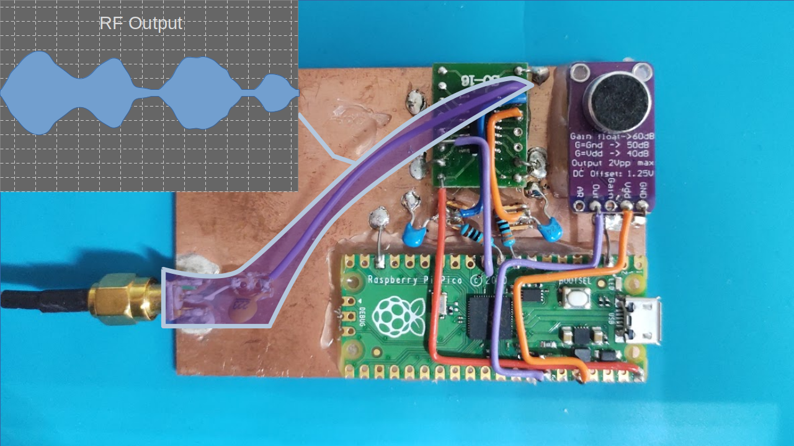

I'm using a MAX9814 microphone pre-amplifier model for convenience. The module
is self-contained and can be connected straight to the ADC input of the
Pi-Pico. The MAX9814 contains an automatic gain control unit, this isn't really
ideal for communication use because it amplifies background noise when you
aren't speaking.

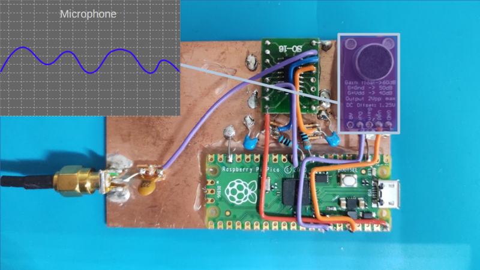

Eventually, I plan to either disable the AGC or use a simple op-amp circuit for
the microphone pre-amplifier.

Software Design
---------------

RF Oscillator
"""""""""""""

The software design makes heavy use of the PIO and DMA features of the Pi-Pico
and these do most of the heavy lifting. The PIO program is very simple, it uses
the auto-pull feature to repeatedly read 32-bit words from the FIFO and output
them one bit at a time to an output pin. We have left the divider at the full
rate so we output one bit per system clock. At 125MHz, this gives us a
theoretical maximum frequency a little over 60MHz.

.. code::

  .program stream_bits
      out pins, 1

In principle the process is simple, a waveform of exactly the right frequency
is pre-generated using high-precision arithmetic to reduce long-term frequency
errors. The DMA transfers waveforms of a fixed length from memory to the PIO
FIFO. The length of the waveform is a compromise between memory consumption and
performance. The longer the waveform, the less frequently the DMA needs to be
triggered.

Complexity arises because the waveform will not usually contain an exact number
of RF cycles. At the end of a 256-bit section of waveform, we will usually be
partway through a cycle. To transition smoothly, we need to start part-way
through the next waveform. We can choose a starting point that has the correct
phase within a clock cycle. We can accumulate any phase error so that we can
compensate for it later. Using this technique it is possible to always toggle
within a clock cycle of when we should, keeping the jitter to +/- one clock
cycle.

The process is further complicated by the transfer size of the PIO. I have
chosen to use 32-bit transfers because this minimises the bandwidth consumed
by the DMA. Smaller transfers are possible, but the bandwidth would be
excessive and it might be difficult to keep up. Instead, I have opted to make 32
copies of the waveform, each advanced by an extra clock cycle. Small advances
of less than 32 clocks are made by selecting the appropriate waveform, for
longer offsets whole 32-bit words can be added. The software can also advance
or retard the waveforms to modulate the phase which we need to
generate FM and SSB.

To reduce the computational load on the software, DMA chaining is used to
play back batches of 256-bit waveforms without software intervention. A batch
of waveforms is started for every audio sample. Batches of 32x256-bit waveforms
yield an audio sample rate of about 15kHz for example. Longer and shorter
batches can be used at different sample rates.

I have made some measurements and it turns out that the software takes less
than 10us to plan and dispatch each batch using less than 10% of the CPU on one
core.

Modulator
"""""""""

The modulator converts a signal from the microphone and converts it into a
baseband signal feeding the RF section. We need to produce samples in
polar (magnitude and phase) rather than rectangular (I and Q)
format. The phase component controls the phase of the RF oscillator, while the
magnitude controls the PWM to generate the RF envelope.

AM and FM modulation is reasonably simple. In AM modulation, the microphone
signal drives the magnitude directly, while the phase is held at
zero. FM modulation is only slightly more complicated. In this mode, the phase
difference between samples (AKA frequency) is taken from the microphone. In
other words, the microphone signal is integrated to generate the phase output.
In FM mode, the amplitude is held at the maximum value.

While AM and FM modulation only affects either the phase or magnitude of the
signal, SSB modulation requires both the phase and frequency components to be
modulated. The SSB signal is first generated in rectangular representation and
then converted to phase and magnitude representation using the 
`CORDIC <https://dspguru.com/dsp/faqs/cordic/>`__ algorithm.

The microphone input consists only of real samples. The I component is taken
directly from the microphone input while the Q component is set to zero. Since
the imaginary part of the signal is zero, it follows that the frequency
spectrum is symmetrical and includes both positive and negative frequency
components.

The positive frequency component is the upper sideband, and the negative
frequency component is the lower sideband, we need to remove the opposite
sideband leaving us with only positive (for USB) or negative (for LSB). One
method of achieving this is to use a Hilbert transform, but I find that using
frequency shifts and filters is more intuitive, although the process is
equivalent. 

The process is to up-shift the frequency by Fs/4 using a complex multiplier and
filter the signal using a symmetrical half-band filter retaining only the
negative frequency components. The frequency is then down-shifted by Fs/4
leaving only the lower sideband. 

Fs/4 is chosen because it can be implemented efficiently. A complex sine wave
with a frequency of Fs/4 consists of only 0,1 and -1. Multiplication by 0, 1,
or -1 can be implemented using trivial arithmetic operations. 

Choosing a half-band filter -Fs/4 to Fs/4 allows further efficiency
improvements. The kernel of a half-band filter is symmetrical, potentially this
can approximately halve the number of multiplication operations, or halve the
number of kernel values that need to be stored. In addition to this about half
of the kernel values are 0, again approximately halving the number of
multiplications. Overall, this filtering operation reduces the number of
multiplications needed by an approximate factor of 8.

The structure as shown leaves the lower sideband part of the signal. An upper
sideband signal could be generated by first down-shifting the frequency, and
then up-shifting. Since the upper and lower sidebands are mirror images, an
easier way to switch between upper and lower sidebands is to change the
direction of rotation at the output of the modulator by switching the I and Q
components for example.

.. image:: images/ham_transmitter_CORDIC_test.png

There are quicker approximate methods to calculate the magnitude and phase of a
complex signal, I found that these methods resulted in unacceptable spurious
signals in the frequency spectrum. Instead, I opted to use the CORDIC
algorithm.  It isn't quite as fast as some other methods, but it's still much
faster than library functions like atan2. The nice thing about CORDIC is that
we can perform more (or fewer) iterations to achieve the best balance between
performance and precision. The CORDIC algorithm turned out to be a good
compromise, both fast enough and precise enough for our application.

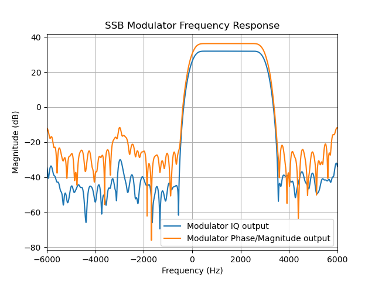

We can characterise the modulator by looking at the impulse response in the
frequency domain. We can see that the filter passes half of the positive
frequencies while attenuation the negative frequencies. The pass band of 2-3kHz
is ideal for SSB transmissions. I have plotted the raw IQ output from the
modulator as well as the phase and magnitude output from the CORDIC. The CORDIC
causes some degradation to the frequency response, but not excessively.

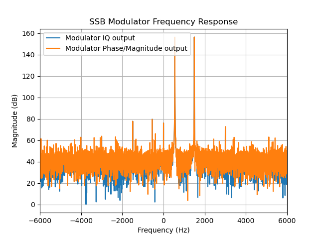

Another useful test is to filter two tones that are not harmonically related.
We can see that the negative tones are very strongly attenuated.

Performance
"""""""""""

The SSB modulator is the most processor-intensive of the modes. In SSB mode,
the modulator adds just over 10% CPU usage to the 10% used by the RF
oscillator. In total, we are still using less than 30% of the CPU on a single
core, so there is plenty of scope for additional development.

Testing
-------

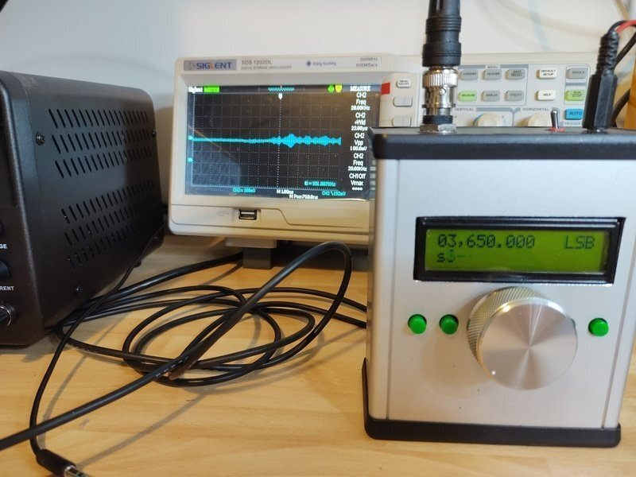

I tested the transmitter in all the modes using an SDR receiver, and the results
were very promising with good quality SSB, AM and FM being generated. I also
tested with a few different receivers which also gave good results. Check out
the `Video <https://youtu.be/PbhmQfPkNL0>`__ to see the results.

Next Steps
----------

From the testing, it looks like we have a sound basis for a Ham Transmitter,
despite the simplicity it performs well. There are a couple of things we need
to address before we can use this on the air.

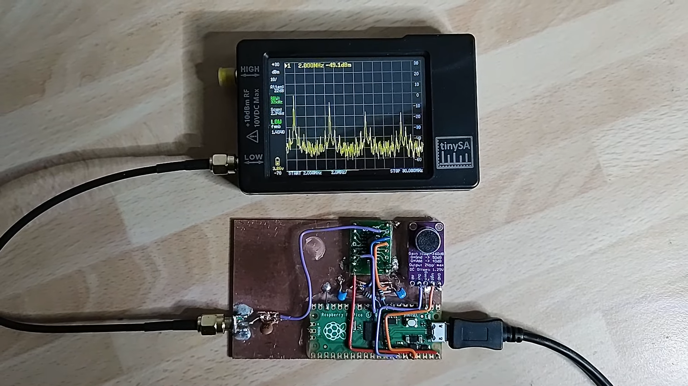

Looking at the transmitter output using a tinySA, we can see that we are
getting strong harmonics at odd multiples of the transmit frequency. These will
cause interference to other bands, so we need to design a filter to remove them
before we can use the transmitter on the air.

We can also see that the power output is very low, only a few milliwatts. We
need to add an amplifier. One big advantage of having a separate envelope and
RF oscillator is that it opens up the possibility to use an efficient switching
amplifier that drives the transistors into the fully-on or fully-off state
which reduces heat losses when the transistor is partially conducting. In this
type of amplifier, the power supply can be modulated using the RF amplifier.

I experimented with this idea on in the `OpenXcvr <https://github.com/dawsonjon/OpenXcvr>`__ project.

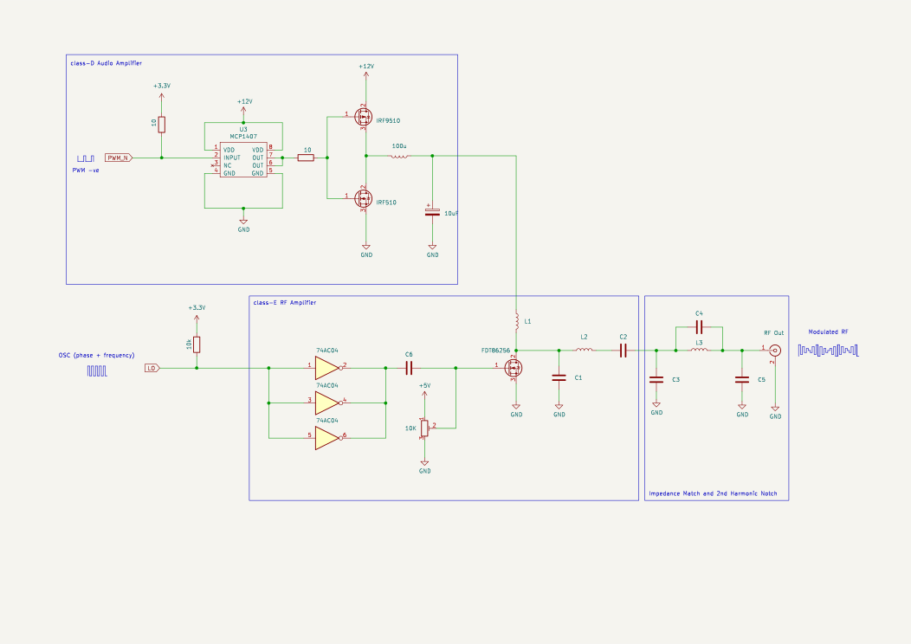

The popular `usdx <https://github.com/threeme3/usdx>`__ transceiver uses a
similar approach, this design uses a class-E amplifier which is tuned to be
resonant on a particular band to achieve even greater efficiency. In the USDX
design the amplitude is modulated by changing the bias voltage on the
RF amplifier rather than modulating the power supply.

My future plans for this project are to add some simple amplification and
filtering. We have already built a capable `receiver <https://101-things.readthedocs.io/en/latest/radio_receiver.html>`__ 
using a Pi-Pico. My ultimate goal is to build a simple yet usable Ham Radio
transceiver.
