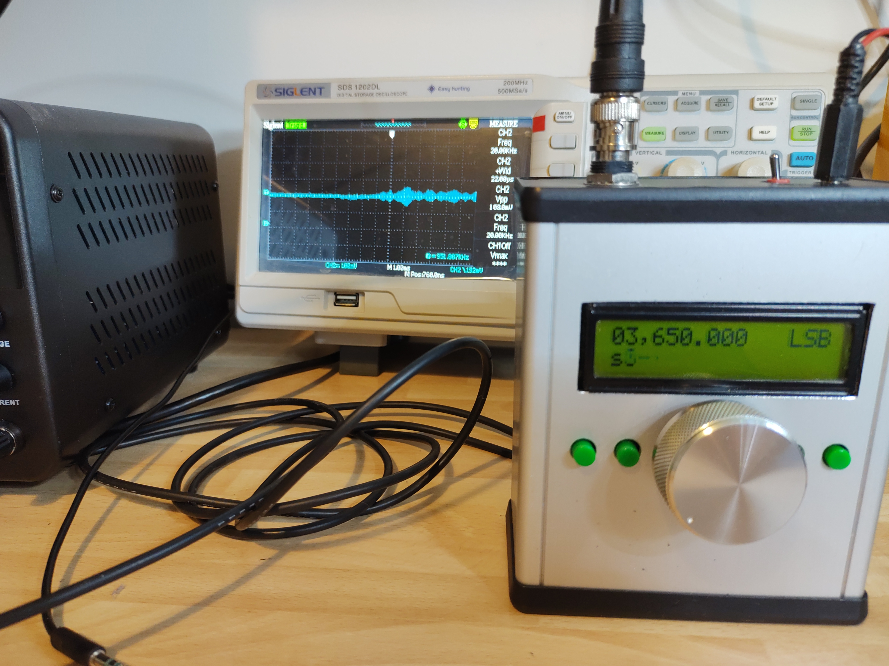

Raspberry Pi Pico Ham Radio Transmitter
=======================================

.. image::  images/HamTransmitterThumbnail.png
  :target: https://youtu.be/PbhmQfPkNL0

Discover the world of amateur radio with the Raspberry Pi Pico-based Ham Radio
Transmitter project, which opens up a spectrum of possibilities for radio
enthusiasts. Capable of outputting SSB, AM, and FM signals, this versatile
transmitter allows you to cover frequencies from 0.5 to 30MHz, including the
Ham bands from 160m to 10m. The transmitter is based on a Raspberry Pi Pico,
which uses a powerful PIO feature to output an RF oscillator with precisely
controlled phase and frequency, reducing the part count and keeping the cost
down. The transmitter also employs a PWM output to generate an RF envelope for
amplitude modulation.  `C++ Code for Pi Pico <https://github.com/dawsonjon/101Things/tree/master/18_transmitter>`_

**Note:** 

*Feel free to experiment, but please keep in mind that it is still an
experimental prototype and not a fully tested design. There are areas that
still need work and there are likely to be changes as the design evolves.*

Prototype Design
----------------

.. image:: images/ham_transmitter_prototype_circuit.svg

At the moment this is a proof of concept rather than a finished product. I
don't have an amplifier or any filtering yet so it can't be used on the air.  I
built a simple prototype on a piece of copper-clad PCB, to test the concept and
assess the quality of the output.

.. image:: images/ham_transmitter_prototype.jpg

The hardware is pretty simple, the Pi Pico has 3 outputs. The RF oscillator is
output on an IO pin, the phase and the frequency are precisely controlled by
software. 

.. image:: images/ham_transmitter_RF_Oscillator.png

For constant amplitude modes like CW and FM, this is all we need, but for modes
that modulate the amplitude like AM and SSB, we use a complimentary pair of PWM
outputs to generate an RF envelope. The PWM outputs are passed through a simple
RC low-pass filter with a cut-off frequency of around 3kHz. I run the PWM as
fast as I can, to reduce ripple, we can get 8-bits of resolution at around
500kHz, at this frequency the filter attenuation is very strong.

.. image:: images/ham_transmitter_RF_Envelope.png

For now, I'm using an FST3253 analogue switch to mix the RF Oscillator and the RF
envelope.

.. image:: images/ham_transmitter_RF_Output.png

I'm using a MAX9814 microphone pre-amplifier model for convenience. The module
is self-contained and can be connected straight to the ADC input of the
Pi-Pico. The MAX9814 contains an automatic gain control unit, this isn't really
ideal for communication use because it amplifies background noise when you
aren't speaking.

.. image:: images/ham_transmitter_Microphone.png

Eventually, I plan to either disable the AGC or use a simple op-amp circuit for
the microphone pre-amplifier.

Software Design
---------------

RF Oscillator
"""""""""""""

The software design makes heavy use of the PIO and DMA features of the Pi-Pico
and these do most of the heavy lifting. The PIO program is very simple, it uses
the auto-pull feature to repeatedly read 32-bit words from the FIFO and output
them one bit at a time to an output pin. We have left the divider at the full
rate so we output one bit per system clock. At 125MHz, this gives us a
theoretical maximum frequency a little over 60MHz.

.. code::

  .program stream_bits
      out pins, 1

In principle the process is simple, a waveform of exactly the right frequency
is pre-generated using high-precision arithmetic to reduce long-term frequency
errors. The DMA transfers waveforms of a fixed length from memory to the PIO
FIFO. The length of the waveform is a compromise between memory consumption and
performance. The longer the waveform, the less frequently the DMA needs to be
triggered.

Complexity arises because the waveform will not usually contain an exact number
of RF cycles. At the end of a 256-bit section of waveform, we will usually be
partway through a cycle. To transition smoothly, we need to start part-way
through the next waveform. We can choose a starting point that has the correct
phase within a clock cycle. We can accumulate any phase error so that we can
compensate for it later. Using this technique it is possible to always toggle
within a clock cycle of when we should, keeping the jitter to +/- one clock
cycle.

The process is further complicated by the transfer size of the PIO. I have
chosen to use 32-bit transfers because this minimises the bandwidth consumed
by the DMA. Smaller transfers are possible, but the bandwidth would be
excessive and it might be difficult to keep up. Instead, I have opted to make 32
copies of the waveform, each advanced by an extra clock cycle. Small advances
of less than 32 clocks are made by selecting the appropriate waveform, for
longer offsets whole 32-bit words can be added. The software can also advance
or retard the waveforms to modulate the phase which we need to
generate FM and SSB.

To reduce the computational load on the software, DMA chaining is used to
play back batches of 256-bit waveforms without software intervention. A batch
of waveforms is started for every audio sample. Batches of 32x256-bit waveforms
yield an audio sample rate of about 15kHz for example. Longer and shorter
batches can be used at different sample rates.

I have made some measurements and it turns out that the software takes less
than 10us to plan and dispatch each batch using less than 10% of the CPU on one
core.

Modulator
"""""""""

The modulator converts a signal from the microphone and converts it into a
baseband signal feeding the RF section. We need to produce samples in
polar (magnitude and phase) rather than rectangular (I and Q)
format. The phase component controls the phase of the RF oscillator, while the
magnitude controls the PWM to generate the RF envelope.

AM and FM modulation is reasonably simple. In AM modulation, the microphone
signal drives the magnitude directly, while the phase is held at
zero. FM modulation is only slightly more complicated. In this mode, the phase
difference between samples (AKA frequency) is taken from the microphone. In
other words, the microphone signal is integrated to generate the phase output.
In FM mode, the amplitude is held at the maximum value.

While AM and FM modulation only affects either the phase or magnitude of the
signal, SSB modulation requires both the phase and frequency components to be
modulated. The SSB signal is first generated in rectangular representation and
then converted to phase and magnitude representation using the 
`CORDIC <https://dspguru.com/dsp/faqs/cordic/>`__ algorithm.

The microphone input consists only of real samples. The I component is taken
directly from the microphone input while the Q component is set to zero. Since
the imaginary part of the signal is zero, it follows that the frequency
spectrum is symmetrical and includes both positive and negative frequency
components.

.. image:: images/DSB_Spectrum.svg

The positive frequency component is the upper sideband, and the negative
frequency component is the lower sideband, we need to remove the opposite
sideband leaving us with only positive (for USB) or negative (for LSB). One
method of achieving this is to use a Hilbert transform, but I find that using
frequency shifts and filters is more intuitive, although the process is
equivalent. 

The process is to up-shift the frequency by Fs/4 using a complex multiplier and
filter the signal using a symmetrical half-band filter retaining only the
negative frequency components. The frequency is then down-shifted by Fs/4
leaving only the lower sideband. 

Fs/4 is chosen because it can be implemented efficiently. A complex sine wave
with a frequency of Fs/4 consists of only 0,1 and -1. Multiplication by 0, 1,
or -1 can be implemented using trivial arithmetic operations. 

Choosing a half-band filter -Fs/4 to Fs/4 allows further efficiency
improvements. The kernel of a half-band filter is symmetrical, potentially this
can approximately halve the number of multiplication operations, or halve the
number of kernel values that need to be stored. In addition to this about half
of the kernel values are 0, again approximately halving the number of
multiplications. Overall, this filtering operation reduces the number of
multiplications needed by an approximate factor of 8.

The structure as shown leaves the lower sideband part of the signal. An upper
sideband signal could be generated by first down-shifting the frequency, and
then up-shifting. Since the upper and lower sidebands are mirror images, an
easier way to switch between upper and lower sidebands is to change the
direction of rotation at the output of the modulator by switching the I and Q
components for example.

.. image:: images/ham_transmitter_CORDIC_test.png

There are quicker approximate methods to calculate the magnitude and phase of a
complex signal, I found that these methods resulted in unacceptable spurious
signals in the frequency spectrum. Instead, I opted to use the CORDIC
algorithm.  It isn't quite as fast as some other methods, but it's still much
faster than library functions like atan2. The nice thing about CORDIC is that
we can perform more (or fewer) iterations to achieve the best balance between
performance and precision. The CORDIC algorithm turned out to be a good
compromise, both fast enough and precise enough for our application.

.. image:: images/ham_transmitter_modulator_impulse_response.png

We can characterise the modulator by looking at the impulse response in the
frequency domain. We can see that the filter passes half of the positive
frequencies while attenuation the negative frequencies. The pass band of 2-3kHz
is ideal for SSB transmissions. I have plotted the raw IQ output from the
modulator as well as the phase and magnitude output from the CORDIC. The CORDIC
causes some degradation to the frequency response, but not excessively.

.. image:: images/ham_transmitter_modulator_two_tone.png

Another useful test is to filter two tones that are not harmonically related.
We can see that the negative tones are very strongly attenuated.

Performance
"""""""""""

The SSB modulator is the most processor-intensive of the modes. In SSB mode,
the modulator adds just over 10% CPU usage to the 10% used by the RF
oscillator. In total, we are still using less than 30% of the CPU on a single
core, so there is plenty of scope for additional development.

Initial Testing
---------------

I tested the transmitter in all the modes using an SDR receiver, and the results
were very promising with good quality SSB, AM and FM being generated. I also
tested with a few different receivers which also gave good results. Check out
the `Video <https://youtu.be/PbhmQfPkNL0>`__ to see the results.

Amplifier Experiments
---------------------

.. image::  images/HamTrandsmitterThumnail2.png
  :target: https://youtu.be/SoWw8tEOJuQ

So far the transmitter has an output power of around 1 milliwatt. To make this
into a practical transmitter, an amplifier is needed. The traditional approach
for single-sideband transmissions is to use a linear amplifier that reproduces
both the amplitude and phase information in the RF signal. The only real
disadvantage of this approach is that linear amplifiers are relatively
inefficient because they operate transistors in their linear region.

A class-E RF amplifier is a very efficient class of amplifier that allows
efficiencies of greater than 90%. The disadvantages of the class-E amplifier
are that it is not linear and removes the amplitude component from the RF
signal entirely. It is possible to restore the amplitude information produced
by the class-E amplifier by modulating the power supply. This is called polar
modulation because the RF signal is reproduced from both the amplitude and
phase components. I'm particularly interested in this type of amplifier because
of the high efficiency that can potentially be achieved. The high-efficiency
design reduces the size and capacity of batteries and removes the need for a
large heatsink. This makes a significant contribution to reducing the size,
weight, and overall cost.

.. image:: images/transmitter-Amplifier.png

Class-E RF Amplifier
""""""""""""""""""""

Class-E amplifiers belong to the category of switching amplifiers. A switching
topology is employed to minimize power dissipation by the switching transistor.
The amplifier is designed to ensure the transistor switches fully on or fully
off. When the transistor is off, it exhibits a very high impedance, resulting
in negligible power dissipation. Conversely, when switched fully on, the
transistor dissipates minimal power due to its low internal resistance.

Another factor contributing to power loss is the output capacitance. During
each cycle, the capacitor undergoes charging and discharging, and the energy
stored in the capacitor is released as heat. This becomes especially
significant at higher frequencies, even with relatively small capacitance
values.

To mitigate these losses, the class-E amplifier strategically combines the
parasitic capacitance of the transistor with additional capacitors and
inductors to create a resonant circuit. This configuration harnesses the energy
stored in the inductors and capacitors, inducing voltage oscillations.
Carefully chosen component values ensure that the voltage returns to zero just
before the transistor switches on. By preventing energy storage in the
capacitor when the transistor is on, the amplifier effectively minimizes energy
wastage.

The class-E amplifier itself consists of a single transistor, the gate of the
transistor is driven with a saturated version of the RF signal sufficient to
switch the transistor on for half of each RF cycle. Power is supplied by an RF
choke L1 that allows DC to be supplied to the amplifier while blocking RF
frequencies. The inductance of the choke is not critical but it should have an
impedance which is much larger than that of the other circuit elements. C1, L2
and C2 form a resonant network. C1 combines with the parasitic capacitance of
the transistor to give the required capacitance. The load impedance is
calculated to give the required output power at a particular supply voltage. In
this design, an impedance of 8 ohms is chosen to give an output power of 5W
with a 12V supply. In practice, the impedance of the actual load is not 8 ohms
and we need an impedance matching circuit to make the standard 50 ohms load
appear to the amplifier as an 8 ohm load. C3, C5 and L3 form a 
`pi impedance matching network <https://www.allaboutcircuits.com/tools/pi-match-impedance-matching-calculator/>`__
to achieve this. The resonant circuits within the class-E amplifier have a
band-pass characteristic which attenuates high-order harmonics sufficiently.
Adding C4 in parallel with L3 creates an additional notch at the second
harmonic frequency further attenuating the second harmonic notch which is
prominent in a class-E amplifier.

class-E amplifiers are often regarded as challenging to design, and the
associated mathematical calculations can be relatively complex. Despite this, a
set of equations can be employed for the amplifier's design. The commonly used
`spreadsheet <http://www.wa0itp.com/classeampdesignrevb.xls>`__ serves this
purpose and aids in designing class-E amplifiers.

To simplify the design process, I developed a Python script based on the
equations found in this spreadsheet. The script calculates values for each
amateur radio band. It uses standard component values, as opposed to exact
ones. Where possible the actual component value is carried forward through the
calculations to minimize errors. In practice though, this made little
difference to the final results.

Additionally, the script selects an appropriate toroid material and calculates
the number of turns required to achieve the desired inductance. It's essential
to note that these calculated values should be considered as a starting point.
In real-world scenarios, component errors, parasitic capacitances, and
inductances can introduce unpredictable effects. Therefore, some adjustments
and tweaking may be necessary to optimize performance and achieve the best
results. 

.. code:: python

  load_impedance_ohms = 0.32*psu_voltage*psu_voltage/output_power
  load_impedance_ohms -= 1.5*RDSon_ohms
  C1_pF = (1e12*0.19)/(2.0*pi*centre_frequency_Hz*load_impedance_ohms)
  C1_pF -= Coss_pF
  C1_pF = nearest_capacitor(C1_pF)
  C2_pF = 1e12/(2.0*pi*centre_frequency_Hz*load_impedance_ohms*1.5)
  C2_pF = nearest_capacitor(C2_pF)
  L2_uH = (1.8*load_impedance_ohms)+1.0 / (2*pi*centre_frequency_Hz*C2_pF/1e12)
  L2_uH = 1e6*L2_uH/(2.0*pi*centre_frequency_Hz)
  L2_windings = calculate_inductor_turns(L2_uH)
  L1_uH = 15*L2_uH
  L1_windings = calculate_inductor_turns(L1_uH)

.. code:: bash

    $python class_e_design.py 
    Class-E Amplifier Design
    ========================

    Supply Voltage: 12V
    Output Power: 5W
    RDSon:  0.912ohms
    Coss: 8.0pF

           o VDD     Class-E Amplifier        |  Impedance Match and Harmonic Notch
           |                                  |
           |                                  |
         [ L1 ]                               | 
           |                                  |        +---[ C4 ]---+
           |                                  |        |            |
           +---------+-----[ L2 ]----[ C2 ]-- | -----+-+---[ L3 ]---+-+------------o
           | d       |                        |      |                |                
       g |-+         |                        |      |                |                
      o--| Q1      [ C1 ]                     |   [ C3 ]           [ C5 ]       [50 Ohm]
         |-+         |                        |      |                |                
           | s       |                        |      |                |                
           +---------+----------------------- | -----+----------------+------------o
           |                                  |
           o GND                              |

    Based on equations found in:

    1. http://www.wa0itp.com/class%20e%20design.html
    2. Cripe, David, NMØS, "class-E Power Amplifiers for QRP"
       QRP Quarterly Vol 50 Number 3 Summer 2009, pp 32-37 
       Errata: Volume 50 Number 4 Fall 2009 p4

      Band             C1     C2     C3     C4     C5       L1                   L2                   L3
    ====================================================================================================================
      10m 28.850MHz   120pF  470pF  270pF   82pF  270pF   2.14uH   23T T37-2   0.14uH    7T T37-6   0.08uH    5T T37-6
      12m 24.940MHz   150pF  560pF  330pF  100pF  330pF   2.44uH   25T T37-2   0.16uH    7T T37-6   0.09uH    6T T37-6
      15m 21.225MHz   180pF  680pF  390pF  120pF  390pF   2.83uH   27T T37-2   0.19uH    8T T37-6   0.11uH    6T T37-6
      17m 18.118MHz   220pF  680pF  470pF  150pF  470pF   3.56uH   30T T37-2   0.24uH    9T T37-6   0.13uH    7T T37-6
      20m 14.175MHz   270pF 1000pF  560pF  180pF  560pF   4.27uH   33T T37-2   0.28uH   10T T37-6   0.17uH    7T T37-6
      30m 10.125MHz   390pF 1200pF  820pF  270pF  820pF   6.42uH 11T FT37-61   0.43uH   12T T37-6   0.23uH    9T T37-6
      40m  7.100MHz   560pF 1800pF 1200pF  390pF 1200pF   8.94uH 13T FT37-61   0.60uH   12T T37-2   0.33uH   11T T37-6
      60m  5.000MHz   820pF 2700pF 1500pF  470pF 1500pF  12.37uH 15T FT37-61   0.82uH   14T T37-2   0.47uH   11T T37-2
      80m  3.650MHz  1000pF 3900pF 2200pF  680pF 2200pF  16.55uH 17T FT37-61   1.10uH   17T T37-2   0.65uH   13T T37-2
     160m  1.900MHz  2200pF 6800pF 3900pF 1200pF 3900pF  33.23uH 25T FT37-61   2.22uH   24T T37-2   1.24uH   18T T37-2
    ====================================================================================================================

Another challenge associated with class-E amplifiers is the task of driving the
gate. The output from the Pi Pico does not possess adequate drive strength or
voltage swing for this purpose. Additionally, the MOSFET gate incorporates a
parasitic capacitance, necessitating a low-impedance driver with high drive
strength.

To ensure the transistor is fully switched on, a few volts are required to
drive the gate. The gate driver must also be capable of operating in the tens
of MHz frequency region. A common and effective solution involves the use of 5V
logic gates with relatively high drive strength. The output from these logic
gates is capacitively coupled to the MOSFET gate, allowing for the addition of
an extra DC bias.

The voltage swing on the gate must be sufficient to ensure the transistor is
fully switched on at one extreme and fully switched off at the other. During
experimentation, I observed that even at its maximum setting, the efficiency
continued to improve. This suggests that a solution providing an even greater
swing might offer enhanced performance.

.. image:: images/ham_transmitter_amplifier_prototype.jpg

A prototype of the class-E amplifier was built using copper-clad board. For
this experiment, the 20M band was chosen using a centre frequency of 14.175MHz.
The analogue switch that we previously used to mix the envelope with the RF
output is no longer needed. The polar modulated amplifier is in effect a
high-power unbalanced mixer. 

**Note:**

*The software now has a compile time option to output balanced or unbalanced
PWM outputs. The original design used a balanced mixer, but the polar-modulated
amplifier requires an unbalanced output.*

.. code:: cpp

    //nco.cpp
    #ifdef BALANCED //Use with FDT5351 balanced mixer
    pwm_set_gpio_level(m_magnitude_pin, 128 + (magnitude >> 9));
    pwm_set_gpio_level(m_magnitude_pin + 1, 128 - (magnitude >> 9));
    #else //Use with polar modulated amplifier
    //remove 8 lsbs
    magnitude >>= 8;
    pwm_set_gpio_level(m_magnitude_pin, magnitude);
    pwm_set_gpio_level(m_magnitude_pin + 1, 255 - magnitude);
    #endif

The prototype used a combination of through-hole
and surface mount components, whatever I had lying around. In the class-E
amplifier, it is important to use NP0/C0G type capacitors rated for 100V or
more. The L3 winding forms part of the second harmonic notch filter, the
frequency of the notch can be measured using a `nanoVNA <https://nanovna.com/>`__, 
and fine adjustments can be made to the notch frequency by adjusting the
spacing of the inductor windings. With the calculated number of turns the
frequency was too low, to achieve the correct frequency at twice the
fundamental it was necessary to remove a whole turn.

The amplifier was then connected and further adjustments were made. It was also
necessary to remove a turn from L1 to achieve the desired power output level.
Further tweaks to the bias voltage and the turn spacing on L2 to achieve the
best efficiency. I found it difficult to measure the efficiency with sufficient
accuracy to give a confident efficiency figure. In practical terms, however, it
was possible to achieve an output power of close to 5 watts into a dummy load.
Although the transistor did get a little warm, it didn't overheat and the case
temperature leveled off at around 44 degrees C. 

Class-D Audio Amplifier
"""""""""""""""""""""""

Now that the class-E amplifier is providing amplification of the RF signal,
retaining the frequency and phase information it is necessary to modulate the
amplitude. The amplifier modulating the amplitude also needs to provide high
efficiency, so it makes sense to use a switching amplifier here too. The design
implements a very simple class-D audio amplifier. The basis of the design is a
MOSFET half bridge using a p-channel and n-channel MOSFET. Although it is
possible to use n-channel MOSFETS for the high side of the bridge, this would
complicate the gate driving arrangement. This simpler arrangement allows both
halves of the bridge to be driven with a single gate driver. Initially, I had
concerns that this might lead to shoot-through, a condition where both
transistors a momentarily switched on simultaneously. I had planned to work
around this issue by using complementary PWM outputs with their switching times
sufficiently spaced. In practice, this didn't seem to be necessary. The output
of the amplifier is passed through a second-order LC low-pass filter. I used a
PWM frequency of nearly 500kHz, I tried to increase this value as far as
possible to reduce ripple. This could be further reduced by using a higher
order filter, although the choke feeding the class-E amplifier should also help
to block ripple.

.. image:: images/ham_transmitter_envelope.png

After passing through the low-pass filter, the PWM waveform now resembled a
sinusoid. This sinusoid represents the RF envelope (a single-tone AM modulated)
that provides the power supply to the class-E amplifier.

.. image:: images/ham_transmitter_rf.png

The RF output from the class-E amplifier now contains an amplitude-modulated RF
signal.

Testing
"""""""

I tested the amplifier in single-sideband mode, comparing the output to the
previous unamplified audio. Subjectively speaking the quality of the audio was
very similar to the unamplified audio and no noticeable distortion had been
introduced. Check out the `Video <https://youtu.be/SoWw8tEOJuQ>`__ to see the
results.

.. image:: images/ham_transmitter_testing.png

Spurious Emissions
""""""""""""""""""

The output of the amplifier was connected (via an attenuator) to a 
`tinySA <https://www.tinysa.org>`__ to analyze the frequency spectrum of the signal.
The resonant filters in the Class-E amplifier have effectively filtered out the
second and third harmonics, reducing them to acceptable levels. However, some
spurious emissions, a couple of MHz from the fundamental frequency, are
present. While these spurious signals are 30dB below the fundamental, their
relatively low power level, only a few milliwatts, still has the potential to
cause interference on other frequencies. Unfortunately, the output quality is
insufficient for practical use on the air.

I conducted brief investigations and determined that the spurious signals are
caused by the periodic frequency corrections. Choosing a transmit period that
is an exact division of the clock frequency eliminates these spurious
emissions. The frequency corrections create spurs in the frequency spectrum due
to their repeated periodic pattern.

To mitigate these spurious emissions, a common method is to apply phase
dithering. By adding a statistically random pattern to the corrections, they
manifest as noise spread across the spectrum rather than as spikes. However,
implementing phase dithering in this design is challenging because the
waveforms are pre-generated. While randomizing transitions in prerecorded
waveforms is possible, they remain the same each time they are replayed.
Dynamically updating the waveforms might not be practical on a Pi Pico.

Another potential solution is additional filtering. Unfortunately, the spurs
are close to the fundamental frequency, requiring a very high-quality filter,
which could be challenging and expensive to implement.

The most effective solution may be to prevent the need for frequency
corrections altogether. Utilizing a Phase-Locked Loop (PLL) could be the best
approach, as many QRP transmitter designs employ PLLs such as the SI5351. These
I2C programmable devices offer good frequency resolution and minimal jitter.
Several methods could be considered. A PLL could be used as the clock for the
Pi Pico, if the pico is clocked at a multiple of the transmit frequency, this
would avoid the need for frequency adjustments. Another solution would be to
modulate the phase by sending frequency adjustments to the PLL via I2C, similar
to the approach used by the uSDX design. Alternatively, we could employ the
more traditional method of using a Quadrature Phase Exciter, converting an IQ
signal into a phase and amplitude modulated RF signal using analog circuitry.
