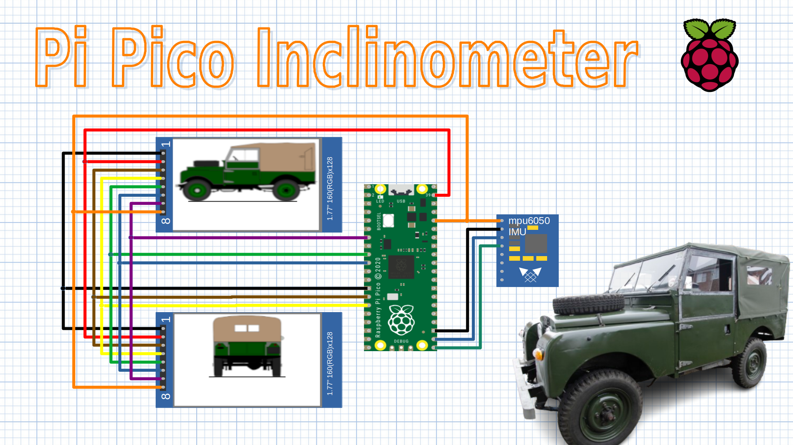
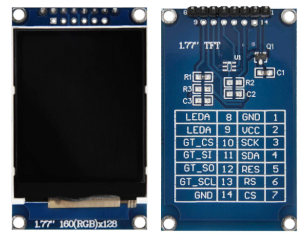
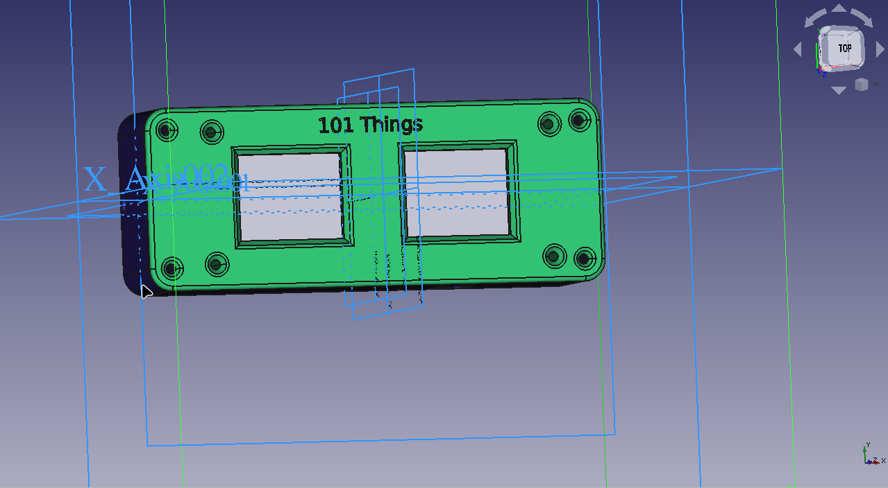

Taming the Terrain: Crafting an Inclinometer for Your Series 1 Land Rover with Raspberry Pi Pico
================================================================================================

Picture this: You're behind the wheel of a classic Series 1 Land Rover, the
engine purring as you navigate through rugged trails, steep inclines, and
unpredictable terrains. This vintage beauty has seen more adventures than most
of us can dream of, and it’s ready for another one. But what if you could equip
this stalwart vehicle with a modern twist, combining its timeless charm with
cutting-edge tech to conquer even the gnarliest paths?

Enter the Raspberry Pi Pico – the tiny, versatile microcontroller that’s about
to revolutionize your off-roading experience. In this project, we’ll transform
our beloved Series 1 Land Rover into a tech-savvy trailblazer by building a
custom inclinometer. This nifty gadget will help you monitor the pitch and roll
of your vehicle, ensuring you stay safe and steady as you traverse the wildest
landscapes.

Whether you’re a seasoned off-roader or a tech enthusiast looking for a new
challenge, this project promises to be a thrilling journey. So, buckle up, grab
your tools, and get ready to blend the old with the new. It’s time to give your
Land Rover a high-tech upgrade...

(Note: I haven't tested it, but it may work with other vehicles too!)

Quick Links
-----------

If you want to give it a go, take a look at the `Inclinometer Code <https://github.com/dawsonjon/101Things/tree/master/22_inclinometer/inclinometer>`_
It is developed as an `Arduino Pico <https://github.com/earlephilhower/arduino-pico?tab=readme-ov-file#arduino-pico>`_ 
sketch, to install Arduino Pico, follow `these instructions <https://github.com/earlephilhower/arduino-pico?tab=readme-ov-file#installation>`_

Choosing a Development Environment
----------------------------------------

The CircuitPython Promise
~~~~~~~~~~~~~~~~~~~~~~~~~

CircuitPython, a beginner-friendly language, offers extensive libraries for a
wide array of sensors and displays. For this project, I chose the MPU6050
accelerometer and gyroscope sensor along with a pair of ST7735 displays. This
seemed like an ideal project for CircuitPython, the promise of getting
everything running with just a few lines of Python code was highly appealing.
Setting up the first display was a breeze. CircuitPython's libraries not only
made it simple to display images but also included handy functions to load
images directly from a USB flash drive and even rotate them before displaying.
Interfacing with the MPU6050 was similarly straightforward, with existing
drivers facilitating easy data acquisition.

Hitting the Wall with Dual Displays
~~~~~~~~~~~~~~~~~~~~~~~~~~~~~~~~~~~

The challenge arose when I attempted to connect the second ST7735 display.
Although CircuitPython supports multiple displays, enabling this feature
required recompiling the firmware, although this is something I could have
overcome it wasn't the simple out-of-the-box solution I hoped it would be.
Moreover, the dual-display configuration used the IO pins inefficiently, not
fully leveraging the SPI bus's capability to handle multiple peripherals with
minimal additional pins.

A Detour into MicroPython
~~~~~~~~~~~~~~~~~~~~~~~~~

Realizing the limitations, I pivoted to MicroPython, a variant of Python
tailored for microcontrollers. Here, I found a display driver written in
Python, which could be adapted for multiple displays. After some hacking, I
successfully connected both displays to the Pico, only a single extra chip
select pin was needed to support a second display. However, new hurdles
emerged. While I could now display images on both screens, the built-in
functions to rotate images in CircuitPython were absent in MicroPython. I had
to write custom code for this task.

Unfortunately, this solution, written entirely in Python, proved to be too slow
to refresh the display in real-time Moreover, memory limitations reared their
head once I began processing two images simultaneously, leading to 
crashes.

Embracing the Power of C++
~~~~~~~~~~~~~~~~~~~~~~~~~~

Reluctantly, I concluded that the most effective path forward was to switch to
C++ using the Pico SDK. This transition was bittersweet. While I have a
fondness for MicroPython's capabilities and ease of use, C++ ended up being the
easiest way forward for this particular project.

Arduino Pico
~~~~~~~~~~~~

The pi-pico SDK isn't particularly beginner-friendly, and a few people have
recommended the excellent `Arduino Pico Core <https://github.com/earlephilhower/arduino-pico?tab=readme-ov-file#arduino-pico>`_ 
developed by Earle Philhower. It is an excellent way to get started, it has loads
of examples and you can get up and running developing code for the pi-pico in
just a few minutes.

Reading the Accelerometer and Gyro
----------------------------------

For this project, I'm using a module containing an mpu6050 device which contains
a 3-axis accelerometer and a 3-axis gyroscope. The MPU6050 module can be
connected to the pico using only 4 wires.

+----------------+-----------------+--------------+
|                |    Pi Pico      | MPU6050      |
+================+======+==========+=====+========+
| 3v3            |  36  | 3v3(out) |   1 | VCC    |
+----------------+------+----------+-----+--------+
| GND            |  23  | GND      |   2 | GND    |
+----------------+------+----------+-----+--------+
| SCL            |  22  | GP17     |   3 | SCL    |
+----------------+------+----------+-----+--------+
| SDA            |  21  | GP16     |   4 | SDA    |
+----------------+------+----------+-----+--------+

The mpu6050 only needs a few i2c register accesses to configure the device and
read from the registers. Although the driver was fairly simple to implement I
found that the device was quite unreliable at first and didn't always work.
From the `documentation
<https://invensense.tdk.com/wp-content/uploads/2015/02/MPU-6000-Register-Map1.pdf>`_
( page 41) The device needed to be reset in a specific sequence
after powering up. Adding this code to the device initialisation seemed to cure
the problem. I did find that this was missing from some of the example code I
looked at including the examples in the `pi-pico SDK
<https://github.com/raspberrypi/pico-examples/blob/master/i2c/mpu6050_i2c/mpu6050_i2c.c#L37>`_.

.. code:: c++

    //reset/wake 
    uint8_t reset_command[] = {107, 128}; 
    i2c_write_blocking(i2c, addr, reset_command, 2, false); 
    sleep_us(100000); 
 
    uint8_t path_reset_command[] = {104, 7}; 
    i2c_write_blocking(i2c, addr, path_reset_command, 2, false); 
    sleep_us(100000); 

The accelerometer readings for the x, y and z axis can be read from the i2c
registers. The default acceleration range is +/-2g which should be more than
sufficient to cope with the acceleration experienced - especially in a Land
Rover. From the x, y and z accelerations, the pitch and roll can be calculated.

.. code:: c++

  void mpu6050::get_pitch_roll(float &pitch, float &roll) 
  {
      uint8_t buffer[6];
      uint8_t val = 0x3B;
      i2c_write_blocking(m_i2c, addr, &val, 1, true);
      i2c_read_blocking(m_i2c, addr, buffer, 6, false);

      int16_t x_raw = (buffer[0] << 8 | buffer[1]);
      int16_t y_raw = (buffer[2] << 8 | buffer[3]);
      int16_t z_raw = (buffer[4] << 8 | buffer[5]);

      float x = x_raw/16384.0f;
      float y = y_raw/16384.0f;
      float z = z_raw/16384.0f;
      
      //this depends on the orientation of the sensor
      pitch = 180.0f * atan2f(x, sqrt(y*y + z*z))/M_PI;
      roll = 180.0f * atan2f(y, sqrt(x*x + z*z))/M_PI;
  }

On the bench, the inclinometer works pretty well using the accelerometer
readings alone giving an exact and stable reading. In the vehicle however
things did not go so well, just the vibrations with the engine running
prevented the device from providing any useable reading. When driving the
readings were very noisy and the acceleration gave distorted readings for
the pitch and roll. It turns out that in any dynamic situation combining
the accelerometer and gyro measurements is essential.

The code to read the gyroscope is fairly similar to the accelerometer code. This
time, however, we need to do some calibration. Even when the sensor is
completely still it reports a constant, non-zero rotation rate. To get a true
reading we need to subtract the zero offset. I had to negate the y value to get
a positive pitch rate when the accelerometer was reporting a positive pitch.

.. code:: c++

  void mpu6050::get_pitch_roll_rate(float &pitch_rate, float &roll_rate)
  {
      uint8_t buffer[6];
      uint8_t val = 0x43;
      i2c_write_blocking(m_i2c, addr, &val, 1, true);
      i2c_read_blocking(m_i2c, addr, buffer, 6, false);

      int16_t x_raw = (buffer[0] << 8 | buffer[1]);
      int16_t y_raw = (buffer[2] << 8 | buffer[3]);
      int16_t z_raw = (buffer[4] << 8 | buffer[5]);

      float x = x_raw * 250.0f/32768.0f;
      float y = y_raw * 250.0f/32768.0f;
      float z = z_raw * 250.0f/32768.0f;

      x -= x_gyro_zero;
      y -= y_gyro_zero;
      z -= z_gyro_zero;

      //this depends on the orientation of the sensor
      pitch_rate = -y;
      roll_rate = x;
  }

To work out the zero offsets, I implemented a simple calibration routine which
is run at power on. I am assuming that the sensor will remain still for at
least a short period when power is first applied. In practice this does seem to
be the case, but if this causes any problems I might need to look at other
options.

.. code:: c++

  void mpu6050::zero_gyro()
  {
      uint8_t buffer[6];
      uint8_t val = 0x43;

      for(int i=0; i<1000; i++)
      {
        i2c_write_blocking(m_i2c, addr, &val, 1, true);
        i2c_read_blocking(m_i2c, addr, buffer, 6, false);

        int16_t x_raw = (buffer[0] << 8 | buffer[1]);
        int16_t y_raw = (buffer[2] << 8 | buffer[3]);
        int16_t z_raw = (buffer[4] << 8 | buffer[5]);

        float x = x_raw * 250.0f/32768.0f;
        float y = y_raw * 250.0f/32768.0f;
        float z = z_raw * 250.0f/32768.0f;

        x_gyro_zero = x_gyro_zero * 0.98 + x * 0.02;
        y_gyro_zero = y_gyro_zero * 0.98 + y * 0.02;
        z_gyro_zero = z_gyro_zero * 0.98 + z * 0.02;
      }
  }

The next challenge is to combine the measurements from the accelerometer and
gyroscope to give a stable result. The gyroscope measures the rate of rotation
around each axis, we can integrate this over time to give a pitch or roll
angle, but this will drift over time, and will include some constant offset. On
the other hand, the accelerometer gives an absolute measurement of pitch and
roll and doesn't suffer from drift, but the measurement is noisy and distorted
by accelerations caused by the movement of the vehicle. We can get the best of
both worlds by combining the accelerometer and gyroscope measurements. The
simplest way to do this is by using a complimentary filter, which responds
directly to the integrated gyroscope measurements, combined with an
accelerometer measurement which has been smoothed over a long period. The net
result is a reading which responds quickly to changes in orientation, but
doesn't drift over time and is much less sensitive to vehicle acceleration and
vibrations.

.. code:: c++

      accelerometer.get_pitch_roll(pitch, roll); 
      accelerometer.get_pitch_roll_rate(pitch_rate, roll_rate); 
 
      delta_time_us = time_us_64() - time_us; 
      time_us += delta_time_us; 
 
      pitch_gyro = (0.9999 * (pitch_gyro + (pitch_rate * delta_time_us / 1e6))) + (0.0001*pitch); 
      roll_gyro  = (0.9999 * (roll_gyro + (roll_rate * delta_time_us / 1e6))) + (0.0001*roll); 

A Kalman filter would be a more sophisticated approach and is something that I
might explore in more detail in future. 

Remote Sensor
-------------

When installed in the vehicle, the inclinometer is tiled to allow an easier
view of the display. In an earlier version, I tried to compensate for the tilt
of the display in the software. To allow installation in different positions, I
added the ability to store the tilt angle of the display in flash and added a
serial interface for adjustment. It seemed like a simple solution, but what I
hadn't considered was the yaw of the vehicle, when turning around corners, the
tilt of the sensor changed resulting in huge errors in the pitch and roll. I
thought about how I could compensate for this in software, but I think the
solution would end up being very complicated. Instead, I decided to connect the
sensor through a short cable to allow it to be mounted on a flat surface. This
means there is no longer any need to compensate for tilt in software and makes
the whole thing much simpler. With the complimentary filter and the sensor
mounted flat, the inclinometer worked much better. The vibrations from the
engine cause only minimal disturbance when the engine is idling and the
readings are stable when driving, even around corners!

Driving the display
-------------------

I chose inexpensive 1.77-inch TFT displays with a 160x128 resolution.

The display uses an SPI connection and a couple of extra control lines, since
the display is a write-only device, the SPI MISO line is unused. The driver is
designed to minimise the number of IO pins needed, the connections to the two
displays are identical except that each display has a separate chip select (CS)
line. The st7735 is a 3.3v device, which isn't 5V tolerant. The pi-pico uses
3.3v logic so this doesn't present any problems to us, but it's something to be
aware of. The displays I used have a 3.3v regulator on the back so I drive VCC
from 5v. Some other displays based on the st7735 expect VCC to be driven from
3.3v so it is worth checking.

+----------------+-----------------+--------------+---------------+
|                |    Pi Pico      | Display 1    |    Display 2  |
+================+======+==========+=====+========+========+======+
| GND            |  13  | GND      |   1 | GND    |      1 | GND  |
+----------------+------+----------+-----+--------+--------+------+
| 5V (see text)  |  39  | VSYS     |   2 | VCC    |      2 | VCC  |
+----------------+------+----------+-----+--------+--------+------+
| MISO           |  16  | GP12     |     |        |        |      |
+----------------+------+----------+-----+--------+--------+------+
| SCK            |  14  | GP10     |   3 | SCK    |      3 | SCK  |
+----------------+------+----------+-----+--------+--------+------+
| MOSI           |  15  | GP11     |   4 | SDA    |      4 | SDA  |
+----------------+------+----------+-----+--------+--------+------+
| RESET          |  9   | GP6      |   5 | RES    |      5 | RES  | 
+----------------+------+----------+-----+--------+--------+------+
| DC             |  10  | GP7      |   6 | RS     |      6 | RS   |
+----------------+------+----------+-----+--------+--------+------+
| CS1            |  7   | GP5      |   7 | CS     |        |      |
+----------------+------+----------+-----+--------+--------+------+
| CS2            |  6   | GP4      |     |        |      7 | CS   |
+----------------+------+----------+-----+--------+--------+------+
| 3v3            |  36  | 3v3(out) |   8 | LED    |      8 | LED  |
+----------------+------+----------+-----+-----------------+------+

To drive the display I wrote a simple, stripped-down driver written in C++. I
decided to write a separate frame buffer class to draw images and text, all the
display driver needs to do is transfer the frame buffer to the display. This
boils down to some SPI accesses to initialise the display, and some
more accesses to transfer the data.

Frame Buffer Class
------------------

The display driver itself is very simple, so I need some code to load (and
rotate) images, and to draw text on the screen. To achieve this I wrote a
simple frame buffer class, for now, I only added the functionality I needed for
this project, but it should be fairly simple to extend the code to support
drawing primitives such as lines and shapes if I need these in future.

RAM is at a premium in the Pi Pico and holding the contents of two displays in
RAM can use it up quite quickly. For this reason, I opted to share a single
frame buffer to draw both displays. This means that we have to reload and
redraw the whole display for each frame. Fortunately, the pi-pico is relatively
fast especially when programming in bare-metal C++ and is easily capable of
sustaining a reasonable refresh rate.

While CircuitPython provides a USB-accessible file system to store the images
out of the box, the pico-sdk doesn't provide the same luxury. There are ways to
implement this functionality in C++, but I decided to opt for a much simpler
approach for this application. I wrote a simple Python script to convert image
files into C++ header files.

.. code:: Python

  import imageio
  import sys

  input_file = sys.argv[1]
  name = input_file.split(".")[0]
  output_file = name+".h"

  im = imageio.imread(input_file)
  h, w, c = im.shape

  pixels = []
  for y in range(h):
    for x in range(w):
      r, g, b = im[y][x][:3]
      color = ((r & 0xF8) << 8) | ((g & 0xFC) << 3) | b >> 3;
      color = (color >> 8 | color << 8) & 0xffff;
      pixels.append("0x%04x"%color)
  pixels = ",\n".join(pixels)
  contents = "static const uint16_t __in_flash() %s[] = {%s};"%(name, pixels)

  with open(output_file, "w") as outf:
    outf.write(contents);

The images, which must be exactly 160 pixels wide and 128 pixels high, can be
converted into header files on the command line.

.. code:: bash

  $ python image2fbuf.py s1_back.bmp

The resulting header files contain arrays containing the pixel data. Since
the pi-pico has much more flash than RAM, the arrays are stored in flash. There
is more than enough space to store both images. To save memory, the image is
rotated on the fly as it is loaded from the flash array into the frame buffer
without the need for any intermediate storage.

.. code:: c++

  void image_rotate(const uint16_t pixels[], float angle)
    {

      //assumes that the image is the same size as the frame buffer
      //rotate around centre of display
      uint16_t cx = width>>1;
      uint16_t cy = height>>1;
      int32_t s = sinf(-angle * M_PI/180) * 1024.0; //10 fraction bits
      int32_t c = cosf(-angle * M_PI/180) * 1024.0; //10 fraction bits

      for(uint32_t y=0; y<height; ++y)
      {
        for(uint32_t x=0; x<width; ++x)
        {

          //rotate x, y coordinate to work out where it should be copied from
          int32_t xm = x-cx;
          int32_t ym = y-cy;
          int32_t xfrom = (((xm * c) - (ym * s)) >> 10) + cx;
          int32_t yfrom = (((xm * s) + (ym * c)) >> 10) + cy;

          if( xfrom < width && yfrom < height && xfrom > 0 && yfrom > 0)
          {
            buffer[y*width+x] = pixels[yfrom*width + xfrom];
          }
          else
          {
            buffer[y*width+x] = RGB565(255, 255, 255); //fill missing pixels in white
          }

        }
      }
    }

I needed the ability to also draw text in the frame buffer, to achieve this I
used bitmap-based fonts which are again stored as arrays in Flash. `This site
<http://www.rinkydinkelectronics.com/r_fonts.php>`_ has a range of fonts that
can easily be adapted. The font contains an array of characters that can be drawn on the buffer pixel-by-pixel.

.. code:: c++

  void character(const uint8_t c, const uint16_t x, const uint16_t y, const uint16_t color, const uint8_t font[])
  {
    uint8_t font_width = font[0];
    uint8_t font_height = font[1];
    uint8_t first_char = font[2];
    uint8_t num_chars = font[3];

    uint16_t idx = 4 + ((c-first_char)*font_width*font_height/8);
    uint8_t data = font[idx++];
    uint8_t bits_left = 8;    

    for(uint8_t k = 0; k<font_height; ++k)
    {
      for(uint8_t j = 0; j<font_width; ++j)
      {
        if(data & 0x80){
          buffer[((y+k)*width)+(x+j)] = color;
        }
        data <<= 1;
        bits_left--;
        if(bits_left == 0)
        {
          data = font[idx++];
          bits_left = 8;
        }
      }
    }
  }

3D Printed Enclosure
--------------------

For this project, I have moved away from my usual PCB sandwich-type enclosure
and designed a 3D-printed enclosure. 3D-printed enclosures have a lot of
advantages, and cost is certainly one of them. It is possible to design and
print a custom enclosure that exactly fits the needs of the project, and the
cost of the material is a fraction of what a commercial enclosure would cost.

I designed the enclosure using FreeCAD, the FreeCAD project and the STL files can be found 
`here <https://github.com/dawsonjon/101Things/tree/master/22_inclinometer/enclosure>`_

Power Supply
------------

Probably the simplest way to power a project like this would be using a car
phone charger to directly power the Pi Pico. In my prototype, I wanted to wire
the inclinometer directly. I went for the old-school option and used a 7805
regulator with a suitable heatsink.

Conclusion
----------

At first, this seemed like it would be a fairly simple project, but there have
been a few false starts and plenty of snags to overcome. Although I am a big
fan of microPython and CircuitPython, and these projects do simplify the
development process, for this project at least C++ was certainly an easier
option. However I think that the Pico Arduino core significantly simplifies the
development process, it is a lot simpler to install and there are plenty of
examples to get you up and running quickly. 

While it is fairly simple to make a "spirit level" type inclinometer that works
well, determining the orientation of the sensor using accelerometers and
gyroscopes in a dynamic environment is a lot more tricky. There is a lot
more I would like to learn about sensor fusion and Kalman filters.

We got it working in the end, and we ended up with a device that works and is
still quite simple to build and program. Using off-the-shelf display and sensor
modules, the whole circuit can be built using point-to-point wiring.

