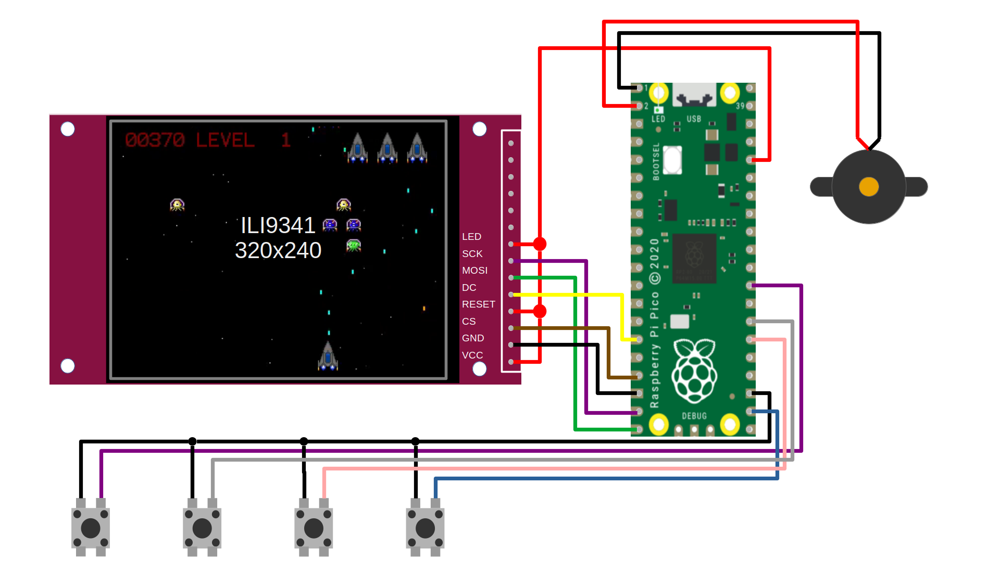
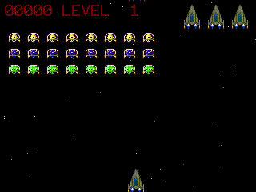
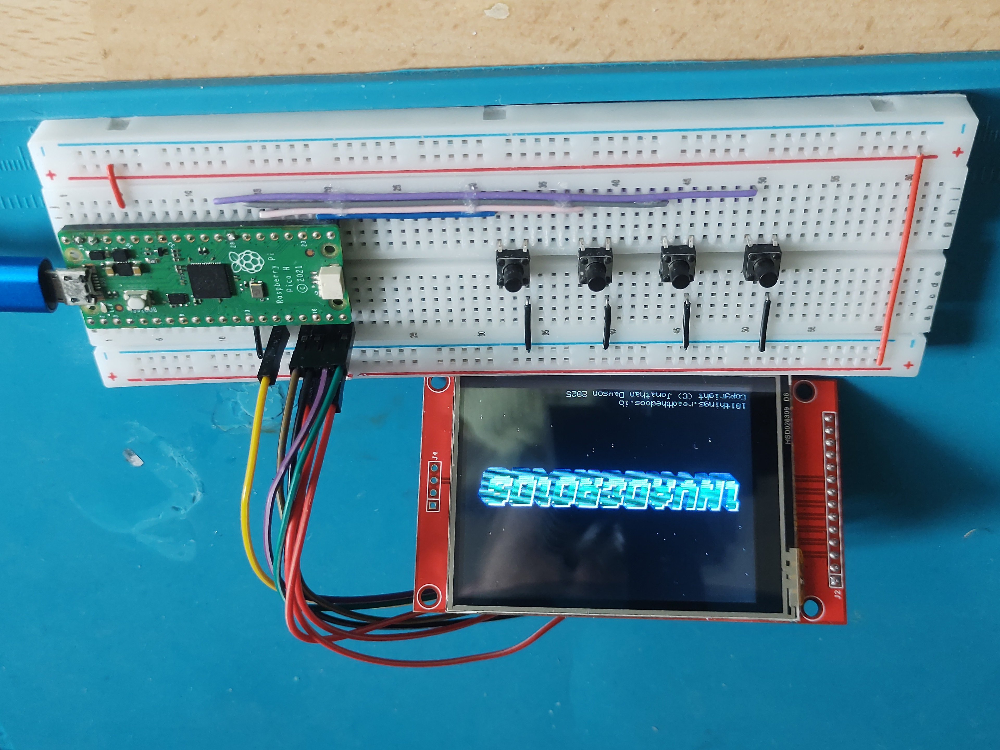
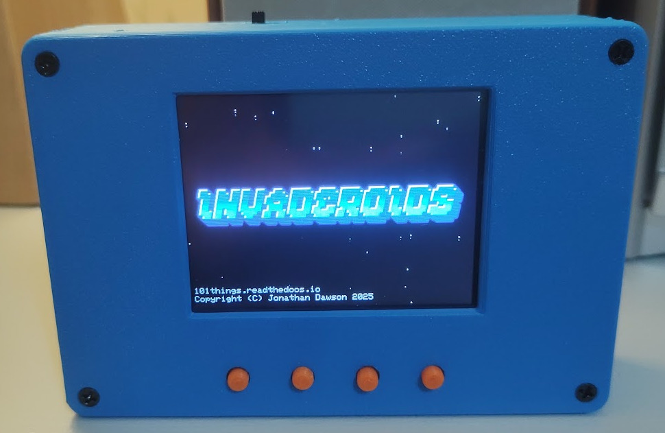
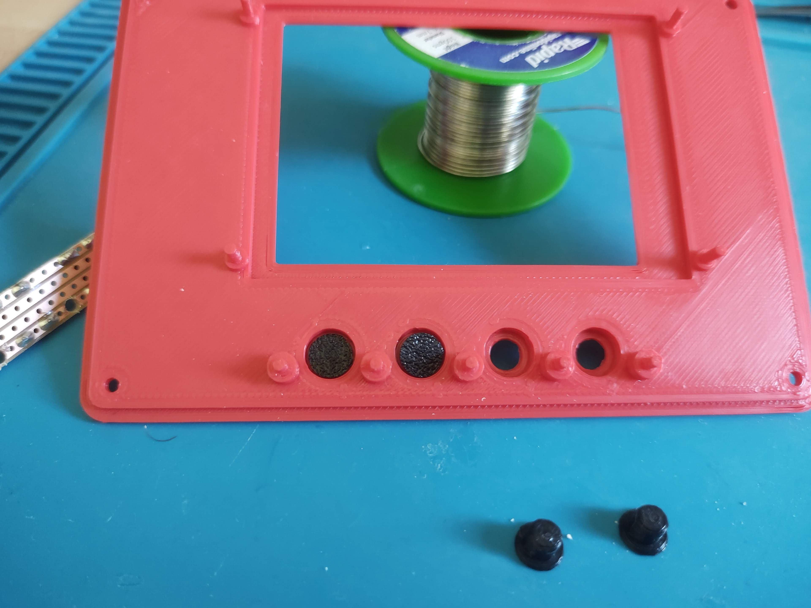
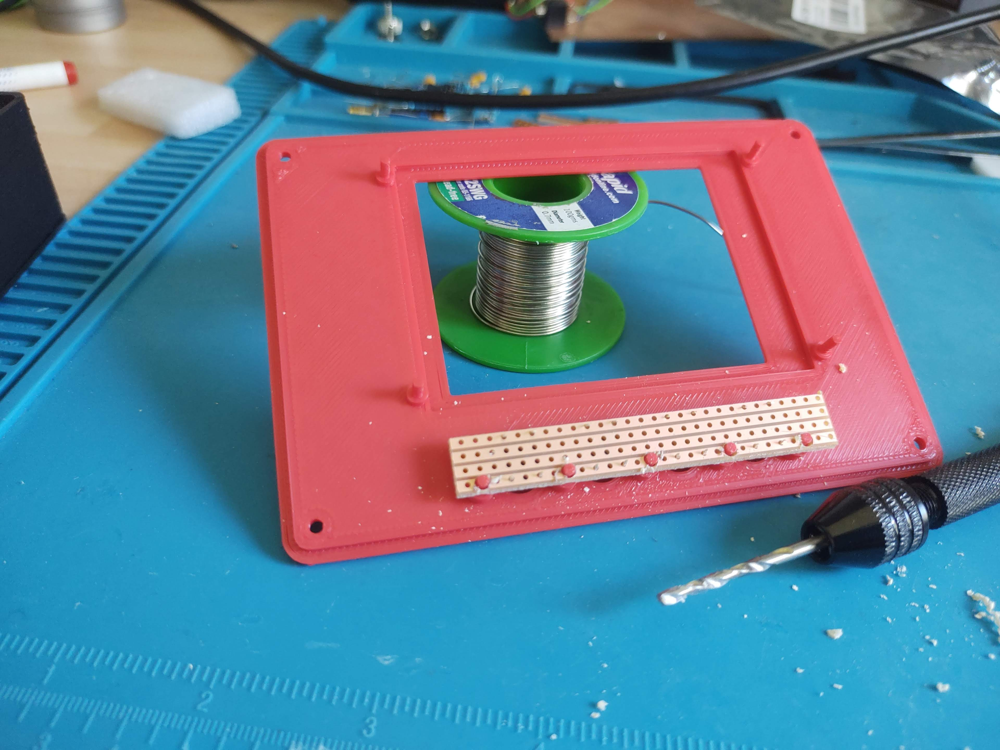
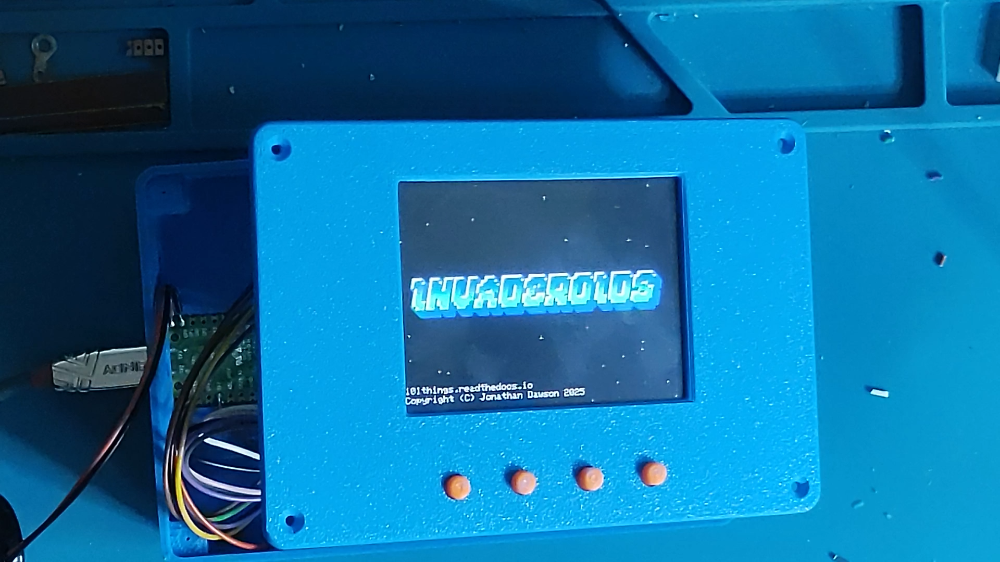

Junkbox Arcade
==============

.. raw:: html

    <iframe width="560" height="315" src="https://www.youtube.com/embed/QSweNG6Ulxg?si=j3-Dnz5GzisLwLft" title="YouTube video player" frameborder="0" allow="accelerometer; autoplay; clipboard-write; encrypted-media; gyroscope; picture-in-picture; web-share" referrerpolicy="strict-origin-when-cross-origin" allowfullscreen></iframe>

Junkbox Arcade grew out of a simple goal: build a tiny retro-style game machine using nothing more than the parts already rattling around in my drawer. No fancy modules, no exotic hardware—just a Pi Pico, an SPI TFT, a few buttons, and whatever else was lying around. I wanted something anyone could put
together on a breadboard in an afternoon, especially if they’ve just finished the classic “blink an LED” stage and are ready for a project that feels like a real step up.

Even with such modest parts, it turns out you can squeeze a surprising amount of performance out of the hardware. The display resolution is a sweet spot for the Pico, the frame buffer fits neatly into RAM, and with a few careful design choices, the software runs smoothly at a consistent update rate. The whole thing
becomes a fun little playground for C++ graphics, simple audio synthesis, and the kind of game logic that gives old arcade titles their charm.

Features
--------

 - **Runs on a single Raspberry Pi Pico** – no extra microcontrollers or fancy shields.
 - **Compact SPI TFT display** – small enough for breadboarding, fast enough for smooth graphics.
 - **Simple button inputs** – just a handful of switches for classic arcade controls.
 - **Lightweight C++ graphics engine** – tile/sprite rendering and a framebuffer.
 - **Basic audio synthesis** – square waves, beeps, and all the retro charm that comes with them.
 - **Breadboard-friendly wiring** – no custom PCB required.
 - **Easy to extend** – add more buttons, joystick, or update the theme.

Quick Links
-----------

 - `github page <https://github.com/dawsonjon/JunkboxArcade>`__
 - `Arduino sketch <https://github.com/dawsonjon/JunkboxArcade/tree/main/invaderoids>`__
 - `3D printed enclosure sketch <https://github.com/dawsonjon/JunkboxArcade/tree/main/enclosure>`__

Hardware
--------

For the hardware, I am pairing a cheap ILI9341 display with a Pi-Pico. This is a combination that I have used in several of my projects. When paired with buttons for a menu-driven interface, it creates a very low-cost platform for portable applications.

The ILI9341 offers a resolution of 240x320, which ends up being a sweet spot for the Pi-Pico. At this resolution, it is possible to hold a full frame buffer in RAM using 150KiB. This fits in the RAM of the Pi-Pico, leaving enough spare RAM to implement the software. Storing a whole frame buffer in RAM makes it much easier to animate the display without introducing any flicker. The maximum SPI rate of the RP2040 is 62.5MHz; it takes 25ms to transfer the frame buffer to the display. This makes an update rate of 20Hz (50ms) a practical proposition, allowing us to generate smooth animations.

This design should work just as well in RP2040 and RP2350-based Pi-Pico devices. The design doesn't make use of any WIFI functionality, but it will happily run in a PicoW or Pico 2W if needed. The RP2040 is able to run the game at full speed using a 125MHz clock in an RP2040. Although the RP2040 can be run at a clock speed of 200MHz, this should be avoided because it reduces the maximum SPI speed, preventing the game from running at the proper rate.

Audio is provided using a passive piezo buzzer driven by a differential PWM-based audio DAC. Using a differential output doubles the voltage swing , giving a louder audio output, while also removing DC, avoiding the need for any external components.

The user interface uses an additional 4 buttons to drive a menu, and the circuit shares a lot of similarity to the `planetarium <https://101-things.readthedocs.io/en/latest/planetarium.html>`__ design.

+-----------------------------------------+----------+---------------------------------+------------------------------+
| Part                                    | Quantity | Example URL                     | Notes                        |
+=========================================+==========+=================================+==============================+
| 320x240 ILI9341 or ILI9342 SPI Display  | 1        | `<https://shorturl.at/Kwjb0>`__ |                              |
+-----------------------------------------+----------+---------------------------------+------------------------------+
| Raspberry Pi Pico                       | 1        | `<https://shorturl.at/bKibr>`__ |                              |
+-----------------------------------------+----------+---------------------------------+------------------------------+
| Tactile buttons 6mm                     | 4        | `<https://shorturl.at/IHNVn>`__ |                              |
+-----------------------------------------+----------+---------------------------------+------------------------------+
| Passive Piezzo Buzzer                   | 1        | `<https://shorturl.at/beNCw>`__ | Must be a passive type       |
+-----------------------------------------+----------+---------------------------------+------------------------------+
| 3D Printed Enclosure                    | 1        | `<https://shorturl.at/M5z12>`__ |                              |
+-----------------------------------------+----------+---------------------------------+------------------------------+

(Note: Links are for illustrative purposes and not necessarily recommendations.)

I'm using an ILI9341 display with an SPI interface, which is cheap and easy to get hold of. They are also available in a few different sizes. I'm using the 3.2-inch version. You need to get one with an SPI interface and make sure that you supply it with the right supply voltage.

The displays I have purchased provide the ability to select a 5V or 3.3V power supply. There is a jumper on the reverse side that can be shorted to bypass a regulator, allowing operation from a 3.3V supply. The IO signals use a 3.3V standard, so they are directly compatible with the Pi Pico.

The design uses a "4-wire" SPI interface to control the display. (There are displays available with a faster parallel interface, but the SPI interface is more economical with IO). The display is unidirectional and needs only the MOSI and SCK pins; the MISO signal is not used. In addition, the display needs a chip select and a "DC" pin. Although the display has a hardware reset, I have found that this can be hard-wired to 3.3V to save IO, and so far, I have had reliable results using only the software reset. The following table shows the display wiring.

The display wiring is shown below:

+-----------+---------------+----------------------+------------------+
| Signal    | Display Pin   | Pico Pin Number      | Pico GPIO Number |
+===========+===============+======================+==================+
| Vcc       | 1             | 36 (3v3 out)         | NA               |
+-----------+---------------+----------------------+------------------+
| Gnd       | 2             | 18 (GND)             | NA               |
+-----------+---------------+----------------------+------------------+
| CS        | 3             | 17                   | 13               |
+-----------+---------------+----------------------+------------------+
| RESET     | 4             | 36 (3v3 out)         | NA               |
+-----------+---------------+----------------------+------------------+
| DC        | 5             | 15                   | 11               |
+-----------+---------------+----------------------+------------------+
| MOSI      | 6             | 20                   | 15               |
+-----------+---------------+----------------------+------------------+
| SCK       | 7             | 19                   | 14               |
+-----------+---------------+----------------------+------------------+
| LED       | 8             | 36 (3v3 out)         | NA               |
+-----------+---------------+----------------------+------------------+

The four buttons used to navigate the menu each connect between GND and a spare GPIO pin:

+-----------+----------------------+------------------+
| Signal    | Pico Pin Number      | Pico GPIO Number |
+===========+======================+==================+
| Gnd       | 23 (GND)             | NA               |
+-----------+----------------------+------------------+
| FIRE_BTN  | 22                   | 17               |
+-----------+----------------------+------------------+
| PAUSE_BTN | 26                   | 20               |
+-----------+----------------------+------------------+
| RIGHT_BTN | 27                   | 21               |
+-----------+----------------------+------------------+
| LEFT_BTN  | 29                   | 22               |
+-----------+----------------------+------------------+

Software
--------

The core planetarium code is written in C++ and can even be compiled to run on a desktop PC. Some of the  hardware-specific operations, such as the display driver, have been tailored to the Raspberry Pi Pico platform.

A demo version is available as an `Arduino sketch <https://github.com/dawsonjon/Pico-Planetarium/tree/main/pico_planetarium>`__. The easiest way to set up a C++ development environment for the Pico is via the `Arduino Pico port by Earle Philhower <https://github.com/earlephilhower/arduino-pico>`__, which supports both the standard Pico and the Wi-Fi-enabled Pico W.

This toolchain can be installed in just a few minutes using the `Boards Manager instructions <https://github.com/earlephilhower/arduino-pico?tab=readme-ov-file#installing-via-arduino-boards-manager>`__, and is supported by extensive `online documentation <https://arduino-pico.readthedocs.io/en/latest/>`__.

The game graphics are all generated using a frame buffer that allows text, images, and drawing primitives to be drawn in an area of memory. The frame buffer code was reused from the `pico planetarium project <https://101-things.readthedocs.io/en/latest/planetarium.html>`__.

Once the animated graphic elements have been written to the frame buffer, they are transferred to the display via SPI. The whole process repeats every 50ms, 25ms is needed to transfer the frame buffer to the display, leaving 25ms to animate the display and generate the audio. Although the RP2040 does support DMA, it doesn't provide much advantage in this case. We could use DMA to automatically transfer the data from RAM to the display, freeing up the CPU for more computations. In practice, this doesn't give a real performance advantage because we can't overwrite the frame buffer while the transfer is in progress.
If we had sufficient RAM to implement a double buffer, however, we could effectively double the available processing power! In any case, the CPU doesn't have any difficulties running the game at full speed with the current architecture.

The audio processing uses a very simple software synthesizer, similar to the Programmable Sound Generator (PSG) chips found in retro arcade games.

The synthesiser allows musical tones to be generated using sinusoidal, triangular, or square waves. This is achieved using a phase accumulator to generate the address into a lookup table containing the appropriate waveform.

The synthesiser can also generate white noise using a pseudo-random number generator. The white noise can be used to generate percussion or explosion sounds.

The musical tones and random noise are then shaped using an envelope generator. The envelope generator uses a simple exponential decay that simulates the natural decay found in musical notes, a plucked string, for example.
The sound generator is capable of generating multiple tones simultaneously, the sounds are generated in 50ms blocks that are synchronised to the 50ms video frames. The sound generator uses a ping-pong buffer and DMA to transfer the sounds to the PWM-based audio DAC. The DMA carries out the transfer
autonomously while the CPU processes generate the next audio/video frame.

.. image:: images/junkbox_arcade/sound.png

The game sound effects are generated using a combination of musical tones and white noise, with various envelopes employed. I found that the sound from the white noise generator was too refined to represent an explosion, so I added an additional quantization stage to give a much cruder sound.

.. raw:: html

   <audio controls="controls" title="Game Sound Effects">
         <source src="_static/effects.wav" type="audio/wav">
         Your browser does not support the <code>audio</code> element.
   </audio>

To generate the music, I adapted the RTTTL generator that I used in the kitchen timer project. A simple Python script converts music in RTTTL format into a C++ array of note pitches and durations. A simple software synthesiser plays each note using a specified waveform and envelope to crudely represent an
instrument. It is possible to generate polyphonic music by combining several RTTTL files to generate multiple tracks.

To give the game a retro feel, I am using fast arpegios. This was a common technique in PSG based games where hardware limitations prevented the use of chord sequences. Breaking the chord into fast arpegios gives the gives a greater depth to the music without requiring multiple notes to be played simultaneously. Not having the necessary musical skills to compose a theme, I turned to chatGPT to generate a suitable sequence.

.. raw:: html

   <audio controls="controls" title="Game Sound Effects">
         <source src="_static/theme.wav" type="audio/wav">
         Your browser does not support the <code>audio</code> element.
   </audio>

Breadboard Build
----------------

This design is so simple, building and testing the circuit using a solderless breadboard is totally doable. Once you are happy that everything is working, you can easily build something more robust using a more permanent prototyping method.

3D Printed Enclosure
--------------------

The 3D printed enclosure design has been reworked to accommodate the extended functionality. I used the `planetarium <https://101-things.readthedocs.io/en/latest/planetarium.html>`__ design as a starting point, which already includes provision for the 4 buttons and TFT display.

The enclosure allows easy access to the Pico's USB port, while also allowing the bootsel button to be operated in-place, simplifying the process of USB programming.

I have tried to design the enclosure to be as flexible as possible, providing several different front panels to accomodate different size TFT displays from 2.4 to 3.2 inch. The TFT display's SD card socket can be accessed through a slot in the top of the enclosure. The enclosure walls have been thinned in this area so that the SD card slot can be trimmed to fit a particular display.

The enclosure includes a number of customizable features to accommodate power-switches and audio jacks. These can be trimmed using a drill or craft knife.

For portable operation, the enclosure includes a generously sized battery compartment. If you would like to  explore battery operation of the Pi Pico, the `datasheet <https://datasheets.raspberrypi.com/pico/pico-datasheet.pdf>`__ presents a few options in section 3.1. The Pico includes an efficient switched-mode regulator and can be operated from 1.8V to 5.5V. The pico will operate from 2 or 3 AA or AAA batteries, or a single 3.7V lithium battery.

The enclosure allows 4x6mm tactile switches to be installed. These are soldered to a piece of "strip-board" or "veroboard" that has been cut to size and drilled. The strip-board is fixed to the panel using meltable features integrated in the front panel. The same meltable fixings are used to secure the TFT display.

.. image:: images/junkbox_arcade/enclosure_construction_2.jpg

.. image:: images/junkbox_arcade/enclosure_construction_4.jpg

The front panel and battery lid are secured using countersunk M3x6 self-tapping screws.

Conclusion
----------

Junkbox Arcade ended up being exactly the kind of project I love: simple parts, simple wiring, but plenty of room to tinker, learn, and expand. It’s approachable enough for beginners but still rewarding for anyone who wants to dive deeper into graphics, audio generation, or Pico-level optimisation.

Whether you keep it on a breadboard, tuck it into the 3D-printed enclosure, or use it as a starting point for your own games, it’s a flexible little platform that shows just how much you can do with the humble bits and pieces already in your workshop.

If you build your own version—or add your own twists—I  would love to hear how it turns out. Retro games have a way of bringing out everyone’s creativity, and this tiny arcade machine is a great place to start experimenting.

If you would like to support 101Things, buy me a coffee: https://ko-fi.com/101things
