Pi Pico Planetarium
===================

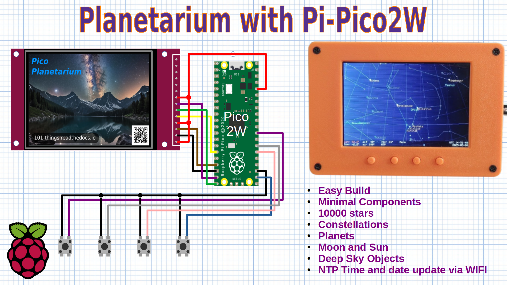

The Pi Pico Planetarium is a compact, low-cost astronomy viewer built around the Raspberry Pi Pico W and a 480x320 ST7796 TFT display. Designed with both beginners and experienced hobbyists in mind, it offers a hands-on introduction to microcontrollers, electronics, and astronomy, while remaining flexible and expandable for more advanced use. The device displays a real-time map of the night sky, including stars, constellations, planets, the Moon, and deep sky objects. By using Wi-Fi to retrieve accurate time data via NTP, the planetarium keeps the star chart aligned with the user’s current time and location.

Hardware
--------

.. image:: images/planetarium/wiring.png

The hardware is straightforward. The key components are the Raspberry Pi Pico (preferably the 2W version) and a TFT display (preferably an ST7796-based 480x320 model).

+-----------------------------------------+----------+---------------------------------------------------------------------------+
| Part                                    | Quantity | Example URL                                                               |
+=========================================+==========+===========================================================================+
| 480x320 ST7796 TFT Display              | 1        | `<https://shorturl.at/H14Pt>`__                                           |
+-----------------------------------------+----------+---------------------------------------------------------------------------+
| Raspberry Pi Pico 2W                    | 1        | `<https://shorturl.at/7EYhl>`__                                           |
+-----------------------------------------+----------+---------------------------------------------------------------------------+
| Tactile buttons 6mm                     | 4        | `<https://shorturl.at/IHNVn>`__                                           |
+-----------------------------------------+----------+---------------------------------------------------------------------------+
| 3D-printed enclosure (optional)         | 1        | `<https://github.com/dawsonjon/Pico-Planetarium/tree/main/enclosure>`__   |
+-----------------------------------------+----------+---------------------------------------------------------------------------+

(Note: Links are for illustrative purposes and not necessarily recommendations.)

The planetarium uses NTP to update the time via the Wi-Fi capabilities of the Pico 2W. This feature can be disabled at compile time if using a microcontroller without Wi-Fi.

While ILI9341 SPI displays are supported, and often used in earlier projects, the higher resolution of the ST7796 (480x320) makes it more suitable here. The display requires a 300 KB frame buffer, which exceeds the 264 KB RAM of the original Pico but fits within the 520 KB of the Pico 2 and Pico 2W.

+-------------+---------------+--------------------------+------------------------+
| Platform    | NTP Time      | ILI9341 320x240 Display  | ST7796 480x320 Display |
+=============+===============+==========================+========================+
| Pi Pico     | No            | Yes                      | No                     |
+-------------+---------------+--------------------------+------------------------+
| Pi Pico W   | Yes           | Yes                      | No                     |
+-------------+---------------+--------------------------+------------------------+
| Pi Pico 2   | No            | Yes                      | Yes                    |
+-------------+---------------+--------------------------+------------------------+
| Pi Pico 2W  | Yes           | Yes                      | Yes                    |
+-------------+---------------+--------------------------+------------------------+

The ST7796 display I used has an SPI interface, and is inexpensive and widely available. I chose a 4.0-inch version. Ensure the display you choose supports SPI and is supplied with the correct voltage. Some displays allow selection between 5v and 3.3v using a jumper.

Displays with 3.3v I/O are directly compatible with the Pico. The "4-wire" SPI interface requires only MOSI and SCK, along with chip select (CS) and data/command (DC) lines. While the display includes a hardware reset pin, it can be safely tied to 3.3v, and I have found software reset to be reliable.

The display wiring is shown below:

+-----------+---------------+----------------------+------------------+
| Signal    | Display Pin   | Pico Pin Number      | Pico GPIO Number |
+===========+===============+======================+==================+
| Vcc       | 1             | 36 (3v3 out)         | NA               |
+-----------+---------------+----------------------+------------------+
| Gnd       | 2             | 18 (GND)             | NA               |
+-----------+---------------+----------------------+------------------+
| CS        | 3             | 17                   | 13               |
+-----------+---------------+----------------------+------------------+
| RESET     | 4             | 36 (3v3 out)         | NA               |
+-----------+---------------+----------------------+------------------+
| DC        | 5             | 15                   | 11               |
+-----------+---------------+----------------------+------------------+
| MOSI      | 6             | 20                   | 15               |
+-----------+---------------+----------------------+------------------+
| SCK       | 7             | 19                   | 14               |
+-----------+---------------+----------------------+------------------+
| LED       | 8             | 36 (3v3 out)         | NA               |
+-----------+---------------+----------------------+------------------+

The four buttons used to navigate the menu each connect between GND and a spare GPIO pin:

+-----------+----------------------+------------------+
| Signal    | Pico Pin Number      | Pico GPIO Number |
+===========+======================+==================+
| Gnd       | 23 (GND)             | NA               |
+-----------+----------------------+------------------+
| UP_BTN    | 22                   | 17               |
+-----------+----------------------+------------------+
| DOWN_BTN  | 26                   | 20               |
+-----------+----------------------+------------------+
| RIGHT_BTN | 27                   | 21               |
+-----------+----------------------+------------------+
| LEFT_BTN  | 29                   | 22               |
+-----------+----------------------+------------------+

There is a section in the planetarium sketch for compile-time constants. These may need to be adjusted depending on your specific hardware. Some displays may show rotated or inverted images, so experimenting with these settings can help correct display issues.

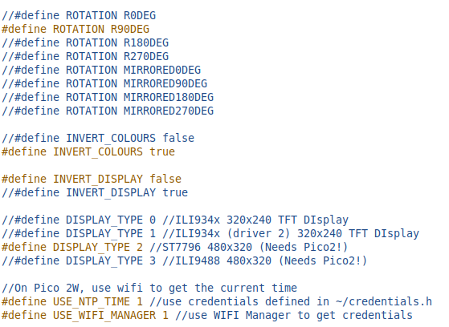

Software
--------

The core planetarium code is written in C++ and can even be compiled to run on a desktop PC. Some of the hardware-specific operations, such as the display driver have been tailored to the Raspberry Pi Pico platform.

A demo version is available as an `Arduino sketch <https://github.com/dawsonjon/Pico-Planetarium/tree/main/pico_planetarium>`__. The easiest way to set up a C++ development environment for the Pico is via the `Arduino Pico port by Earle Philhower <https://github.com/earlephilhower/arduino-pico>`__, which supports both the standard Pico and the Wi-Fi-enabled Pico W.

This toolchain can be installed in just a few minutes using the `Boards Manager instructions <https://github.com/earlephilhower/arduino-pico?tab=readme-ov-file#installing-via-arduino-boards-manager>`__, and is supported by extensive `online documentation <https://arduino-pico.readthedocs.io/en/latest/>`__.

NTP Time Updates
----------------

To keep the sky chart aligned with the correct time, the planetarium fetches the current time from an NTP server using the Pico 2W’s built-in Wi-Fi. This is done using a lightweight UDP-based request. Once the current time is retrieved, it is converted to Unix time and applied using `settimeofday`.

Here’s a simplified excerpt from the `NTPTime` class:

.. code:: cpp

  #include "NTPTime.h"

  static const char* ntpServerName = "pool.ntp.org";
  static const int ntpPort = 123;

  void NTPTime::sendNTPpacket(const char* ntpServer) {
    memset(udpBuffer, 0, udpBufferSize);
    udpBuffer[0] = 0b11100011;

    udp.beginPacket(ntpServer, ntpPort);
    udp.write(udpBuffer, udpBufferSize);
    udp.endPacket();
  }

  void NTPTime::setTime() {
    if (WiFi.status() != WL_CONNECTED) {
      Serial.println("No Connection...");
      return;
    }

    int packetSize = udp.parsePacket();
    if (packetSize) {
      udp.read(udpBuffer, udpBufferSize);
      unsigned long highWord = word(udpBuffer[40], udpBuffer[41]);
      unsigned long lowWord = word(udpBuffer[42], udpBuffer[43]);
      time_t secsSince1900 = (highWord << 16) | lowWord;

      const unsigned long seventyYears = 2208988800UL;
      time_t unix_time = secsSince1900 - seventyYears;

      timeval tv = {.tv_sec = unix_time};
      settimeofday(&tv, NULL);
      Serial.println("Time Updated");
    }

    if (millis() - lastUpdated > 30000) {
      sendNTPpacket(ntpServerName);
      lastUpdated = millis();
    }
  }

  void NTPTime::begin() {
    udp.begin(2390);  // Arbitrary local UDP port
  }

Wi-Fi Configuration
-------------------

Handling Wi-Fi credentials can be one of the more awkward aspects of working with microcontrollers that lack a full user interface. To simplify this, the planetarium uses a Wi-Fi manager that starts the Pico as a captive access point on first boot. Users can connect to the Pico’s network and enter their Wi-Fi credentials via a browser. These credentials are stored in flash memory for future use.

The project uses the `WiFiManager-Pico library by Matt Thorley <https://github.com/mthorley/wifimanager-pico/blob/main/src/WiFiManager.cpp>`__, which is lightweight and easy to integrate. Only a few source files are needed.

Example usage:

.. code:: cpp

  String title("Pico Planetarium");
  String name("PICO_PLANETARIUM_PICO2W");
  String shortname("PICO_PLANETARIUM");
  String maker("101 Things");
  String version("0.0.1");

  WiFiManager wm("PICO_PLANETARIUM", "password");
  wm.setContentText(title, name, shortname, maker, version);
  wm.autoConnect();

I’ve made a few minor customisations to the original library, replacing some dependencies with local code for simplicity, and slightly modifying EEPROM initialization to allow shared use with other settings.

.. image:: images/planetarium/WiFiManager.png

Stars and Constellations
''''''''''''''''''''''''

The foundation of the planetarium display is a realistic star field. Rather than use a large, memory-heavy star catalogue, I chose the `Bright Star Catalog (BSC) <http://tdc-www.harvard.edu/catalogs/bsc5.html>`__, which contains approximately 10,000 stars. This makes it a good fit for flash storage and covers nearly all stars visible to the naked eye.

For each star the catalog includes its Right Ascension (RA), Declination (DEC), magnitude, and spectral class. 

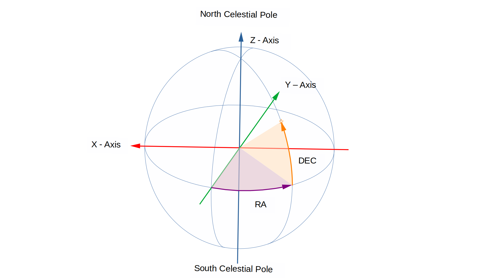

I preprocess the data using a Python script that converts the coordinates to 3D Cartesian (x, y, z) format. The preprocessing step avoids costly trigonometric calculations during rendering. The stars can then be rotated in real-time, using matrix multiplications, to match the observer’s time and location, ensuring fast performance even with 10,000 stars. 

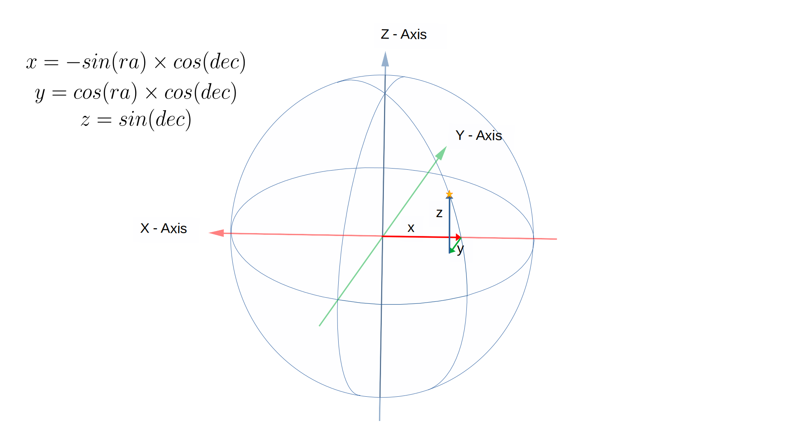

Notice that the direction of the x-axis looks backwards, but it helps with the
translation to screen coordinates later in the process. Imagine an observer is
looking through the display at the sky, we can simply scale the x and y
coordinates to fit on the screen.

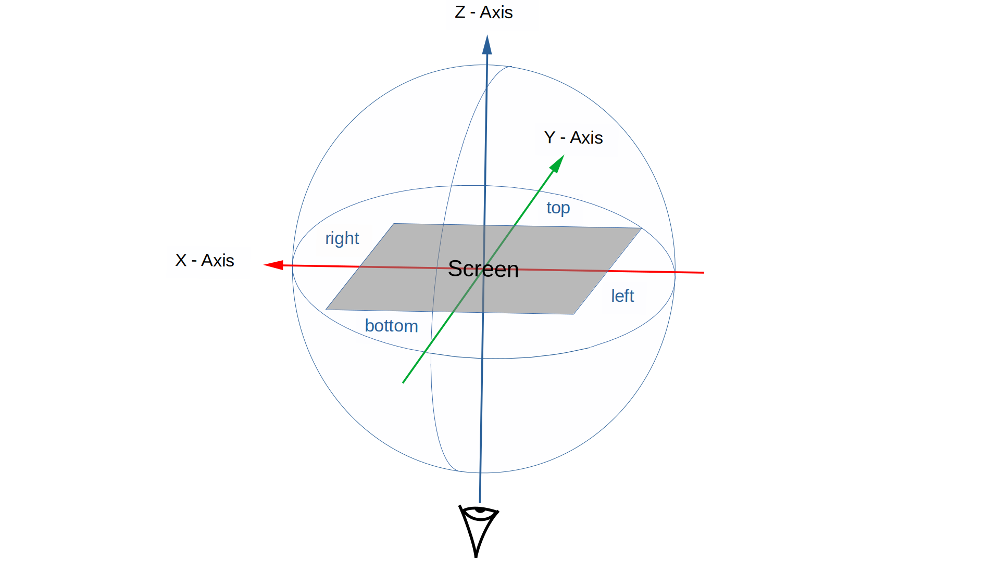

If we were standing at the North Pole, looking straight up, at the right time
of day, the task would be complete. For other views, locations, or times, we need to rotate the *celestial sphere* so that we are
looking at the right part of the sky. This needs four rotations around the x and z axes. The final screen coordinates are derived from the x and y components of these rotated vectors, and stars are only drawn if they are in front of the observer (positive z-values).

The 3D transformation involves four sequential matrix rotations to properly orient the celestial sphere as viewed by the observer:

**Sidereal Time Rotation (around the Z-axis)**

This rotation compensates for the Earth's rotation around its axis. Because the Earth spins once approximately every 23 hours, 56 minutes, and 4 seconds (a sidereal day), the celestial sphere appears to rotate in the opposite direction.   

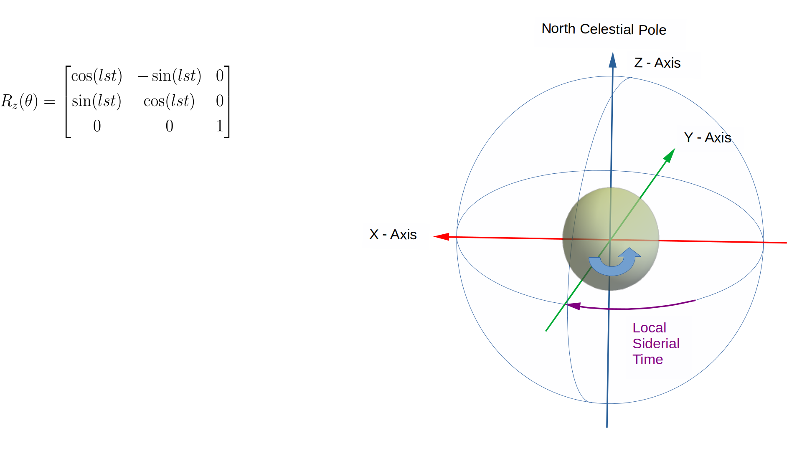

The *Local Sidereal Time (LST)* measures the angle of this rotation relative to the local meridian. It can be calculated from the current UTC time and the observer’s longitude. The process involves subtracting the number of
full rotations since a time when the Earth was in a known position. We use the
J2000 epoch. Once we know this, we can add our local longitude to find the
position of the stars in our location.

.. code:: cpp

 float c_planetarium::greenwich_sidereal_time()
 {
     // Convert UTC to Julian Date and calculate Greenwich Mean Sidereal Time (GMST)

     double ut = observer.hour + observer.min / 60.0 + observer.sec / 3600.0;
     int month = observer.month;
     int year = observer.year;

     if (month <= 2) {
         year -= 1;
         month += 12;
     }

     double a = floor(year / 100.0);
     double b = 2 - a + floor(a / 4.0);

     double jd = floor(365.25 * (year + 4716)) +
                 floor(30.6001 * (month + 1)) +
                 observer.day + b - 1524.5 + ut / 24.0;

     double centuries = (jd - 2451545.0) / 36525.0;

     double gmst = 280.46061837 +
                   360.98564736629 * (jd - 2451545.0) +
                   0.000387933 * pow(centuries, 2.0) -
                   pow(centuries, 3.0) / 38710000.0;

     return fmod(gmst, 360.0);  // Degrees in [0, 360)
 }

 void c_planetarium::local_sidereal_time()
 {
     float gmst = greenwich_sidereal_time();
     lst = fmod(gmst + observer.longitude, 360.0f);
 }

**Latitude Rotation (around the X-axis)**  

This rotation compensates for the observer’s latitude. At the North Pole (latitude +90°), the North Celestial Pole appears directly overhead; at the equator (0° latitude), it lies on the horizon. Rotating the celestial sphere around the X-axis adjusts the view of the star field to simulate this effect.

   .. image:: images/planetarium/rotation2.png

**Azimuth Rotation (around the Z-axis)**  

This rotation adjusts for the compass direction in which the observer is looking. By rotating around the Z-axis, the view can be oriented towards north, east, south, west, or any intermediate direction.

   .. image:: images/planetarium/rotation3.png

**Altitude Rotation (around the X-axis)**  

The final rotation compensates for the elevation angle of the observer’s line of sight. An altitude of 90° corresponds to looking straight up at the zenith, while 0° means looking along the horizon. This rotation adjusts the celestial sphere accordingly.

   .. image:: images/planetarium/rotation4.png

Each of these rotations is expressed mathematically as a 3×3 rotation matrix. These matrices are multiplied together to form a single transformation matrix that is applied to all star coordinates. Although trigonometric functions are needed to generate the transformation matrix this operation only needs to be performed once for each time and location. Once calculated, the transformation matrix is computationally efficient requiring only multiplications and additions and can be rapidly repeated for each of the 10000 stars.

The Bright Star Catalogue also provides magnitude and spectral class. The magnitude is used to determine the visual size of stars, this is represented by changing the size and brightness of the pixels on the screen. The spectral class is represented by the colour which varies through blue, white, and yellow to red.

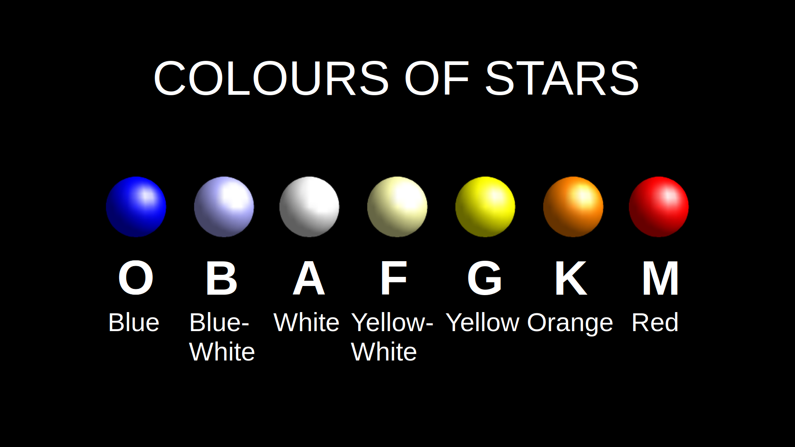

Constellations are overlaid using line segments between the brightest stars in each group. The source data for these connections comes from `Marc van der Sluys <https://github.com/MarcvdSluys/ConstellationLines?tab=readme-ov-file>`__, released under `Creative Commons Attribution 4.0 International (CC BY 4.0) licence <https://creativecommons.org/licenses/by/4.0/>`__. It is stored as coordinate pairs in a header file. These lines are transformed in the same way as the star data.

.. image:: https://i.ytimg.com/vi/3rwerEt2inI/maxresdefault.jpg
  :target: https://www.youtube.com/watch?v=3rwerEt2inI

Constellation names and center points are based on data by `Greg Miller (celestialprogramming.com) <https://www.celestialprogramming.com/snippets/ConstellationCenterPoints/constellationCenterPoints.html>`__ (public domain). These are used for labeling on the star map.

Deep Sky Objects
''''''''''''''''

In addition to stars and constellations, the planetarium displays a selection of popular deep sky objects (DSOs) such as star clusters, nebulae, and galaxies. Like stars, these objects appear to move across the sky with the rotation of the Earth, so their positions can be calculated using the same celestial transformations.

Choosing which DSOs to include is challenging due to their vast number. For this project, I used a curated list from `Eleanor Lutz’s excellent Western Constellations Atlas of Space <https://github.com/eleanorlutz/western_constellations_atlas_of_space/blob/main/data/processed/messier_ngc_processed.csv>`__, which compiles the most well-known Messier and NGC objects. I believe the data was originally obtained from `W.H. Finlay’s Concise Catalogue of Deep-sky Objects <https://link.springer.com/book/10.1007/b97522>`__  `see <https://github.com/eleanorlutz/western_constellations_atlas_of_space?tab=readme-ov-file#bayer-designations-and-messier-objects>`__. The `Western Constellations Atlas of Space <https://github.com/eleanorlutz/western_constellations_atlas_of_space>`__ project is well worth a look.

Each deep sky object’s coordinates are stored similarly to stars and are transformed and rotated to the observer’s viewpoint.

.. image:: https://i.ytimg.com/vi/8Xjfh-coyno/maxresdefault.jpg
  :target: https://youtu.be/8Xjfh-coyno

Planets
'''''''

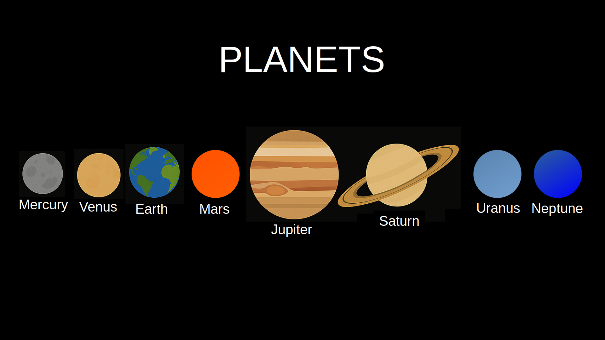

Unlike stars, which can be modeled as fixed points on the celestial sphere, the planets move across the sky as they orbit the Sun. Their positions must be calculated dynamically for the current date and time. 

The orbits of the planets can be calculated using Kepler's equation. A Planet's orbit around the Sun is described by several parameters which describe the size, shape and orientation of an elliptical orbit relative to a reference plane passing through the Sun's equator.

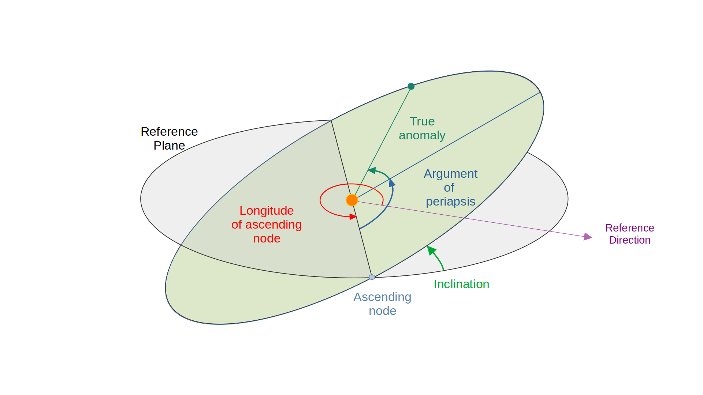

If we also know the orbital period (e.g. the length of a planet's year or a related parameter) and the position of the planet in its orbit at a known point in time (e.g. the J2000 epoch) we can calculate the position of a planet at a future time. 

This Python script doesn't include all the parameters describing the elliptical orbit, but it does give some idea of how the process works.

.. code:: Python

  # Function to solve Kepler's equation
  def kepler_equation(E, M, e):
      return E - e * np.sin(E) - M

  # Define orbital elements for major planets (simplified, at epoch J2000)
  # a = semi-major axis (AU), e = eccentricity, i = inclination (degrees), T = period (days)
  planets = {
      "Mercury": {"a": 0.387, "e": 0.205, "i_deg": 7.0, "T": 88,    "M0_deg": 174.796},
      "Venus":   {"a": 0.723, "e": 0.007, "i_deg": 3.4, "T": 225,   "M0_deg": 50.115},
      "Earth":   {"a": 1.000, "e": 0.017, "i_deg": 0.0, "T": 365,   "M0_deg": 357.517},
      "Mars":    {"a": 1.524, "e": 0.093, "i_deg": 1.9, "T": 687,   "M0_deg": 19.373},
      "Jupiter": {"a": 5.204, "e": 0.049, "i_deg": 1.3, "T": 4333,  "M0_deg": 20.020},
      "Saturn":  {"a": 9.582, "e": 0.056, "i_deg": 2.5, "T": 10759, "M0_deg": 317.020},
      "Uranus":  {"a": 19.20, "e": 0.046, "i_deg": 0.8, "T": 30687, "M0_deg": 142.2386},
      "Neptune": {"a": 30.05, "e": 0.010, "i_deg": 1.8, "T": 60190, "M0_deg": 256.228},
  }

  # Time array for animation (years converted to days)
  t_days = np.linspace(0, 60190, num_frames)

  # Function to compute (x, y, z) positions in 3D from Keplerian elements
  def planet_position(a, e, i_deg, T, M0_deg, t_array):
      n = 2 * np.pi / T
      i_rad = np.radians(i_deg)
      M0 = np.radians(M0_deg)
      x_list, y_list, z_list = [], [], []

      for t in t_array:
          M = M0 + n * t
          M = np.mod(M, 2 * np.pi)
          E = newton(kepler_equation, M, args=(M, e))
          theta = 2 * np.arctan2(np.sqrt(1+e)*np.sin(E/2),
                                 np.sqrt(1-e)*np.cos(E/2))
          r = a * (1 - e * np.cos(E))
          x_orb = r * np.cos(theta)
          y_orb = r * np.sin(theta)
          z_orb = 0
          # Rotate for inclination
          x = x_orb
          y = y_orb * np.cos(i_rad)
          z = y_orb * np.sin(i_rad)
          x_list.append(x)
          y_list.append(y)
          z_list.append(z)
      return np.array(x_list), np.array(y_list), np.array(z_list)

.. image:: https://i.ytimg.com/vi/6WDm4TmXejI/maxresdefault.jpg
  :target: https://youtu.be/6WDm4TmXejI

`Greg Miller's Celestial Programming <https://www.celestialprogramming.com/>`__ has proved to be an excellent resource providing many code examples for astronomical calculations. I adapted the approach used `in this JavaScript example <https://www.celestialprogramming.com/planets_with_keplers_equation.html>`__. It is based on an algorithm described in Chapter 8 of the Explanatory Supplement to the Astronomical Almanac 3rd ed P340. There is a description of the technique `here <https://ssd.jpl.nasa.gov/txt/aprx_pos_planets.pdf>`__. The technique uses the same orbital parameters, but also includes additional terms describing how the parameters change over time, yielding greater precision over a longer timescale.

The function calculates the x, y and z coordinates of each planet relative to the Sun (heliocentric). These are then converted to geocentric coordinates by subtracting the Earth’s position from the planet’s position. After that, the planet’s coordinates are transformed into equatorial coordinates, and then rotated using the same matrix pipeline used for stars.

.. code:: cpp

  convert_to_ra_dec(planet_x-earth_x, planet_y-earth_y, planet_z-earth_z, ra, dec);

Interestingly, since the Earth's position relative to the Sun is known, we also know the Sun's position relative to the Earth!

.. code:: cpp

  convert_to_ra_dec(-earth_x, -earth_y, -earth_z, ra, dec);

.. image:: https://i.ytimg.com/vi/-D5T-8g2Lbg/maxresdefault.jpg
  :target: https://youtu.be/-D5T-8g2Lbg

The Sun, Moon and Planets are represented using actual photographs, however, at this scale they are only a few pixels accross!

The Moon
''''''''

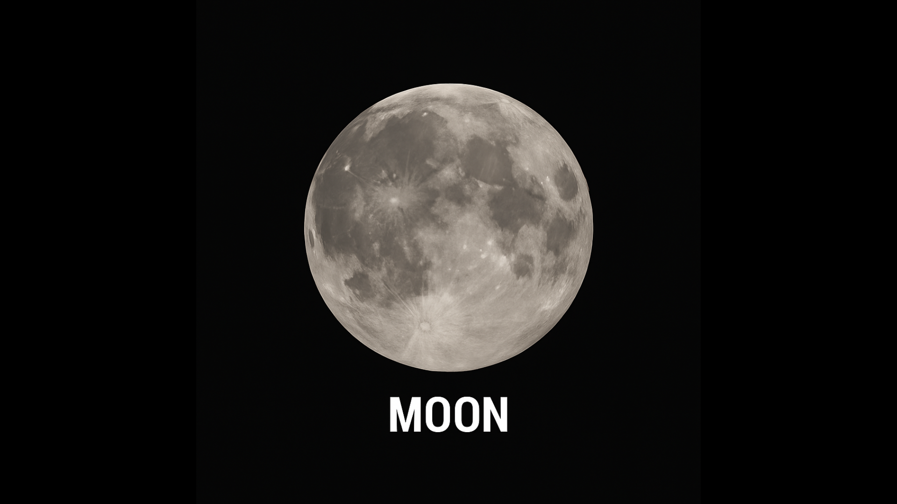

The final touch is to plot the position of the Moon, this time I adapted `this JavaScript example <https://www.celestialprogramming.com/lowprecisionmoonposition.html>`__, based on an algorithm described in Astronomical Almanac page D22 (2017 ed).

.. image:: https://i.ytimg.com/vi/57CUo21NMPE/maxresdefault.jpg
  :target: https://youtu.be/57CUo21NMPE

3d Printed Enclosure
--------------------

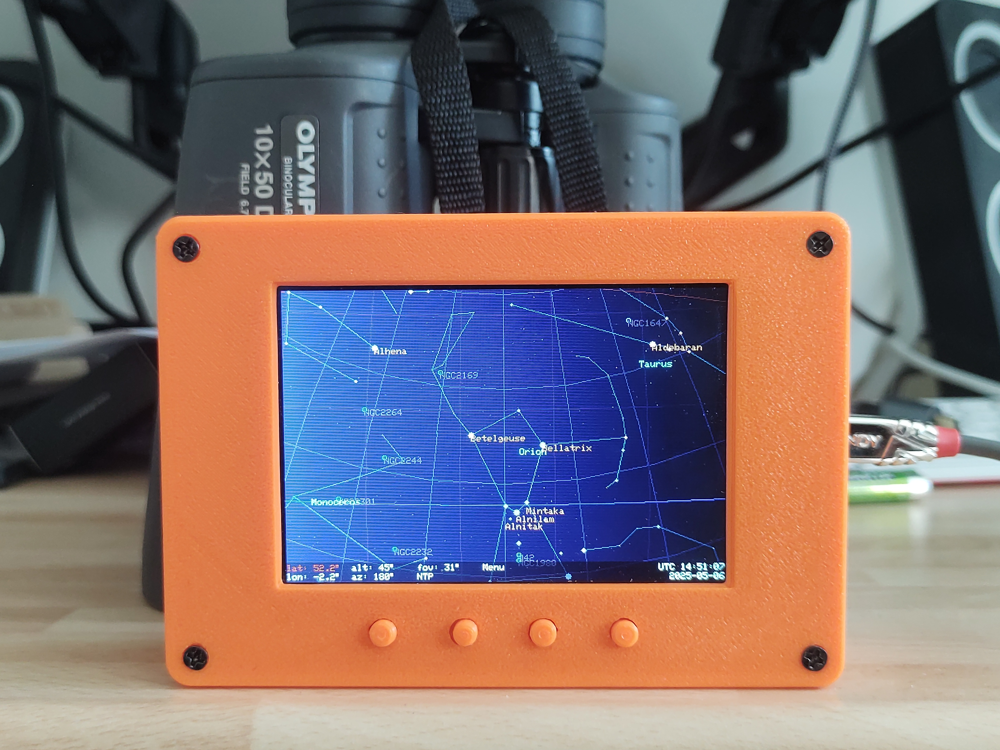

I designed a simple 3d-printed enclosure for the SSTV decoder. The FreeCAD design and STL files can be found `in the github repo <https://github.com/dawsonjon/Pico-Planetarium/tree/main/enclosure>`__.

Conclusion
----------

.. image:: https://i.ytimg.com/vi/-zFnA6QKb48/maxresdefault.jpg
  :target: https://youtu.be/-zFnA6QKb48

The Pi Pico Planetarium is a compact yet capable device that brings the night sky to life in the palm of your hand. It combines real-time astronomy, embedded graphics, and wireless connectivity in a way that is both accessible and extensible.

From displaying over 10,000 stars to tracking planets and rendering the Moon's position, the project demonstrates what’s possible with minimal hardware and thoughtful design. The use of C++ and low-level graphics ensures good performance, while modular code allows for further customization and expansion.

This project has proven to be a rewarding challenge, blending software engineering, astronomy, and electronics. It’s a great tool for learning, teaching, or simply enjoying a more personal connection with the stars.

There is still much room for experimentation—improving the UI, integrating a compass or GPS, or exploring more sophisticated celestial mechanics models. But even in its current form, the planetarium is a powerful and portable stargazing companion.

Whether you’re a beginner learning about the sky, or a maker looking for a satisfying build, this project offers something to inspire and engage.

Useful Links
------------

Here are some references and useful links.

+ `Marc van der Sluys - Contellation Lines <https://github.com/MarcvdSluys/ConstellationLines?tab=readme-ov-file>`__
+ `Greg Miller - Celestial Programming <https:celestialprogramming.com>`__
+ `Eleanor Lutz - Western Constellations Atlas of Space <https://github.com/eleanorlutz/western_constellations_atlas_of_space>`__
+ `Jet Propulsion Laboratory - Approximate Positions of the Planets <https://ssd.jpl.nasa.gov/txt/aprx_pos_planets.pdf>`__
+ `Bright Star Catalog <http://tdc-www.harvard.edu/catalogs/bsc5.html>`__
+ `WiFi Manager Pico <https://github.com/mthorley/wifimanager-pico>`_
