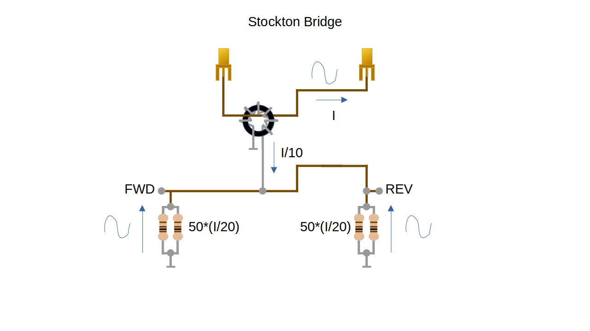
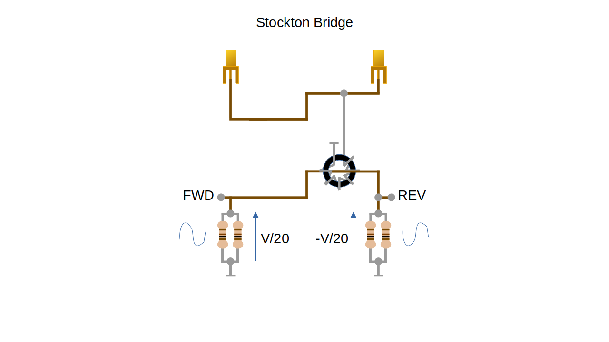
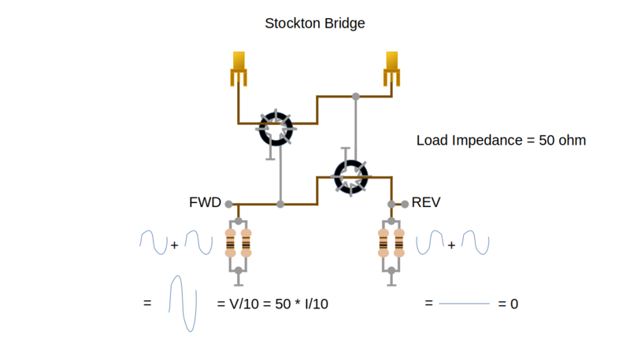
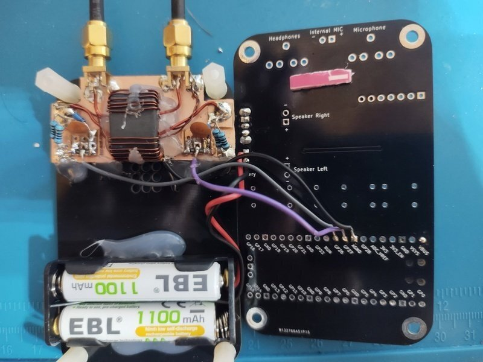
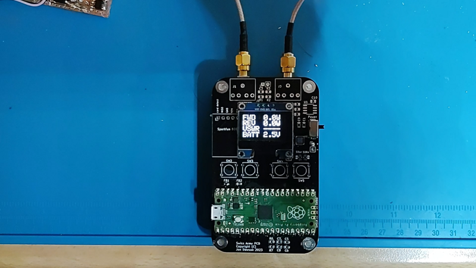
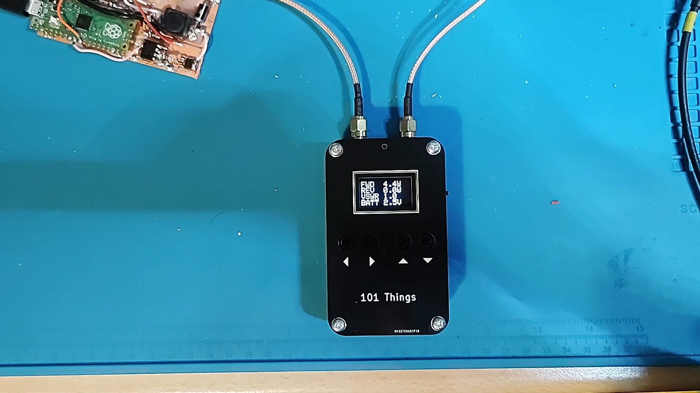

Power and SWR Meter
===================

.. image::  images/power_meter_thumbnail.png
  :target: https://youtu.be/_b22atCT8KU

Up until now, I have been measuring the output power of QRP transmitters using
an oscilloscope to measure the RMS voltage across a dummy load. Assuming that
the signal is a sinusoid and that the dummy load is 50 ohms, it is possible to
convert the RMS voltage into a power level. I printed out a `handy cheat sheet <https://github.com/dawsonjon/101Things/tree/master/20_power_swr_meter/powers.pdf>`_
to quickly convert from RMS voltage to power. Still, there is no substitute for
a dedicated RF power meter,  it gives a quick and easy power measurement in
Watts. While we are at it, we might as well build a power and SWR meter. As well
as measuring the power, the SWR meter indicates how well the
impedance of the antenna is matched transmitter. Achieving a good
impedance match not only maximises the power transferred to the antenna but
also helps to prevent damage that might occur when a transmitter drives an
incorrect load.

The project is built using a Pi-Pico and other parts I keep in my junk box. The
ubiquitous SSD1306 display, a couple of hand-wound transformers, a couple of
diodes and a handful of resistors and capacitors.

Although I have used a Pi-Pico in my design, you could easily build an
RF power meter using any microcontroller and display. 

Hardware
--------

.. image:: images/power_meter_schematic.svg

Stockton Bridge
'''''''''''''''

The heart of the design is a `Stockton Bridge <https://www.sm7ucz.se/Meters/Stockton_pwr_meter.pdf>`_. 
The Stockton Bridge is a "bidirectional inline wattmeter" that sits between the
transmitter and the load and gives an indication of the forward and reflected
power. From the forward and reflected power, it is possible to calculate the
VSWR. When I first came across the Stockton Bridge its workings seemed very
mysterious. How could it distinguish between the forward and reflected power?

It turns out that the Stockton Bridge is measuring the impedance of the load by
sampling the voltage and current at a single point. In a perfectly matched
system, the output impedance of the transmitter will match the input impedance
of the load and the characteristic impedance of the transmission line
connecting them. Under these conditions, all of the power generated by the
transmitter will be transferred to the load. Most transmitters and antennas
have a 50 ohm impedance.

The bridge consists of two transformers, a current transformer and a
voltage transformer. These transformers generate a sample of the current and
voltage, in our case 1 tenth of the current and 1 tenth of the voltage.

The current sample is split into two branches, each taking half the current
sample. In each branch, the current is passed through a resistor with a known
value of 50 ohms (the system impedance). The voltage across each resistor
50*I/20.

The voltage sample is applied across the two branches such that the forward
branch sees a positive signal V/20 while the reverse branch sees -V/20.

When the current and voltage waveforms are superimposed, the samples are added
in the forward branch and subtracted in the reverse branch. When the load is a
resistor of exactly 50 ohms, then I = V/50. Under these conditions, the current
and voltage samples in the forward branch add to give V/10 and in the reverse
branch cancel completely.

When the load is not exactly 50 ohms, the voltage and current samples in the
forward branch will add to less than V/10 and the voltage and current waveforms
in the reverse branch will not completely cancel. An inductive or capacitive
load will result in a phase difference between the current and voltage waveform
which has a similar effect.

Although we are measuring the voltage and current at a single point, the
the behaviour of the forward and reverse branches in the Stockton Bridge is
analogous to the behaviour of the incident and reflected waves in a transmission
line. When a transmission line is terminated with its characteristic impedance, no
reflections occur and all the power is transferred to the load. However when
the termination of the characteristic impedance is not a perfect match, some of
the power is reflected causing standing waves in the transmission line as the
reflected wave interferes with the forward wave.

The forward and reverse voltages can be measured using detector diodes and from
these measurements, the forward and reverse power can be calculated. From these
powers, it is also possible to calculate the Voltage Standing Wave Ratio (VSWR).
For practical purposes, the VSWR can simply be treated as a figure of merit
indicating how well the load is matched to the transmitter. Less than 2 is a
"good" match and 1 is a "perfect" match.

For the designs I'm working on, I'm trying to measure powers of about 5W, but I
would like to leave a little headroom. At 5W, the peak voltage into a 50 ohm
load would be 22V, and with a turns ratio of 10:1 would output 2.2V. This is then passed
through a potential divider with a gain of 0.5 presenting 1.1V to the ADC. This
gives a reasonable amount of headroom and an input of 10W would be a reasonable
maximum.

We could have used a turn ratio of 20:1 and eliminated the potential divider.
The downside of this approach is that the voltage drop in the detector diode
would become more significant reducing accuracy.

Swiss Army PCB
'''''''''''''''

For this project, I used my usual Swiss Army PCB as the starting point, it
provides a convenient enclosure for the Pi-Pico with a space for mounting the
OLED display.

Details of the Swiss-Army-PCB can be found `here <https://github.com/dawsonjon/101Things/blob/master/PCB/swiss%20army%20pcb/things.pdf>`_.

Components excluded:

- Micro SD card,
- Microphone preamplifier
- Microphone/headphone sockets
- Audio amplifier
- Push buttons

Components retained:

- OLED Display
- Pi-Pico

Additional components:

- Stockton Bridge

The Stockton Bridge itself is built using a small piece of copper-clad PCB with
a couple of SMA connectors for the transmitter and load. I started off using a
pair of FT50-43 ferrite cores but found that they didn't fit inside the
Swiss-army PCB enclosure. I replaced them with an unknown binocular core from
my junk box.

If you were going to purchase a binocular core, `G8GYW <https://g8gyw.github.io/>`_ 
uses a BN-43-202 in his design which looks ideal.

I opted to build a hand-held device using a couple of AAA batteries to power the
Pi-Pico. If using battery power, it is necessary to remove D1 from the Pi-Pico.
Alternatively, the batteries could be omitted and the Pi-Pico could simply be
powered through the USB connector.

Software
--------

Here is the C++ code along with a pre-built firmware image available for
download over USB.

- `C++ Code for Pi-Pico <https://github.com/dawsonjon/101Things/tree/master/20_power_swr_meter>`_
- `Pico Firmware <https://github.com/dawsonjon/101Things/blob/master/build/20_power_swr_meter/power_swr_meter.uf2>`_

I opted to design the software in C++ using the Pi-Pico SDK. This is by no
means the only choice, the software is very simple and doesn't need much memory
or CPU. This would be an ideal project to build using `MicroPython <https://micropython.org/>`_ 
or your favourite programming language.

The software reads the fwd and reverse voltages from the ADC, and the raw ADC value
is converted into a voltage taking into account the turns ratio and voltage
divider. The voltage is then filtered using a first-order IIR filter.

.. code:: cpp

    // smoothing filter
    fwd_adc_volts = (0.9 * fwd_adc_volts) + (0.1 * read_adc_volts(fwd_adc));
    rev_adc_volts = (0.9 * rev_adc_volts) + (0.1 * read_adc_volts(rev_adc));
    batt_adc_volts = (0.9 * batt_adc_volts) + (0.1 * read_adc_volts(batt_adc));

By default, the voltage reference in the Pi-Pico is taken from the 3.3v supply.
It is possible to use an external shunt reference to provide greater accuracy,
but I didn't have one to hand. I also don't have access to a more accurate
power reference, to calibrate against. I settled for using a DVM to measure the
forward and reverse detector voltages and compared these to the reported
voltages. (I output the uncorrected measurements to the USB serial port for
this purpose.). By comparing the voltages at two power levels I was able to
apply a linear correction so that the DVM and reported values agree closely.

By making measurements at two power levels, we can calculate the gradient and
intercept. This takes account of any error in the ADC reference voltage and the
resistors in the potential divider.

.. code:: cpp

  // Measure fwd power using DMM at 2 power levels, compared with reported value
  // calculate gradient and intercept
  //  y      x
  // Vfwd  Vfwd_adc
  // 1.583 1.572
  // 0.831 0.838

  const float y1 = 0.831; // measured values
  const float y2 = 1.583;
  const float x1 = 0.838; // reported values
  const float x2 = 1.572;

  const float m = (y2 - y1) / (x2 - x1);
  const float c = y1 - (m * x1);

Once the gradient and intercept are known, the corrected voltage can be found
from the ADC voltage.

.. code:: cpp

    //Apply calibration correction and scaling
    const float fwd_corrected_peak_voltage =
        m * (fwd_adc_volts * adc_scale) + c;
    const float rev_corrected_peak_voltage =
        m * (rev_adc_volts * adc_scale) + c;

We then need to compensate for the voltage drop in the detector diodes which
can be obtained from the datasheet. For small input voltages, the detector
voltage may be less than the diode drop. Unless we see a non-zero voltage at
the ADCs we might as well assume that the RF power is zero, avoiding the need
to divide by zero. It is then a simple matter to calculate the forward and
reflected power assuming a 50 ohm impedance.

.. code:: cpp

    // convert ADC voltage to RF pk-pk voltage
    const float fwd_pk_pk_volts =
        (fwd_corrected_peak_voltage + diode_drop_volts) * turns_ratio * 2.0f;
    const float rev_pk_pk_volts =
        (rev_corrected_peak_voltage + diode_drop_volts) * turns_ratio * 2.0f;
    const float batt_volts = 12.0 * batt_adc_volts;

    // convert RF pk-pk voltage into power assuming 50ohms
    const float fwd_power_watts =
        (fwd_adc_volts * adc_scale) > 0.1
            ? (fwd_pk_pk_volts * fwd_pk_pk_volts) / 400.0f
            : 0.0f;
    const float rev_power_watts =
        (rev_adc_volts * adc_scale) > 0.1
            ? (rev_pk_pk_volts * rev_pk_pk_volts) / 400.0f
            : 0.0f;

From the forward and reflected power the VSWR can be calculated.

.. code:: cpp

    // calculate VSWR
    const float reflection_ratio = sqrt(rev_power_watts / fwd_power_watts);
    const float vswr = (1.0f + reflection_ratio) / (1.0f - reflection_ratio);

From the forward and reflected power the VSWR can be calculated.

I have kept the user interface very simple, I simply write the forward power,
reflected power, SWR and battery voltage to the OLED display using the largest
font that fits.

.. code:: cpp

    ssd1306_clear(&disp);
    char line[23];
    snprintf(line, 22, "FWD  %3.1fW", fwd_power_watts);
    ssd1306_draw_string(&disp, 0, 0, 2, line);
    snprintf(line, 22, "REV  %3.1fW", rev_power_watts);
    ssd1306_draw_string(&disp, 0, 16, 2, line);
    if (fwd_power_watts == 0) {
      snprintf(line, 22, "VSWR ----", vswr);
    } else {
      snprintf(line, 22, "VSWR %3.1f", vswr);
    }
    ssd1306_draw_string(&disp, 0, 32, 2, line);
    snprintf(line, 22, "BATT %3.1fV", batt_volts);
    ssd1306_draw_string(&disp, 0, 48, 2, line);
    ssd1306_show(&disp);

I use this `SSD1306 <https://github.com/daschr/pico-ssd1306>`_ library in my
C++ projects, but the display is fairly ubiquitous and is supported by most
development environments.

Testing
-------

In use the power meter gives reasonably accurate results, and it agrees well
with the oscilloscope-based measurements. It is much more convenient than the
oscilloscope, giving instant results with no calculations. With a Pi-Pico and a
few other junk-box parts, I have built a handy new piece of test equipment for
the lab!

Useful Links
------------

Here are some useful links about Stockton Bridge power meters.

- `Stockton Bridge <https://www.sm7ucz.se/Meters/Stockton_pwr_meter.pdf>`_. 
- `G8GYW <https://g8gyw.github.io/>`_
- `Owen Duffy <https://owenduffy.net/blog/?p=9138>`_
- `KK5JY <http://kk5jy.net/swr-meter-v1/>`_
- `K6JCA <https://k6jca.blogspot.com/2015/01/notes-on-directional-couplers-for-hf.html>`_

