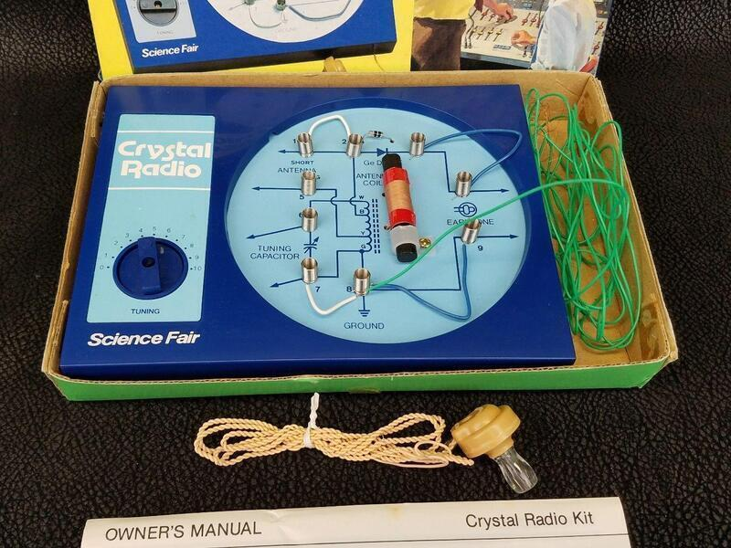
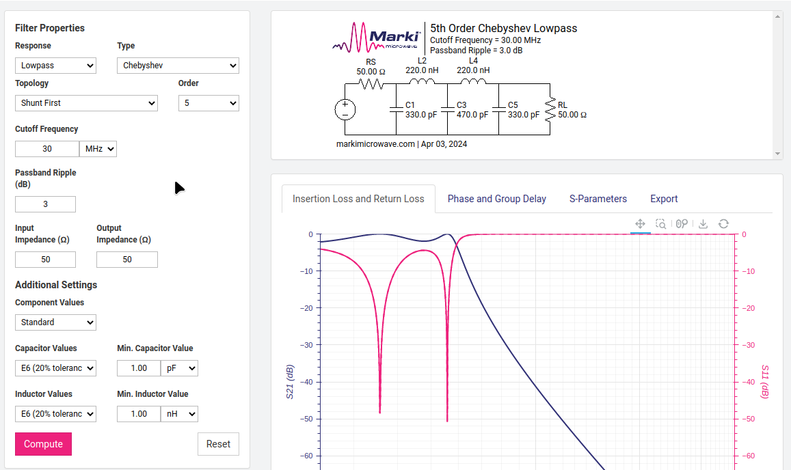
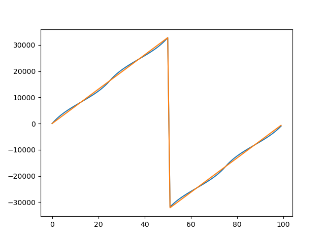
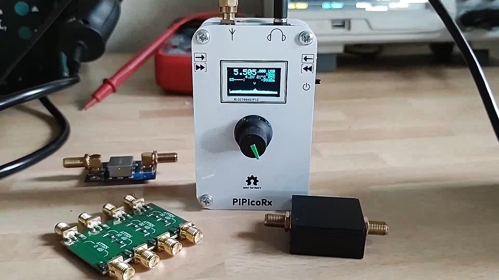
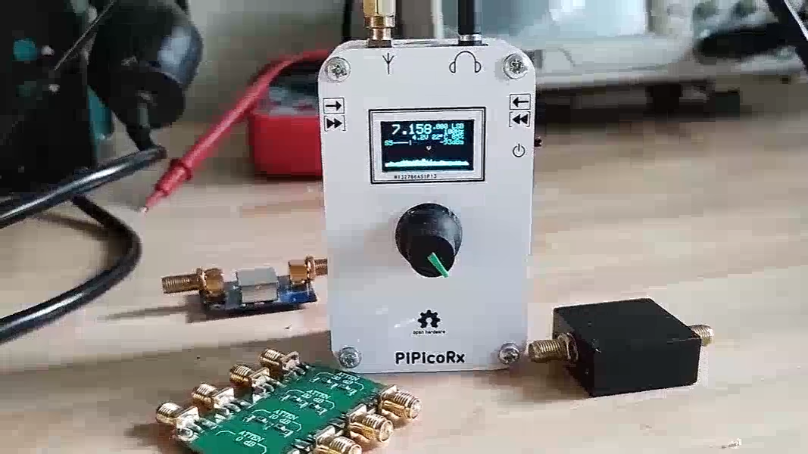
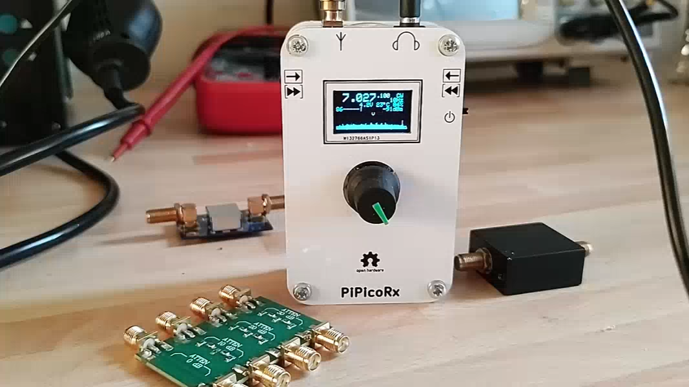

Pi Pico Rx - A crystal radio for the digital age?
=================================================

My first step into the world of electronics was with a crystal radio, just like this one. 

Back then, I don't think it has ever occurred to me that I could make a radio
myself, so I wasn't expecting it to work. But when I put the earphone in, I was
amazed to hear very faint sounds coming through. I couldn't believe that
building a radio could be so simple, and the best part was, it didn't need any
batteries! That little experience sparked my interest in electronics.

Times have certainly changed since then, and today, we find ourselves in a
golden age for electronics enthusiasts. Back in the ninteen eightees, I could
have never imagined that my pocket money would one day buy a device with
computing power that could have filled an entire room just a few decades ago.

I often wonder how we can still capture that sense of awe and excitement from
my first crystal radio experience. Is it still possible to create something
simple yet captivating? 

The Pi Pico Rx - may be the answer to that question. While it may not be quite
as straightforward as the crystal radio, the Pi Pico Rx presents a remarkably
simple solution. Armed with just a 
`Raspberry Pi Pico <https://www.raspberrypi.com/products/raspberry-pi-pico/>`__, 
an analogue switch, and an op-amp, we now have the power to construct a capable
SDR receiver covering the LW, MW, and SW bands. With the ability to receive
signals from halfway around the globe. I can't help but think that my younger
self would have been truly impressed!

If you are interested in a simpler version that can be built on a breadboard using mostly through-hole components, checkout the breadboard version
`here <https://101-things.readthedocs.io/en/latest/breadboard_radio.html>`_. 

.. image:: images/breadboard_radio_schematic.svg

Features
""""""""

+ 0 - 30MHz coverage
+ 250kHz bandwidth SDR reciever
+ CW/SSB/AM/FM reception
+ OLED display
+ simple spectrum scope
+ Headphones/Speaker
+ 500 general purpose memories
+ runs on 3 AAA batteries
+ less than 50mA current consumption

Pi Pico Rx
----------

.. image:: images/thumbnail5.png
  :target: https://github.com/dawsonjon/PicoRX/assets/717535/4846c78d-21c3-42e8-bcdf-278cc2bdadcb

Pi Pico Rx is a minimal SDR receiver based around the `Raspberry Pi Pico <https://www.raspberrypi.com/products/raspberry-pi-pico/>`__. 
The design uses a “Tayloe” Quadrature Sampling Detector (QSD) popularised by
`Dan Tayloe <https://www.norcalqrp.org/files/Tayloe_mixer_x3a.pdf>`__.
And used in *many* HF SDR radio designs. This simple, design allows a
high-quality mixer to be implemented using an inexpensive analogue
switch.

.. image:: https://raw.githubusercontent.com/wiki/dawsonjon/PicoRX/images/QSD.png

A quadrature oscillator is generated using the PIO feature of the
RP2040. This eliminates the need to use an external programmable
oscillator. Without overclocking the device this supports frequencies up
to about 30MHz, conveniently covering the LW, MW and SW bands.

The IQ output from the QSD is amplified using a high-speed, low-noise
op-amp. The I and Q channels are sampled by the built-in ADC which
provides 250kHz of bandwidth. The dual-core ARM Cortex M0 processor
implements the Digital Signal Processing algorithms, demodulating AM,
FM, SSB and CW to produce an audio output.

Audio output is provided using a PWM followed by a low-pass filter. At
first, I used an LM386 audio amplifier, but later found that with a
suitable current limiting resistor the IO pin could easily drive a pair
of headphones or even a small speaker directly.

A cobbled-together prototype proves that it is possible to build an HF
SDR receiver using a Pi Pico, an analogue switch, an op-amp and a
handful of discrete components.

Other SDR Receivers
"""""""""""""""""""

This isn’t a new idea by any means, there are loads of SDR designs out
there. Some use a PC soundcard, others use a built-in CPU for the SDR.
The uSDX project even does the DSP processing using an 8-bit micro! I
have put a list of links to some of the other projects that have
inspired me. Each of these projects introduces new ideas and
innovations. I hope that the Pi Pico Rx has introduced some of its own
evolutionary developments that might inspire others with their designs.

-  `softrock SDR <https://www.wb5rvz.org/>`__
-  `QRP Labs <https://www.qrp-labs.com/receiver.html>`__
-  `mcHF <http://www.m0nka.co.uk/>`__
-  `elecraft KX3 <https://elecraft.com/products/kx3-all-mode-160-6-m-transceiver>`__
-  `usdx <https://github.com/threeme3/usdx>`__
-  `(tr)uSDX <https://dl2man.de/>`__
-  `uSDR-pico <https://github.com/ArjanteMarvelde/uSDR-pico>`__
-  `compact-si5351-based-sdr <https://circuitsalad.com/2020/01/06/compact-si5351-based-sdr/>`__
-  `qex <https://www.arrl.org/files/file/Technology/tis/info/pdf/020708qex013.pdf>`__
-  `Teensy-Convolutional SDR <https://github.com/DD4WH/Teensy-ConvolutionSDR>`__

Continuing in the spirit of knowledge sharing, I have attempted to
describe the finer details of the hardware and software in this wiki,
starting here with an overview of the new features introduced by the Pi
Pico Rx that I haven’t seen before in other designs.

Sampling IQ data using a round-robin ADC
""""""""""""""""""""""""""""""""""""""""

One of the challenges I faced was sampling IQ signals using an ADC that
is only capable of sampling one channel at a time. It can be configured
in a round-robin mode that samples I and Q alternately. I had worried
that this might create a phase imbalance between the I and Q channels. I
needn’t have worried, it turns out that there is a simple way to recover
a complex signal with 250kHz bandwidth by sampling I and Q alternately
at 500kSample/s.

The trick is to low pass filter the I and Q data leaving 250kHz of
bandwidth from -125kHz to 125kHz. The QSD detector itself forms a
low-pass filter, so this can easily be achieved by selecting suitable
capacitor values in the op-amp. The ADC is configured to sample I and Q
alternately (starting with I). In the software, the “missing” values can
be replaced by zeros.

.. image:: https://raw.githubusercontent.com/wiki/dawsonjon/PicoRX/images/round-robin-complex.png

This results in a complex signal with a sampling rate of 500KS/s. The
central half of the spectrum from -125kHz to 125kHz contains the
spectrum we want. The outer half of the spectrum from -250kHz to -125kHz
and 125kHz to 250kHz contains reflections of the central half. To
recover the original spectrum, we simply need to low-pass filter the
signal so that we retain the central section. We could then reduce the
sample rate to 250kHz. In our application, we filter out only a very
small section of the spectrum containing the signal of interest, we
don’t need to take any additional steps to remove the reflections.

Why does this work?
"""""""""""""""""""

To understand why this works, it helps to think about how we could have
converted the signal into a real (rather than complex IQ) signal and
sampled it using a single-channel ADC. This is one of the approaches I
had originally considered taking. I only realised that there was an
easier way once I worked the problem through. This was my thought
process.

.. image:: https://raw.githubusercontent.com/wiki/dawsonjon/PicoRX/images/frequency_shift_real.png

To satisfy Nyquist, we need to filter the complex data so that all our
signals sit between -125kHz and 125kHz. We could then shift the data up
by 125kHz so that our signals are between 0 and 250kHz. The frequency
shift is 1/4 of the 500KSample/second sample rate. A frequency shift by
Fs/4 can be implemented by rotating the signal by 1/4 turn in each
sample. This doesn’t need any multiplication, only negation.

Since our signal now only contains positive frequencies, the imaginary
(Q) part of the signal doesn’t contain any useful information and we can
throw it away. A signal containing only real (I) values has a
symmetrical spectrum, discarding the imaginary samples introduces
negative frequency reflections of the positive frequency signals.

The real signal can now be sampled with a single-channel ADC at
500kSamples/s. The frequency shift could have been implemented in
hardware using a simple mixer, but we only need I and Q samples
alternately, so we could use a round-robin ADC to capture the alternate
I and Q samples and implement the mixer in software, negating I and Q
when necessary.

Once we have the real signal in the software, we might like to convert
the real signal back to a complex one. We could use a Hilbert transform,
this would filter out the negative frequencies leaving a complex signal
with an asymmetrical spectrum containing only positive frequencies from
0 to 250kHz.

Another approach would be to shift the frequencies down by 125kHz
leaving the original spectrum from -125kHz to 125kHz, now with
reflections in the outer half of the spectrum. These could be removed
with a low-pass filter. We can take the same approach to the Fs/4
frequency shift, this time rotating 1/4 turn each sample in the opposite
direction.

Inspecting the resulting samples, we can see that the downwards
frequency shift has cancelled out the negations we performed during the
upwards frequency shift, leaving us with the alternating I/Q samples we
originally captured.

Conveniently, it turns out, the alternating IQ samples captured from the
round-robin ADC were the only samples we needed to fully capture the
central half of the frequency spectrum. The “missing” samples only
contributed to the outer part of the spectrum that we had already
filtered out.

Creating Quadrature Oscillator Using PIO
""""""""""""""""""""""""""""""""""""""""

The pi pico is based on the
`RP2040 <https://www.raspberrypi.com/documentation/microcontrollers/rp2040.html>`__
microcontroller. The PIO is a novel feature of the RP2040. Programmable
State Machines (like small microprocessors) can be configured to offload
IO functions from the software. It is fairly simple to configure a PIO
state machine to output a quadrature oscillator on 2 IO pins. Once
configured the Oscillator runs autonomously without software
intervention, not placing any further load on the CPU.

The PIO program is remarkably simple:

.. code::

       .program nco
       set pins, 0
       set pins, 1      ; Drive pin low
       set pins, 3      ; Drive pin high
       set pins, 2      ; Drive pin low

The frequency of the NCO can be programmed using the PIO clock divider.
This has a 16-bit integer and an 8-bit fractional part. With an input
clock of 125MHz, the NCO can be programmed from a few hundred Hz to just
over 30MHz. Perfect for an LW/MW/SW receiver.

At low frequencies, a good resolution can be achieved, but at high
frequencies, the step size can be more than 100kHz. However, with a
bandwidth of 250kHz, that is still enough to give continuous coverage of
the whole frequency range. To compensate for the coarse frequency
resolution in the oscillator, a high-resolution frequency shifter is
implemented in the software. (The 32-bit phase accumulator has a
theoretical resolution of a little over 0.0001 Hz which should be
ample.)

Hardware Design
---------------

The design aim for the hardware is to make the design as simple and
cheap as possible without compromising the performance too much. I have
designed a PCB that expands on the basic concept to include a
preamplifier and a bank of low-pass filters. To check out the details
you can look at the `full Schematics in pdf format <https://github.com/dawsonjon/PicoRX/raw/master/PCB/pico_rx/pipicorx.pdf>`__,
but I will walk through some of the details here.

Raspberry Pi Pico
"""""""""""""""""

The heart of the receiver is a Raspberry Pi Pico. The onboard ADC
samples at 500kSamples/s giving us 250kHz of bandwidth. The 12-bit ADC
has a theoretical dynamic range of 72 dB, but it won’t be that good in
reality. An SSB signal only needs 2.5kHz of bandwidth. We can exchange
our excess bandwidth for increased dynamic range improving the overall
sensitivity. An oversampling ratio of 100 gives us an extra 20dB,
equivalent to adding 3 extra bits. This gives a theoretical dynamic
range of 92dB in SSB mode. The ADC has an input range of 0 to 3.3V. With
no amplification, that represents a range of -78 dBm to 14 dBm.

.. image:: https://raw.githubusercontent.com/wiki/dawsonjon/PicoRX/images/raspberry_pi_pico.png

The Raspberry Pi Pico has an onboard switched mode regulator, which
allows the Pico to be easily powered by batteries. This design uses
3xAAA batteries. It is possible to add additional external components to
the pi pico to allow the device to be powered from batteries, or the USB
power supply. This design is primarily intended to be a portable
standalone radio, with the USB connection providing the ability to
program the flash. To avoid the need to add additional components, I
opted to remove D1 from the pico instead. This prevents the possibility
of contention between the USB supply and the batteries.

User Interface
""""""""""""""

There isn’t anything particularly unusual about the user interface. A
128x64 OLED display uses an ssd1306-based I2C interface. These are
fairly ubiquitous these days and have replaced the HD44780 as the go-to
cheap/simple display. The I2C interface certainly helps reduce the pin
count. Cost is a key driver, I could have replaced the rotary encoder
with a pair of push buttons to save cost, but I think this would be a
step too far. It wouldn’t feel like a radio without a proper tuning
knob. Ideally, I would have liked to use something a bit more compact, a
thumbwheel-based rotary encoder mounted on one edge would have been
ideal. Although there do seem to be some around, they seem to be quite
hard to find.
`This <https://thepihut.com/products/ano-directional-navigation-and-scroll-wheel-rotary-encoder?variant=40602738294979&currency=GBP&utm_medium=product_sync&utm_source=google&utm_content=sag_organic&utm_campaign=sag_organic&gclid=CjwKCAjw8ZKmBhArEiwAspcJ7rsKIv2ios_qeXYeiaTvd2Sy5ZoNwu6wMn-wy0BhmLKbxDeurRXSTBoCXMEQAvD_BwE>`__
directional navigation scroll wheel also caught my eye, but in the end,
cost won out and I went with a standard encoder.

.. image:: https://raw.githubusercontent.com/wiki/dawsonjon/PicoRX/images/user_interface.png

PWM audio
"""""""""

At first, I considered using an LM386 (or similar) audio amplifier to
drive the headphones or a small speaker. It turns out that the PWM is
perfectly capable of driving headphones or a small speaker directly. A
100uF capacitor blocks DC, the larger the capacitance the better the DC
response, but in this application 100uF is probably overkill. The RP2040
has a maximum drive strength of 12mA. The 100-ohm resistor serves as a
current limiting resistor and one-half of an RC low-pass filter. With a
peak voltage of 1.65v, and assuming an internal resistance of about 40
ohms, the maximum current into a 32-ohm load is
``1.65/(100+40+32) = 9.5mA`` and with an 8-ohm load is
``1.65/(100+40+8) = 11.1mA``.

.. image:: https://raw.githubusercontent.com/wiki/dawsonjon/PicoRX/images/pwm_audio.png

If a better speaker were needed, the
`TPA2012 <https://www.ti.com/lit/ds/symlink/tpa2012d2.pdf?ts=1690654596617&ref_url=https%253A%252F%252Fwww.google.com%252F>`__
looks like the ideal modern replacement for the LM386, and would be
ideal for battery-powered applications. The output also works well with
PC speakers, but watch out for the drive level being significantly
higher than the usual 100mV pk-pk.

QSD Detector (Tayloe Detector)
""""""""""""""""""""""""""""""

The design uses a “Tayloe” Quadrature Sampling Detector (QSD)
popularised by [Dan Tayloe](The design uses a “Tayloe” Quadrature
Sampling Detector (QSD) popularised by `Dan Tayloe <https://www.norcalqrp.org/files/Tayloe_mixer_x3a.pdf>`__.
It is used in many SDR receivers, and for good reason. In this design,
the select inputs to the analogue switch are driven directly by the
Raspberry Pi Pico, the PIO feature of the RP2040 is capable of
generating a quadrature oscillator at frequencies up to 30MHz without
software intervention. The resistor values have been chosen to give a
gain of 1000 or 60 dB. This gives a theoretical input range at the input
to the QSD of -138 dBm to -46 dBm. The capacitor values have been chosen
to give a cut-off frequency of about 60kHz and a bandwidth of 120kHz.
QSD is effectively acting as the anti-aliasing filter, so a degree of
oversampling helps. The gain and bandwidth requirements require a fast
op-amp. The LT6231 is a popular choice in this type of SDR because of
its low noise, it is fast enough to cope with the larger bandwidth used
in this design compared to most SDRs. The newer LTC6227 op-amp is
recommended for new designs and is even better.

.. image:: https://raw.githubusercontent.com/wiki/dawsonjon/PicoRX/images/tayloe_detector.png

One potential weakness of this design is the potential of aliasing in
the ADC. This isn’t an issue for SDRs that use sound cards or audio
ADCs, they usually include very good antialiasing filters. A potential
improvement would be to include an active low-pass filter. This could
make use of a more basic (and cheaper) op-amp. There is also a potential
to save cost by cascading several cheaper op-amps sharing the gain
between them, the gain bandwidth product at each stage could be much
lower, and the noise performance of the later amplifiers is less
critical.

Low Pass Filters
""""""""""""""""

The Tayloe detector uses a switch rather than an analogue mixer, this
gives similar behaviour to mixing the incoming RF with a square wave.
This means that the QSD is sensitive to signals at odd harmonics of the
fundamental, the strongest of which is at 3 times the tuned frequency.
This design employs low-pass filters to strongly attenuate the odd
harmonics. A bank of 5 filters covers the frequency range from 1MHz to
30MHz. The bands each cover an octave, in the 1MHz to 2 MHz band, a
cutoff frequency of 2MHz attenuates the third harmonic which could be
between 3MHz and 6MHz. As the frequency increases, the width of the band
can be doubled, so the range from 1MHz to 30MHz can be covered with 5
filters. To cover the full LW and MW range, I would have needed at least
3 more filters, this seems excessive considering the limited number of
stations in this part of the spectrum, so I decided to just live with
the possibility of interfering at odd harmonics in this range. There is
no reason why an additional filter couldn’t be added by a user
interested in these bands, it could even be built into a magnetic loop
or ferrite antenna.

.. image:: https://raw.githubusercontent.com/wiki/dawsonjon/PicoRX/images/low_pass_filters.png

There are a few online tools that can be used to calculate the filter values, I used `this one. <https://markimicrowave.com/technical-resources/tools/lc-filter-design-tool/>`_

In practice, strong local AM stations can cause interference, since
these tend to be at lower frequencies the low-pass filters do little to
attenuate them. Bandpass filters would have given a better performance.
I found that fitting an external AM band-stop filter greatly improved
the performance in the SW frequency bands.

I measured the filter response using a
`nanovna <https://nanovna.com/>`__. This takes a lot of guesswork out of
the design. I made a direct connection to the filters having partially
assembled the PCB.

.. image:: https://raw.githubusercontent.com/wiki/dawsonjon/PicoRX/images/nanovna.jpg

This one has the desired 4MHz cutoff frequency and an attenuation of
more than 60dB in the stop band. In the pass band, there is an insertion
loss of about 10 dB. This gives a theoretical power range of around -128
dBm to -36 dBm.

.. image:: https://raw.githubusercontent.com/wiki/dawsonjon/PicoRX/images/nanovna.png

Preamplifier
""""""""""""

In a LW/MW/SW band there are high levels of atmospheric noise. Arguably,
a preamplifier isn’t necessary. If we could achieve the theoretical
range of -128 dBm to -36 dBm, that would give us all the sensitivity we
need. In practice, the ADC has internal noise of about 20dB. An MDS of a
little better than -100dBm might be a more realistic figure.

A good rule of thumb is that the receiver should be able to “see” the
antenna noise to give the best chance of resolving weak signals. A good
way to check this is to look for a rise in the noise floor of about an
s-point when connecting the antenna.

With a loft-mounted wire antenna, I found that the receiver was
sensitive enough. For portable use, however, a more compact antenna is
desirable. I had good results with a
`youloop <https://airspy.com/youloop/>`__ antenna, but I needed to add a
low-noise amplifier to get good results. I used a typical 20dB
MMIC-based LNA with the prototype. I thought about using an MMIC
amplifier like a
`MAR6 <https://www.minicircuits.com/pdfs/MAR-6+.pdf>`__. Instead, I
opted to use the LTC6226 op-amp (a single amplifier version of the
LTC6227 amplifier used in the QSD). This low-noise amplifier has enough
GBP to provide 20dB gain over the 30MHz bandwidth. The amplifier uses an
inverting configuration with a 50 ohm input impedance. The feedback
network includes a capacitor and resistor to give a low-pass-filter
behaviour with a cutoff frequency of 30MHz.

.. image:: https://raw.githubusercontent.com/wiki/dawsonjon/PicoRX/images/preamplifier.png

With the LTC6226 preamplifier, I can hear plenty of weak signals using
the youloop antenna but I do now find that strong local AM stations
overload the receiever causing heavy clipping. There may be scope to
tweak the gain in the preamplifier to find a better compromise, that
allows most signals to be received. Perhaps a switchable attenuator
could be added to make the receiver more versatile.

Enclosure
"""""""""

Enclosures often end up being one of the most expensive components in an
electronic project. However, it is now possible to have PCBs made very
cheaply in a range of colours with contrasting silk-screen printing,
they can be accurately machined and are extremely strong. In short, they
make ideal front (and back) panels. I opted for a PCB sandwich style of
construction to build a cheap, robust and reasonably smart-looking
device.

Software Design
---------------

The Raspberry Pi Pico contains a dual-core processor. The first core
handles the user interface, driving the display, rotary encoder, push
buttons, and a flash interface. The second core is dedicated to
implementing the DSP functions. The cores communicate using control and
status structures, these structures are protected by mutexes. Control
and status data are passed between the two cores periodically.

ADC Interface
"""""""""""""

The ADC interface is configured in round-robin mode. Two DMA channels
are used to transfer blocks of 4000 samples from the ADC to memory. The
choice of 4000 samples is fairly arbitrary, longer blocks give an extra
margin when the worst-case execution time is significantly longer than
the average (at the expense of extra memory). The DMA channels are
configured in a ping-pong fashion using DMA chaining. When each DMA
channel completes, the other DMA channel automatically starts. The DMA
chaining allows the ADCs to be read autonomously, without placing any
load on the CPU.

Real-time Processing
""""""""""""""""""""

As each DMA transfer completes, the ``process_block function`` is
called. The ``process_block`` function takes a block of I/Q samples and
outputs a block of Audio samples. At a sample rate of 500kSamples/s that
gives us a real-time deadline of 8ms to process each block. At a CPU
frequency of 125MHz, that means that we have exactly 1 million clock
cycles for each block. After the work is complete, a timer measures the
idle time until the next block is complete. The CPU utilisation can be
calculated as ``utilisation = (8ms - idle_time)/8ms``, it is useful to
monitor the CPU utilisation during development so that the impact of
each change can be assessed. The ``process_block`` function is the only
part of the software that is time critical, and this part of the
software uses fixed-point arithmetic and is run from RAM to maximise
performance. The other parts of the software aren’t particularly
critical so it is run from flash and floating-point operations are used
freely.

DC Removal
""""""""""

The first task is to remove DC, this is achieved by averaging the
samples in each block, the average value represents the DC level, and
this value is then subtracted from the next block. This turns out to be
slightly faster than using a DC blocking filter. At this point in the
DSP chain, the DC removal process isn’t that critical. The receiver uses
a low IF so the wanted signal is always offset from DC by a few kHz.
Once we have frequency shifted the signal, any remaining DC is outside
the pass band and is removed by the decimating filters. At first, I
subtracted 2048 from the raw (unsigned 0 to 4095) ADC sample to give a
signed value (-2048 to 2047). It turned out that this process was
redundant, if we leave out the subtraction the DC removal process sees
this as an additional DC level of 2048 and removes it anyway.

Frequency Shift
"""""""""""""""

Before the samples can be frequency shifted, we need to convert the
samples into complex format. The round-robin ADC alternates between I
and Q samples, so even-numbered samples will be I and odd-numbered
samples will be Q. The “missing” samples, needed to form a complex
sample, need to be replaced by zeros.

.. code:: cpp

   int16_t i = (idx&1^1)*raw_sample; //even samples contain i data
   int16_t q = (idx&1)*raw_sample; //odd samples contain q data

Since the RP2040 can perform a multiply in one clock cycle, it ended up
being faster to multiply the sample by 1 or 0 than to select a sample
using the ternary ``idx&1?raw_sample:0`` syntax. This might not be true
on other platforms. Once the signal is in complex format we can
frequency shift the wanted signal to the centre of the spectrum using a
complex multiply by a fixed frequency tone.

There are two components to the frequency offset, the first is
compensating for the limited frequency resolution of the quadrature
oscillator (the difference between the frequency we wanted and the
frequency we got). The other component is the low-IF offset we have
deliberately introduced to move the wanted signal away from DC. There
tends to be a lot of interference close to DC caused by LO leakage,
mains hum, etc. Applying a frequency offset allows us to filter out this
interference.

We need to create a complex tone to “wipe off” the frequency offset. We
can’t calculate sin and cos values fast enough for real-time operation,
so we calculate a lookup table of 2048 values representing a full cycle.
Some memory is saved by using the same lookup table for sin and cos
values, cos is calculated from the sin table by applying a pi/2 phase
shift to the index. The values are scaled to give 15 fraction bits, with
a magnitude of just less than 1 to make full use of the available 16
bits without causing overflow.

.. code:: cpp

   //pre-generate sin/cos lookup tables
   float scaling_factor = (1 << 15) - 1;
   for(uint16_t idx=0; idx<2048; idx++)
   {
       sin_table[idx] = sin(2.0*M_PI*idx/2048.0) * scaling_factor;
   }

For each sample, the 32-bit phase accumulates a sample’s worth of phase
change (frequency). The 32-bit phase and frequency values are scaled so
that ``0 to (2^32)-1`` represent the range ``0 to (almost)2*pi``. The 11
most significant bits of the phase accumulator are used as an index for
the lookup table. Although only 11 bits of the phase accumulator are
used to index the lookup table, the phase is accumulated to a much
higher resolution. The rounding error caused by truncating the 21 least
significant bits causes a short-term phase jitter, but this will tend to
be compensated for in later cycles giving us a very precise average
frequency in the long term.

.. code:: cpp

   const uint16_t phase_msbs = (phase >> 21);
   const int16_t rotation_i =  sin_table[(phase_msbss+512u) & 0x7ff]; //32 - 21 = 11MSBs
   const int16_t rotation_q = -sin_table[phase_msbs];
   phase += frequency;

The tone can then be applied to the signal using a complex multiply
resulting in the wanted signal being shifted to the centre of the
spectrum. The result of the multiplication now has an extra 15 fraction
bits that need to be removed. The truncation causes about 1/2 and LSB of
negative bias. This can be problematic later in the signal processing
(particularly for CW signals where we deliberately shift DC into the
audible range). We could use a better rounding method here to eliminate
the bias, but this would require significant extra CPU cycles in a
critical part of the software. A much more efficient approach is to
estimate the bias introduced in each stage of the processing, the total
bias can then be compensated later in one place, removing the bias after
decimation greatly reduces the number of cycles needed.

.. code:: cpp

   const int16_t i_shifted = (((int32_t)i * rotation_i) - ((int32_t)q * rotation_q)) >> 15;
   const int16_t q_shifted = (((int32_t)q * rotation_i) + ((int32_t)i * rotation_q)) >> 15;

Decimation
""""""""""

At this point, we are still working at a sampling rate of 500kSamples/s
which is much more than we need. The highest bandwidth signal we are
trying to handle is an FM signal with 9kHz of bandwidth. At this stage
we can reduce the sample rate by a large factor, this will reduce the
computational load in later stages by the same factor. In this design,
the round-robin IQ sampling introduces images in the outer half of the
spectrum. These images are also removed during the decimation process.

Decimation is achieved using a combination of
`CIC <https://tomverbeure.github.io/2020/09/30/Moving-Average-and-CIC-Filters.html>`__
and
`half-band <https://tomverbeure.github.io/2020/12/15/Half-Band-Filters-A-Workhorse-of-Decimation-Filters.html>`__
filters to perform decimation leaving us with a narrow spectrum.

.. image:: https://raw.githubusercontent.com/wiki/dawsonjon/PicoRX/images/decimating_filters.png

The CIC is a very efficient filter design, but it doesn’t have very
sharp edges which leads to aliasing at the edge of the spectrum. These
aliases are removed using the first half-band filter before a further
decimation by a factor of 2. A second and final half-band filter removes
any aliases remaining at the band edge, the final half-band filter is a
higher-order filter giving crisper edges. No decimation is performed in
the final stage, so as not to introduce any further aliases.

In this design, the decimation factor is adjusted depending on the mode
resulting in a different final sampling rate and bandwidth. This is an
very simple and efficient way to vary the bandwidth of the final filter.

+---------+-----------------+-------------------+-------------+------------+
| Mode    | Decimation CIC  | Decimation HBF 1  | Post        | Post       |
|         |                 |                   | Decimation  | Decimation |
|         |                 |                   | Sample Rate | Bandwidth  |
|         |                 |                   | (Hz)        | (Hz)       |
+=========+=================+===================+=============+============+
| AM      | 20              | 2                 | 12500       | 6250       |
+---------+-----------------+-------------------+-------------+------------+
| CW      | 20              | 2                 | 12500       | 6250       |
|         |                 |                   |             | (more      |
|         |                 |                   |             | filtering  |
|         |                 |                   |             | needed)    |
+---------+-----------------+-------------------+-------------+------------+
| SSB     | 25              | 2                 | 10000       | 5000       |
|         |                 |                   |             | (more      |
|         |                 |                   |             | filtering  |
|         |                 |                   |             | needed)    |
+---------+-----------------+-------------------+-------------+------------+
| FM      | 14              | 2                 | 17857       | 8929       |
+---------+-----------------+-------------------+-------------+------------+

Demodulation AM
"""""""""""""""

In this project, AM demodulation is achieved by taking the magnitude of
the complex sample. To avoid the use of square roots, a more efficient
approximation of the magnitude is calculated. This is calculated using
the min/max approximation, based on a method I found here `approximate magnitude <http://dspguru.com/dsp/tricks/magnitude-estimator/>`__.

.. code:: cpp

   uint16_t rectangular_2_magnitude(int16_t i, int16_t q)
   {
     //Measure magnitude
     const int16_t absi = i>0?i:-i;
     const int16_t absq = q>0?q:-q;
     return absi > absq ? absi + absq / 4 : absq + absi / 4;
   }

The AM carrier now looks like a large DC component which is removed
using a DC-cancelling filter.

.. code:: cpp

   int16_t amplitude = rectangular_2_magnitude(i, q);
   //measure DC using first-order IIR low-pass filter
   audio_dc = amplitude+(audio_dc - (audio_dc >> 5));
   //subtract DC component
   return amplitude - (audio_dc >> 5);

This is one of the simplest methods of AM demodulation, implementing a
synchronous AM detector should give improved performance.

Demodulation FM
"""""""""""""""

FM demodulation uses a similar approach to the AM demodulator. This
time, we take the change in phase from one sample to the next. I found a
`phase approximation <https://dspguru.com/dsp/tricks/fixed-point-atan2-with-self-normalization/>`__
in the same place as I found the magnitude approximation and modified it
for this application. I scaled the output to use the full range of a
16-bit integer. That way, I get the best possible resolution from the
16-bit number, and phase wrapping comes for free when the integer
overflows.

.. code:: cpp

   int16_t rectangular_2_phase(int16_t i, int16_t q)
   {

      //handle condition where the phase is unknown
      if(i==0 && q==0) return 0;

      const int16_t absi=i>0?i:-i;
      int16_t angle=0;
      if (q>=0)
      {
         //scale r so that it lies in the range -8192 to 8192
         const int16_t r = ((int32_t)(q - absi) << 13) / (q + absi);
         angle = 8192 - r;
      }
      else
      {
         //scale r so that it lies in the range -8192 to 8192
         const int16_t r = ((int32_t)(q + absi) << 13) / (absi - q);
         angle = (3 * 8192) - r;
      }

      //angle lies in the range -32768 to 32767
      if (i < 0) return(-angle);     // negate if in quad III or IV
      else return(angle);
   }

The approximate method agrees quite closely with the ideal output.

It is now quite simple to demodulate an FM signal by comparing the phase
of each sample with the phase of the previous sample.

.. code:: cpp

   int16_t phase = rectangular_2_phase(i, q);
   int16_t frequency = phase - last_phase;
   last_phase = phase;
   return frequency;

This is one of the simplest methods of FM demodulation.

Demodulation SSB
""""""""""""""""

.. image:: https://raw.githubusercontent.com/wiki/dawsonjon/PicoRX/images/SSB_Modulator.svg

At the output of the decimator, we have a complex signal with 5kHz of
bandwidth covering the frequency range from -2.5kHz to +2.5kHz. The
positive frequencies represent the upper sideband and the negative
frequencies contain the lower sideband. We only want one of the
sidebands. The opposite sideband might contain another signal or
interference so we would like to filter it out.

An efficient method of filtering an SSB signal is to up-shift the
frequency by Fs/4 using a complex multiplier and filter the signal using
a symmetrical half-band filter retaining only the negative frequency
components. The frequency is then down-shifted by Fs/4 leaving only the
lower sideband.

Fs/4 is chosen because it can be implemented efficiently. A complex sine
wave with a frequency of Fs/4 consists of only 0,1 and -1.
Multiplication by 0, 1, or -1 can be implemented using trivial
arithmetic operations, no multiplications or trigonometry are needed.

Choosing a half-band filter -Fs/4 to Fs/4 allows further efficiency
improvements. The kernel of a half-band filter is symmetrical,
potentially this can approximately halve the number of multiplication
operations, or halve the number of kernel values that need to be stored.
In addition to this about half of the kernel values are 0, again
approximately halving the number of multiplications. Overall, this
filtering operation reduces the number of multiplications needed by an
approximate factor of 4.

The structure as shown leaves the lower side-band part of the signal. An
upper side-band signal could be generated by first down-shifting the
frequency, and then up-shifting.

.. code:: cpp

   if(mode == USB)
   {
     ssb_phase = (ssb_phase + 1) & 3u;
   }
   else
   {
     ssb_phase = (ssb_phase - 1) & 3u;
   }

   const int16_t sample_i[4] = {i, q, -i, -q};
   const int16_t sample_q[4] = {q, -i, -q, i};
   int16_t ii = sample_i[ssb_phase];
   int16_t qq = sample_q[ssb_phase];
   ssb_filter.filter(ii,  qq);
   const int16_t audio[4] = {-qq, -ii, qq, ii};
   return audio[ssb_phase];

Once we have filtered out the opposite side-band we are left with only
2.5kHz of bandwidth. We can now discard the imaginary component leaving
us with a real audio signal.

Demodulation CW
"""""""""""""""

CW signals use much less bandwidth than speech, many CW signals can be
accommodated within the bandwidth of a speech signal. To pick out an
individual signal we need a much narrower filter. To achieve this we use
a second decimation filter of the same design. This time the CIC has a
decimation rate of 10, followed by two half-band filters giving a final
bandwidth of 150Hz. The resulting signal sits at or around DC, so it
isn’t audible. To convert the signal into an audible tone we need to
apply a frequency shift by mixing with a CW side-tone. This uses the
same frequency-shifting technique described above. The same sin lookup
table is used, with a new phase accumulator tuned to the side-tone
frequency. Since we are planning to throw away the imaginary (Q) part of
the signal, we don’t bother to calculate it in the first place.

.. code:: cpp

   if(cw_decimate(ii, qq)){
       cw_i = ii;
       cw_q = qq;
   }
   cw_sidetone_phase += cw_sidetone_frequency_Hz * 2048 * decimation_rate * 2 / adc_sample_rate;
   const int16_t rotation_i =  sin_table[(cw_sidetone_phase + 512u) & 0x7ffu];
   const int16_t rotation_q = -sin_table[cw_sidetone_phase & 0x7ffu];
   return ((cw_i * rotation_i) - (cw_q * rotation_q)) >> 15;

Audio AGC
"""""""""

The loudness of an AM or SSB signal is dependent on the strength of the
received signal. Very weak signals are tiny compared to strong signals.
The amplitude of FM signals is dependent not on the strength of the
signal, but the frequency deviation. Thus wideband FM signals will sound
louder than narrow-band FM signals. In all cases, the AGC scales the
output to give a similar loudness regardless of the signal strength or
bandwidth.

This can be a little tricky, in speech, there are gaps between words. If
the AGC were to react too quickly, then the gain would be adjusted to
amplify the noise during the gaps. Conversely, if the AGC reacts too
slowly, then sudden volume increases will cause the output to saturate.
`The UHSDR project <https://github.com/df8oe/UHSDR/wiki/Automatic-Gain-Control-(AGC)>`__
has a good description, and the OpenXCVR design is based on similar
principles.

The first stage of the AGC is to estimate the average magnitude of the
signal. This is achieved using a leaky max hold circuit. When the input
signal is larger than the magnitude estimate, the circuit reacts by
quickly increasing the magnitude estimate (attack). When the input is
smaller than the magnitude estimate waits for a period (the hang period)
before responding. After the hang period has expired, the circuit
responds by slowly reducing the magnitude estimate (decay). The attack
period is always quite fast, but the hang and delay periods are
programmable and are controlled by the AGC rate setting. The diagram
shows, how the magnitude estimate responds to a changing input
magnitude.

.. image:: https://github.com/dawsonjon/OpenXcvr/blob/master/images/magnitude_estimation.png?raw=true

Having estimated the magnitude, the gain is calculated by dividing the
desired magnitude by the estimated magnitude. Having calculated the
gain, we simply multiply the signal by the gain to give an appropriately
scaled output. on those occasions where the magnitude of the signal
increases rapidly and the AGC does not have time to react, we need to
prevent the signal from overflowing. This is achieved using a
combination of soft and hard clipping. Signals above the soft clipping
threshold are gradually reduced in size, and signals above the hard
clipping limit are clamped to the limit value.

.. code:: cpp

       static const uint8_t extra_bits = 16;
       int32_t audio = audio_in;
       const int32_t audio_scaled = audio << extra_bits;
       if(audio_scaled > max_hold)
       {
         //attack
         max_hold += (audio_scaled - max_hold) >> attack_factor;
         hang_timer = hang_time;
       }
       else if(hang_timer)
       {
         //hang
         hang_timer--;
       }
       else if(max_hold > 0)
       {
         //decay
         max_hold -= max_hold>>decay_factor;
       }

       //calculate gain needed to amplify to full scale
       const int16_t magnitude = max_hold >> extra_bits;
       const int16_t limit = INT16_MAX; //hard limit
       const int16_t setpoint = limit/2; //about half full scale

       //apply gain
       if(magnitude > 0)
       {
         int16_t gain = setpoint/magnitude;
         if(gain < 1) gain = 1;
         audio *= gain;
       }

       //soft clip (compress)
       if (audio > setpoint)  audio =  setpoint + ((audio-setpoint)>>1);
       if (audio < -setpoint) audio = -setpoint - ((audio+setpoint)>>1);

       //hard clamp
       if (audio > limit)  audio = limit;
       if (audio < -limit) audio = -limit;

       return audio;

Audio Output
""""""""""""

Audio output is achieved using a PWM output. The output is filtered
using a very simple low-pass RC filter. The PWM choice of PWM frequency
results in a trade-off. A higher frequency results in a lower ripple,
and a lower frequency results in a higher resolution. I found that a PWM
frequency of 500kHz resulted in a good compromise. This gives about 8
bits worth of audio resolution while reducing the ripple to an
acceptable level and moving it out of the audible band. Since we only
need a few kHz of bandwidth, it should be possible to achieve a much
greater resolution by using a higher-order low-pass filter on the
output. However, the selected PWM frequency gives better audio quality
than I had expected, using very simple and cost-effective hardware and
doesn’t noticeably degrade at lower volume settings.

The PWM audio uses 2 DMA channels in a ping-pong arrangement similar to
the ADC DMA. The ADC DMA, the process_block() function running on core 1
and the PWM DMA form a pipeline. At any one time, these three processes
are each handling a block concurrently.

.. image:: https://raw.githubusercontent.com/wiki/dawsonjon/PicoRX/images/timing.png

Data Capture
""""""""""""

The user interface provides a simple spectrum scope. Although the bulk
of the processing for the spectrum scope is performed in the user
interface on core 0, the data needs to be captured during the processing
of each block. The data is captured after the frequency shift into a
capture buffer. It is not necessary to capture data during every block,
it is only necessary to update at the refresh rate of the display. The
capture buffer is protected by a mutex, but it is important that gaining
access to the mutex never delays the signal processing. For this reason,
data is only ever captured when the mutex is already available. Once a
buffer worth of data has been captured, the mutex is released.

Capturing Battery Voltage and CPU temperature
"""""""""""""""""""""""""""""""""""""""""""""

Although not strictly essential, the ability to monitor the battery
voltage and CPU temperature are nice features to have, and the Raspberry
Pi Pico makes provision to monitor these using the ADC. Unfortunately,
the ADC is maxed out capturing the IQ data. A workaround is to interrupt
the IQ capture for a few samples to capture the temperature and voltage
channels. Although missing these samples every minute or so has little
effect on the audio quality, we must pick up the IQ sampling at exactly
the right time. Achieving this reliably involves completely halting the
receiver process. The DMA channels are all halted and flushed. The ADC
can then capture the voltage and temperature in single-shot mode before
being reconfigured into round-robin mode and restarting the receiver.

.. _user-interface-1:

User Interface
""""""""""""""

The user interface is very simple consisting of a rotary encoder, push
buttons and a small OLED display. The receiver is configured using a
menu. The PIO feature greatly simplifies the implementation of the
rotary encoder. The PIO can keep track of steps independently of the
software, removing the need to frequently check for changes in position.

Spectrum Scope
""""""""""""""

The OLED display has enough space to implement a very crude spectrum
scope. This is achieved by windowing the capture buffer and performing
an FFT. Due to the round-robin sampling method, the outer half of the
spectrum doesn’t contain any useful information, so only the central 128
points of the 256 points are captured. To reduce the noise level, the
results from several FFTs are combined incoherently. The spectrum is
scaled to occupy 128 pixels wide by 64 high. The magnitudes are
auto-scaled into 64 steps. The display doesn’t allow the brightness of
pixels to be changed individually, so it isn’t possible to implement a
waterfall display. However, it should be relatively straightforward to
implement a waterfall plot if another type of display was used.

Flash Interface
"""""""""""""""

The receiver includes a 512-channel memory, where each memory can hold a
single frequency or a band of interest. The channels are pre-programmed
to useful preset values at compile time, but the memories can be
overwritten by the user through the menu. Although this functionality
would have been fairly straightforward to implement using an external
i2c EEPROM device, it is possible to emulate this functionality by
accessing an unused area of flash. While a suitable EEPROM would
admittedly be quite cheap, reducing the hardware complexity (and cost)
is one of the main objectives of this project.

Reading from the flash is fairly straightforward, the compiler can be
instructed to place a constant array in flash by using the
``__in_flash()`` attribute. Writing to the flash is a different matter,
the flash data can only be erased and programmed on a sector-by-sector
basis. It is also important that the flash is not being used by the
software while it is arranged. The process to write a single channel to
flash is:

-  Copy the whole sector to RAM
-  Within the RAM copy, update the part of the sector that holds the
   memory channel
-  Suspend the receiver, terminating all DMA transfers
-  Halt core 1
-  Disable all interrupts
-  Erase flash sector
-  Write RAM copy of sector back to flash
-  Re-enable interrupts
-  Resume core 1
-  Resume receiver restarting DMA transfers

The process was quite complicated to implement, but worth the effort. It
all happens in the blink of an eye to the user. It is also useful for
the receiver to remember settings like volume, squelch etc across power
cycles. Volume is particularly important for users wearing headphones.
The flash memory is expected to have an endurance of about 100,000 erase
cycles. If the settings were stored to flash each time the settings
changed, this might limit the life of the device particularly if
frequency changes were stored each time the rotary encoder changed
position. To extend the life of the flash, the settings are stored in a
bank of 512 channels. Each time a setting is saved, the next free
channel is used. Once all the channels are exhausted, the channels are
all erased and the first channel is overwritten. Each time the receiver
powers up, the settings are restored from the last channel to be
written. This effectively increases the life of the flash by a factor of
512 giving an endurance of 51,200,000 stores. This would allow the
settings to be stored once per second for more than a year of continuous
use. This is likely to last well beyond the lifetime of the receiver
given a more realistic level of usage.

Construction
------------

+ The full schematics for the PCB can be found `here <https://github.com/dawsonjon/PicoRX/raw/master/PCB/pico_rx/pipicorx.pdf>`__.
+ There are 3 PCBs in total, the front and back panels are contructed from PCBs to form a sandwich enclosure. The Gerber files for the PCBs can be found `here <https://github.com/dawsonjon/PicoRX/raw/master/PCB/pico_rx/gerbers/gerbers.zip>`__, `here <https://github.com/dawsonjon/PicoRX/raw/master/PCB/front_panel/gerbers/gerbers.zip>`__ and `here <https://github.com/dawsonjon/PicoRX/raw/master/PCB/back_panel/gerbers/gerbers.zip>`__.  
+ A bill of materials can be found `here <https://github.com/dawsonjon/PicoRX/raw/master/PCB/pico_rx/BOM.ods>`__.  
+ The USB loadable firmware for the pi pico can be found `here <https://github.com/dawsonjon/PicoRX/raw/master/build/picorx.uf2>`__.

.. image:: https://github.com/dawsonjon/PicoRX/assets/717535/c46863a0-d919-4a2d-a47c-f318970170d0

.. image:: https://github.com/dawsonjon/PicoRX/assets/717535/db03292b-5582-4b92-ad33-03b7d92bd5c5

.. image:: https://github.com/dawsonjon/PicoRX/assets/717535/de6689ca-d68a-4a62-9608-bd2808922834

Testing
-------

Testing with a simple `youloop <https://airspy.com/youloop/>`__ antenna.

French Language SW Broadcast
""""""""""""""""""""""""""""

.. image:: images/thumbnail1.png
  :target: https://github.com/dawsonjon/PicoRX/assets/717535/5f64a0c1-25f6-42e2-b4bd-db18d089a864

Shannon VOLMET
""""""""""""""

SSB "Rag Chewing" on the 40m band
"""""""""""""""""""""""""""""""""

CW on the 40m band
"""""""""""""""""""

