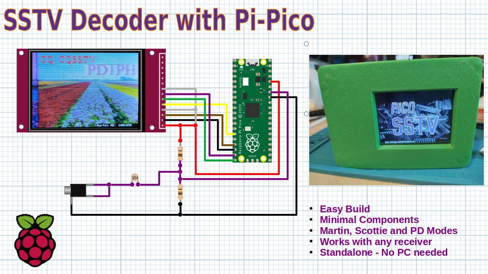
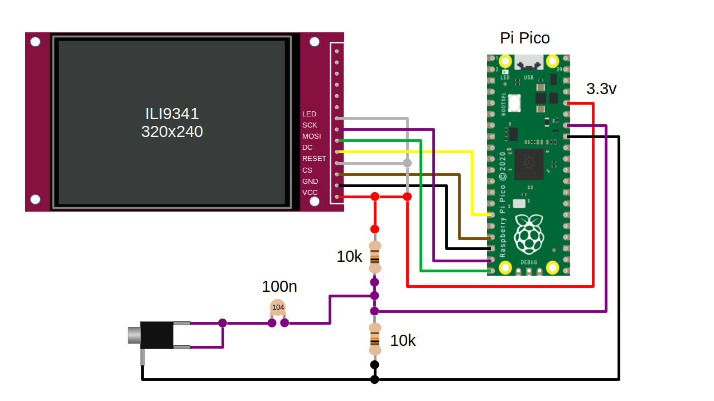
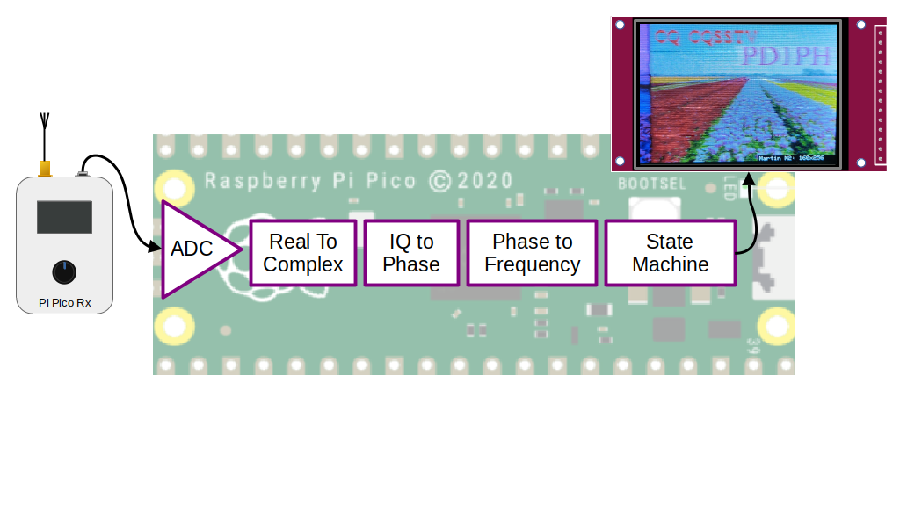
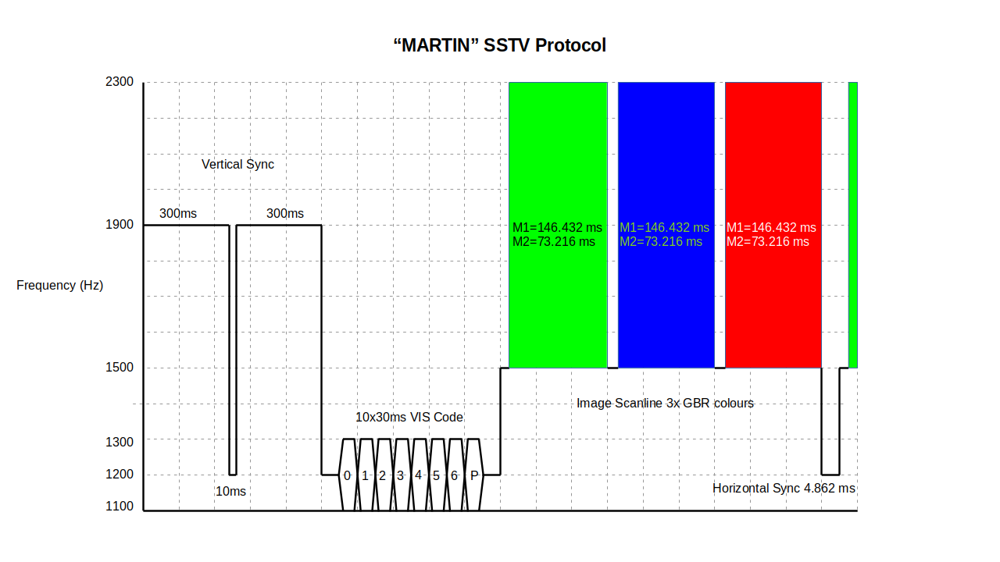
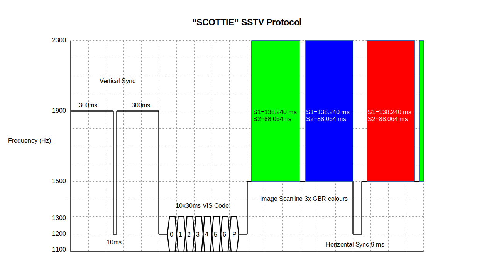
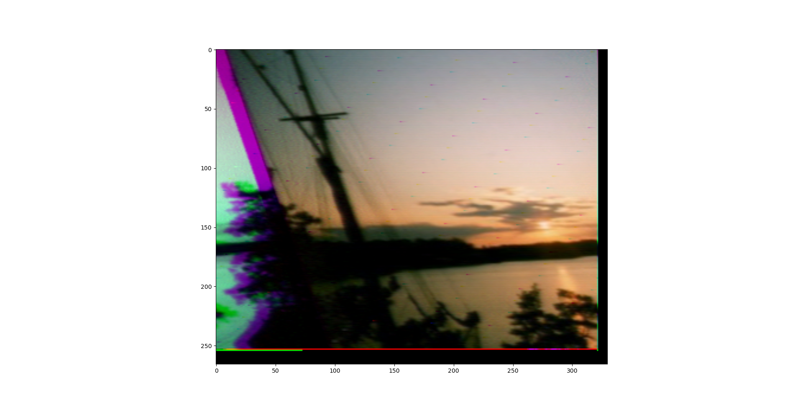
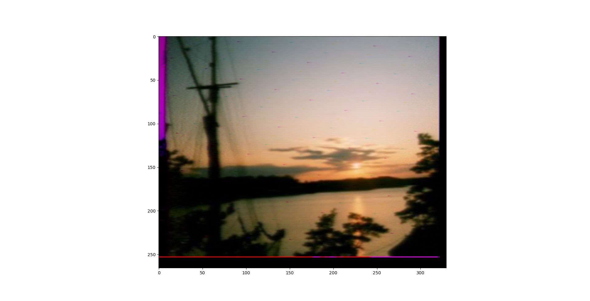
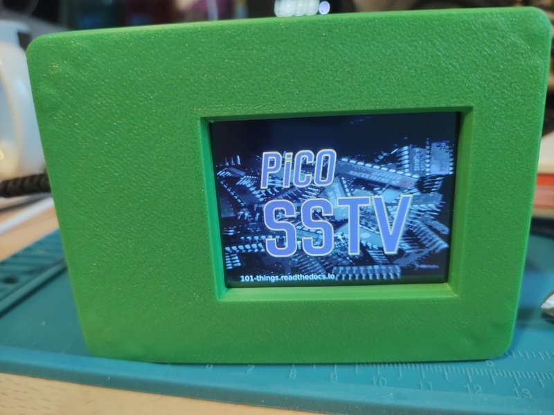
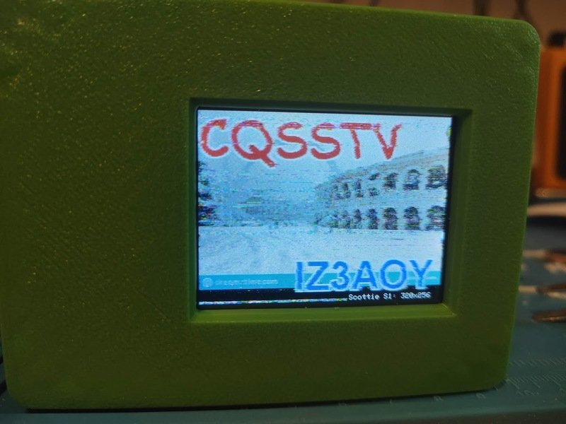

Slow Scan Television (SSTV) Decoder
===================================

Slow Scan Television (SSTV) is a fascinating way to transmit images over radio,
commonly used by amateur radio enthusiasts. Traditionally, decoding SSTV
signals requires a PC and a soundcard, but this project demonstrates a simpler,
more accessible solution.

Using a Raspberry Pi Pico microcontroller and an affordable TFT display, you
can build a compact SSTV decoder that doesn't require a PC. With just a few
resistors and capacitors, the decoder interfaces directly with the headphone
output of any radio, making it highly versatile and easy to set up.

This guide walks you through constructing and programming the decoder, enabling
you to receive and display SSTV images in no time. Whether you're a seasoned
ham radio operator or a curious hobbyist, this project provides an excellent
opportunity to explore the world of SSTV with minimal cost and effort.

Hardware
--------

The hardware is fairly simple requiring a Raspberry Pi Pico and a few
inexpensive components. The following parts list is all that is needed to build
the decoder.

+-----------------------------------------+----------+---------------------------------+
| Part                                    | Quantity | Example URL                     |
+=========================================+==========+=================================+
| 320x240 ILI9341 or ILI9342 SPI Display  | 1        | `<https://shorturl.at/Kwjb0>`__ |
+-----------------------------------------+----------+---------------------------------+
| Raspberry Pi Pico                       | 1        | `<https://shorturl.at/bKibr>`__ |
+-----------------------------------------+----------+---------------------------------+
| Resistor 10k                            | 2        | `<https://shorturl.at/aSetc>`__ |
+-----------------------------------------+----------+---------------------------------+
| Capacitor Ceramic 100n                  | 1        | `<https://shorturl.at/smvFK>`__ |
+-----------------------------------------+----------+---------------------------------+
| 3.5mm Stereo Socket                     | 1        | `<https://shorturl.at/KUiZ2>`__ |
+-----------------------------------------+----------+---------------------------------+

(Note links are for illustrative purposes and not necessarily recommendations)

The Pi-Pico provides a 12-bit ADC, which is used to sample the headphone output
from the receiver. The Pico ADC need a voltage between 0 and 3v. This means
that it can handle up to 3v pk-pk headphone output voltage of most receivers without
needing any additional amplification. The capacitor is a DC-blocking capacitor,
and the 2 resistors form a potential divider to provide a mid-rail bias voltage
to the ADC.

I'm using an ILI9341 display with an SPI interface, which is
cheap and easy to get hold of. They are also available in a few different sizes
I'm using the 2.4-inch version. You need to get one with an SPI interface and
make sure that you supply it with the right supply voltage.

The displays I have purchased provide the ability to select a 5V or 3.3V power
supply. There is a jumper on the reverse side that can be shorted to bypass a
regulator allowing operation from a 3.3V supply. The IO signals use a 3.3V
standard so are directly compatible with the Pi Pico.

The design uses a "4 wire" SPI interface to control the display. (There are
displays available with a faster parallel interface, but the SPI interface is
more economical with IO). The display is unidirectional and needs only the MOSI
and SCK pin, the MISO signal is not used. In addition, the display needs a chip
select and a "DC" pin. Although the display has a hardware reset, I have found
that this can be hard-wired to 3.3v to save IO, and so far I have had reliable
results using only the software reset. The following table shows the display wiring.

+-----------+---------------+----------------------+------------------+
| Signal    |   Display     |      Pico Pin Number | Pico GPIO Number |
+===========+===============+======================+==================+
|  Vcc      |      1        |        36 (3v3 out)  |        NA        |
+-----------+---------------+----------------------+------------------+
|  Gnd      |      2        |        18 (GND)      |        NA        |
+-----------+---------------+----------------------+------------------+
|  CS       |      3        |        17            |        13        |
+-----------+---------------+----------------------+------------------+
|  RESET    |      4        |        36 (3v3 out)  |        NA        |
+-----------+---------------+----------------------+------------------+
|  DC       |      5        |        15            |        11        |
+-----------+---------------+----------------------+------------------+
|  MOSI     |      6        |        20            |        15        |
+-----------+---------------+----------------------+------------------+
|  SCK      |      7        |        19            |        14        |
+-----------+---------------+----------------------+------------------+
|  LED      |      8        |        36 (3v3 out)  |        NA        |
+-----------+---------------+----------------------+------------------+

Software
--------

There are quite a few different SSTV standards, but the Martin and Scottie
protocols seem to be the most popular. I also found that there were quite a few
signals using PD50 and PD90. The PD modes use YCrCb format rather than GBR,
this allows the colour information to be sent more efficiently and is therefore
able to transfer images much faster, but they are less tolerant of errors in
frequency and often have a green tinge when the transmitter/receiver is poorly
calibrated.

SSTV signals are designed to work over narrow bandwidth voice channels. They
use a frequency modulation scheme, where the intensity of a pixel is
represented by a tone between 1500 Hz and 1900 Hz with 1200Hz horizontal
synchronisation pulses between each line.

Each image starts with a vertical synchronisation pulse followed by a VIS code.
The VIS code is a 7-bit number that can be used to work out which standard is
being used.

The different SSTV signals all use a fairly similar structure but tend to have
differences in timings. For example, the Scottie mode is similar to Martin but
uses a slightly different length of the colour line, and (unusually) the horizontal
sync appears in the middle of the line between the blue and red components.

The Pi-Pico's built-in ADC takes the place of the sound card used in the
"traditional" SSTV setup. The ADC is a 12-bit device with a 500kS/s sample
rate. This is more than sufficient to decode SSTV signals. I run the ADC at
15kS/s, this can be achieved using an integer division of the 48MHz USB clock
and provides plenty of bandwidth.

The ADC data is captured using DMA into alternating "ping-pong" buffers. This
means that the ADC capturing process is carried out autonomously by the
hardware, while the software concurrently decodes a previous block. (Leaving
the second CPU core completely spare).

I'm assuming that the receiver is correctly tuned using USB mode. The ADC
provides a single "real" sample of the audio captured from the headphone
output. There are many methods of measuring frequency, but in this application
measuring the phase change between samples seems like the simplest approach.

If we have a complex (I and Q) sample, we can directly measure the phase of
each sample, so the first step is to convert the real sample to a complex
sample with I and Q components. This can be achieved using a Hilbert transform
(or equivalent). A real-only signal can be thought of as a signal with an
imaginary component of zero. A real signal always has a symmetrical spectrum
with both positive and negative sidebands. We can think of the Hilbert
transform as an asymmetrical filter that removes the negative sideband, at the
same time adding an imaginary component to the signal exactly 90 degrees out of phase.

The process is identical to the method used to generate a single sideband
modulation so I reused the code from the
`transmitter project <https://101-things.readthedocs.io/en/latest/ham_transmitter.html#modulator>`__

The next step is to work out the phase of each sample. This can be achieved
using an `atan2(i, q)`. The transmitter project implemented a fast (yet
reasonably accurate) approximation using the
`CORDIC <https://dspguru.com/dsp/faqs/cordic/>`__ algorithm. Again I have
reused the code from the transmitter project.

Once we know the phase of each sample, we can work out the frequency of the
change in phase from one sample to the next, using a simple subtraction. The
phase output from the CORDIC algorithm is scaled so that the full range of a
The 16-bit integer represents `2*pi` radians of phase. This means that the normal
overflow behaviour of a 2's complement number gives us phase unwrapping (modulo
2 pi) for free. For clarity, the frequency is then scaled to give an integer
frequency in Hz.

A state machine and some counters decode the frequency information into an
image. The decoder uses an asynchronous approach to decoding which means we can
decode the image even if some of the horizontal synchronisation pulses are lost
due to fading. A counter tracks the time in samples since the start of the
image. Since we know the length of each scan line and each colour coponent we
can work out the colour, x and y coordinates using divide and modulo
operations. Each pixel is not an exact number of samples, so it is necessary to
include a fractional sample component when performing these calculations. Each
pixel comprises many samples, and the final value of each pixel is calculated
as an average across all the samples to reduce noise.

In early versions of the decoder, I decoded the VIS code to work out which mode
was being used. I found that this was unreliable and that a missing (or
incorrectly decoding) VIS code would result in the loss of a whole image.

I found that measuring the interval between horizontal sync pulses allowed me
to make a good guess at the mode being used, this resulted in more reliable
decoding allowing images to be decoded even when the VIS information was
missing (e.g. because of interference or fading). Image decoding terminates
when either the maximum expected number of lines has been received, or when a
timeout is exceeded. The length of the timeout is a tradeoff short timeouts can
result in an image being decoded in two separate parts if fading occurs
part-way through transmission. A long timeout might result in the start of a
new image being missed. I found that a timeout of 30-40 seconds was a good
compromise but your mileage may vary.

Another useful (essential?) feature is automatic slant correction. Slant occurs
when the sample rate in the transmitter and receiver are mismatched. An error of even a fraction of one per cent can result in a dramatic image
slant. It is good practice when transmitting SSTV to make sure that the sampling
frequency is carefully calibrated, and when this practice is observed minimal
slant can be achieved without any correction.

Automatic slant correction is implemented by performing continuous measurements
of the hsync timing. The average timing of a received scan line is measured by
dividing the elapsed time by the number of lines. The estimate of the average
scan time is used to adjust the timing of the decoder. The estimate improves
as the image progresses, but an additional smoothing filter is used to prevent
measurement noise. Again, the use of automatic slant correction is a trade-off,
it allows images from poorly calibrated transmitters to be received successfully. However, it may give slightly worse results for well-calibrated
transmitters especially when signals are noisy, since this adds noise to the
estimated length of the scan line.

There is a lot of variation between ILI9341 displays, I have had identical-looking displays that had different colours and rotations. The rotation and
colour of the display can be configured using compile-time parameters in the
sketch. By changing the rotation and colour configurations in the sketch, it should
be possible to get the code working with most display variants.

.. code:: C++

  //CONFIGURATION SECTION
  ///////////////////////////////////////////////////////////////////////////////

  #define PIN_MISO 12 //not used by TFT but part of SPI bus
  #define PIN_CS   13
  #define PIN_SCK  14
  #define PIN_MOSI 15
  #define PIN_DC   11
  #define SPI_PORT spi1

  #define ROTATION R0DEG
  //#define ROTATION R90DEG,
  //#define ROTATION R180DEG,
  //#define ROTATION R270DEG,
  //#define ROTATION MIRRORED0DEG,
  //#define ROTATION MIRRORED90DEG,
  //#define ROTATION MIRRORED180DEG,
  //#define ROTATION MIRRORED270DEG

  #define INVERT_COLOURS false
  //#define INVERT_COLOURS true

  #define STRETCH true
  //#define STRETCH false

  #define ENABLE_SLANT_CORRECTION true
  //#define ENABLE_SLANT_CORRECTION false

  #define LOST_SIGNAL_TIMEOUT_SECONDS 40

3D Printed Enclosure
--------------------

I designed a simple 3D-printed enclosure for the SSTV decoder. The FreeCAD design and STL files can be found `here <https://github.com/dawsonjon/PicoSSTV/tree/main/enclosure>`__.

Conclusion
----------

I'm quite pleased with the SSTV decoder and I have managed to receive quite a
few SSTV images using very simple hardware. In future, I would like to consider
expanding the range of SSTV modes that can be received. It should be possible
to add SD card support to allow images to be automatically saved as they are
downloaded. I also think it should be possible to decode a much wider range of
signals using identical hardware.  With appropriate software, I believe that
the hardware should be capable of receiving FAX, CW, RTTY, PSK31 and FT8.

Implementing an SSTV transmitter should be relatively simple, I would like to
try integrating a small camera so that images can be captured and transmitted
too.

Useful Links
------------

Here are some useful links about Slow Scan Television.

+ `pySSTV <https://github.com/dnet/pySSTV>`__
+ `SSTV Handbook <https://www.sstv-handbook.com/>`__

If you would like to support 101Things, buy me a coffee: https://ko-fi.com/101things
