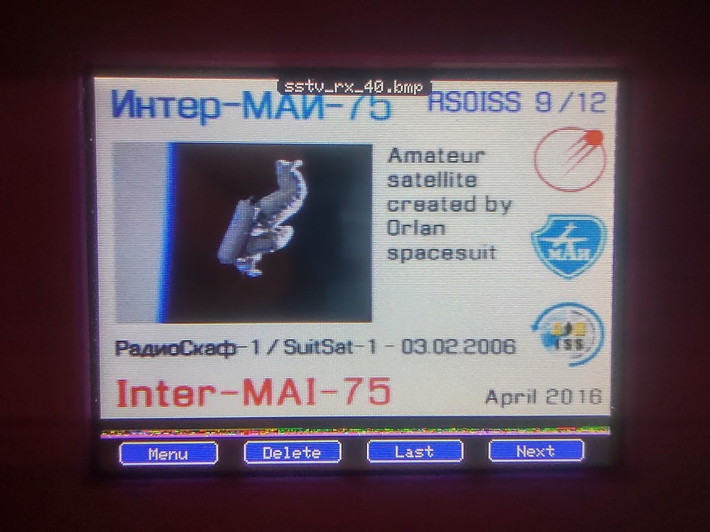
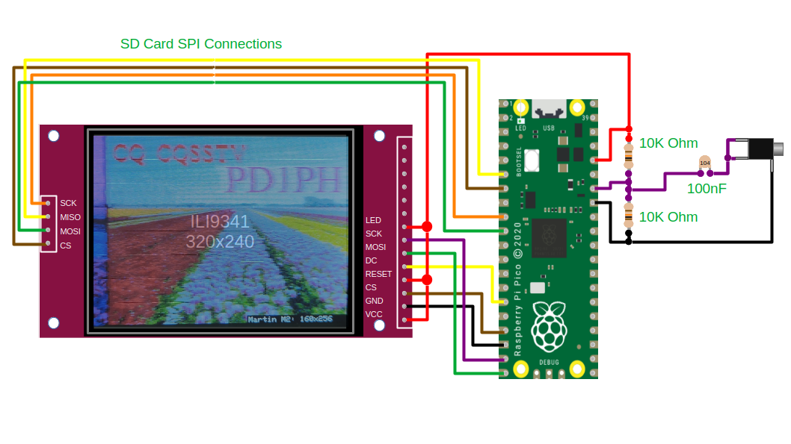
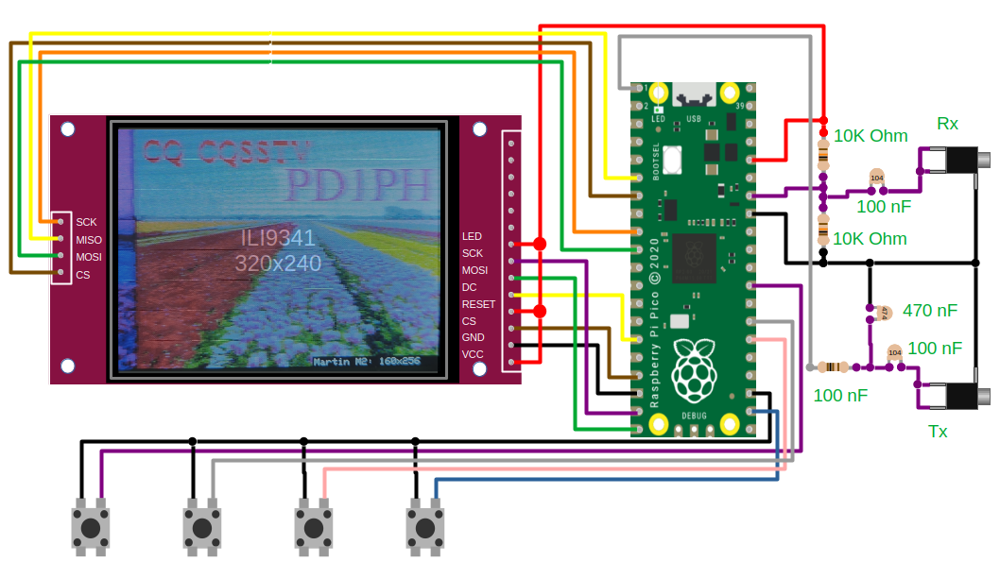

Slow Scan Television (SSTV) Part 2
===================================

.. raw:: html

   <iframe width="560" height="315" src="https://www.youtube.com/embed/3gel-2bvtw4?si=xx8NQh77VKD0pQNe" title="YouTube video player" frameborder="0" allow="accelerometer; autoplay; clipboard-write; encrypted-media; gyroscope; picture-in-picture; web-share" referrerpolicy="strict-origin-when-cross-origin" allowfullscreen></iframe>

In the first part of this series, I demonstrated a very simple SSTV decoder using a Raspberry Pi Pico and an inexpensive ILI9341 TFT display. I have had a lot of interest in the project, and I have received requests and contributions, including additional modes and new features. In this update, I have upgraded the SSTV decoder to include more advanced functionality, such as an encoder, SD card support, and a menu-driven user interface. The project has grown from a simple Arduino sketch into a library of SSTV functionality that can be used in other projects, complete with a collection of example designs to get you started.

New Modes
---------

The most popularly requested modes are the PD120 and PD180 modes. These are the modes used by the ISS for occasional transmissions from space. These were the first new moes to be implemented. These modes are much higher resolution than the existing Martin/Scottie modes, so they needed to be down-scaled to fit onto the ILI9341 display.

There are a number of audio files that can be downloaded from `spacecomms <https://spacecomms.wordpress.com/iss-sstv-audio-recordings>`__, and these were duly tested with the Pico SSTV decoder.

A few modes were fairly simple to implement by making modifications to existing modes. The SC2 modes and ScottieDX could all be implemented by modifying the timings of existing modes. The Robot24, Robot36, and Robot72 modes are trickier. These modes use yCrCb encoding. Robot 36 is particularly difficult to decode using the current architecture because the Cr and Cb components are sent in alternating scan lines. An extra sync (sorta) of 1500Hz indicates that a scan line contains Cr information, while 2300Hz indicates that a scan line contains Cb information. Credit goes to Franciscu Capuzzi (IS0JSV) for his clever method to detect and correctly decode the chrominance in these modes. In addition to the colour Robot modes, the decoder now also supports the black and white Robot modes.

Library
-------

The original SSTV decoder used a very simple circuit, and the code was supplied as a simple sketch. I wanted to include a number of new features that would require different (additional) hardware. I wanted to provide software to support existing hardware while also supporting new hardware with a more comprehensive set of features.

I decided that the best approach was to move from an Arduino sketch to providing an Arduino library. One of the nice things about Arduino libraries is the ability to include a number of code examples. I chose to use this feature to provide a few different example designs, ranging from the very simple to the more complete.

+ **sstv_receive_tft** - Similar to the original design, supporting the original hardware but with new modes.
+ **sstv_recieve_sd** - Adds simple automatic SD card logging to the basic design
+ **sstv_transmit_basic** - A minimal transmit-only example. Transmits an image from SD card.
+ **sstv_full** - Receive and transmit functionality, SD card storage and full menu driven UI.

My hope was that converting the SSTV project into a library would enable the code to be reused in other projects and on various hardware platforms. The `Wio Terminal SSTV <https://github.com/Brabudu/WioTerminalSSTV>`__ project by Franciscu Capuzzi (IS0JSV) makes a really neat SSTV device, and is an excellent example of how the library could be used.

.. image:: https://github.com/Brabudu/WioTerminalSSTV/raw/main/img/sstv.jpg

If you have been following progress on the `Pi Pico Rx <https://101-things.readthedocs.io/en/latest/breadboard_radio_part4.html>`__, you might be interested to know that the receiver now includes a built-in decoder based on this library.

SD Card Storage
---------------

  Wiring for SD card example

One of the most requested features is SD card storage. This makes the device a lot more useful because it allows images to be stored automatically as they are received, which means that the decoder can be left unattended. I have left mine running for several days at a time, and I periodically check back to see what has come in.

Although it is possible to purchase SD card holders, I opted to use the SD card holder that is built into most ILI9341 displays. A few extra wires are all that is needed to connect the SPI bus to the SD card. I opted to use the SDFS library included in the Arduino Pico core. In addition, the VFS library allows the SD card to be accessed using standard C library functions.

For image storage, I wrote a very simple library that allows .bmp images to be loaded and saved. The nice thing about SD card storage is that it allows images to be stored in full resolution, even if they have to be downscaled to display
them on the TFT display.

SSTV Encoder (transmit)
-----------------------

.. figure:: images/sstv_part2/transmit_circuit.png

  Wiring for transmit example

Compared to the decoder, the encoder is relatively simple to implement. The audio output is generated using PWM, followed by a filter and a DC blocking capacitor. The PWM audio code has been reused from other projects.

The encoding process always starts with a fixed sequence consisting of 2 300ms bursts at 1900Hz. The generate_tone function accepts 2 parameters, the frequency and the duration. I use 16 fraction bits to represent the duration in ms. A high resolution is needed to maintain precise timings over the timescale of an image transmission. After this, the image encoding depends on the transmission mode.

.. code:: cpp

  void c_sstv_encoder :: generate_sstv(e_sstv_tx_mode mode)
  {
    generate_tone(1900, 300 << 16);
    generate_tone(1200, 10 << 16);
    generate_tone(1900, 300 << 16);
    generate_vis_code(mode);

    //...

    generate_martin(mode);

  }

The encoding process works through the image one line at a time. Each line consists of a burst for each colour (R-G-B in the case of Martin). Each pixel consists of a short burst between 1500Hz and 2300Hz, with 1500Hz gaps between each colour. At the end of each line, a horizontal sync pulse of 1200Hz is sent.

.. code:: cpp

  void c_sstv_encoder :: generate_martin(e_sstv_tx_mode mode)
  {

    uint16_t width, height;
    float colour_time_ms;

    switch(mode)
    {
      case tx_martin_m1:
        width = 320;
        height = 240;
        colour_time_ms = 146.320;
        break;

      case tx_martin_m2:
        width = 320;
        height = 240;
        colour_time_ms = 73.216;
        break;

      default: return;
    }

    uint32_t hsync_pulse_ms_f16 = 4.862 * (1<<16);
    uint32_t colour_gap_ms_f16 = 0.572 * (1<<16);
    uint32_t pixel_time_ms_f16 = (colour_time_ms*(1<<16))/width;

    //send rows
    for(uint16_t row=0u; row < height; ++row)
    {
      generate_tone(1500, colour_gap_ms_f16);
      for(uint16_t col=0u; col < width; ++col)
        generate_tone(get_pixel(width, height, row, col, 1), pixel_time_ms_f16);

      generate_tone(1500, colour_gap_ms_f16);
      for(uint16_t col=0u; col < width; ++col)
        generate_tone(get_pixel(width, height, row, col, 2), pixel_time_ms_f16);

      generate_tone(1500, colour_gap_ms_f16);
      for(uint16_t col=0u; col < width; ++col)
        generate_tone(get_pixel(width, height, row, col, 0), pixel_time_ms_f16);

      generate_tone(1500, colour_gap_ms_f16);
      generate_tone(1200, hsync_pulse_ms_f16);
    }
  }

The generate_tone function converts the fixed-point time-in-ms value into a fixed-point number-of-samples value. Where the number of samples has a fractional component, we round to down, but store the fraction part. The fractional parts are accumulated so that they can be compensated for later to maintain accurate long-term timings.

.. code:: cpp

  void c_sstv_encoder :: generate_tone(uint16_t frequency, uint32_t time_ms_f16)
  {
      uint32_t samples_exact_f16 = (m_Fs_Hz*time_ms_f16/1000) + m_residue_f16;
      uint32_t samples = samples_exact_f16 >> 16u;
      m_residue_f16 = samples_exact_f16-(samples << 16u);
      output_samples(frequency, samples);
  }

The tones themselves are generated using a simple phase accumulator. The phase accumulator uses a high resolution. The 10 most significant bits from the phase accumulator control a lookup table that has been pre-programmed with a 16-bit sine wave. The generated sample is then sent to the PWM audio module to be output.

.. code:: cpp

  void c_sstv_encoder :: output_samples(uint32_t frequency, uint16_t samples)
  {
      uint32_t step = (static_cast<uint64_t>(frequency)<<32)/m_Fs_Hz;
      for(uint16_t idx = 0; idx < samples; ++idx)
      {
        output_sample(m_sin_table[m_phase >> 22]);
        m_phase += step;
      }
  }

Full Example - Menu Driven Encoder/Decoder
------------------------------------------

While the basic examples give the minimal code needed to receive or transmit an SSTV signal, this example is more complete, including many of the features included in PC-based SSTV software. As well as including both transmit and receive functionality, this example provides a richer experience, including a user interface that allows you to browse files and customise settings.

  Wiring for transmit example

The user interface uses an additional 4 buttons to drive a menu, and the circuit shares a lot of similarity to the `planetarium <https://101-things.readthedocs.io/en/latest/planetarium.html>`__ design. A menu allows the user to switch between transmit, receive, file-browse (slideshow) mode, as well as providing a settings menu that allows the decoder configuration to be customised.

The Arduino Pico core includes a library to emulate an EEPROM using the Pi Pico's onboard flash. This feature is used to store user settings and restore them after each power cycle.

+-----------------------------------------+----------+---------------------------------+------------------------------+
| Part                                    | Quantity | Example URL                     | Notes                        |
+=========================================+==========+=================================+==============================+
| 320x240 ILI9341 or ILI9342 SPI Display  | 1        | `<https://shorturl.at/Kwjb0>`__ | for receive examples         |
+-----------------------------------------+----------+---------------------------------+------------------------------+
| Raspberry Pi Pico                       | 1        | `<https://shorturl.at/bKibr>`__ |                              |
+-----------------------------------------+----------+---------------------------------+------------------------------+
| Resistor 10k                            | 2        | `<https://shorturl.at/aSetc>`__ | for receive examples         |
+-----------------------------------------+----------+---------------------------------+------------------------------+
| Capacitor Ceramic 100n                  | 2        | `<https://shorturl.at/smvFK>`__ | 1 for transmit 1 for receive |
+-----------------------------------------+----------+---------------------------------+------------------------------+
| Resistor 100 ohm                        | 1        | `<https://shorturl.at/QXFMh>`__ | for transmit examples        |
+-----------------------------------------+----------+---------------------------------+------------------------------+
| Capacitor Ceramic 470n                  | 1        | `<https://shorturl.at/hRgnC>`__ | for transmit examples        |
+-----------------------------------------+----------+---------------------------------+------------------------------+
| 3.5mm Stereo Socket                     | 1        | `<https://shorturl.at/KUiZ2>`__ | 1 for transmit 1 for receive |
+-----------------------------------------+----------+---------------------------------+------------------------------+
| Tactile buttons 6mm                     | 4        | `<https://shorturl.at/IHNVn>`__ | for menu driven interface    |
+-----------------------------------------+----------+---------------------------------+------------------------------+
| SD Card                                 | 1        | `<https://shorturl.at/C5DyY>`__ | for SD Card Examples         |
+-----------------------------------------+----------+---------------------------------+------------------------------+
| 3D Printed Enclosure                    | 1        | `<https://shorturl.at/M5z12>`__ |                              |
+-----------------------------------------+----------+---------------------------------+------------------------------+

(Note: Links are for illustrative purposes and not necessarily recommendations.)

The display wiring is shown below:

+-----------+---------------+----------------------+------------------+
| Signal    | Display Pin   | Pico Pin Number      | Pico GPIO Number |
+===========+===============+======================+==================+
| Vcc       | 1             | 36 (3v3 out)         | NA               |
+-----------+---------------+----------------------+------------------+
| Gnd       | 2             | 18 (GND)             | NA               |
+-----------+---------------+----------------------+------------------+
| CS        | 3             | 17                   | 13               |
+-----------+---------------+----------------------+------------------+
| RESET     | 4             | 36 (3v3 out)         | NA               |
+-----------+---------------+----------------------+------------------+
| DC        | 5             | 15                   | 11               |
+-----------+---------------+----------------------+------------------+
| MOSI      | 6             | 20                   | 15               |
+-----------+---------------+----------------------+------------------+
| SCK       | 7             | 19                   | 14               |
+-----------+---------------+----------------------+------------------+
| LED       | 8             | 36 (3v3 out)         | NA               |
+-----------+---------------+----------------------+------------------+

The four buttons used to navigate the menu each connect between GND and a spare GPIO pin:

+-----------+----------------------+------------------+
| Signal    | Pico Pin Number      | Pico GPIO Number |
+===========+======================+==================+
| Gnd       | 23 (GND)             | NA               |
+-----------+----------------------+------------------+
| UP_BTN    | 22                   | 17               |
+-----------+----------------------+------------------+
| DOWN_BTN  | 26                   | 20               |
+-----------+----------------------+------------------+
| RIGHT_BTN | 27                   | 21               |
+-----------+----------------------+------------------+
| LEFT_BTN  | 29                   | 22               |
+-----------+----------------------+------------------+

Slideshow Mode
--------------

The image file browser cycles through all the images in the root folder of the SD card. The images can be navigated using the next and back buttons. The file browser also works in a slideshow mode, moving onto the next image after a predefined timeout. If an image is received while the slideshow is in operation, the decoder automatically switches into receive mode.

Text Overlay
------------

The text overlay feature allows a user-defined text banner to be added to an image prior to transmission. This allows call-signs and other messages to be embedded directly in the image.

The text overlay is implemented using a frame buffer that allows text and
drawing primitives to be drawn in an area of memory. The frame buffer code was
reused from the `pico planetarium project <https://101-things.readthedocs.io/en/latest/planetarium.html>`__.

Although I could have used a touch screen for text entry, I wanted to support non-touch TFT displays and didn't want to add additional hardware at this stage. I opted to implement a simple 4-button text entry scheme. I use a 3 level tree, which allows all letters and numbers to be entered using only 3
keystrokes. Once you get used to the way it works, it allows reasonably fast text entry with a little practice.

3D Printed Enclosure
--------------------

The 3D printed enclosure design has been reworked to accommodate the extended functionality. I used the `planetarium <https://101-things.readthedocs.io/en/latest/planetarium.html>`__ design as a starting point, which already includes provision for the 4 buttons and TFT display.

The enclosure allows easy access to the Pico's USB port, while also allowing the bootsel button to be operated in-place, simplifying the process of USB programming.

I have tried to design the enclosure to be as flexible as possible, providing several different front panels to accomodate different size TFT displays from 2.4 to 3.2 inch. The TFT display's SD card socket can be accessed through a slot in the top of the enclosure. The enclosure walls have been thinned in this area so that the SD card slot can be trimmed to fit a particular display.

The enclosure includes a number of customizable features to accommodate power-switches and audio jacks. These can be trimmed using a drill or craft knife.

For portable operation, the enclosure includes a generously sized battery compartment. If you would like to  explore battery operation of the Pi Pico, the `datasheet <https://datasheets.raspberrypi.com/pico/pico-datasheet.pdf>`__ presents a few options in section 3.1. The Pico includes an efficient switched-mode regulator and can be operated from 1.8V to 5.5V. The pico will operate from 2 or 3 AA or AAA batteries, or a single 3.7V lithium battery.

The enclosure allows 4x6mm tactile switches to be installed. These are soldered to a piece of "strip-board" or "veroboard" that has been cut to size and drilled. The strip-board is fixed to the panel using meltable features integrated in the front panel. The same meltable fixings are used to secure the TFT display.

.. image:: images/sstv_part2/enclosure_construction_5.jpg

The front panel and battery lid are secured using countersunk M3x6 self-tapping screws.

Conclusion
----------

In this installation, the Pi Pico SSTV decoder has been extended into a more fully featured portable device with support for the most popular modes. We have included a menu-driven interface, SD card storage, and an image file browser.

I haven't had much luck yet receiving SSTV from the International Space Station, and I seem to keep missing upcoming events. This is something I would really like to get working, so I'm going to keep looking out for opportunities.

There is still plenty more I would like to achieve in the future. Among other things, I would like to extend the code to include support for a small camera. I'm also keen to extend the decoder to include other digital modes such as FT8, PSK31, and RTTY. I would also like to look at designing CW functionality. Watch this space for more updates!

If you would like to support 101Things, buy me a coffee: https://ko-fi.com/101things

