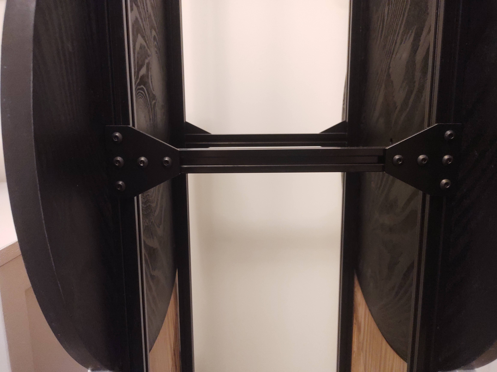

Dobsonian Telescope
===================

.. image::  images/telescope_thumbnail.png
  :target: https://youtu.be/KxbAh8ndkbY

I'm not an expert in astronomy, I've never built (or even used) an astronomical
telescope before, but it is something I have always wanted to do. It hadn't
occurred to me that you could build a telescope, but years ago I ran into
some instructions to build a Dobsonian telescope. At the time I found it quite
difficult to find the optical parts and even struggled to source the specified
10-inch cardboard tube, and moved on to other projects. Recently I stumbled
across the `Stellafane guide <https://stellafane.org/tm/dob/index.html>`__, 
an excellent introduction to Amateur Telescope Making and with renewed
enthusiasm I set about sourcing the parts I would need.  I was excited to
discover that telescope parts could be sourced quite easily online and that the
cost wasn't too unreasonable. Ironically, the large cardboard tubes still seem
quite hard to find.

Design
------

The `Stellafane guide <https://stellafane.org/tm/dob/index.html>`__ is a very
good introduction and provides all the details you need to get started. I won't
try to duplicate it here, I will just document some of the design decisions I
made for my particular scope.

I opted for an 8-inch reflector, and this choice was mainly down to economics.
I found a mirror set including a 200 mm (8 inches) primary mirror and a 40mm
secondary mirror. I found that the price of the mirror seemed to increase quite
significantly beyond this size. I think that a 6 or 8-inch reflector should be
a reasonable size for a first telescope. The mirror has a focal length of 1600mm
which gives a focal ratio of about f8. I think that the relatively high focal
ratio should give quite high magnifications and should be good for observing planets.

As far as possible I have tried to follow the Stellafane guide, for a first
telescope I think it makes sense to use a tried and tested approach. The most
significant deviation I have mode is in the construction of the tube. I have
struggled to find suitable cardboard tubes [#f1]_ so I wanted to explore some
other options. It is quite easy to build a square, or hexagonal tube using wood
or plywood. Aluminium or PVC tubes might also be options. A different approach
entirely would be a truss-tube-based design.

In the end, I thought it might be fun to build the tube using 2020 T-slots.
These aluminium extrusions work like a scaled-up version of Mechano and are
often used to build CNC machines and 3D printers. Although I haven't seen many
other telescopes using these profiles, I thought it might be worth a go. Apart
from being easy to get hold of, the main advantage of using this type of
material is the flexibility it affords, allowing the design and dimensions of
the scope to be easily adjusted.

The size and focal length of the primary mirror are the primary factors that
determine the dimensions of the scope. Stellafane provides an `online design
tool <https://stellafane.org/tm/newt-web/newt-web.html>`__ that can be used to
work out the main parameters.

.. image:: images/telescope_newtweb.png

The rest of the design is a balancing act, involving tradeoffs and compromises.

The first tradeoff is the size of the secondary diagonal mirror. Making the
mirror too large will block too much light from reaching the primary mirror,
too small and not all the light reflected from the primary mirror will reach
the eyepiece.

Since I already have a 40mm diagonal mirror, the decision has been made for me
and it turns out that this is a good size in any case. The only other dimension
I can change is the distance from the secondary mirror to the eyepiece, once
this has been decided, the distance from the diagonal to the primary is
calculated by the tool. The goal is to avoid vignetting (blocking the light
path) by the tube or the focuser while maximising the illuminated diameter.

The distance from the primary to the eyepiece is a combination of the tube
diameter, the thickness of the tube and the height of the focuser.
Constructing the tube using 2020 t-slots allows us to make the tube any diameter
we want, but the thickness of the tube is 20mm which is much thicker than a
cardboard tube. The focuser I bought has a fairly large minimum height and lots
of travel. A tube width of 250mm seems to be a good compromise giving a 12mm
100% illuminated diameter and no vignetting.

.. image:: images/telescope_raytrace.png

The Newtweb utility generates a handy ray trace which helps visualise the design
and diagnose the cause of any vignetting. Once the key parameters have been
designed, the utility calculates a handy table with all the measurements.

.. image:: images/telescope_dimensions.png

.. [#f1] I'm sure I could find some if I tried, but when I can have the 
         optical parts delivered to my door, the effort seems disproportionate.

Optical Tube Assembly
---------------------

Now we have the dimensions it is a simple matter to design the optical tube
assembly using the 2020 profile. 

.. image:: images/telescope_optical_tube_assembly.png

The tube is a basic cuboid, at first, I just used
corner connectors but found that the tube wasn't stiff enough and needed some
trianglation. 

.. image:: images/telescope_corner_connectors_1.jpg
  :width: 75%
  :align: center

.. image:: images/telescope_corner_connectors_3.jpg
  :width: 75%
  :align: center

I added corner blocks to each of the corners and aluminium
gussets in the centre and this solved the problem very nicely. I only added the
gussets to the top and bottom of the tube since the altitude bearings on the
side will add support to this dimension.

Some of the hardware had a silver/chrome finish, I have tried to reduce
unwanted reflections by either painting these matt black or by covering them
with self-adhesive black felt. The open-tube design may also benefit from a
shroud and additional flocking, and this is something I may address in the
future.

Mirror Cell
-----------

For the mirror cell, I stuck quite closely to the Stellafane design, but I did
have to modify the lower part to fit into a square rather than a circular tube. I
incorporated plenty of ventilation into the design to assist in the cooling of
the mirror. I cut the parts from 18mm plywood and again painted them matt
black. I used 2020 corner pieces to fix the mirror cell into the tube. One
nice thing about this is that the distance between the mirror cell and
the secondary mirror can easily be adjusted.

.. image:: images/telescope_mirror_cell_1.svg
  :width: 75%
  :align: center

I stuck with Stellafane's recommendation to use silicon adhesive to mount the
mirror, but I did take the risk of substituting 'coffee stirrers' for 'popsicle
sticks'!

Spider and Secondary Mirror Holder
----------------------------------

The spider and secondary mirror holder need to be adjustable in a couple of
different dimensions to allow the scope to be properly aligned (collimated).
This is another place where we can take advantage of the inherent adjustability
of the t-slots. The secondary mirror holder is a short length of t-slot cut off
at 45 degrees, and the mirror is glued to this. The secondary mirror holder is
suspended from the edges of the tube using a length of 2mm x 10mm aluminium
strip. I have made this strip relatively thin to reduce the diffraction caused
by blocking the light path. The strip is attached to the tube using 2 corner
blocks. This allows adjustment from side to side, into and out of the tube as
well as rotation in two axes.

.. image:: images/telescope_spider.png

.. image:: images/telescope_secondary_mirror_holder.png

Again the secondary mirror is attached using silicon adhesive, using a 'coffee
stirrer' as a spacer while the adhesive cures.

Focuser
-------

This is another area where economics plays a factor, I opted for a `relatively
inexpensive <https://www.ebay.co.uk/itm/144815207453?var=444035499240>`__ 
1.25-inch rack and pinion focuser. This seemed like a good compromise between
cost and quality. The focuser is an all-metal design that seems to be well-made. 
The focuser is attached to the tube using a 6mm sheet of black phenolic
resin, and a matching sheet sits behind the focuser.

Alignment and Focus Test
-------------------------

Before committing to the final positioning of the primary mirror, I wanted to
check that I could bring distant objects into focus. Having performed a rough
alignment I mounted a 25mm eyepiece and attempted to focus on some distant (and
not-so-distant) objects. I live about 4 miles from the `Malvern Hills
<https://en.wikipedia.org/wiki/Malvern_Hills>` and can see these from where I
live. I hadn't yet built the mount, so used dining room chairs to point the
telescope towards the horizon. I found that the calculated position of the
primary mirror worked almost exactly as predicted. With the focuser extended by
about 25mm from its minimum height, I was able to bring the Malvern hills into
focus and was able to see individual branches of trees that couldn't be seen
with the naked eye, which was quite promising.

The focuser I bought has quite a lot of travel and with the focuser close to
fully extended I was able to focus on objects a hundred meters or so away.

What next?
----------

Well, now the optical tube assembly is built and we can focus on distant
objects. We have taken a collection of parts and we have a working telescope -
although not yet a very practical one. In the next part of this project, I will
be building a traditional Dobsonian mount. Then I can accurately colimate the
telescope and get some first glimpses of the night sky...

