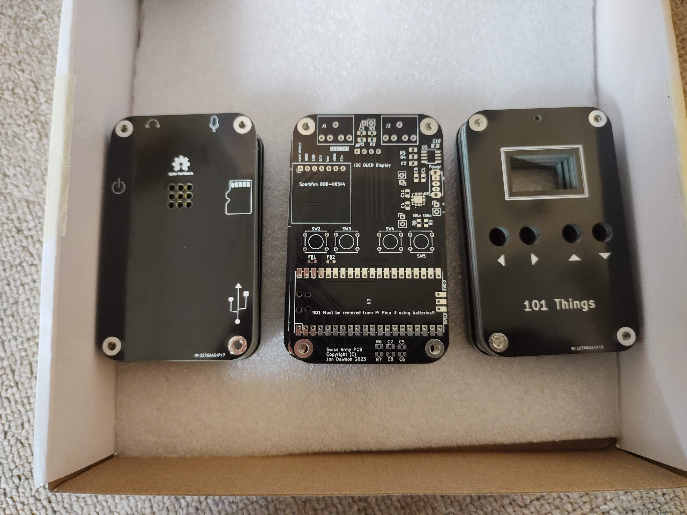

Kitchen Timer with a Twist
===========================

.. image:: images/timer.jpg
   :alt: Kitchen Timer

This project introduces a unique twist to the conventional kitchen timer. While
seemingly simple, it proves to be quite practical.

Hardware
--------

This project is based on the versatile Swiss-army PCB, with some components
omitted for simplicity. 

Components excluded:

- micro SD card,
- microphone preamplifier
- microphone/headphone sockets (bypassed by a wire link).

Components retained:

- OLED Display
- Buttons
- Audio amplifier
- Pi Pico

Power options include USB (in which case, omit the battery case and power
switch) or batteries (remove D1 from the Pi Pico in this case).

Details of the Swiss-Army-PCB can be found `here <https://github.com/dawsonjon/101Things/blob/master/PCB/swiss%20army%20pcb/things.pdf>`_.

Firmware
--------

Here is the C++ code along with a pre-built firmware image available for
download over USB.

- `C++ Code for Pi Pico <https://github.com/dawsonjon/101Things/tree/master/14_timer>`_
- `Pico Firmware <https://github.com/dawsonjon/101Things/blob/master/build/14_timer/timer.uf2>`_

Software
--------

The timer code itself is intentionally kept simple but with a fun twist.
Instead of generic beeps, the code includes a selection of melodies to signal
the end of the timer. The C++ code snippet for the timer logic is as follows:

.. code:: cpp

  if (running) {
    if (time_us_64() >= next_run) {
      next_run += 1000000u;
      if (seconds == 0) {
        if (minutes == 0) {
          if (hours == 0) {
            // timer expired
            running = false;
            hours = stored_hours;
            minutes = stored_minutes;
            seconds = 0;
            needs_reset = false;
            uint64_t start_time = time_us_64(); // update timer 1 second from now
            while((time_us_64() - start_time) < timeout)
            {
              player.play_tune(audio_output, tunes[tune], num_notes[tune]);
              ++tune;
            }
          } else {
            minutes = 59;
            --hours;
          }
        } else {
          --minutes;
          seconds = 59;
        }
      } else {
        --seconds;
      }
    }
  }

Simple Tune Player Class
------------------------

Here is a simple class designed to play a musical tune. Each musical note is
represented by a structure (`note_t`) containing the frequency in Hertz and the
duration in samples. A rest is indicated by setting the frequency to zero. The
`play_tune` function is responsible for playing an array of notes, utilizing
the `play_note` function for individual note playback.

The `play_note` function features a phase accumulator, which increments by a
fixed number of steps for each sample. The ten most significant bits of the
phase accumulator serve as an index into a sine (`sin`) lookup table. The
appropriate number of samples is then passed to the PWM audio output. This
version introduces a small gap between each note; however, a more sophisticated
solution would involve applying an envelope to the amplitude of the audio
signal to better represent a musical note.

.. code:: cpp

    void music::play_note(PWMAudio audio_output, note_t note)
    {

      const uint32_t frequency_steps =
        static_cast<uint32_t>(4294967296.0 * note.pitch_Hz / audio_sample_rate);
      const float amplitude = note.pitch_Hz == 0 ? 0 : 2047; // frequency of zero means silence

      uint32_t samples_left = note.duration_samples - 50;
      while (samples_left) 
      {
        uint32_t block_size = std::min(static_cast<uint32_t>(1024u), samples_left);
        for (uint16_t idx = 0; idx < block_size; idx++) {
          const float sample = sin_table[phase >> 22] * amplitude; // 10 MSBs (32-10 = 22)
          phase += frequency_steps;
          samples[ping][idx] = sample + 2048;
        }
        audio_output.output_samples(samples[ping], block_size);
        ping ^= 1u;
        samples_left -= block_size;
      }

      // small gap between notes
      for (uint16_t idx = 0; idx < 50; idx++) {
        samples[ping][idx] = 2048;
      }
      audio_output.output_samples(samples[ping], 50);
      ping ^= 1u;

    }

    void music::play_tune(PWMAudio audio_output, const note_t notes[], uint16_t length)
    {
      // play each note in turn
      for(uint16_t i=0; i<length; i++)
      {
        play_note(audio_output, notes[i]);
      }
    }

RTTTL Format: An Introduction 
-----------------------------

Now that we have straightforward code for playing tunes, the next step is to
gather some tunes for playback. Fortunately, there are libraries that house
numerous tunes designed for Nokia phones, all available in RTTTL format.

RTTTL, which stands for Ring Tone Text Transfer Language, is a simple
text-based format used for representing melodies in mobile phones and other
compatible devices. Developed for easy exchange of ringtones, RTTTL provides a
concise way to describe musical sequences.

RTTTL Syntax 
""""""""""""

The syntax of an RTTTL string consists of three main components: the name,
default values, and the note sequence. Each component is separated by colons,
and the note sequence is further divided into segments denoting the note,
duration, and optional control parameters.

Example RTTTL String 
""""""""""""""""""""

Here's an example of a basic RTTTL string:

.. code:: 

  InspectorGadgetTheme : d=4,o=5,b=140:16d,8e,8f,16g,8a,8f,8g#,8e,8g,8f,16d,16e,16f,16g,8a,8d6,c#7,p,16d,16e,16f,16g,8a,8f,8g#,8e

In this example, "InspectorGadgetTheme" is the name of the ringtone and the subsequent
components set the default duration (d), octave (o), and beats per minute (b).
The note sequence follows, with each note represented by a letter (e.g., a, b,
c) and optional modifiers for duration and other parameters.

Python RTTTL Parser
-------------------

With a collection of tunes in RTTTL format, a Python script simplifies the
conversion of these tunes into arrays of notes that our software can play.

The RTTTL string consists of two main parts: the header and the body. The
header contains information like the title, default octave, default note size,
and tempo in beats per minute. Although not explicitly stated in the
documentation, treating a `beat` as a `quarter` note appears to play the tunes
at the correct speed.

Python Code
"""""""""""

The Python script to parse the RTTTL string is as follows:

.. code:: python

  title, header, body = rtttl.split(":")
  title = title.strip()
  header_dict = {"o": 6, "b": 63, "d": 4}
  for key_value in header.split(","):
    key, value = key_value.split("=")
    key = key.strip()
    value = value.strip()
    header_dict[key.lower()] = value.lower()

The body of the RTTTL string contains a comma-separated list of notes. The
first number represents the duration of a note, where 4 means a quarter note, 8
means an eighth note, and so on. The pitch is represented by a letter, possibly
followed by a `#` character indicating the note. The final number represents
the octave number. An optional `.` character indicates that the duration should
be multiplied by 1.5. The `.` character can appear anywhere in the note.

Parsing a note is done as follows:

.. code:: python

    # parse duration
    duration = ""
    dotted = False
    while note and note[0].isdigit():
      duration += note[0]
      note = note[1:]
    if duration:
      duration = int(duration)
    else:
      duration = int(header_dict["d"])

    # check for dot
    if note and note[0]==".":
      dotted = True
      note = note[1:]

    # parse pitch 
    pitch = note[0]
    note = note[1:]
    if note and note[0] == "#":
      pitch += "#"
      note = note[1:]

    # check for dot
    if note and note[0]==".":
      dotted = True
      note = note[1:]

    # parse octave
    if note and note[0].isdigit():
      octave = int(note[0])
      note = note[0]
    else:
      octave = int(header_dict["o"])

    # check for dot
    if note and note[0]==".":
      dotted = True
      note = note[1:]

Conversion to Frequencies and Samples
"""""""""""""""""""""""""""""""""""""

The script then converts pitches into Hertz and durations into samples using lookup tables:

.. code:: python

  def calculate_frequencies():
    f = 261.63  # middle C
    notes = ["c", "c#", "d", "d#", "e", "f", "f#", "g", "g#", "a", "a#", "b"]
    ratio = pow(2, 1/12)  # a semitone
    frequencies = {}
    for octave in [4, 5, 6, 7, 8]:
      for note in notes:
        frequencies["%s%u" % (note, octave)] = round(f)
        f *= ratio
    return frequencies
  frequencies = calculate_frequencies()

From the tempo in `beats_per_minute` and the sample rate `audio_sample_rate`, note durations are converted into samples:

.. code:: python

  # convert duration to samples
  if dotted:
    duration = (sample_rate*60*3*4) // (duration*2*int(header_dict["b"]))
  else:
    duration = (sample_rate*60*4) // (duration*int(header_dict["b"]))

Output Header File
""""""""""""""""""

The Python script outputs a header file that can be included in C++ code. An example tune representation in C++ looks like this:

.. code:: cpp

  const note_t InspectorGadgetTheme[] = {
    {587, 1071},  // d5
    {659, 2142},  // e5
    {698, 2142},  // f5
    {784, 1071},  // g5
    {880, 2142},  // a5
    {698, 2142},  // f5
    {831, 2142},  // g#5
    {659, 2142},  // e5
    {784, 2142},  // g5
    {698, 2142},  // f5
    {587, 1071},  // d5
    {659, 1071},  // e5
    {698, 1071},  // f5
    {784, 1071},  // g5
    {880, 2142},  // a5
    {1175, 2142}, // d6
    {2217, 4285}, // c#7
    {0, 4285},    // p5
    {587, 1071},  // d5
    {659, 1071},  // e5
    {698, 1071},  // f5
    {784, 1071},  // g5
    {880, 2142},  // a5
    {698, 2142},  // f5
    {831, 2142},  // g#5
    {659, 2142},  // e5
  };

