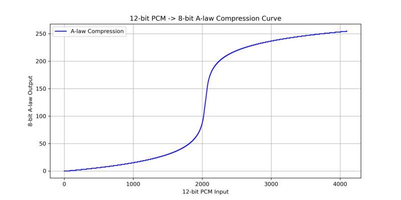
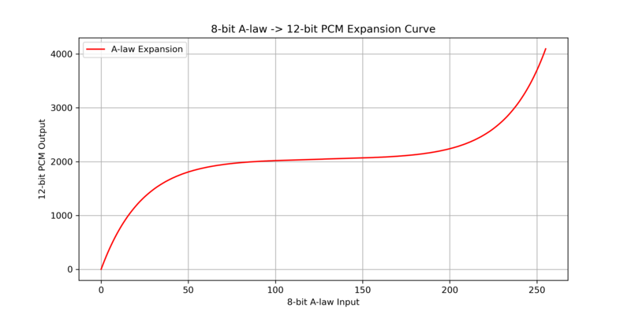

Walkie Talkie with Pi-Pico W
============================

The goal of this project was to create a minimalist, retro-style walkie-talkie with a simple and compact design. The hardware is kept as minimal as possible, avoiding any conventional user interface: the BOOTSEL button doubles as a push-to-talk control, and the built-in LED serves as a status indicator. This makes the device easy to build, fun to use, and gives it a charmingly retro feel.

The project is ideal for beginners—it is inexpensive, uses readily available components and modules, and can be assembled in just a few hours. A 3D-printed enclosure completes the design, allowing a compact, pocket-sized, and robust device to be put together quickly, making it both practical and visually appealing.

Parts List
----------

+-----------------------------------------+----------+---------------------------------+------------------------------+
| Part                                    | Quantity | Example URL                     | Notes                        |
+=========================================+==========+=================================+==============================+
+-----------------------------------------+----------+---------------------------------+------------------------------+
| Raspberry Pi Pico W                     | 1        | `<https://shorturl.at/mVJ0G>`__ |                              |
+-----------------------------------------+----------+---------------------------------+------------------------------+
| Resistor 1k                             | 1        | `<https://shorturl.at/ipgdH>`__ |                              |
+-----------------------------------------+----------+---------------------------------+------------------------------+
| MAX4466 Microphone Module               | 1        | `<https://shorturl.at/O6Rwf>`__ | (with adjustable gain)       |
+-----------------------------------------+----------+---------------------------------+------------------------------+
| MAX98357A I2S 3W Amplifier Module       | 1        | `<https://shorturl.at/cVZdq>`__ |                              |
+-----------------------------------------+----------+---------------------------------+------------------------------+
| 30mm 8R Speaker                         | 1        | `<https://shorturl.at/FqhhM>`__ |                              |
+-----------------------------------------+----------+---------------------------------+------------------------------+
| Switch                                  | 1        | `<https://shorturl.at/TyLoy>`__ |                              |
+-----------------------------------------+----------+---------------------------------+------------------------------+
| Battery Holder 3xAA                     | 1        | `<https://shorturl.at/0Rlrp>`__ |                              |
+-----------------------------------------+----------+---------------------------------+------------------------------+
| 3D Printed Enclosure                    | 1        |                                 |                              |
+-----------------------------------------+----------+---------------------------------+------------------------------+

(Note: Links are for illustrative purposes and not necessarily recommendations.)

Circuit
-------

Wiring Table
------------

+-----------+---------------+----------------+----------------------+------------------+-------------+-----------------+
| Signal    | MAX4466       | MAX98357A      | Pico Pin Number      | Pico GPIO Number | Battery Box | Note            |
+===========+===============+================+======================+==================+=============+=================+
| VBATT     |               |  7 (vin)       | 39 (Vsys)            | NA               | +ve         |                 |
+-----------+---------------+----------------+----------------------+------------------+-------------+-----------------+
| 3v3       | 3 (vcc)       |                | 36 (3v3 out)         | NA               |             | Via 1K resistor |
+-----------+---------------+----------------+----------------------+------------------+-------------+-----------------+
| Gnd       |               |  6 (gnd)       | 3 (GND)              | NA               | -ve         |                 |
+-----------+---------------+----------------+----------------------+------------------+-------------+-----------------+
| AGnd      | 2 (gnd)       |                | 33 (AGND)            | NA               |             |                 |
+-----------+---------------+----------------+----------------------+------------------+-------------+-----------------+
| MIC       | 1 (out)       |                | 31                   | 26               |             |                 |
+-----------+---------------+----------------+----------------------+------------------+-------------+-----------------+
| DOUT      |               |  3 (din)       | 1                    | 0                |             |                 |
+-----------+---------------+----------------+----------------------+------------------+-------------+-----------------+
| BCLK      |               |  2 (bclk)      | 2                    | 1                |             |                 |
+-----------+---------------+----------------+----------------------+------------------+-------------+-----------------+
| LRCLK     |               |  1 (lrc)       | 4                    | 2                |             |                 |
+-----------+---------------+----------------+----------------------+------------------+-------------+-----------------+

Power Supply and Battery Selection
----------------------------------

For portable operation, the device is powered from AA batteries. The Raspberry Pi Pico supports a wide input voltage range of 1.8 V to 5.5 V and can operate reliably from as little as two AA cells. However, the MAX98357A audio amplifier requires a minimum supply voltage of 2.5 V, which leaves little margin when using only two cells—particularly with rechargeable AA batteries, which can drop to around 2.0 V when fully discharged. To provide sufficient voltage headroom, the design uses three AA cells, allowing the batteries to fully discharge while still meeting the minimum voltage requirements of both the Pico and the audio amplifier.

AA cells were chosen over AAA cells due to their significantly higher capacity at a similar cost, resulting in longer operating time between battery changes. The enclosure was sized to accommodate a 3×AA battery holder, and despite using these relatively large cells, the overall unit remains compact and pocket-sized, making it well suited for portable, handheld use.

Estimated Battery Life
----------------------

Battery life depends strongly on operating mode, as Wi-Fi transmission and audio playback dominate power consumption. In receive mode, with the radio enabled and audio output active, current consumption is typically modest, allowing extended listening time. During transmit operation, current draw increases due to continuous ADC sampling, Wi-Fi packet transmission, and audio processing, but this mode is usually intermittent in normal push-to-talk use. With three AA alkaline cells, which typically provide capacities in the 2000–2500 mAh range, the device can operate for many hours of mixed receive and transmit use, and for significantly longer periods when predominantly receiving.

Using rechargeable NiMH AA cells slightly reduces total runtime due to their lower nominal voltage and capacity, but the three-cell configuration still provides sufficient headroom for reliable operation across the full discharge range. The efficient Class-D audio amplifier, low CPU overhead from DMA-driven audio capture, and the half-duplex communication model all contribute to keeping average power consumption low. In practice, this results in a portable walkie-talkie that can comfortably be used throughout a day without requiring battery replacement or recharging.

**Typical Current Consumption**

+----------+---------------------------------------------------------------+-----------------+
| Mode     | Description                                                   | Approx. Current |
+==========+===============================================================+=================+
| Idle     | Wi-Fi connected, no audio activity                            | 70–90 mA        |
+----------+---------------------------------------------------------------+-----------------+
| Receive  | Wi-Fi active, UDP audio receive, I²S audio playback           | 100–130 mA      |
+----------+---------------------------------------------------------------+-----------------+
| Transmit | ADC sampling, A-law encoding, UDP audio transmit (PTT active) | 130–180 mA      |
+----------+---------------------------------------------------------------+-----------------+

*Figures are indicative and depend on Wi-Fi activity, audio level, and supply voltage.*

Battery Life Implications
-------------------------

With three AA alkaline cells (typically 2000–2500 mAh), these current levels translate to many hours of practical use under normal push-to-talk operation, where transmit time is brief compared to receive and idle time. Continuous transmit represents a worst-case scenario and is not representative of typical usage. The use of DMA-driven audio capture, UDP-based transport, and an efficient Class-D amplifier helps keep average current consumption low, making the device well suited for extended portable operation.

3D-Printed Enclosure
--------------------

Microphone Module and Noise Mitigation
--------------------------------------

The project uses a MAX9418 microphone module, which provides a convenient output level that can be sampled directly by the Pico’s ADC input. During testing, it was observed that enabling the Pico W’s radio introduced significant power supply noise, which coupled into the microphone signal and degraded audio quality. This issue was effectively mitigated by placing a 1 kΩ resistor in series between the Pico’s 3.3 V supply and the microphone’s VCC pin. Combined with the capacitors already present on the microphone module, this forms a simple low-pass filter that attenuates high-frequency noise from the power supply. Since the MAX9418 draws very little current, the voltage drop across the resistor is minimal, so the microphone still receives sufficient voltage for proper operation while the PSU noise is strongly suppressed.

Capturing Audio from the ADC
----------------------------

Audio input is captured directly from the built-in ADC of the microcontroller. To efficiently handle continuous sampling without missing data, the ADC is configured to use DMA (Direct Memory Access) into a ping-pong buffer, allowing one half of the buffer to be filled while the other is processed. DMA completion interrupts are used to switch between the two buffer halves, signaling to the application that a new block of samples is ready. The user code continuously checks for the availability of a new buffer, and it is guaranteed one buffer’s worth of time to complete processing before the next block arrives. Sampling is performed at 10 kHz, which is more than sufficient to capture speech frequencies, ensuring clear and intelligible voice transmission over the walkie-talkie link while minimizing CPU load.

Audio Output Stage
------------------

Audio output is handled by a MAX98357A digital audio amplifier, which can be obtained very cheaply while still providing excellent audio quality. The device is driven directly from a digital I²S interface, eliminating the need for a DAC or analog filtering stages and keeping the audio path simple and noise-resistant. As a switch-mode (Class-D) amplifier, the MAX98357A is highly efficient, which is particularly important for a battery-powered walkie-talkie and helps to extend operating time between charges. The amplifier is paired with a 20 mm miniature speaker; while small, these speakers sound surprisingly good when mounted in a sealed enclosure, which significantly improves low-frequency response and overall clarity.

A-law Compression
-----------------

To efficiently transmit voice over our walkie-talkie, we use A-law compression to reduce the bit depth of the audio signal. The incoming audio from the microphone is captured as 12-bit PCM samples, which provide high fidelity but require significant bandwidth if transmitted directly. A-law compression logarithmically reduces the dynamic range of the signal, emphasizing quieter sounds and slightly compressing louder ones. This allows the audio to be encoded into 8-bit values, reducing the data rate while preserving intelligibility and clarity. The compression process is reversible, so the original waveform can be approximately reconstructed on the receiving side.

Our implementation includes both compression and expansion curves, which map the original 12-bit PCM values to 8-bit A-law values and back. These curves are carefully generated and visualized using Python, ensuring that the compression maintains voice quality and avoids distortion in low-amplitude signals. By combining A-law compression with digital transmission, the walkie-talkie achieves a balance between audio clarity and efficient bandwidth usage, making the system both compact and practical for real-time communication.

Wi-Fi Connection Modes
----------------------

The firmware supports two different Wi-Fi communication modes. The first uses the WiFiManager code previously developed for another project. This provides a very clean and user-friendly way to configure Wi-Fi credentials and requires only two additional source files to be added to the project. It has proven to be reliable and easy to integrate, and has become the preferred (“go-to”) method for Wi-Fi configuration across multiple projects.

The second mode is a pseudo peer-to-peer (P2P) configuration, designed to allow the walkie-talkies to operate when no external Wi-Fi router is available. In this mode, one unit takes the role of an access point (AP) while the other operates as a station (STA). To allow a single common firmware build to run on both devices, an automatic role-negotiation process is used. On first startup, each device initially attempts to connect as an STA; if this fails, it reconfigures itself as an AP. If both attempts fail, the device waits for a random delay before retrying, which helps prevent both units from synchronising into the same role and blocking connection establishment. Once a connection is successfully made, the negotiated role is stored in flash using the emulated EEPROM library, allowing much faster reconnection on subsequent power cycles.

.. mermaid::

   stateDiagram-v2
    [*] --> Init

    Init --> Try_STA : Power on / Reset

    Try_STA --> Connected_STA : STA connection successful
    Try_STA --> Try_AP : STA connection failed

    Try_AP --> Connected_AP : AP started and peer connected
    Try_AP --> Random_Wait : AP start or connection failed

    Random_Wait --> Try_STA : Random delay elapsed

    Connected_STA --> Store_Role
    Connected_AP --> Store_Role

    Store_Role --> Operational

    Operational --> [*]

Peer Discovery and Heartbeat Mechanism
--------------------------------------

To discover the IP address of the remote device, the firmware uses UDP broadcast advertisements. Each device periodically sends a small UDP packet at one-second intervals to indicate its presence on the network. These packets also act as a heartbeat, allowing each unit to confirm that the other device is still alive. When a packet is received on the designated advertisement port, the receiving device stores or updates the remote IP address associated with the peer.

The discovered remote IP address is stored in flash memory and can be used as a hint to speed up subsequent startups, reducing connection time after a power cycle. However, the system always treats broadcast advertisements as authoritative; if a new advertisement is received, the stored IP address is immediately updated. This approach combines fast reconnection with robustness against network changes, ensuring reliable operation even if IP addresses change between sessions.

Audio Transport and Push-to-Talk Operation
------------------------------------------

Once the IP address of the link partner is known, audio is transmitted using UDP unicast packets. This approach keeps end-to-end latency low and avoids the overhead of connection-oriented protocols, resulting in a delay that is not noticeable in normal operation. The system operates in a half-duplex, push-to-talk mode. When idle, the device remains in a receive loop; pressing the BOOTSEL button switches the firmware into a transmit loop. In transmit mode, the data flow is driven directly by the ADC, and audio packets are sent immediately as they are produced, ensuring minimal buffering and low latency.

In the receive loop, a jitter buffer is required to absorb variations in network timing. The implementation uses a buffer depth of four audio packets, which is small enough to avoid introducing audible latency while still being sufficient to smooth short-term network jitter. Hysteresis is applied to playback control: audio playback does not start until at least two packets are present in the buffer, but once started it continues until the buffer is empty. This prevents rapid start/stop behaviour and results in stable, glitch-free audio output even when packet arrival timing varies slightly.

Noise Gate
----------

A noise gate is implemented to automatically silence the audio path when no speech is present. This prevents background noise from being transmitted during quiet periods and significantly reduces the risk of acoustic feedback, particularly when the microphone and speaker are in close proximity. When the input signal exceeds a defined threshold, the gate opens and audio is transmitted normally; when the signal falls below the threshold, the gate closes and mutes the output. This simple processing stage greatly improves perceived audio quality and makes the walkie-talkie more pleasant to use in real-world environments.

Conclusion
----------

This project demonstrates that it is possible to build a fully functional, low-cost digital walkie-talkie with minimal hardware and a retro, pocket-sized form factor. By leveraging the Pico’s built-in peripherals, readily available modules like the MAX9418 microphone and MAX98357A amplifier, and efficient software techniques such as DMA-driven audio capture, A-law compression, and UDP-based communication, the device achieves clear voice transmission with low latency while remaining compact and energy-efficient.

The minimalist design—using the BOOTSEL button as push-to-talk and the built-in LED as a status indicator—keeps the build simple, inexpensive, and approachable for beginners, while the 3D-printed enclosure ensures a robust and portable final device. Overall, this project is a fun, practical introduction to microcontroller-based audio and wireless communication, and it provides a solid foundation for further experimentation or enhancements.
